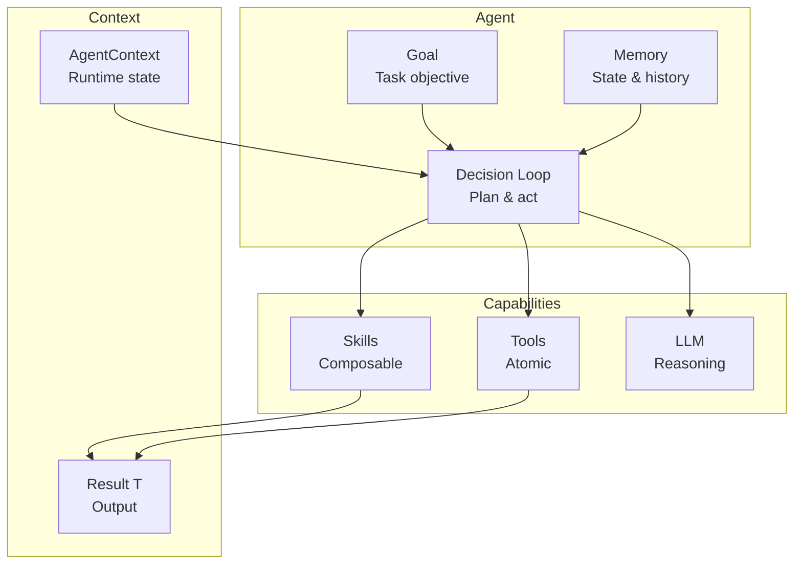
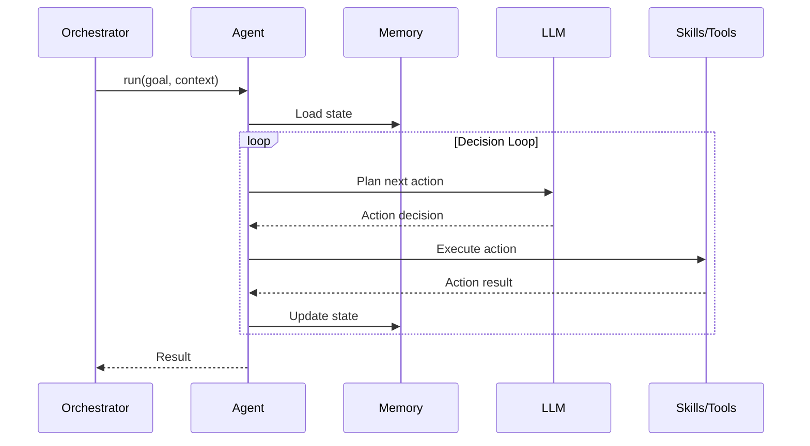

# Agents

Agents are autonomous entities with goals, memory, and decision-making capabilities.

## Agent Architecture



## Agent Execution Flow



## Defining an Agent

```python
from cemaf.agents.base import Agent
from cemaf.core.result import Result

class ResearchAgent(Agent[dict, dict]):
    @property
    def id(self) -> str:
        return "researcher"

    async def run(self, goal: dict, context: AgentContext) -> Result[dict]:
        # Agent logic with memory and decision-making
        return Result.ok({"result": "research complete"})
```

## Dynamic Agent Registry

The `AgentRegistry` provides domain-scoped agent discovery, factory creation, and auto-generated capabilities:

```python
from cemaf.agents.registry import AgentRegistry

registry = AgentRegistry()

# Register agents
registry.register_agent(agent_instance=my_librarian)
registry.register_agent(agent_instance=my_researcher)

# Discover agents
agent = registry.get(agent_id="librarian")
all_agents = registry.list_all()

# Domain-scoped lookup
domain_agents = registry.get_for_domain(domain_id=DomainID("healthcare"))

# Auto-generated capabilities description (useful for LLM-based planning)
capabilities = registry.get_capabilities_description()
# "librarian: Retrieves semantic blueprints\nresearcher: High-fidelity retrieval..."
```

## Built-in Context Agents

CEMAF ships with four context engineering agents:

| Agent | Purpose |
|-------|---------|
| **Librarian** | Retrieves semantic blueprints from configured namespaces |
| **Researcher** | High-fidelity retrieval (k=15) with LLM synthesis |
| **Summarizer** | Context density reduction with token tracking |
| **Writer** | Deterministic content generation using blueprints |

See [Context Engineering Agents](context_engineering_agents.md) for details.
