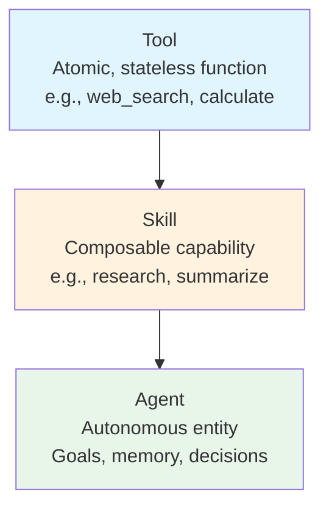
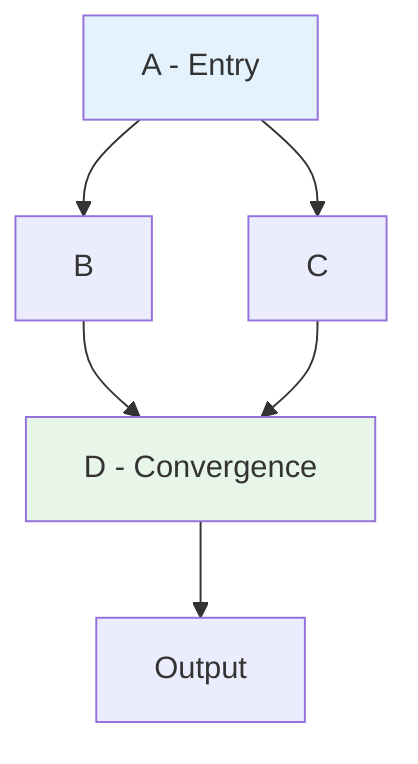
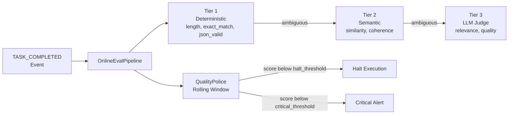

# Architecture Overview

CEMAF is built on a modular, pluggable architecture where all components are defined as `Protocol`s for dependency injection.

## System Architecture

```mermaid
flowchart TB
    subgraph Orchestration
        BOOT[bootstrap.create_executor<br/>Composition Root]
        SVC[RuntimeServices<br/>DI Container]
        DEEP[DeepAgent<br/>Orchestrator]
        EXEC[DAGExecutor]
        HANDLERS[NodeHandlers<br/>Router/Loop/Parallel/Conditional]
        CHECK[Checkpointer]
        BOOT --> SVC --> EXEC
        DEEP --> EXEC --> HANDLERS --> CHECK
    end

    subgraph Execution
        AGENTS[Agents<br/>Goals & State]
        SKILLS[Skills<br/>Composable]
        TOOLS[Tools<br/>Atomic]
        AGENTS --> SKILLS --> TOOLS
    end

    subgraph Context Engineering
        CTX[Context<br/>Immutable]
        PATCH[Patches<br/>Provenance]
        BUDGET[TokenBudget]
        CTYPE[ContextType<br/>RESOURCE/MEMORY/SKILL]
        CTX --> PATCH
        BUDGET --> CTX
        CTYPE --> CTX
    end

    subgraph Memory
        MEM[MemoryStore<br/>InMemory / SQLite]
        SCOPE[Scoped + TTL]
        TIERED[TieredMemoryStore<br/>L0/L1/L2 Progressive]
        DEDUP[MemoryDeduplicator<br/>Exact + Semantic]
        EXTRACT[ExtractionPipeline<br/>Post-Session]
        SCOPEH[ScopePath<br/>Hierarchical Propagation]
        MEM --> SCOPE
        MEM --> TIERED
        MEM --> DEDUP
        MEM --> EXTRACT
        SCOPE --> SCOPEH
    end

    subgraph Evals
        ONLINE[OnlineEvalPipeline<br/>Event-Driven]
        JUDGE[HierarchicalJudge<br/>3-Tier]
        POLICE[QualityPolice<br/>Rolling Window]
        ETOOLS[Eval Tools<br/>RunEval/CheckQuality]
        QAGENT[QualityGuardAgent]
        ONLINE --> JUDGE
        ONLINE --> POLICE
        ETOOLS --> QAGENT
    end

    subgraph Glass Box
        PROV[ProvenanceChain<br/>Audit Trail]
        GUARD[BudgetGuard<br/>Cost Limits]
        GLASS[GlassBoxReporter<br/>Audit Reports]
        PROV --> GLASS
        GUARD --> GLASS
    end

    subgraph Infrastructure
        LLM[LLM Clients<br/>Resilient + Instrumented]
        OBS[Observability<br/>StructuredLogger + Prometheus]
        PERSIST[Persistence]
        EMBED[OpenAIEmbeddingProvider]
    end

    Orchestration --> Execution
    Execution --> Context Engineering
    Execution --> Memory
    Execution --> Evals
    Execution --> Glass Box
    Context Engineering --> Infrastructure
    Memory --> Infrastructure
    Glass Box --> Infrastructure
    Evals --> Infrastructure
```

## Core Concepts

### Tool -> Skill -> Agent Hierarchy



### Dynamic DAG Execution



## RuntimeServices and Composition Root

All optional runtime dependencies are bundled into a frozen `RuntimeServices` dataclass (`orchestration/services.py`), which acts as the DI container for orchestration. The composition root is `bootstrap.create_executor()`.

```python
from cemaf.bootstrap import create_executor
from cemaf.orchestration.services import RuntimeServices

services = RuntimeServices(
    run_logger=my_logger,
    event_bus=my_bus,
    llm_client=my_llm,
    memory_manager=my_memory,
    session_manager=my_sessions,
    online_eval_pipeline=my_eval_pipeline,
    quality_police=my_police,
    budget_guard=my_guard,
    moderation_pipeline=my_moderation,
    auto_heal_manager=my_recovery,
)

executor = create_executor(
    agent_registry=registry,
    services=services,
)
```

`RuntimeServices` fields (all optional):

| Category | Fields |
|----------|--------|
| Observability | `run_logger`, `event_bus`, `health_monitor`, `budget_guard` |
| Quality | `online_eval_pipeline`, `quality_police` |
| Memory | `memory_manager`, `session_manager` |
| Content Safety | `moderation_pipeline` |
| Context | `context_compiler`, `token_budget`, `domain_context` |
| LLM + Retrieval | `llm_client`, `vector_store` |
| Recovery | `auto_heal_manager` |

### Node Handlers

Complex node type logic (router, conditional, loop, parallel) is extracted from `DAGExecutor` into `orchestration/node_handlers.py`. Each handler receives a `NodeHandlerContext` with shared state and delegates (route_choices, merge strategy, retry logic). This keeps `DAGExecutor` focused on orchestration flow while handlers own type-specific execution.

## Online Evaluation System

The eval system provides continuous quality monitoring during DAG execution.



### Components

- **OnlineEvalPipeline** (`evals/online.py`): Subscribes to `TASK_COMPLETED` events via `EventBus`. Binds evaluators to node patterns (specific node_id or `"*"` wildcard). Supports `GATE` mode (blocks downstream) and `OBSERVE` mode (log only).
- **HierarchicalJudge** (`evals/hierarchy.py`): Three-tier evaluation cascade. Tier 1 runs fast deterministic checks (exact match, length, JSON schema). If score falls in the ambiguity range, tier 2 runs semantic evaluators. If still ambiguous, tier 3 invokes an LLM judge. Configurable pass thresholds and sample rates.
- **QualityPolice** (`evals/police.py`): Maintains a rolling window of evaluation scores. Detects anomalies via configurable thresholds (`warn_threshold`, `critical_threshold`, `halt_threshold`). Emits `QualityAlert` events and can halt execution when quality degrades.
- **Eval Tools** (`evals/tools.py`): `RunEvalTool`, `CheckQualityTool`, `RecordScoreTool` wrap the eval system as standard CEMAF tools for self-evaluation within agent workflows.
- **QualityGuardAgent** (`evals/agents.py`): A registered CEMAF agent that uses eval tools internally. Evaluates outputs, records scores to QualityPolice, and reports pass/fail results.

## OpenViking Memory Enhancements

Five enhancements to the memory system:

### Memory Deduplication

`MemoryDeduplicator` protocol (`memory/deduplication.py`) with `SemanticDeduplicator` implementation. Detects duplicates via exact key match and embedding similarity. Actions: `STORE_NEW`, `SKIP`, `MERGE`.

### Context Type Classification

`ContextType` enum (`RESOURCE`, `MEMORY`, `SKILL`) on `ContextSource` in `context/source.py`. Each type has `ContextTypeBehavior` rules (cacheable, shareable, compressible, default TTL, priority, preferred compaction). `ContextTypeClassifier` protocol in `context/classification.py`.

### Three-Tier Progressive Loading

`TieredMemoryStore` (`memory/tiered_store.py`) wraps `SemanticMemoryStore` with L0/L1/L2 progressive retrieval:

| Tier | Purpose | Content |
|------|---------|---------|
| L0 | Key metadata | Scope, key, confidence, timestamps |
| L1 | Summary | Truncated/summarized value |
| L2 | Full content | Complete memory item |

`progressive_search()` retrieves L0 candidates first, promotes the most relevant to L1/L2, staying within token budgets.

### Hierarchical Scope Propagation

`ScopePath` (`memory/scope_hierarchy.py`) represents hierarchical paths like `project/campaign/assets`. `PropagatingScorer` queries ancestor scopes with distance-decayed relevance. Memory items carry `scope_path` for fine-grained retrieval across the scope tree.

### Post-Session Extraction

`ExtractionPipeline` (`memory/extraction_pipeline.py`) runs during `SessionManager.dispose()`:

1. `MemoryExtractor` (default: `RuleBasedExtractor`) extracts salient facts from session episodes
2. `MemoryDeduplicator` filters near-duplicates
3. Surviving items are stored and promoted from SESSION to PROJECT scope
4. `MEMORY_EXTRACTED` event emitted via EventBus

## Production Backends

### Observability

- **StructuredLogger** (`observability/structured.py`): JSON-lines logger satisfying the `Logger` protocol. Outputs structured records with timestamps, levels, and injectable context fields.
- **PrometheusMetrics** (`observability/prometheus_metrics.py`): `MetricsCollector` backed by `prometheus_client`. Lazy metric registration, counters/gauges/histograms, `generate_metrics()` for scraping.

### Storage and LLM

- **SqliteMemoryStore** (`memory/sqlite_store.py`): Persistent `MemoryStore` backed by `aiosqlite`. Single SQLite table with scope/key primary key, JSON-serialized values, TTL/expiry columns, and `scope_path` support.
- **OpenAIEmbeddingProvider** (`retrieval/openai_embeddings.py`): Production `EmbeddingProvider` using OpenAI `text-embedding-3-small`. Handles empty text gracefully, supports batch embedding in a single API call.
- **ResilientLLMClient** (`llm/resilient.py`): Wraps any `LLMClient` with `RetryPolicy`, `CircuitBreaker`, and `RateLimiter`. Optional `MetricsCollector` integration for observability.

## Pluggability

All components are defined as `Protocol`s for dependency injection:

```python
# Swap implementations without changing code
executor = DAGExecutor(
    node_executor=my_executor,
    checkpointer=RedisCheckpointer(),  # or InMemoryCheckpointer()
)

memory = SqliteMemoryStore(db_path="data.db")  # or InMemoryStore()
llm = ResilientLLMClient(client=AnthropicClient())  # with retry + circuit breaker
embeddings = OpenAIEmbeddingProvider(api_key="...")  # or MockEmbeddingProvider()
```

## Project Structure

```
cemaf/
├── src/cemaf/
│   ├── core/           # Types, enums, constants, Result, utils, recovery
│   ├── tools/          # Tool abstractions
│   ├── skills/         # Skill abstractions
│   ├── agents/         # Agent abstractions, Registry, Context Agents
│   ├── orchestration/  # DAG, Executor, DeepAgent, Planner, NodeHandlers, RuntimeServices
│   ├── context/        # TokenBudget, Compiler, Context, ContextType, classification
│   ├── memory/         # MemoryStore, Semantic, Tiered, Dedup, Extraction, ScopePath, SQLite
│   ├── persistence/    # Entities (Project, Run, Artifact)
│   ├── llm/            # LLM protocols, Instrumented, Resilient, Anthropic, tiktoken
│   ├── retrieval/      # VectorStore, Embeddings, OpenAI embeddings, Hybrid
│   ├── streaming/      # SSE, StreamBuffer
│   ├── generation/     # Image, Audio, Video, UI, Code generation
│   ├── evals/          # Evaluators, HierarchicalJudge, OnlineEval, QualityPolice, Tools, Agents
│   ├── resilience/     # Retry, CircuitBreaker, RateLimiter
│   ├── observability/  # Logger, StructuredLogger, PrometheusMetrics, BudgetGuard, GlassBox
│   ├── scheduler/      # Job scheduling, triggers
│   ├── validation/     # Validation rules and pipelines
│   ├── events/         # Event bus and notifiers
│   ├── cache/          # Caching with TTL and eviction
│   ├── mcp/            # Model Context Protocol bridges and transports
│   ├── bootstrap.py    # Composition root
│   └── config/         # Configuration management
└── tests/
    ├── conftest.py     # 55 reusable fixtures
    ├── unit/           # 2000+ unit tests
    └── integration/    # Cross-module integration tests
```

## Design Principles

1. **Protocol-Based**: All components use Python `Protocol`s for maximum flexibility
   - Protocols define interfaces, not implementations
   - Default implementations provided, but replaceable
   - Structural typing - no inheritance required
   - See [Protocol Guide](protocol_guide.md) for details

2. **Standalone Modules**: Each module can be used independently
   - No forced dependencies between modules
   - Use only what you need
   - Mix CEMAF modules with your own code freely

3. **Immutable Context**: State is managed through immutable `Context` objects
   - Every change creates a new Context (`set()` uses `copy.deepcopy()`)
   - Full provenance tracking via patches
   - Enables deterministic replay

4. **Result Pattern**: All operations return `Result[T]` for explicit error handling
   - Never raises exceptions
   - Explicit success/failure states
   - Rich error metadata

5. **Testability**: Comprehensive test suite with 2118+ tests and 55 fixtures
   - Mock implementations for all protocols
   - Dependency injection for testing
   - Integration tests for real workflows

6. **BYO-X**: Every integration is a protocol + default + injectable factory
   - Bring your own LLM, vector store, memory backend, embedding provider
   - Default implementations work out of the box
   - Production backends available (SQLite, OpenAI, Prometheus)

7. **Extensibility**: Easy to extend and replace components
   - Implement protocols to extend functionality
   - Wrap existing implementations
   - Create completely custom implementations
   - See [Extension Patterns](extension_patterns.md) for examples
