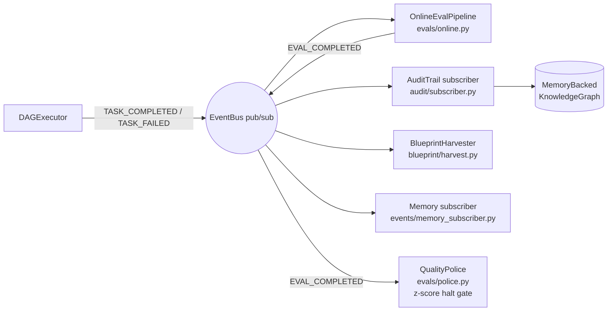

# CEMAF Deep Architecture

> A ground-truth architectural reference: dependency tiers, the node hot-path,
> the two dispatch seams, the reactive plane, and the composition roots — drawn
> from the source, not the ideal. Every structural claim here is verifiable
> against `src/cemaf/`.

For a visual, multi-view tour of the same material, open the
[Architecture Atlas](cemaf-architecture.html) (a self-contained HTML file —
Overview, Core Engine, Agentic, Context Lifecycle, Runtime, Principles). For the
spec-concept → module index (where each SPEC-00..10 concept lands), see
[spec-module-map.md](spec-module-map.md). For the navigable doc map, see
[../index.md](../index.md).

## Contents

- [Glossary](#glossary)
- [The model in one paragraph](#the-model-in-one-paragraph)
- [View 1 — Dependency tiers](#view-1--dependency-tiers)
- [View 2 — The node hot-path](#view-2--the-node-hot-path)
- [View 3 — The two dispatch seams](#view-3--the-two-dispatch-seams)
- [View 4 — The reactive plane](#view-4--the-reactive-plane)
- [View 5 — Composition roots](#view-5--composition-roots)
- [The architecture in five sentences](#the-architecture-in-five-sentences)

## Glossary

| Term | Meaning |
|------|---------|
| **DAG** | Directed acyclic graph of `Node`s; the unit of work `DAGExecutor` runs via topological sort. |
| **Node hot-path** | The per-node control flow in `ContextNodeExecutor.execute_node`: resolve → prep → PRE → run/recover → POST → emit. |
| **Resolver chain** | First-match-wins `NodeResolver` list deciding *what* runs for a node (council / auction / static). |
| **Interceptor spine** | The ordered PRE → execute → POST chain every AGENT node passes through (SPEC-01a). |
| **RECOVER** | A POST decision that re-runs an agent with a feedback hint, bounded by `max_recovery_attempts`. |
| **RuntimeServices** | One frozen dataclass bundling every injectable runtime dependency; injected at the composition root. |
| **Composition root** | `bootstrap.create_executor` (base) / `meta.create_meta_executor` (Layer 2) — the single wiring point. |
| **Layer 1 / Layer 2** | Base framework / self-hosting layer (`meta`, `audit`, `knowledge`); the arrow is strictly one-way. |
| **Protocol seam** | A `@runtime_checkable` Protocol integration point — implementations are structural (BYO-X). |
| **Provenance** | `ContextPatch` source on every mutation + `ProvenanceLink` per node run — the audit trail. |

## The model in one paragraph

CEMAF executes a **DAG** of nodes. Each node is dispatched by a **resolver chain**
(council / auction / static), runs through an **interceptor spine** (PRE → execute
→ POST, with a bounded RECOVER loop), reads and writes an immutable **Context**
compiled under a **token budget**, and emits **events** that reactive subsystems
(online-eval, quality-police, audit, harvest) consume off the hot path. Everything
optional is injected via one frozen **RuntimeServices** bundle at a **composition
root**. Every seam is a `@runtime_checkable` Protocol. **Layer 2** (`meta`,
`audit`, `knowledge`) consumes the base through contracts and is never imported
back — so CEMAF can introspect itself without a dependency cycle.

The codebase is **41 modules** under `src/cemaf/` (every package listed in the
View 1 tiers). The views below place them by *measured* coupling (import
fan-in/fan-out), trace the one control-flow path that matters, and name the two
seams where all extensibility lives.

> The module count and the fan-in/fan-out figures are measured, not hand-kept.
> Regenerate them after any refactor:
>
> ```bash
> # module count
> find src/cemaf -maxdepth 1 -type d -not -name __pycache__ | grep -v '^src/cemaf$' | wc -l
> # fan-in per package (how many other packages import it)
> python3 - <<'PY'
> import re, pathlib, collections
> pkgs={p.name for p in pathlib.Path("src/cemaf").iterdir() if p.is_dir() and p.name!="__pycache__"}
> fan_in=collections.Counter()
> for py in pathlib.Path("src/cemaf").rglob("*.py"):
>     src=py.relative_to("src/cemaf").parts[0]
>     seen=set()
>     for m in re.finditer(r'from cemaf\.(\w+)', py.read_text()):
>         d=m.group(1)
>         if d in pkgs and d!=src: seen.add(d)
>     for d in seen: fan_in[d]+=1
> for m,c in fan_in.most_common(12): print(f"{c:3d}  {m}")
> PY
> ```

## View 1 — Dependency tiers

Modules placed by **measured fan-in** (how many packages import them) — the
actual coupling, not the org chart. Tier 0 is imported by nearly everything;
each tier above depends only on tiers below it.

```text
┌─────────────────────────────────────────────────────────────────────┐
│ TIER 0 — FOUNDATION          core (fan-in 38)  ·  config (fan-in 18)  │
│ imported by nearly all       Result[T] · NewType ids · enums ·        │
│                              utc_now · Settings · provider registry   │
└─────────────────────────────────────────────────────────────────────┘
                                  ▲
┌─────────────────────────────────────────────────────────────────────┐
│ TIER 1 — SHARED FABRIC                                                │
│  context(10) observability(10) events(9) llm(8) retrieval(7) memory(7)│
│  Context/Compiler/   Logger/Prometheus/  EventBus  adapters  Vector/  │
│  TokenBudget/patch   RunLogger/Budget    pub/sub   resilient memory   │
│                      Guard/Health                  /router  tiers     │
└─────────────────────────────────────────────────────────────────────┘
                                  ▲
┌─────────────────────────────────────────────────────────────────────┐
│ TIER 2 — CAPABILITIES (work units + quality/safety + integrations)    │
│  agents(6) tools(6) skills(3) sandbox(3) blueprint(4) evals(3)        │
│  resilience(3) citation moderation validation generation streaming    │
│  mcp rlm cache persistence ingestion state iteration catalog security │
│  trust improvement scheduler council interceptors replay docs_api     │
└─────────────────────────────────────────────────────────────────────┘
                                  ▲
┌─────────────────────────────────────────────────────────────────────┐
│ TIER 3 — ORCHESTRATION (fan-out 14; top of Layer 1)                   │
│  DAGExecutor · ContextNodeExecutor · RuntimeServices · resolvers/ ·   │
│  bootstrap.create_executor                                            │
└─────────────────────────────────────────────────────────────────────┘
                                  ▲  consumes via Protocol only (one-way)
┌─────────────────────────────────────────────────────────────────────┐
│ LAYER 2 — SELF-HOSTING (fan-out: meta 12)   CEMAF's first client      │
│  meta/ (agents·tools·DAGs·bootstrap)   audit/   knowledge/            │
└─────────────────────────────────────────────────────────────────────┘
```

**Verified boundary fact.** The dependency arrow is one-way — no Layer-2 package
is imported *back into* the base as a structural dependency. There are exactly
three base → Layer-2 import sites, and their mechanisms differ (this nuance is
the honest version of "one-way"):

| Site | Target | Kind |
|------|--------|------|
| `orchestration/services.py` | `knowledge.protocols.KnowledgeGraph` | runtime, `@runtime_checkable` **Protocol** |
| `security/rbac.py` (TYPE_CHECKING) | `audit.protocols.AuditLog` | type-only, **Protocol** (no runtime import) |
| `security/rbac.py` (lazy, in-method) | `audit.models.{AuditEntry, AuditEntryType}` | runtime, **concrete** — imported lazily to dodge a parse-time cycle |

So the base depends on Layer-2 mostly through *contracts*; the one concrete
runtime touch (`audit.models` in RBAC) is deliberately lazy. No base module
imports `meta` at all.

## View 2 — The node hot-path

This is `ContextNodeExecutor.execute_node` — the load-bearing control flow of the
whole framework. Traced from source.

```mermaid
stateDiagram-v2
    [*] --> Resolve

    state "RESOLVE (resolver chain, first-match-wins)" as Resolve
    Resolve --> CouncilDone: CouncilResolver to NodeComplete (verdict)
    Resolve --> Prep: Auction/Static to RunAgent(agent_name)
    CouncilDone --> [*]: verdict steers the DAG; agent never runs

    state "PREP" as Prep
    Prep --> Prep2: recall global_memory (MemoryManager)
    Prep2: compile Context under TokenBudget (ContextCompiler)

    Prep2 --> PRE
    state "PRE interceptors (run_pre)" as PRE
    PRE --> Blocked: any REJECT to failed NodeResult, agent never runs
    Blocked --> [*]

    PRE --> Loop
    state "RECOVERY LOOP (bounded by max_recovery_attempts)" as Loop {
        [*] --> Inject
        Inject: inject last MAX_VISIBLE_HINTS into global_memory[RECOVERY_HINTS_KEY]
        Inject --> Run
        Run: agent.run(goal, ctx)
        Run --> Prov: record ProvenanceLink
        Prov --> Ingest: ingest result into session memory
        Ingest --> POST
        state "POST interceptors (run_post)" as POST
        POST --> Accept: ACCEPT to success
        POST --> Reject: REJECT to gate_rejected, fail
        POST --> Recover: RECOVER + budget left to append hint, loop
        Recover --> Inject
        POST --> Exhausted: RECOVER + budget spent to downgrade to REJECT
    }
    Accept --> Emit
    Reject --> Emit
    Exhausted --> Emit
    Emit: DAGExecutor emits TASK_COMPLETED / TASK_FAILED (payload carries recovery_attempts, gate_rejected)
    Emit --> [*]
```



Invariants visible here:

- **Empty pipeline = no-op** — PRE/POST are skipped when no pipeline is wired; behaviour is byte-identical to running without the feature.
- **Gate-reject is non-retryable** — a `gate_rejected` result won't burn the retry budget (a deterministic gate can't loop the agent).
- **RECOVER is bounded** — after `max_recovery_attempts` (default 2) a RECOVER downgrades to REJECT, so feedback retries always terminate.

## View 3 — The two dispatch seams

All extensibility lives in two ordered, Protocol-typed seams.

```text
            NODE ARRIVES
                │
   ┌────────────▼──────────────────────────────────────────────┐
   │ SEAM 1: NodeResolver chain   (orchestration/resolvers/)     │
   │ first matches() wins → ResolveOutcome = RunAgent | NodeComplete
   │                                                             │
   │  CouncilResolver   config["council"]     → NodeComplete      │ SPEC-10
   │       (N members deliberate + vote; rounds=N multi-round)    │
   │  AuctionResolver   config["capability"]  → RunAgent(bid)     │ SPEC-09
   │       (registered only when agent_selector wired; else       │
   │        falls through to ref_id)                              │
   │  StaticRefResolver always               → RunAgent(ref_id)   │ fallback
   │                                                             │
   │  "add a node kind = register a resolver, not edit code"      │
   └────────────┬───────────────────────────────────────────────┘
                │ RunAgent → resolve agent from registry
   ┌────────────▼──────────────────────────────────────────────┐
   │ SEAM 2: Interceptor spine   (interceptors/)                 │ SPEC-01a
   │ PRE → [execute] → POST, ordered chain, empty = no-op        │
   │                                                             │
   │  PreInterceptor.pre()   → ACCEPT(enrich ctx) | REJECT        │
   │  PostInterceptor.post()  → ACCEPT | REJECT | RECOVER         │
   │       GateEvalInterceptor runs Evaluators on the output;     │
   │       on_failure = REJECT (block) | RECOVER (retry + hint)   │
   └─────────────────────────────────────────────────────────────┘
```

Registration order is `[Council, Auction?, Static]` — Auction is present only
when a `RuntimeServices.agent_selector` is wired, preserving "static unless a
selector is configured". Both seams are **split single-method
`@runtime_checkable` Protocols**: a POST-only interceptor need not implement
`pre`; the pipeline detects phases by `isinstance`.

## View 4 — The reactive plane

The executor emits events; subscribers react asynchronously. This keeps
quality, audit, and learning decoupled from execution. The executor emits seven
event types (`TASK_STARTED/COMPLETED/FAILED`, `DAG_STARTED/COMPLETED/CHECKPOINT`,
`SYSTEM_ERROR`); subscribers below are verified in source.



Note the two-hop chain: the executor emits task events; `OnlineEvalPipeline`
consumes them and re-emits `EVAL_COMPLETED`; `QualityPolice` subscribes to
*that*, not to the raw task stream. `recovery_attempts` and `gate_rejected` ride
the `TASK_COMPLETED` / `TASK_FAILED` payload, so audit and harvest can correlate
recovery behaviour without re-walking the result tree.

## View 5 — Composition roots

```text
create_executor(agent_registry, services: RuntimeServices, config)   ← base root
   │  builds ContextNodeExecutor (threads the 23 RuntimeServices deps,
   │    incl. max_recovery_attempts)
   │  builds the resolver chain: [Council, Auction?(if selector), Static]
   │  subscribes online-eval + quality-police when an event_bus is present
   │  wraps in InstrumentedDAGExecutor when a tracer is present
   ▼
DAGExecutor  ──runs──▶  topological sort ▶ per-node hot-path (View 2)

create_meta_executor(...)   ← Layer-2 root
   │  auto-builds AuditTrail from EventBus, KnowledgeGraph from MemoryManager
   │  registers meta-agents / meta-tools, then DELEGATES to
   │    create_executor(services=svc)
   ▼  (so Layer 2 inherits every base primitive — incl. the RECOVER budget — free)
```

**RuntimeServices** is one frozen dataclass of **23 fields**, all `| None` except
`max_recovery_attempts: int = 2`, grouped: Observability · Quality · Memory ·
Content-Safety · Context · LLM/Retrieval · Knowledge · Agent-selection · Council ·
Interceptors · Blueprints · Recovery · Tracing. (The full field table lives in
the project [CLAUDE.md](../../CLAUDE.md) and [module_reference.md](../module_reference.md).)

## The architecture in five sentences

1. **Protocol-first** — every integration point (`LLMClient`, `VectorStore`,
   `MemoryManager`, `Evaluator`, `NodeResolver`, `Interceptor`, `KnowledgeGraph`,
   `AuditLog`) is a `@runtime_checkable` Protocol; implementations are structural
   (BYO-X).
2. **One hot-path, many stations** — features are PRE/POST interceptor stations
   and resolver entries on a *single* `execute_node` flow, not bespoke branches.
3. **Immutable data, explicit provenance** — `Context` is copy-on-write, every
   mutation carries a `ContextPatch` source, every node run records a
   `ProvenanceLink`.
4. **Budgeted context, priority-selected** — `TokenBudget` + `ContextCompiler`
   drop by priority, not recency, before each agent call.
5. **Strict layering** — Layer 2 self-hosting consumes the base only through
   contracts; the base never imports it, so CEMAF can introspect itself without
   a cycle.
