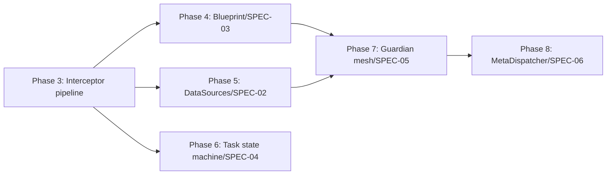

# Roadmap — Spec-Driven Work Plan for the Unbuilt Phases

Status: implementation plan; supplements [spec-module-map.md](spec-module-map.md)'s
Phase table with the §1–§10 spec-driven breakdown per [spec-driven.md](../../CLAUDE.md)
convention. No external ticket system — CEMAF plans against its own SPEC docs.
Each phase below IS the ticket: its own §1 Context, §2 Interface Contract, §3
Invariants, and §4 Acceptance Criteria live in the cited SPEC file, not here.
This doc adds the missing layer — sequencing, dependency order, and the §10
test-coverage checklist each phase must clear before merge.

## Conventions

- **No ticket IDs are invented.** A phase is "claimed" by opening a PR against
  it; there is no separate tracker to keep in sync.
- **Definition of done** for every phase = the four bullets at the bottom of
  [spec-module-map.md](spec-module-map.md#phase-2-implementation-plan):
  integration tests proving the seam, the map's Status column flipped to
  `landed`, spec drift (if any) written back into the SPEC file, and full
  suite + mypy + ruff green.
- **Ordering is a dependency graph, not a queue.** Phases 4 and 5 can run in
  parallel (both depend only on Phase 3's interceptor pipeline). Phase 6
  depends on nothing but Phase 3. Phase 7 depends on Phases 4 and 5
  (guardians read `ctx.surfaced_sources`, populated by Phase 5's
  `PullInterceptor`, and `BlueprintRequest.grounding_refs`, populated by
  Phase 4). Phase 8 depends on Phase 7 (recovery routes through guardian
  rejections).

---

## Phase 3 — Interceptor pipeline (SPEC-01)

**Spec**: [SPEC-01](../specs/SPEC-01-node-interceptor-pipeline.md) — the full
pipeline spec, of which [SPEC-01a](../specs/SPEC-01a-interceptor-spine.md)
(already landed in `cemaf/interceptors/`) is a slice.

**What's already landed** (per spec-module-map.md): `PreInterceptor` /
`PostInterceptor` Protocols, `InterceptorPipeline`, `GateEvalInterceptor`,
`DecisionKind` (ACCEPT/REJECT/RECOVER), `RecoveryHint`, `GateFailureMode` — the
SPEC-01a *slice*. SPEC-01 §2 sources `ChainProfile` from SPEC-00 §2 rather
than owning it — confirm SPEC-00 §2 lands (or already has landed) the enum
before this phase's `pre()`/`post()` signatures can type against it. Missing
here: the canonical `pre_order`/`post_order` sequencing
(`"legitimacy","pull","blueprint","task_inject","audit"` per SPEC-01 §4) and
`ctx.surfaced_sources` as a field on the existing `context/Context` type
(NOT a new type — SPEC-01's `pre`/`post` signatures take `ctx: Context`
directly, per §2's method signatures).

**Work**:
1. Confirm/land `ChainProfile` (DEFAULT/RECOVERY) wherever SPEC-00 §2 places
   it — this phase consumes it, doesn't own it.
2. `cemaf/context/context.py` — add `surfaced_sources: tuple[CiteableChunk, ...]`
   to the existing `Context` dataclass (SPEC-02's write target, read by
   Phase 4's `BlueprintInterceptor` and Phase 7's `CiteOrFailInterceptor`).
   Do not create a parallel `InterceptorContext` type — SPEC-01 §2 threads
   the same `Context` through every interceptor's `pre`/`post`.
3. `cemaf/interceptors/pipeline.py` extension — enforce the canonical
   `pre_order` from SPEC-01 §4 ("legitimacy","pull","blueprint","task_inject","audit")
   so Phases 4–7 register into fixed positions, not an unordered set.
4. Wire `ChainProfile` selection into `ContextNodeExecutor` behind a feature
   flag (existing pattern — see how `interceptor_pipeline` itself landed as
   an optional `RuntimeServices` field first).

**§10 test coverage**: L0 — profile selection returns the right interceptor
set for DEFAULT vs. RECOVERY. L1 — a node tagged for RECOVERY profile skips
`online_eval`/`goal_completion` in the chain. L2 — `ctx.surfaced_sources`
survives a full PRE→execute→POST round trip unmodified when no interceptor
writes to it.

---

## Phase 4 — Blueprint as LLM input (SPEC-03)

**Spec**: [SPEC-03](../specs/SPEC-03-blueprint-as-llm-input.md) — fully
written, 14 invariants, 21 Gherkin scenarios, 5 correctness properties. This
is the most spec-complete of the six phases; implementation is translation,
not design.

**Current state**: `blueprint/Blueprint` exists with `to_prompt()`.
`generation/` has `protocols.py` (image/audio/video generator Protocols) but
no `BlueprintRequest`/`StructuredGenerator` — SPEC-03's shapes are entirely
new additions to `generation/`, not a rework of what's there.

**Work** (ordered by SPEC-03 §2's own type dependency chain):
1. `generation/blueprint_request.py` — `GoalSpec`, `StyleSpec`, `PolicySpec`,
   `BlueprintRequest[T]`, `StructuredResult[T]`, the three new exception types
   (`StreamingIncompleteError`, `PolicyExhaustedError`, `ToolLoopExhaustedError`).
2. `blueprint/library.py` extension — `BlueprintLibrary.resolve_for_node()`
   (explicit `node.blueprint_id` > capability match > `None`) and
   `list_all()` with the ≤200 cardinality cap (Inv 8, startup error on
   overflow — Gherkin "Blueprint registry over cap fails startup").
3. `interceptors/blueprint.py` — `BlueprintInterceptor` (PRE, position 3,
   *after* Phase 5's `PullInterceptor` — chain order is canonical per SPEC-03
   §6 Dependencies). Implements Inv 1–3.
4. `generation/structured_generator.py` — `StructuredGenerator` Protocol +
   default impl. This is the biggest single piece: Inv 11's tool-call loop
   (parallel dispatch, `tool_output_verifier` check before feeding results
   back, round-vs-call budget accounting) and Inv 13's cumulative token
   bound across rounds are the two invariants most likely to hide subtle
   bugs — write the Gherkin scenarios for "Tool-loop generation budget is
   bounded across rounds" and "Parallel tool calls" as tests *first*.
5. Grounding annotation policy (§2 "Grounding annotation policy",
   `STRUCTURAL_METADATA_ALLOW_LIST`) + the SPEC-00 §6 spec-audit rule (Inv
   10) — this can land as its own PR since it's independently testable
   (static analysis over registered blueprints, no runtime dependency).

**§10 test coverage**: SPEC-03 §4 already has 21 Gherkin scenarios — implement
every one as an L1/L2 test, not a subset. §8 Eval Criteria table
(`BlueprintResolutionEvaluator`, `SchemaConformanceEvaluator`,
`PolicyAdherenceEvaluator`, `BlueprintEffectivenessEvaluator`) needs GATE
wiring for the first three; `BlueprintEffectivenessEvaluator` is OBSERVE-only
per the table, don't gate on it.

---

## Phase 5 — DataSources + KG (SPEC-02)

**Spec**: [SPEC-02](../specs/SPEC-02-kg-and-datasource-services.md).

**Current state**: `knowledge/MemoryBackedKnowledgeGraph` exists but is only
consumed by `meta/` — SPEC-02's job is to generalize it into a
`RuntimeServices`-level service any node can pull from, and to define
`DataSource` as a new read-only connector Protocol `retrieval/` doesn't have.

**Work**:
1. `cemaf/datasources/protocols.py` — `DataSource` Protocol (read-only,
   citeable, with health-check and timeout contract per SPEC-02 §2).
2. `cemaf/datasources/registry.py` — `DataSourceRegistry` (this repo's
   standard `ProviderRegistry[T]` pattern — reuse `core/provider_registry.py`,
   don't reinvent a second registry shape).
3. `cemaf/interceptors/pull.py` — `PullInterceptor` (PRE, position 2 — *before*
   Phase 4's `BlueprintInterceptor`). Retrieves across KG + vector store +
   memory + `DataSource`s within `node.budget.pull_tokens`, writes to
   `ctx.surfaced_sources` — this is the canonical membership set Phase 7's
   cite-or-fail guardian enforces against, so its correctness gates
   everything downstream.
4. Eviction policy — deterministic across runs (spec-module-map.md's Phase 5
   gate explicitly calls this out; don't ship an LRU that isn't
   seed-reproducible in tests).
5. `RuntimeServices.knowledge_graph` is already `landed` per spec-module-map —
   confirm Phase 5 only *adds* `datasource_registry`, doesn't touch the
   existing KG field.

**§10 test coverage**: L2 — `PullInterceptor` hydrates `ctx.surfaced_sources`
from a registered `DataSource` within budget; budget-exceeded truncates
deterministically (same seed → same truncation). Integration — a fake
`DataSource` with injected latency/failure modes (per `pluggable-scalable.md`
PS-10 — every port ships a `Fake<Port>` with failure injection).

---

## Phase 6 — Task state machine (SPEC-04)

**Spec**: [SPEC-04](../specs/SPEC-04-task-state-machine.md) — full state
diagram in §1 (`QUEUED → RUNNING → PAUSED/COMPLETED/HALTED`).

**Current state**: nothing — DAGs run today, tasks don't exist as a
first-class concept. This is the largest net-new package of the six
(`cemaf/task/` is entirely new: `models.py`, `enums.py`, `repository.py`,
`lease.py`, `context.py`, `scheduler.py`, per spec-module-map.md's table).

**Work**:
1. `cemaf/task/enums.py` — `TaskState` StrEnum matching the SPEC-04 §1 state
   diagram exactly (don't add states the diagram doesn't have).
2. `cemaf/task/models.py` — `Task` aggregate (the entity that owns
   `TaskState` + a retry counter, per SPEC-04 §1's "recover-once-then-halt"
   motivation).
3. `cemaf/task/repository.py` — `TaskRepository` Protocol. This is a
   `persistence/`-shaped port per `pluggable-scalable.md` — reuse the
   existing `persistence/protocols.py` pattern (`ProjectStore`,
   `ArtifactStore` already establish the shape) rather than a bespoke one.
4. `cemaf/task/lease.py` — `AcquiredLease` (HITL pause/resume token) + expiry
   + reclamation logic in `cemaf/task/scheduler.py`.
5. `cemaf/task/context.py` — `TaskContext`, populated per-node by a new
   `TaskInjectInterceptor` (PRE, position 4 — *last* in DEFAULT_PRE_ORDER,
   per SPEC-04 §1).
6. `RuntimeServices.task_repository` — new optional field, following the
   exact pattern `knowledge_graph` and `agent_selector` already established
   (optional, `None`-default, composed at `bootstrap.create_executor()`).

**§10 test coverage**: L2 — every state transition in the SPEC-04 §1 diagram
has a positive test (transition succeeds) and a negative test (invalid
transition raises/rejects). Integration — lease expiry actually reclaims an
orphaned task (simulate a crashed worker: acquire lease, let it expire,
confirm a second acquirer can take it).

---

## Phase 7 — Guardian mesh (SPEC-05)

**Spec**: [SPEC-05](../specs/SPEC-05-guardian-mesh.md) — six guardians, each
explicitly backed by an *existing* CEMAF subsystem (this phase is composition,
not six new subsystems):

| Guardian | Phase | Backing (already exists) |
|---|---|---|
| `LegitimacyInterceptor` | PRE (first) | `moderation/ModerationPipeline` + new `AuthorizationPolicy` |
| `CiteOrFailInterceptor` | POST (first) | `citation/`, `evals/grounding.py`, new `ClaimExtractor` |
| `ToolOutputVerifierInterceptor` | POST (second) | new `ToolOutputVerifier` |
| `OnlineEvalInterceptor` | POST | `evals/online.py`, `evals/police.py` |
| `GoalCompletionInterceptor` | POST (terminal node only) | `evals/judge.py` extended |
| `AuditInterceptor` | BOTH (last) | `audit/` |

**Work**:
1. `cemaf/evals/claim_extractor.py` — `ClaimExtractor` Protocol +
   `SchemaFieldClaimExtractor` (reads `grounding_required=True` Pydantic
   field annotations from Phase 4's `BlueprintRequest.output_schema`) and
   `SentenceClaimExtractor` (pinned sentence-boundary + hedge-phrase rules
   per SPEC-05 §2 — copy the pinned regex/hedge-list verbatim, don't
   approximate).
2. `cemaf/interceptors/legitimacy.py`, `cite_or_fail.py`,
   `tool_output_verifier.py`, `online_eval.py`, `goal_completion.py`,
   `audit.py` — six interceptor files, each thin (the backing subsystem does
   the work; the interceptor is the PRE/POST adapter).
3. `cemaf/guardian/mesh.py` — `GuardianMesh` composing all six in the SPEC-05
   §1 phase/position order above. This is the actual net-new package
   (`src/cemaf/guardian/` doesn't exist yet).
4. Cite-or-fail's membership check reads `ctx.surfaced_sources` — this only
   works once Phase 5's `PullInterceptor` is landed and Phase 4's
   `BlueprintRequest.grounding_refs` is populated (Phase 3's SPEC-03 Property
   3: `cited_evidence_refs ⊆ grounding_refs`). **Do not start Phase 7 before
   4 and 5 are both merged** — the membership predicate has nothing to check
   against otherwise.

**§10 test coverage**: SPEC-05 §4 has a Gherkin scenario per guardian —
implement every one. L2 — each guardian's REJECT path actually blocks
downstream (same pattern as the already-landed `test_interceptor_gate.py` —
real `DAGExecutor`, no mocks).

---

## Phase 8 — MetaDispatcher + self-resolving DAG (SPEC-06)

**Spec**: [SPEC-06](../specs/SPEC-06-self-resolving-dag.md).

**Current state**: `create_meta_executor()` exists as a *parallel*
composition root — meta runs in a different universe from user DAGs. SPEC-06
closes that gap: a guardian rejection (Phase 7) should be able to route
*into* the same run, not require a separate meta invocation the user has to
wire by hand.

**Work**:
1. `cemaf/core/types.py` — `RecoveryRequest` (already flagged
   `scaffold pending` in spec-module-map.md's SPEC-00 §2 row; this is the
   type Phase 8 actually needs, so land it here if Phase 3 didn't already).
2. `cemaf/meta/dispatcher.py` — `MetaDispatcher` added to `RuntimeServices`.
   Recursion safety: depth limits + `MetaInvocationBudget` (separate pool
   from the parent Task's `TokenBudget` — don't let meta-recovery silently
   spend the user's budget).
3. `ChainProfile.RECOVERY` (Phase 3) strips `online_eval` +
   `goal_completion` — confirm this wiring is exercised here, not just
   declared in Phase 3.
4. `cemaf/meta/recovery_dag.py` — the sub-DAG run triggered by a guardian's
   `PostflightDecision.RECOVER(INVOKE_META_ARCHITECT, retry_hints)`.

**§10 test coverage**: Integration — a guardian REJECT triggers
`MetaDispatcher` → `MetaArchitect` selects a recovery DAG → sub-DAG runs
under `ChainProfile.RECOVERY` → audit gate blocks an unsafe accept. This is
one end-to-end test exercising Phases 3, 7, and 8 together — write it last,
after all three land, as the integration proof the phasing was correct.

---

## Deliberately deferred — Phase 9 and Phase 10

**Phase 9** (GATE evaluator SLO hardening, SPEC-00 §8) and **Phase 10**
(production substrate, SPEC-17) are excluded from this plan on purpose:
Phase 9 depends on Phase 7's guardians running in OBSERVE mode long enough to
have real threshold data, and Phase 10 is explicitly scoped in SPEC-17 §1 as
needing Phases 1–9's primitives first ("does not yet form one production
contract"). Pulling either forward would mean gating thresholds with no data
or building a durability contract with nothing yet running durably. Revisit
once Phases 3–8 are `landed`.
