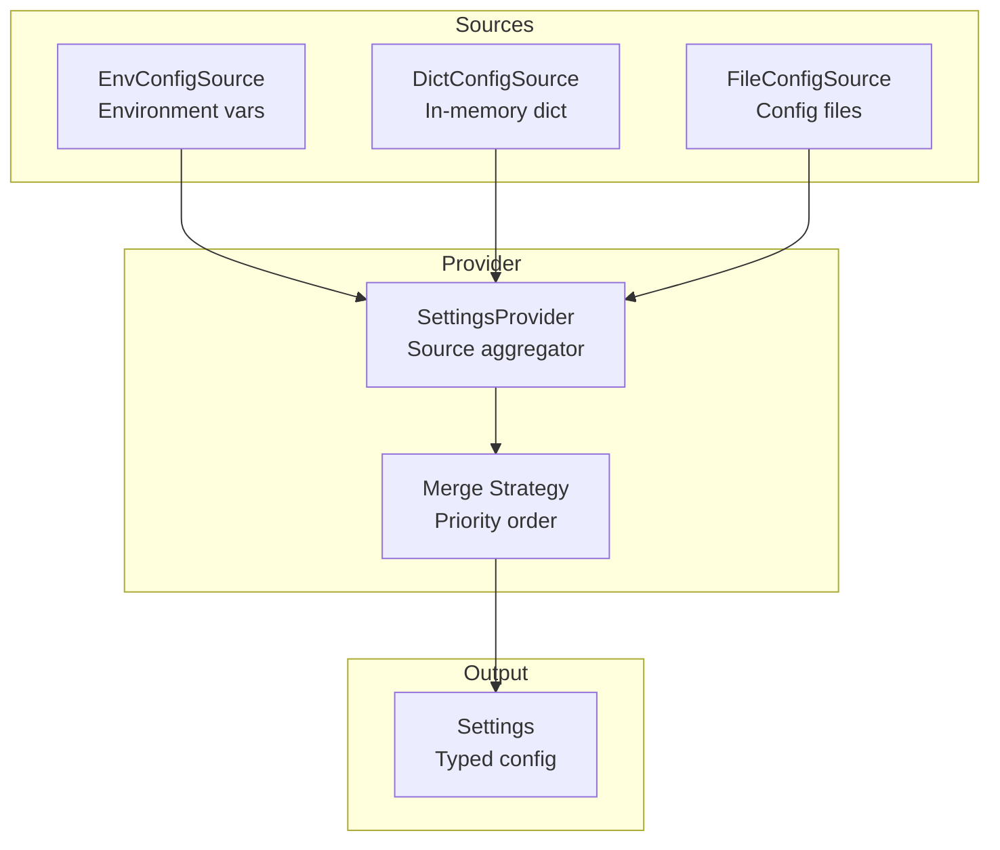
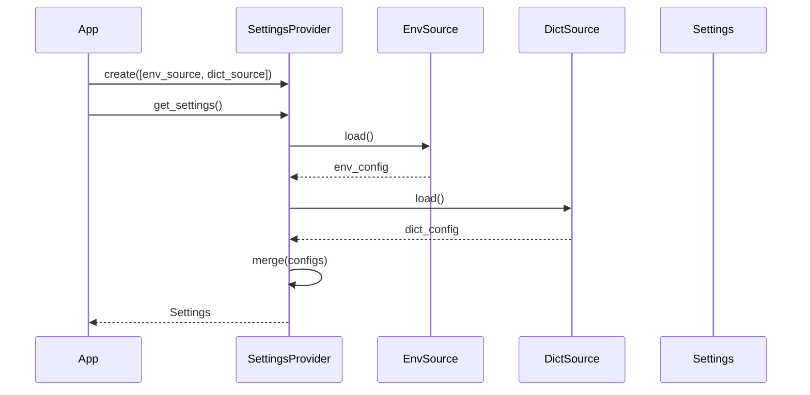

# Configuration

Configuration management with multiple sources.

## Configuration Architecture



## Configuration Flow



## Config Sources

```python
from cemaf.config import (
    DictConfigSource,
    EnvConfigSource,
    config_source_registry,
    create_config_source,
    create_settings_provider,
)

# Load from environment
env_source = EnvConfigSource(prefix="CEMAF")

# Load from dict
dict_source = DictConfigSource({"key": "value"})

# Combine direct sources. Higher priority sources override lower priority sources.
provider = create_settings_provider(
    sources=(
        (1, env_source),
        (2, dict_source),
    )
)
settings = await provider.get()

# Declarative source construction through the registry.
provider = create_settings_provider(
    source_specs=(
        {"type": "env", "priority": 1, "prefix": "CEMAF"},
        {"type": "dict", "priority": 2, "data": {"debug": True}},
    )
)

# Custom sources can be registered without changing framework code.
config_source_registry.register(
    backend="consul",
    factory=lambda **kwargs: ConsulConfigSource(url=kwargs["url"]),
)
source = create_config_source("consul", url="https://consul.example")
```
