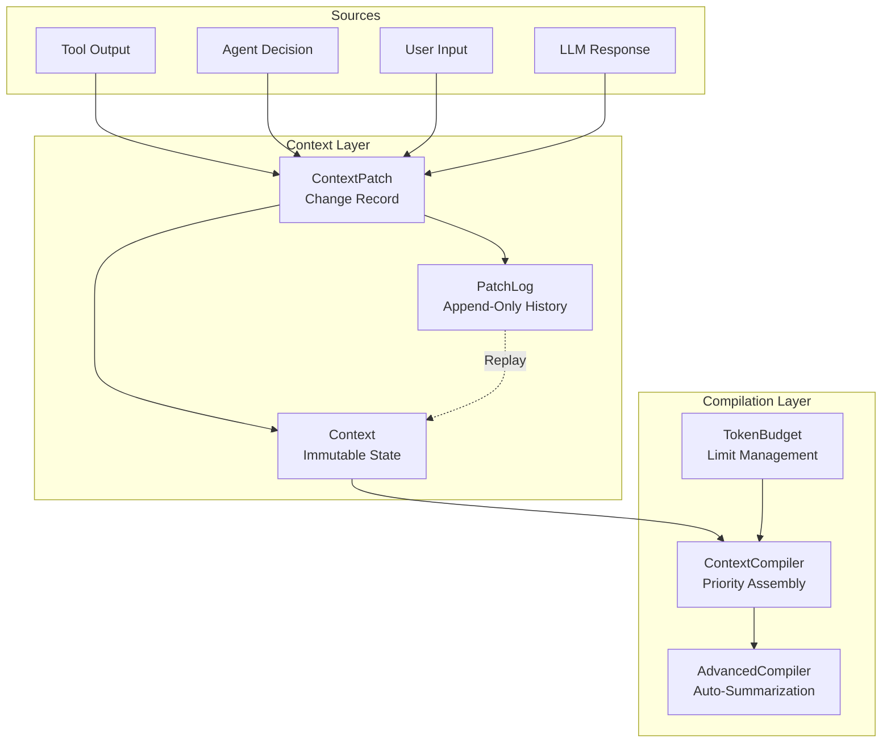
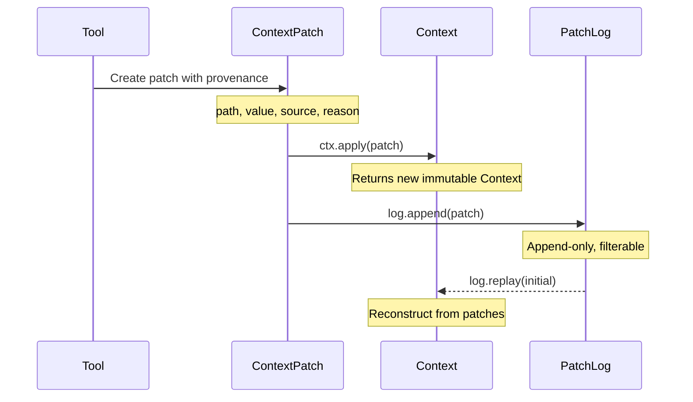

# Context Management

CEMAF provides sophisticated context management with:
- **Immutable Context**: State that can't be accidentally mutated
- **Context Patches**: Track every change with full provenance
- **Patch Logs**: Append-only history for replay and debugging
- **Token Budgeting**: Stay within LLM limits
- **Automatic Summarization**: Compress low-priority content

## Architecture Overview



## Context Flow



## Context Class

Immutable context object for state management:

```python
from cemaf.context import Context

# Create context
ctx = Context(data={"key": "value"})

# Get values (supports dot notation)
value = ctx.get("key")
nested = ctx.get("data.user.id", default=None)

# Set values (returns new Context)
new_ctx = ctx.set("new_key", "new_value")
nested_ctx = ctx.set("data.user.id", 123)

# Delete values
ctx = ctx.delete("temp_key")

# Append to lists
ctx = ctx.append("items", new_item)

# Deep merge dicts
ctx = ctx.deep_merge("config", {"debug": True})

# Merge contexts
merged = ctx1.merge(ctx2)

# Convert to dict
data = ctx.to_dict()

# Copy context
copy = ctx.copy()
```

## Context Patches

Track every context change with full provenance:

```python
from cemaf.context import ContextPatch, PatchOperation, PatchSource

# Create patches with factory methods
patch = ContextPatch.set(
    path="user.preferences.theme",
    value="dark",
    source=PatchSource.USER,
    source_id="settings_form",
    reason="User changed theme preference",
)

# Convenience methods for common sources
patch = ContextPatch.from_tool(
    tool_id="web_search",
    path="search_results",
    value={"results": [...]},
)

patch = ContextPatch.from_agent(
    agent_id="research_agent",
    path="findings",
    value={"summary": "..."},
)

# Apply patch to context
new_ctx = ctx.apply(patch)
```

### Patch Operations

```python
# SET - Set a value at path
patch = ContextPatch.set("config.debug", True)

# DELETE - Remove a value
patch = ContextPatch.delete("temp_data")

# MERGE - Deep merge a dict
patch = ContextPatch.merge("settings", {"new_key": "value"})

# APPEND - Append to a list
patch = ContextPatch.append("messages", {"role": "user", "content": "Hi"})
```

### Patch Sources

| Source | When to Use |
|--------|-------------|
| `PatchSource.TOOL` | Change from tool execution |
| `PatchSource.AGENT` | Change from agent decision |
| `PatchSource.LLM` | Change from LLM output parsing |
| `PatchSource.SYSTEM` | Framework-level change |
| `PatchSource.USER` | User input |

## Patch Logs

Append-only log for recording and replaying changes:

```python
from cemaf.context import PatchLog, ContextPatch

# Create and build log
log = PatchLog()
log = log.append(ContextPatch.set("a", 1))
log = log.append(ContextPatch.set("b", 2))

# Replay on initial context
initial = Context()
final = log.replay(initial)

# Filter patches
tool_patches = log.filter_by_source(PatchSource.TOOL)
user_patches = log.filter_by_source_id("user_input")
config_patches = log.filter_by_path_prefix("config")

# Inspect
paths = log.get_affected_paths()  # {"a", "b"}
latest = log.get_latest_for_path("a")

# Serialize for storage
data = log.to_list()
restored = PatchLog.from_list(data)
```

## Context Diffing

Generate patches between two contexts:

```python
old_ctx = Context(data={"count": 1, "name": "Alice"})
new_ctx = Context(data={"count": 2, "name": "Alice", "age": 30})

# Generate patches to transform old into new
patches = old_ctx.diff(new_ctx)

# patches contains:
# - SET count = 2
# - SET age = 30

# Apply patches to verify
result = old_ctx
for patch in patches:
    result = result.apply(patch)
assert result.to_dict() == new_ctx.to_dict()
```

## Token Budget

Manage token limits for LLM context:

```python
from cemaf.context.budget import TokenBudget

# Create budget
budget = TokenBudget(max_tokens=1000, reserved_for_output=200)

# Available tokens for context
available = budget.available_tokens  # 800

# Model-specific budgets
budget = TokenBudget.for_model("gpt-4", reserved_for_output=200)
```

## Context Compiler

Compile context from artifacts and memories:

```python
from cemaf.context.compiler import PriorityContextCompiler

compiler = PriorityContextCompiler()

compiled = await compiler.compile(
    artifacts=(("brief", "important content"),),
    memories=(("mem1", "relevant memory"),),
    budget=TokenBudget(max_tokens=1000),
    priorities={"brief": 10, "mem1": 5}
)

# Check if within budget
if compiled.within_budget():
    messages = compiled.to_messages()
```

## Advanced Context Compiler

Automatically summarizes low-priority sources when budget is exceeded:

```python
from cemaf.context.advanced_compiler import AdvancedContextCompiler
from cemaf.context.budget import TokenBudget

compiler = AdvancedContextCompiler(
    llm_client=my_llm_client,
    token_estimator=my_estimator
)

budget = TokenBudget(max_tokens=1000, reserved_for_output=200)
compiled = await compiler.compile(
    artifacts=(("brief", "important content"),),
    memories=(("long_mem", "very long content..."),),
    budget=budget,
    priorities={"brief": 10, "long_mem": 0}  # long_mem will be summarized if needed
)
```

The `AdvancedContextCompiler`:
1. Gathers all sources first
2. Checks if total tokens exceed budget
3. Summarizes lowest-priority sources first
4. Continues until budget is met or all sources processed

### AdvancedContextCompiler Modes

The `AdvancedContextCompiler` supports two operational modes based on configuration:

#### Mode 1: Pure Summarization (Default)

When no algorithm is specified, all sources are included and low-priority sources are summarized to fit budget.

**Example**:
```python
from cemaf.context.advanced_compiler import AdvancedContextCompiler
from cemaf.context.compiler import SimpleTokenEstimator
from cemaf.llm.mock import MockLLMClient

compiler = AdvancedContextCompiler(
    llm_client=MockLLMClient(),
    token_estimator=SimpleTokenEstimator(),
)
# No algorithm → Pure summarization mode

compiled = await compiler.compile(
    artifacts=(("doc1", content1), ("doc2", content2)),
    memories=(),
    budget=TokenBudget(max_tokens=1000, reserved_for_output=200),
)
# Result: All sources included (some may be summarized)
```

**Use when**:
- All sources must be represented in output
- Information preservation is critical
- Compliance/audit scenarios

#### Mode 2: Two-Stage Optimization

When an algorithm is provided, the compiler first uses the algorithm to select sources, then applies summarization if needed.

**Example**:
```python
from cemaf.context.algorithm import KnapsackSelectionAlgorithm

algorithm = KnapsackSelectionAlgorithm()
compiler = AdvancedContextCompiler(
    llm_client=MockLLMClient(),
    token_estimator=SimpleTokenEstimator(),
    algorithm=algorithm,  # Two-stage mode
)

compiled = await compiler.compile(
    artifacts=artifacts,
    memories=memories,
    budget=budget,
    priorities=priorities,
)
# Result: Algorithm selects best sources, may exclude some
# Metadata includes excluded_keys for debugging
```

**Use when**:
- Performance-critical (minimize LLM calls)
- Large source sets need optimal selection
- Some information loss is acceptable
- Need metadata about exclusions

#### Choosing a Mode

| Scenario | Recommended Mode | Configuration |
|----------|------------------|---------------|
| Document review, all sections matter | Mode 1 | `algorithm=None` |
| Large-scale retrieval (100+ candidates) | Mode 2 | `algorithm=KnapsackSelectionAlgorithm()` |
| Compliance/audit trail | Mode 1 | `algorithm=None` |
| Budget-constrained agent | Mode 2 | `algorithm=GreedySelectionAlgorithm()` |
| Analysis requiring complete context | Mode 1 | `algorithm=None` |
| Performance-critical generation | Mode 2 | `algorithm=GreedySelectionAlgorithm()` |

## Exclusion Tracking

When sources are excluded from compilation, the algorithm records structured exclusion metadata:

```python
from cemaf.core.enums import ExclusionReason

# Selection algorithms track why sources were excluded
# Greedy: BUDGET_EXCEEDED when token budget runs out
# Knapsack: LOW_PRIORITY when optimizing value/weight ratio

compiled = await compiler.compile(
    artifacts=artifacts,
    memories=memories,
    budget=budget,
    priorities=priorities,
)

# Exclusion metadata in compiled result
for excluded in compiled.metadata.get("excluded_sources", []):
    print(f"Source {excluded['source_id']} excluded: {excluded['reason']}")
    # e.g., "Source doc_5 excluded: ExclusionReason.BUDGET_EXCEEDED"
```

### ExclusionReason Enum

| Reason | When Used |
|--------|-----------|
| `BUDGET_EXCEEDED` | Token budget ran out before this source could be included |
| `LOW_PRIORITY` | Knapsack algorithm excluded for better value/weight ratio |
| `STALE` | Source data is outdated |
| `DUPLICATE` | Duplicate content detected |
| `FILTERED` | Filtered by domain rules or moderation |

### Integration with ProvenanceChain

Exclusion metadata feeds into `SourceReference` for full audit:

```python
from cemaf.core.provenance import SourceReference

# Each source in a ProvenanceLink records inclusion/exclusion
ref = SourceReference(
    source_id="doc_5",
    source_type="artifact",
    token_count=2000,
    priority=3,
    included=False,
    exclusion_reason=ExclusionReason.BUDGET_EXCEEDED,
)
```

## Token Estimation

Estimate tokens for content:

```python
from cemaf.context.compiler import SimpleTokenEstimator

estimator = SimpleTokenEstimator()
tokens = estimator.estimate("Hello world")  # ~2 tokens
```

### Smart Token Estimator Factory

Use `create_token_estimator()` for the best available estimator — prefers tiktoken (accurate, model-specific) with automatic fallback to heuristic:

```python
from cemaf.context.factories import create_token_estimator

# Accurate estimation for a known model (uses tiktoken if available)
estimator = create_token_estimator(model="gpt-4")

# Fallback to heuristic for unknown models
estimator = create_token_estimator(model="custom-model")

# Default heuristic (no model specified)
estimator = create_token_estimator()
```

### Compressible Flag in Exclusion Details

When sources are excluded from compilation, the algorithm tracks whether each excluded source is compressible — enabling downstream systems (e.g., `AdvancedContextCompiler`) to decide whether to summarize or drop:

```python
result = algorithm.select_sources(sources=sources, budget=budget)

for detail in result.metadata.get("excluded_details", []):
    if detail["compressible"]:
        print(f"Source {detail['source_id']} can be summarized to fit budget")
    else:
        print(f"Source {detail['source_id']} must be dropped entirely")
```

## Context Compiler Registry

Context compiler backends are extensible via `ProviderRegistry`:

```python
from cemaf.context.factories import context_compiler_registry, create_context_compiler_from_config

# Built-in backends: greedy, knapsack, optimal
compiler = create_context_compiler_from_config(algorithm_name="knapsack")

# Register a custom backend
context_compiler_registry.register(backend="custom", factory=my_compiler_factory)
compiler = create_context_compiler_from_config(algorithm_name="custom")
```

## Token Estimator Registry

Token estimation is also registry-backed:

```python
from cemaf.context import TokenEstimator, create_token_estimator, token_estimator_registry

def create_domain_token_estimator(**kwargs) -> TokenEstimator:
    return DomainTokenEstimator(calibration=kwargs["calibration"])

token_estimator_registry.register(
    backend="domain",
    factory=create_domain_token_estimator,
)

estimator = create_token_estimator(
    estimator_type="domain",
    calibration="legal-briefs",
)
```

Environment-based compiler creation reads `CEMAF_CONTEXT_TOKEN_ESTIMATOR_BACKEND`,
`CEMAF_CONTEXT_TOKEN_ESTIMATOR_MODEL`, and `CEMAF_CONTEXT_CHARS_PER_TOKEN`.

## Context Type Classification

Context sources are classified into three behavioral types that control caching, sharing, compression, and compaction behavior.

### ContextType Enum

| Type | Semantics | Default Priority |
|------|-----------|------------------|
| `RESOURCE` | External data (documents, tool outputs) | 3 |
| `MEMORY` | Agent/session memory | 7 |
| `SKILL` | System prompts, instructions | 5 |

The `ContextType` is set on `ContextSource` via factory methods:

```python
from cemaf.context.source import ContextSource, ContextType

# Automatically classified as RESOURCE
source = ContextSource.from_tool_output(content="search results...", tool_name="web_search")
assert source.context_type == ContextType.RESOURCE

# Automatically classified as MEMORY
source = ContextSource.from_memory(content="user prefers dark mode", memory_key="pref:theme")
assert source.context_type == ContextType.MEMORY

# Automatically classified as SKILL
source = ContextSource.from_system_prompt(content="You are a helpful assistant.")
assert source.context_type == ContextType.SKILL
```

### ContextTypeBehavior

Each type has behavioral rules that downstream systems use to make decisions:

```python
from cemaf.context.classification import get_behavior, classify_source, ContextTypeBehavior
from cemaf.context.source import ContextType

behavior = get_behavior(context_type=ContextType.MEMORY)
# ContextTypeBehavior(
#     cacheable=False,
#     shareable=False,
#     compressible=True,
#     default_ttl_seconds=86400.0,
#     default_priority=7,
#     preferred_compaction="metadata",
# )
```

### Behavioral Rules by Type

| Property | RESOURCE | MEMORY | SKILL |
|----------|----------|--------|-------|
| `cacheable` | True | False | True |
| `shareable` | True | False | True |
| `compressible` | True | True | False |
| `default_ttl_seconds` | None | 86400 | None |
| `preferred_compaction` | `"summary"` | `"metadata"` | `"full"` |

### ContextTypeClassifier Protocol

Implement the `ContextTypeClassifier` protocol for custom classification:

```python
from cemaf.context.classification import ContextTypeClassifier, DefaultContextTypeClassifier

# Default classifier maps string source_types to ContextType
classifier = DefaultContextTypeClassifier()
ct = classifier.classify(source_type="document")   # ContextType.RESOURCE
ct = classifier.classify(source_type="memory")     # ContextType.MEMORY
ct = classifier.classify(source_type="system")     # ContextType.SKILL
ct = classifier.classify(source_type="unknown")    # ContextType.RESOURCE (default)

# Module-level convenience functions
from cemaf.context.classification import classify_source, get_behavior
ct = classify_source(source_type="tool_output")
behavior = get_behavior(context_type=ct)
```

### Default Source Type Mapping

| `source_type` string | `ContextType` |
|---------------------|--------------|
| `"document"` | `RESOURCE` |
| `"tool_output"` | `RESOURCE` |
| `"memory"` | `MEMORY` |
| `"system"` | `SKILL` |
| anything else | `RESOURCE` (fallback) |
