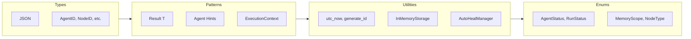
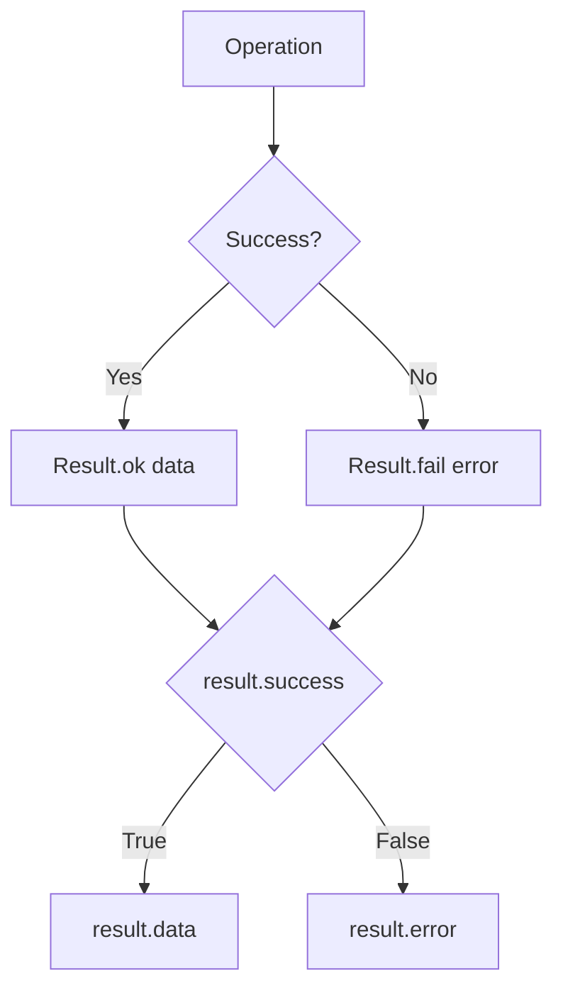

# Core Module

The core module provides fundamental types, enums, utilities, and patterns used throughout CEMAF.

## Overview



## Result Flow



## Result Pattern

All operations return a generic `Result[T]` type for explicit error handling:

```python
from cemaf.core.result import Result

# Success
result = Result.ok(data={"status": "success"})
if result.success:
    print(result.data)

# Failure
result = Result.fail("Error message")
if not result.success:
    print(result.error)

# With metadata and hints
result = Result.ok(
    data={"value": 42},
    metadata={"source": "cache"},
    hints=[{"action": "retry", "reason": "timeout", "suggestion": "wait 5s"}]
)

# Using the hint builder
result = (
    Result.fail("Token limit exceeded")
    .with_hint(
        action="summarize",
        reason="context_too_large",
        suggestion="Add a SummarizerGate"
    )
)
```

### Result API

```python
@dataclass(frozen=True)
class Result(Generic[T]):
    success: bool
    data: T | None = None
    error: str | None = None
    hints: list[dict[str, Any]] = field(default_factory=list)
    metadata: JSON = field(default_factory=dict)
    created_at: datetime = field(default_factory=utc_now)

    @classmethod
    def ok(cls, data: T, metadata: JSON | None = None, hints: list[dict[str, Any]] | None = None) -> Result[T]

    @classmethod
    def fail(cls, error: str, metadata: JSON | None = None, hints: list[dict[str, Any]] | None = None) -> Result[T]

    def with_hint(self, action: str, reason: str, suggestion: str) -> Result[T]
```

## MindState (Declarative Cognition)

The `MindState` protocol provides a unified declarative schema for an agent's mental state, combining context, memory, and moderation.

```python
from cemaf.core.mind_state import MindState

# Declaratively build an agent's mind state
state = MindState.build([
    MemoryComponent(scope="session"),
    TokenBudgetGate(limit=2000)
])

print(state.context)
```

## API Stability & Experimental Features

Use the `@experimental` decorator to mark APIs that are unstable and subject to change:

```python
from cemaf.core.experimental import experimental

@experimental
class MyUnstableAPI:
    """This API is experimental and may change without notice."""
    def do_something(self):
        pass

# Instantiation emits DeprecationWarning
instance = MyUnstableAPI()
# Warning: MyUnstableAPI is experimental and subject to change.
# Do not use in production. API stability is not guaranteed.
```

Experimental APIs:
- Emit `DeprecationWarning` on instantiation
- Have updated docstrings with `⚠️ EXPERIMENTAL` prefix
- Function normally but alert users to potential breaking changes
- Should not be used in production until marked stable

**Note**: APIs marked `@experimental` remain fully functional; the decorator only communicates stability status.

## Recovery & Auto-Heal

The `AutoHealManager` enables autonomous recovery from infrastructure errors by mapping error types to recovery strategies with a fallback chain:

```python
from cemaf.core.recovery import AutoHealManager, RecoveryStrategy
from cemaf.core.result import Result

# Define custom recovery strategy
class SummarizeContextStrategy(RecoveryStrategy):
    def recover(self, error_result: Result, context: Context) -> Result[Context]:
        # Summarize context to reduce token usage
        summarized = context.set("summarized", True)
        return Result.ok(summarized)

# Register strategies with fallback chain
manager = AutoHealManager()
manager.register("TokenLimitExceeded", SummarizeContextStrategy())
manager.register_pattern(r"timeout.*", TimeoutRecoveryStrategy())
manager.set_default_strategy(DefaultRecoveryStrategy())

# Attempt to heal a failure
recovery_result = manager.heal(error_result, context)
if recovery_result.success:
    new_context = recovery_result.data
```

### Recovery Fallback Chain

The `heal()` method uses a 4-level fallback strategy:

1. **Exact exception_type match** - Uses registered strategy for specific error type
2. **Pattern matching** - Regex-matches error message against registered patterns
3. **Default strategy** - Falls back to default strategy if available
4. **Fail** - Returns failure if no strategy available

This allows graceful degradation where not all errors need explicit strategies.

## Types

Core type aliases for type safety:

```python
from cemaf.core.types import (
    JSON,           # JSON-compatible dict
    AgentID,        # Agent identifier
    NodeID,         # DAG node identifier
    RunID,          # Execution run identifier
    SkillID,        # Skill identifier
    ToolID,         # Tool identifier
)
```

## Enums

Common enumerations:

```python
from cemaf.core.enums import (
    AgentStatus,    # Agent execution status
    MemoryScope,    # Memory persistence scope
    NodeType,       # DAG node type
    RunStatus,      # Execution run status
)
```

## Utilities

Common utility functions:

```python
from cemaf.core.utils import (
    utc_now,        # Current UTC datetime
    generate_id,    # Generate unique ID with optional prefix
    safe_json,      # Safe JSON parsing
    json_dumps,     # JSON serialization
    truncate,       # Truncate strings
)
```

## Storage

Generic in-memory storage:

```python
from cemaf.core.storage import InMemoryStorage

# Create storage
store = InMemoryStorage[str, dict]()

# Operations
await store.set("key", {"value": 42})
value = await store.get("key")
exists = await store.contains("key")
await store.delete("key")
await store.clear()
size = await store.size()
```

## Constants

```python
from cemaf.core.constants import (
    DEFAULT_MAX_RETRIES,
    DEFAULT_TIMEOUT_SECONDS,
    MAX_CONTEXT_TOKENS,
)
```
