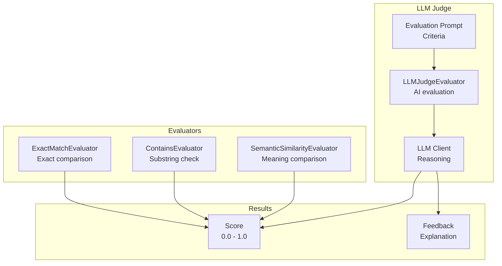
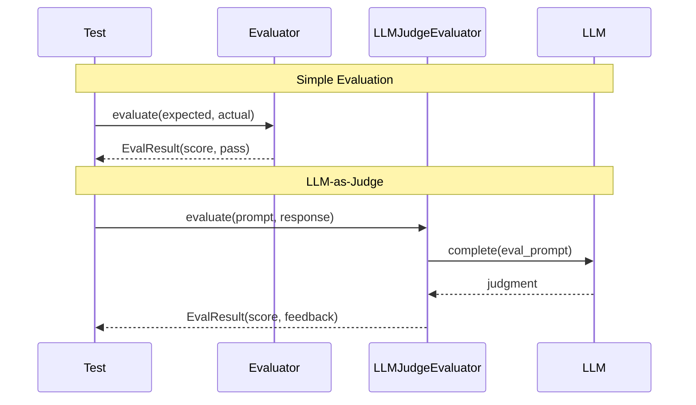

# Evaluations

Evaluators and LLM-as-judge for testing and validation.

## Evaluation Architecture



## Evaluation Flow



## Evaluators

```python
from cemaf.evals.evaluators import ExactMatchEvaluator, ContainsEvaluator

# Exact match
evaluator = ExactMatchEvaluator()
result = evaluator.evaluate("expected", "actual")

# Contains
evaluator = ContainsEvaluator(substrings=["required"])
result = evaluator.evaluate("text with required content")
```

## LLM-as-Judge

```python
from cemaf.evals.llm_judge import LLMJudgeEvaluator

judge = LLMJudgeEvaluator(llm_client=my_llm)
result = await judge.evaluate(
    prompt="Is this correct?",
    response="The answer is 42"
)
```

## HierarchicalJudge

Multi-tier evaluation that runs fast deterministic checks first, escalating to expensive LLM judges only when needed.

### Tier Execution

| Tier | Type | When Runs | Cost |
|------|------|-----------|------|
| Tier 1 | Deterministic (exact match, length, contains) | Always | Free |
| Tier 2 | Semantic similarity | Only if tier 1 passes | Low |
| Tier 3 | LLM judge | Only if tier 2 is ambiguous or sampled | High |

```python
from cemaf.evals.hierarchy import HierarchicalJudge, HierarchicalJudgeConfig
from cemaf.evals.evaluators import ExactMatchEvaluator, LengthEvaluator
from cemaf.evals.semantic import SemanticSimilarityEvaluator

judge = HierarchicalJudge(
    tier1_evaluators=(ExactMatchEvaluator(), LengthEvaluator()),
    tier2_evaluator=SemanticSimilarityEvaluator(embedding_provider=my_embedder),
    tier3_evaluator=LLMJudgeEvaluator(llm_client=my_llm),
    config=HierarchicalJudgeConfig(
        tier1_pass_threshold=0.5,
        tier3_ambiguity_range=(0.4, 0.7),  # escalate to tier 3 when tier 2 score is ambiguous
        tier3_sample_rate=0.0,              # random sampling rate for tier 3
    ),
)

result = await judge.evaluate(
    output="The capital of France is Paris",
    expected="Paris",
)
# result.metadata["tiers_run"] -> [1, 2] or [1, 2, 3]
# result.metadata["tier_scores"] -> [0.8, 0.95]
```

### Escalation Logic

1. Tier 1 **always runs** via `CompositeEvaluator`. If it fails, evaluation stops immediately.
2. Tier 2 runs if tier 1 passes and a tier 2 evaluator is configured.
3. Tier 3 runs only if the tier 2 score falls within `tier3_ambiguity_range` OR random sampling triggers.

## OnlineEvalPipeline

Event-driven evaluation that subscribes to `TASK_COMPLETED` events and runs evaluators on node outputs during DAG execution.

### Eval Modes

| Mode | Behavior |
|------|----------|
| `GATE` | Failed eval emits `QUALITY_ALERT` with level `halt`, blocks downstream |
| `OBSERVE` | Log only, never blocks execution |

```python
from cemaf.evals.online import OnlineEvalPipeline, NodeEvalBinding, EvalMode

pipeline = OnlineEvalPipeline(
    bindings=(
        NodeEvalBinding(
            node_pattern="summarizer",  # match specific node
            evaluators=(LengthEvaluator(), ContainsEvaluator(substrings=["summary"])),
            mode=EvalMode.GATE,
            expected="Expected summary text",
        ),
        NodeEvalBinding(
            node_pattern="*",           # match all nodes
            evaluators=(LengthEvaluator(),),
            mode=EvalMode.OBSERVE,
        ),
    ),
    event_bus=my_event_bus,
)

# Subscribe to execution events
pipeline.subscribe()

# After DAG execution, inspect results
for result in pipeline.results:
    print(f"Node {result['node_id']}: score={result['overall_score']:.2f}")
```

### Event Flow

1. `TASK_COMPLETED` event triggers evaluation
2. Pipeline emits `EVAL_STARTED` before running evaluators
3. On completion, emits `EVAL_COMPLETED` with scores
4. In `GATE` mode, failed evals also emit `QUALITY_ALERT`
5. On error, emits `EVAL_FAILED`

## QualityPolice

Rolling window quality monitor with anomaly detection and halt gate. Tracks eval scores over time and triggers alerts when quality degrades.

```python
from cemaf.evals.police import QualityPolice, QualityPoliceConfig, AlertLevel

police = QualityPolice(
    config=QualityPoliceConfig(
        window_size=20,          # rolling window size
        warn_threshold=0.7,      # rolling mean triggers WARN
        critical_threshold=0.5,  # rolling mean triggers CRITICAL
        halt_threshold=0.3,      # rolling mean triggers HALT
        anomaly_drop=0.3,        # single score drop triggers CRITICAL
    ),
)

# Manual scoring
alert = police.record_score(score=0.2, node_id="summarizer")
if alert and alert.level == AlertLevel.HALT:
    print("Quality degradation: halting execution")

# Check halt gate
if police.should_halt():
    print(f"Rolling mean: {police.rolling_mean:.2f}")

# Auto-subscribe to eval events
police.subscribe(event_bus=my_event_bus)
```

### Alert Levels

| Level | Trigger | Effect |
|-------|---------|--------|
| `WARN` | Rolling mean < `warn_threshold` | Logged, event emitted |
| `CRITICAL` | Rolling mean < `critical_threshold` OR anomaly drop | Logged, event emitted |
| `HALT` | Rolling mean < `halt_threshold` | Sets `should_halt() = True` |

## Eval Tools

Three CEMAF tools that wrap the eval system for agent-internal use:

| Tool | ID | Purpose |
|------|----|---------|
| `RunEvalTool` | `run_eval` | Run named evaluators on output text |
| `CheckQualityTool` | `check_quality` | Query quality police status |
| `RecordScoreTool` | `record_score` | Record a score to quality police |

```python
from cemaf.evals.tools import RunEvalTool, CheckQualityTool, RecordScoreTool

# Run evaluators by name
eval_tool = RunEvalTool()
result = await eval_tool.execute(
    output="Some text to evaluate",
    evaluator_names=["length", "json_valid"],
)

# Check quality monitoring status
check_tool = CheckQualityTool(quality_police=police)
status = await check_tool.execute()
# status.data -> {"rolling_mean": 0.85, "halted": False, "alerts_count": 0, ...}

# Record a score
record_tool = RecordScoreTool(quality_police=police)
result = await record_tool.execute(score=0.9, node_id="my_node")
```

### Built-in Evaluator Registry

Available evaluator names for `RunEvalTool` and `resolve_evaluators()`:

| Name | Class |
|------|-------|
| `"length"` | `LengthEvaluator` |
| `"exact_match"` | `ExactMatchEvaluator` |
| `"contains"` | `ContainsEvaluator` |
| `"json_valid"` | `JSONSchemaEvaluator` |

## QualityGuardAgent

A CEMAF agent that dogfoods the framework's own eval tools. Evaluates outputs and monitors quality trends via `QualityPolice`.

```python
from cemaf.evals.agents import QualityGuardAgent, QualityGuardGoal

agent = QualityGuardAgent(quality_police=police)

result = await agent.run(
    goal=QualityGuardGoal(
        output="Text to evaluate",
        expected="Expected output",
        evaluator_names=("length", "exact_match"),
        record_to_police=True,
    ),
    context=my_agent_context,
)

guard_result = result.output
print(f"Passed: {guard_result.passed}, Score: {guard_result.overall_score}")
print(f"Quality status: {guard_result.quality_status}")
if guard_result.alert:
    print(f"Alert: {guard_result.alert['message']}")
```

The agent is registered in `AgentRegistry` with ID `"QualityGuard"`.

## Wiring with RuntimeServices

The eval system integrates into the orchestration layer via `RuntimeServices` and the composition root:

```python
from cemaf.orchestration.services import RuntimeServices
from cemaf.bootstrap import create_executor

services = RuntimeServices(
    event_bus=my_event_bus,
    online_eval_pipeline=my_online_pipeline,  # subscribes to TASK_COMPLETED
    quality_police=my_police,                 # subscribes to EVAL_COMPLETED
)

# create_executor() auto-wires subscriptions when events are enabled
executor = create_executor(
    agent_registry=my_registry,
    services=services,
)
```

When `create_executor()` is called with both `event_bus` and eval components:
1. `OnlineEvalPipeline.subscribe()` hooks into `TASK_COMPLETED` events
2. `QualityPolice.subscribe(event_bus=)` hooks into `EVAL_COMPLETED` events
3. The `DAGExecutor` receives `quality_police` and can check `should_halt()` during execution
