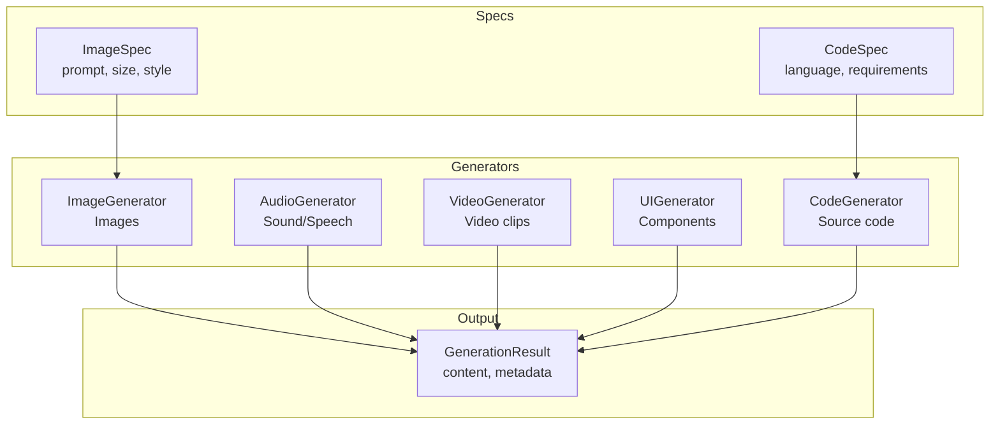
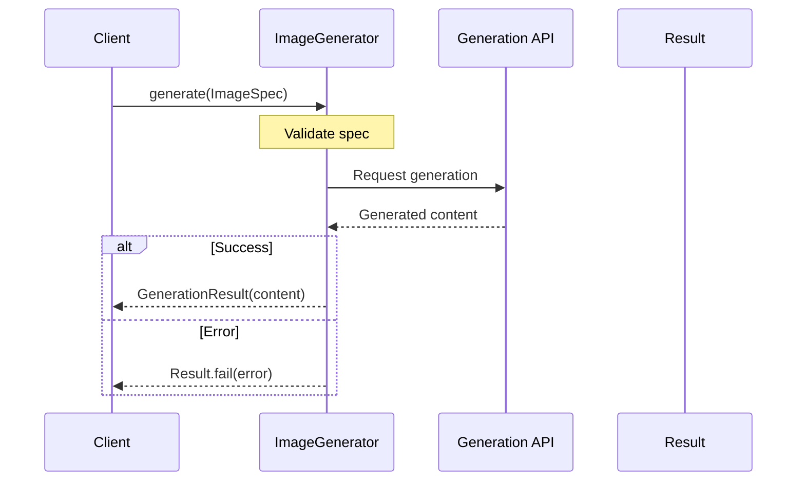

# Generation

Protocols for generative AI outputs: images, audio, video, UI, and code.

## Generation Architecture



## Generation Flow



## Image Generation

```python
from cemaf.generation import create_image_generator
from cemaf.generation.protocols import ImageSpec

generator = create_image_generator(provider="mock")

spec = ImageSpec(
    prompt="A beautiful sunset",
    width=1024,
    height=1024,
    style="photorealistic"
)

result = await generator.generate(spec)
```

## Factory Registries

Generation backends are selected through modality-specific registries. The
built-in `mock` backend is registered by default; applications can register
provider adapters without editing CEMAF.

```python
from cemaf.generation import (
    ImageGenerator,
    create_image_generator,
    image_generator_registry,
)

def create_external_image_generator(**kwargs) -> ImageGenerator:
    return ExternalImageGenerator(
        api_key=kwargs["api_key"],
        model=kwargs.get("model", "image-model"),
    )

image_generator_registry.register(
    backend="external-image",
    factory=create_external_image_generator,
)

generator = create_image_generator(
    provider="external-image",
    api_key="provider-key",
)
```

The same pattern is available for `audio_generator_registry`,
`video_generator_registry`, `code_generator_registry`,
`diagram_generator_registry`, and `ui_generator_registry`.

## Code Generation

```python
from cemaf.generation import create_code_generator
from cemaf.generation.protocols import CodeSpec

generator = create_code_generator(provider="mock")

spec = CodeSpec(
    prompt="Create a function that calculates fibonacci",
    include_tests=True
)

result = await generator.generate(spec)
```
