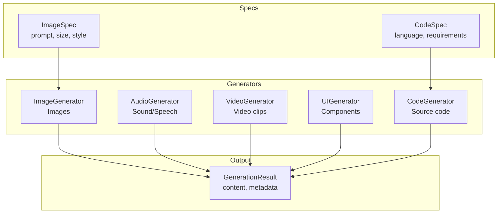
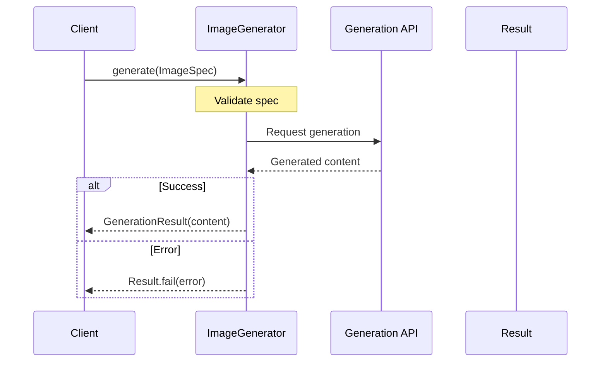

# Generation

Protocols for generative AI outputs: images, audio, video, UI, and code.

## Generation Architecture



## Generation Flow



## Image Generation

```python
from cemaf.generation.protocols import ImageGenerator, ImageSpec

generator: ImageGenerator = DalleGenerator()

spec = ImageSpec(
    prompt="A beautiful sunset",
    size="1024x1024",
    style="photorealistic"
)

result = await generator.generate(spec)
```

## Factory Registries

Generation backends are selected through modality-specific registries. The
built-in `mock` backend is registered by default; applications can register
provider adapters without editing CEMAF.

```python
from cemaf.generation import (
    ImageGenerator,
    create_image_generator,
    image_generator_registry,
)

def create_dalle_generator(**kwargs) -> ImageGenerator:
    return DalleGenerator(
        api_key=kwargs["api_key"],
        model=kwargs.get("model", "dall-e-3"),
    )

image_generator_registry.register(
    backend="dall-e",
    factory=create_dalle_generator,
)

generator = create_image_generator(
    provider="dall-e",
    api_key="sk-...",
)
```

The same pattern is available for `audio_generator_registry`,
`video_generator_registry`, `code_generator_registry`,
`diagram_generator_registry`, and `ui_generator_registry`.

## Code Generation

```python
from cemaf.generation.protocols import CodeGenerator, CodeSpec

generator: CodeGenerator = ClaudeCodeGenerator()

spec = CodeSpec(
    language="python",
    requirements="Create a function that calculates fibonacci",
    include_tests=True
)

result = await generator.generate(spec)
```
