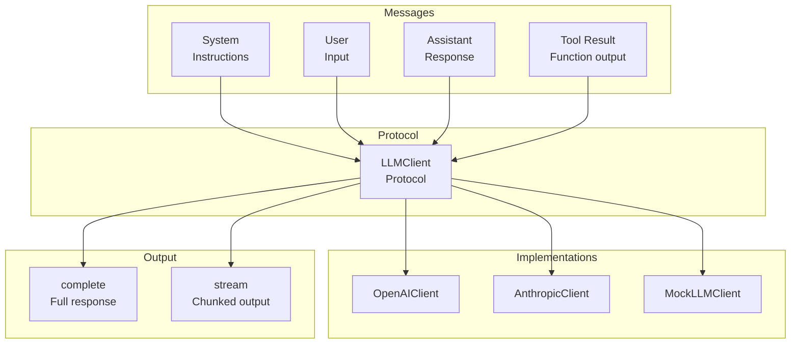
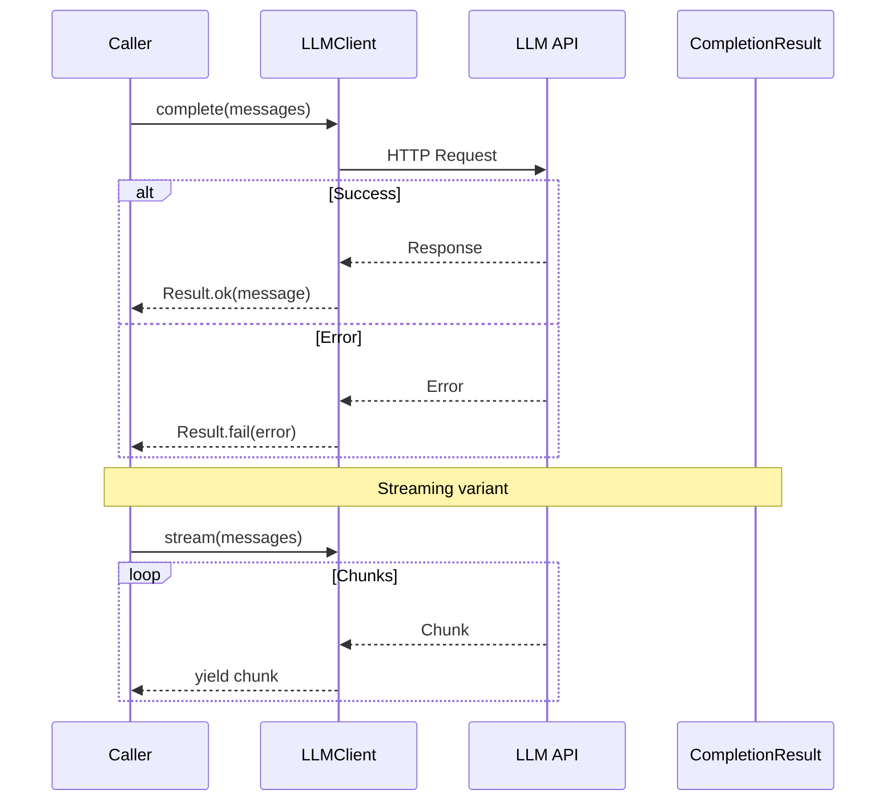

# LLM Module

Protocol-based LLM client abstraction for pluggable backends.

## LLM Architecture



## LLM Request Flow



## LLM Client Protocol

```python
from cemaf.llm.protocols import LLMClient, Message, CompletionResult

# Use any LLM implementation
llm: LLMClient = OpenAIClient()  # or AnthropicClient(), MockLLMClient()

# Complete
result = await llm.complete([
    Message.system("You are a helpful assistant"),
    Message.user("Hello!")
])

if result.success:
    print(result.message.content)
```

## Message Types

```python
from cemaf.llm.protocols import Message

system_msg = Message.system("System prompt")
user_msg = Message.user("User input")
assistant_msg = Message.assistant("Response")
tool_msg = Message.tool_result("tool_id", "result")
```

## Streaming

```python
async for chunk in llm.stream(messages):
    print(chunk.content, end="", flush=True)
```

## Instrumented LLM Client

`InstrumentedLLMClient` wraps any `LLMClient` and auto-records every `complete()`/`stream()` call into a `RunLogger` for glass box audit:

```python
from cemaf.llm.instrumented import InstrumentedLLMClient
from cemaf.observability.run_logger import InMemoryRunLogger

run_logger = InMemoryRunLogger()
run_logger.start_run(run_id="run_001", dag_name="pipeline")

# Wrap any LLM client — transparent to callers
instrumented = InstrumentedLLMClient(
    client=my_llm_client,
    run_logger=run_logger,
    node_id="step_0",
    agent_id="researcher",
)

# Use exactly like a normal LLMClient
result = await instrumented.complete(messages=[Message.user("Hello")])
# LLMCall automatically recorded in RunLogger with model, tokens, cost, duration
```

The `ContextNodeExecutor` automatically wraps agents' LLM clients with `InstrumentedLLMClient` when a `RunLogger` is present — no manual wiring needed in DAG execution.

## LLM Configuration

```python
from cemaf.llm.protocols import LLMConfig

config = LLMConfig(
    model="claude-sonnet-4-6",
    temperature=0.7,
    max_tokens=4096,
    top_p=0.9,
    stop_sequences=["END"],
    timeout_seconds=30,
)

# Override config per-call
result = await llm.complete(messages=messages, config_override=config)
```

## LLM Factories

```python
from cemaf.llm.factories import create_llm_client_from_config

# From environment (reads CEMAF_LLM_BACKEND, CEMAF_LLM_MODEL, etc.)
client = create_llm_client_from_config()

# Register custom backends
from cemaf.llm.factories import llm_registry
llm_registry.register(backend="custom", factory=my_factory_fn)
```
