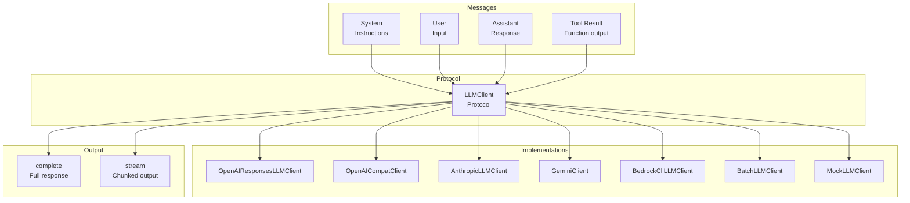
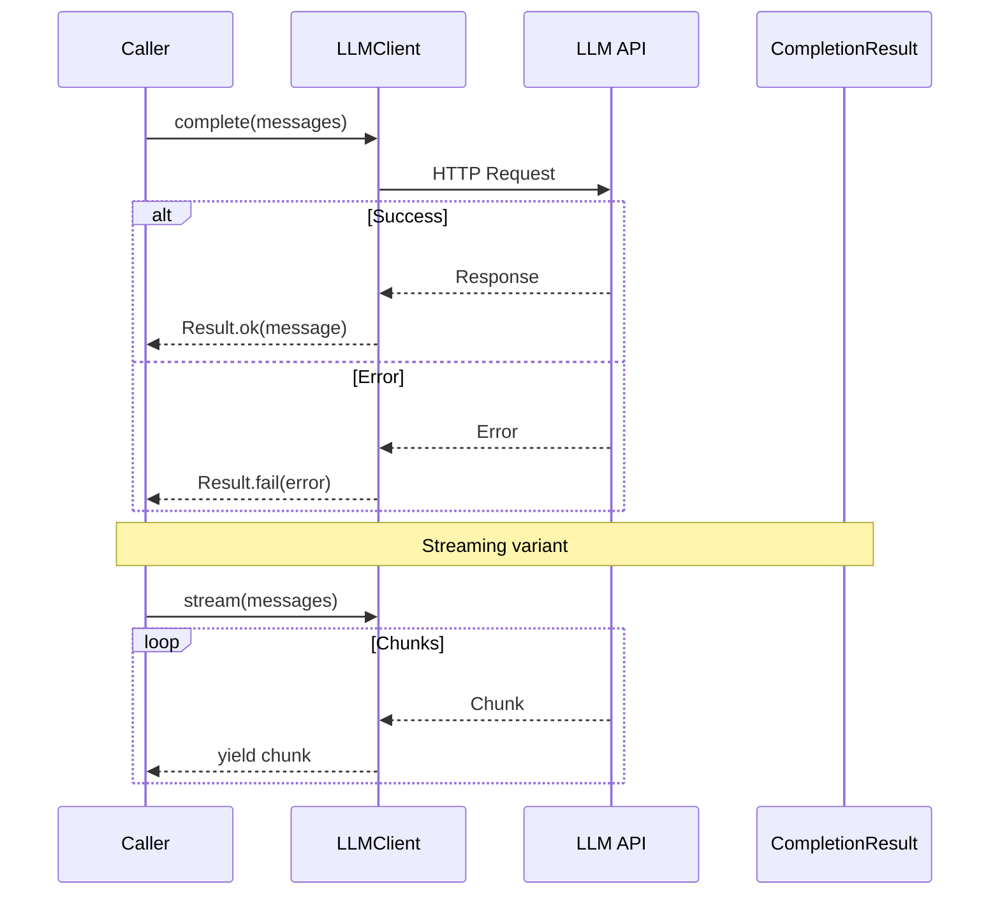

# LLM Module

Protocol-based LLM client abstraction for pluggable backends.

## LLM Architecture



## LLM Request Flow



## LLM Client Protocol

```python
from cemaf.llm import LLMClient, Message, create_llm_client

# Use any LLM implementation
llm: LLMClient = create_llm_client("mock")

# Complete
result = await llm.complete([
    Message.system("You are a helpful assistant"),
    Message.user("Hello!")
])

if result.success:
    print(result.message.content)
```

## Message Types

```python
from cemaf.llm.protocols import Message

system_msg = Message.system("System prompt")
user_msg = Message.user("User input")
assistant_msg = Message.assistant("Response")
tool_msg = Message.tool_result("tool_id", "result")
```

## Streaming

```python
async for chunk in llm.stream(messages):
    print(chunk.content, end="", flush=True)
```

## Instrumented LLM Client

`InstrumentedLLMClient` wraps any `LLMClient` and auto-records every `complete()`/`stream()` call into a `RunLogger` for glass box audit:

```python
from cemaf.llm.instrumented import InstrumentedLLMClient
from cemaf.observability.run_logger import InMemoryRunLogger

run_logger = InMemoryRunLogger()
run_logger.start_run(run_id="run_001", dag_name="pipeline")

# Wrap any LLM client — transparent to callers
instrumented = InstrumentedLLMClient(
    client=my_llm_client,
    run_logger=run_logger,
    node_id="step_0",
    agent_id="researcher",
)

# Use exactly like a normal LLMClient
result = await instrumented.complete(messages=[Message.user("Hello")])
# LLMCall automatically recorded in RunLogger with model, tokens, cost, duration
```

The `ContextNodeExecutor` automatically wraps agents' LLM clients with `InstrumentedLLMClient` when a `RunLogger` is present — no manual wiring needed in DAG execution.

## LLM Configuration

```python
from cemaf.llm.protocols import LLMConfig

config = LLMConfig(
    model="gemma3:4b",
    temperature=0.7,
    max_tokens=4096,
    top_p=0.9,
    stop_sequences=["END"],
    timeout_seconds=30,
)

# Override config per-call
result = await llm.complete(messages=messages, config_override=config)
```

## OpenAI

Use `openai` for the native OpenAI Responses API:

```python
from cemaf.llm import Message, create_llm_client

llm = create_llm_client("openai", model="gpt-5.5")
result = await llm.complete([Message.user("Summarize this run")])
```

The native adapter uses Responses streaming for `stream()`. For
`count_tokens_exact()`, it calls the OpenAI input-token counting endpoint when
available and falls back to the local estimator if the endpoint is unavailable
or fails.

Use `openai-compatible` for servers that expose the Chat Completions wire
protocol, such as local inference servers or provider gateways:

```python
from cemaf.llm import create_llm_client

llm = create_llm_client(
    "openai-compatible",
    base_url="http://localhost:8000/v1",
    api_key="local",
    model="qwen",
)
```

Configuration-driven local/free serving:

```bash
CEMAF_LLM_PROVIDER=ollama
CEMAF_LLM_DEFAULT_MODEL=gemma3:4b
```

## Gemini and Vertex

Use `gemini` for Google AI Studio API-key access:

```python
from cemaf.llm import Message, create_llm_client

llm = create_llm_client("gemini", api_key="...", model="gemini-2.5-flash")
result = await llm.complete([Message.user("Summarize this run")])
```

Use `vertex` or `vertex-ai` when the same Gemini adapter should call Vertex AI:

```python
from cemaf.llm import create_llm_client

llm = create_llm_client(
    "vertex",
    gcp_project="my-project",
    location="us-central1",
    model="gemini-2.5-flash",
)
```

Vertex authentication resolves in this order: explicit `access_token`,
`VERTEX_ACCESS_TOKEN`/`GCP_ACCESS_TOKEN`/`GCLOUD_ACCESS_TOKEN`, Application
Default Credentials, then `gcloud auth print-access-token`. If an API key is
provided, the adapter can use the Vertex API-key header instead.

Both paths support CEMAF tool definitions for `complete()`, `stream()`, and
`count_tokens_exact()`.

## Batch Processing

Use `BatchLLMClient` for offline Anthropic Message Batches workloads. It is not
low-latency streaming: `stream()` submits a single-item batch through
`complete()` and emits the completed response as a fallback stream for generic
`LLMClient` callers. `count_tokens_exact()` returns the local estimate because
the batch API does not provide a preflight count endpoint.

```python
from cemaf.llm.factories import create_batch_client
from cemaf.llm.protocols import Message

client = create_batch_client(api_key="...", model="claude-sonnet-4-6")
result = await client.complete([Message.user("Summarize this dataset")])
```

## LLM Factories

```python
from cemaf.llm.factories import create_llm_client_from_config

# From environment (reads CEMAF_LLM_PROVIDER, CEMAF_LLM_DEFAULT_MODEL, etc.)
client = create_llm_client_from_config()

# Register custom backends
from cemaf.llm.factories import llm_registry
llm_registry.register(backend="custom", factory=my_factory_fn)
```
