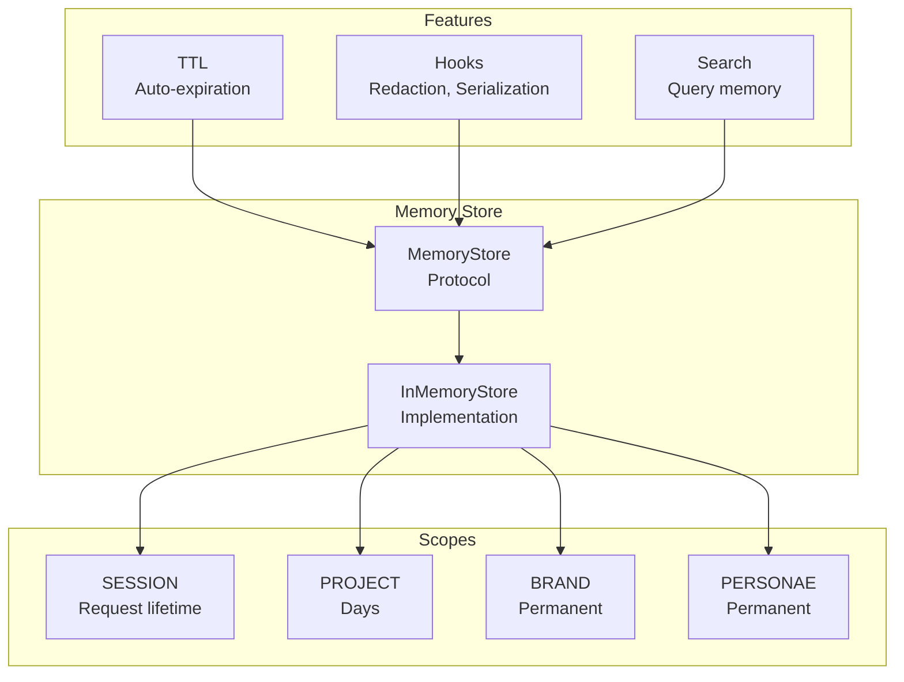
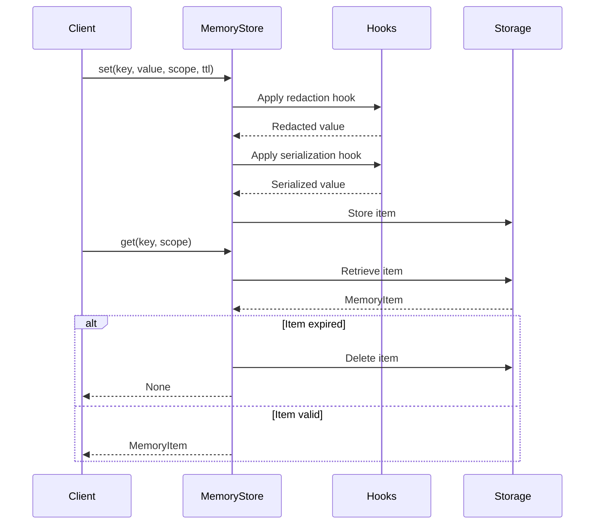

# Memory Management

CEMAF provides scoped memory management for different persistence needs.

## Memory Architecture



## Memory Operations Flow



## Memory Scopes

| Scope      | Persistence | Use Case           |
| ---------- | ----------- | ------------------ |
| `SESSION`  | Request     | Conversation state |
| `PROJECT`  | Days        | Task context       |
| `BRAND`    | Permanent   | Brand guidelines   |
| `PERSONAE` | Permanent   | User preferences   |

## Memory Store

```python
from cemaf.memory.base import MemoryStore, InMemoryStore
from cemaf.core.enums import MemoryScope

store = InMemoryStore()

# Store memory
await store.set(
    key="user_preference",
    value={"theme": "dark"},
    scope=MemoryScope.USER
)

# Retrieve memory
item = await store.get("user_preference", scope=MemoryScope.USER)

# List by scope
items = await store.list_by_scope(MemoryScope.USER)

# Search
results = await store.search("preference", scope=MemoryScope.USER)
```

## Memory Item

```python
from cemaf.memory.base import MemoryItem

item = MemoryItem(
    key="key",
    value={"data": "value"},
    scope=MemoryScope.PROJECT,
    metadata={"source": "user"}
)

# Full key includes scope
full_key = item.full_key  # "PROJECT:key"
```

## Deduplication

Detect and resolve near-duplicate memory items before storage. Uses a two-stage approach: exact key match, then embedding similarity.

```python
from cemaf.memory.deduplication import SemanticDeduplicator, DeduplicationAction

deduplicator = SemanticDeduplicator(
    semantic_store=my_semantic_store,
    similarity_threshold=0.85,
)

# Find duplicates of a candidate item
matches = await deduplicator.find_duplicates(candidate=item, threshold=0.85)

# Resolve: STORE_NEW, SKIP, or MERGE
result = await deduplicator.resolve(candidate=item, matches=matches)

if result.action == DeduplicationAction.SKIP:
    print("Duplicate detected, skipping")
elif result.action == DeduplicationAction.MERGE:
    print(f"Merged with: {result.merged_from}")
```

### Resolution Logic

| Match Type | Resolution |
|------------|-----------|
| No matches | `STORE_NEW` |
| Exact key | `MERGE` (keep higher confidence) |
| Semantic, existing higher confidence | `SKIP` |
| Semantic, candidate higher confidence | `MERGE` |

The `MemoryDeduplicator` protocol allows custom strategies:

```python
from cemaf.memory.deduplication import MemoryDeduplicator

@runtime_checkable
class MemoryDeduplicator(Protocol):
    async def find_duplicates(self, candidate: MemoryItem, *, threshold: float = 0.85) -> tuple[DuplicateMatch, ...]: ...
    async def resolve(self, candidate: MemoryItem, matches: tuple[DuplicateMatch, ...]) -> DeduplicationResult: ...
```

## Tiered Progressive Loading

Three-tier progressive retrieval reduces token usage by loading memory at the appropriate resolution.

### Loading Tiers

| Tier | Tokens | Content | Use Case |
|------|--------|---------|----------|
| `L0` | ~100 | One-sentence abstract | Broad scan, ranking |
| `L1` | ~2K | Overview for planning | Shortlisting |
| `L2` | Full | Complete content | Final selection |

### TieredMemoryStore

```python
from cemaf.memory.tiered_store import TieredMemoryStore
from cemaf.memory.tiered import TruncationTierGenerator
from cemaf.memory.semantic import MemoryQuery

store = TieredMemoryStore(
    semantic_store=my_semantic_store,
    tier_generator=TruncationTierGenerator(),
)

# Store with auto-generated tier abstracts
tiered_item = await store.store_with_tiers(item=my_item)

# Progressive search: L0 broad scan -> L1 shortlist -> L2 final
results = await store.progressive_search(
    query=MemoryQuery(text="user preferences", scope=MemoryScope.PROJECT),
    l0_limit=50,   # Stage 1: broad scan
    l1_limit=10,   # Stage 2: shortlist
    l2_limit=5,    # Stage 3: final selection
)

# Access cached tiered item
tiered = store.get_tiered(full_key="PROJECT:my_key")
content = tiered.content_at_tier(LoadingTier.L1)
```

### Tier Generation

`TruncationTierGenerator` creates tiers without LLM calls using truncation heuristics. Implement the `TierGenerator` protocol for LLM-based summarization:

```python
from cemaf.memory.tiered import TierGenerator

@runtime_checkable
class TierGenerator(Protocol):
    async def generate_tiers(self, item: MemoryItem) -> TieredMemoryItem: ...
```

## Scope Propagation

Hierarchical scope paths enable parent-child score propagation for scoped memory retrieval.

### ScopePath

```python
from cemaf.memory.scope_hierarchy import ScopePath, PropagatingScorer

# Parse hierarchical paths
path = ScopePath.from_string("project/campaign/assets")
path.root        # "project"
path.depth       # 3
path.parent      # ScopePath("project/campaign")
path.is_ancestor_of(child_path)  # True if ancestor
```

### PropagatingScorer

Scores scopes by sampling items, then propagates parent scores to children:

```python
scorer = PropagatingScorer(
    semantic_store=my_semantic_store,
    propagation_factor=0.7,  # child_score += parent_score * 0.7
)

scope_nodes = await scorer.score_scopes(
    query=MemoryQuery(text="brand guidelines"),
    scope_paths=(
        ScopePath.from_string("project"),
        ScopePath.from_string("project/brand"),
        ScopePath.from_string("project/brand/colors"),
    ),
)
# Returns ScopeNode tuple sorted by score descending
for node in scope_nodes:
    print(f"{node.path}: score={node.score:.2f}, items={node.item_count}")
```

## Post-Session Extraction

Automatically extract and promote session learnings to long-term memory when a session ends.

### RuleBasedExtractor

Heuristic extraction without LLM dependency:

```python
from cemaf.memory.extraction import RuleBasedExtractor, ExtractionCategory

extractor = RuleBasedExtractor(
    min_confidence=0.6,
    min_event_importance=0.7,
)

extracted = await extractor.extract(
    session_memories=session_items,
    episodes=episode_list,
    recent_events=events,
)
```

### Extraction Rules

| Rule | Input | Output |
|------|-------|--------|
| High-confidence SESSION items | `confidence >= 0.6` | Promote to PROJECT as FACT |
| Repeated action patterns | Same action 3+ times | PATTERN with count-based confidence |
| Error/correction events | `importance >= 0.7` | CORRECTION as lesson learned |

### ExtractionPipeline

Wires extract -> deduplicate -> store into a single flow:

```python
from cemaf.memory.extraction_pipeline import ExtractionPipeline

pipeline = ExtractionPipeline(
    extractor=RuleBasedExtractor(),
    deduplicator=my_deduplicator,  # optional
    memory_manager=my_manager,
    event_bus=my_event_bus,         # optional, emits MEMORY_EXTRACTED
)

report = await pipeline.run(
    session_memories=session_items,
    episodes=episodes,
    recent_events=events,
)
print(f"Extracted: {report.extracted_count}, Stored: {report.stored_count}")
print(f"Deduplicated: {report.deduplicated_count}, Skipped: {report.skipped_count}")
```

## SQLite Backend

Persistent memory store backed by SQLite via `aiosqlite`. Auto-creates the table on first use, handles TTL expiration, and supports `scope_path` for hierarchical queries.

```python
from cemaf.memory.sqlite_store import SqliteMemoryStore

store = SqliteMemoryStore(db_path="cemaf_memory.db")

await store.set(item=my_item)
item = await store.get(scope=MemoryScope.PROJECT, key="my_key")
items = await store.list_by_scope(scope=MemoryScope.PROJECT)  # excludes expired
removed = await store.cleanup_expired()  # returns count removed
```

Configure via environment variable:

```bash
export CEMAF_MEMORY_SQLITE_PATH=cemaf_memory.db
```

## Factory Functions

| Factory | Creates | Key Parameters |
|---------|---------|----------------|
| `memory_store_registry.register(...)` | Custom `MemoryStore` backend | `backend`, `factory` |
| `memory_scorer_registry.register(...)` | Custom `MemoryScorer` backend | `backend`, `factory` |
| `memory_compactor_registry.register(...)` | Custom `MemoryCompactor` backend | `backend`, `factory` |
| `memory_extractor_registry.register(...)` | Custom `MemoryExtractor` backend | `backend`, `factory` |
| `create_memory_store(backend=)` | `MemoryStore` | `"memory"`, `"json_file"`, `"sqlite"`, `"postgres"`, or registered custom backend; `max_items` and `default_ttl_seconds` apply to the built-in memory backend |
| `create_memory_scorer()` | `MemoryScorer` | `"temporal_decay"` or registered custom backend |
| `create_memory_compactor()` | `MemoryCompactor` | `"simple"`, `scorer`, or registered custom backend |
| `create_memory_extractor()` | `MemoryExtractor` | `"rule_based"` or registered custom backend |
| `create_memory_store_from_config()` | `MemoryStore` | Reads `CEMAF_MEMORY_BACKEND`, `CEMAF_MEMORY_MAX_ITEMS`, `CEMAF_MEMORY_DEFAULT_TTL_SECONDS`, and backend path/DSN env vars |
| `create_memory_manager()` | `DefaultMemoryManager` | `memory_store`, `embedding_provider`, `vector_store`, `scorer`, `episodic_store`, `deduplicator` |
| `create_memory_runtime()` | `MemoryRuntime` | `memory_backend`, `vector_backend`, `embedding_provider_name`, `scorer_type`, `extractor_type`, `compactor_type`, `event_bus` |
| `create_session_manager()` | `DefaultSessionManager` | `memory_manager`, `extraction_pipeline`, `compactor`, `compactor_type` |
| `create_tiered_store()` | `TieredMemoryStore` | `memory_store` |
| `create_extraction_pipeline()` | `ExtractionPipeline` | `memory_manager`, `extractor`, `extractor_type`, `deduplicator`, `event_bus` |
| `create_scope_scorer()` | `PropagatingScorer` | `semantic_store`, `propagation_factor` |

```python
from cemaf.memory.factories import (
    create_extraction_pipeline,
    create_memory_compactor,
    create_memory_extractor,
    create_memory_manager,
    create_memory_runtime,
    create_memory_scorer,
    create_memory_store,
    create_scope_scorer,
    create_session_manager,
    create_tiered_store,
)

# SQLite-backed memory manager with session extraction
store = create_memory_store(backend="sqlite")
manager = create_memory_manager(memory_store=store)
pipeline = create_extraction_pipeline(memory_manager=manager)
session_mgr = create_session_manager(
    memory_manager=manager,
    extraction_pipeline=pipeline,
)

# One-call runtime composition
runtime = create_memory_runtime(
    memory_backend="sqlite",
    vector_backend="sqlite",
    embedding_provider_name="hash",
    db_path="cemaf_memory.db",
)
manager = runtime.memory_manager
session_mgr = runtime.session_manager

# Bounded in-process memory for development/tests
store = create_memory_store(
    backend="memory",
    max_items=1000,
    default_ttl_seconds=3600.0,
)
```

Custom stores can be registered without editing CEMAF:

```python
from cemaf.memory import MemoryStore, memory_store_registry, create_memory_store

def create_redis_memory_store(**kwargs) -> MemoryStore:
    return RedisMemoryStore(url=kwargs["redis_url"])

memory_store_registry.register(
    backend="redis",
    factory=create_redis_memory_store,
)

store = create_memory_store(backend="redis", redis_url="redis://localhost:6379")
```

Custom memory internals can be registered the same way:

```python
from cemaf.memory import memory_compactor_registry, create_memory_runtime

memory_compactor_registry.register(
    backend="llm_summary",
    factory=lambda **kwargs: LlmMemoryCompactor(llm=kwargs["llm"]),
)

runtime = create_memory_runtime(compactor_type="llm_summary")
```
