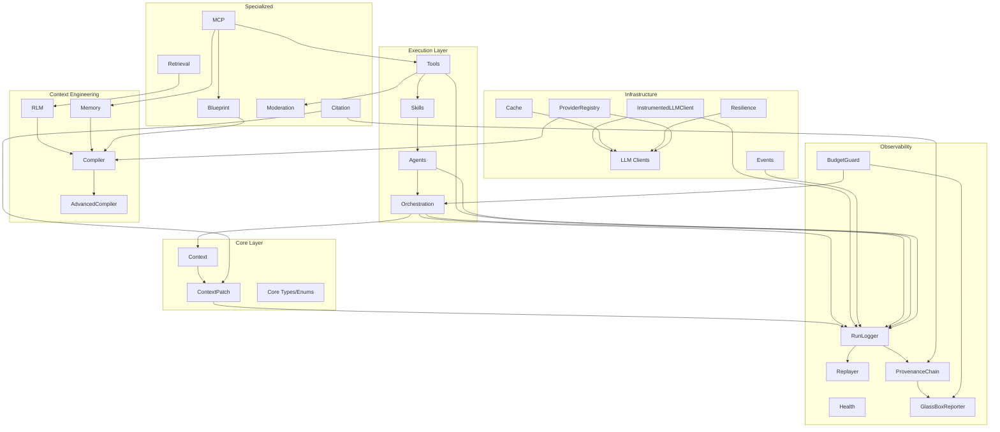

# Module Interconnections

This document provides a unified view of how CEMAF modules depend on and integrate with each other. Understanding these interconnections is crucial for building integrated systems and identifying integration opportunities.

## Overview

CEMAF modules are organized into layers:

1. **Core Layer**: Foundation types, context, and protocols
2. **Execution Layer**: Tools, skills, agents, and orchestration
3. **Context Engineering Layer**: Compilation, budgeting, RLM, memory
4. **Infrastructure Layer**: LLM, cache, events, resilience, observability
5. **Specialized Layer**: Blueprint, moderation, citation, retrieval, MCP

## Dependency Graph



## Core Layer Interconnections

### Context → ContextPatch → RunLogger

**Flow**: Context changes create patches, patches are logged

```python
# Context change creates patch
patch = ContextPatch.set(
    path="data.result",
    value=result,
    source=PatchSource.TOOL,
    source_id="web_search",
)

# Patch applied to context
new_context = context.apply(patch)

# Patch logged for observability
run_logger.record_patch(patch, correlation_id="run_123")
```

**Integration Points**:
- `Context.apply()` creates new context from patch
- `RunLogger.record_patch()` records patch with provenance
- `PatchLog` enables replay and debugging

## Execution Layer Interconnections

### Tools → Skills → Agents → Orchestration

**Flow**: Tools compose into skills, skills compose into agents, agents orchestrated in DAGs

```python
# Tool execution
tool_result = await tool.execute(query="search term")

# Skill uses multiple tools
skill_result = await skill.execute(context)

# Agent uses skills and tools
agent_result = await agent.execute(goal, context)

# Orchestration coordinates agents
dag_result = await executor.run(dag, context)
```

**Integration Points**:
- Tools registered in `ToolRegistry`
- Skills registered in `SkillRegistry`
- Agents use skills and tools via dependency injection
- DAGExecutor coordinates node execution

### Orchestration → Context → Observability

**Flow**: DAG execution creates context patches, patches logged

```python
# DAG execution creates patches
result = await executor.run(dag, context)

# Patches created for each node output
patch = ContextPatch.set(
    path=f"nodes.{node_id}.output",
    value=node_result.data,
    source=PatchSource.AGENT,
    source_id=node_id,
)

# Patches logged automatically
run_logger.record_patch(patch, correlation_id=result.run_id)
```

**Integration Points**:
- `DAGExecutor` creates patches for node outputs
- `RunLogger` records complete execution history
- Correlation IDs link related operations

## Context Engineering Interconnections

### RLM → Context Compiler → Token Budget

**Flow**: RLM uses compiler for budget enforcement, chunks converted to context sources

```python
# RLM uses compiler for budget enforcement
compiler = PriorityContextCompiler(estimator)
engine = DivideAndConquerQueryEngine(llm, compiler, max_depth=3)

# Chunks converted to context sources
chunk_data = tuple((chunk.chunk_id, chunk.content) for chunk in chunks)
compiled = await compiler.compile(
    artifacts=chunk_data,
    memories=(),
    budget=budget,
)
```

**Integration Points**:
- `RLM` uses `ContextCompiler` for budget enforcement
- Chunks converted to `(key, content)` pairs for compiler
- Compiler respects token budget limits

### Memory → Context Compiler

**Flow**: Memory items included in context compilation

```python
import json

from cemaf.core.enums import MemoryScope

# Memory items retrieved
session_items = await memory_store.list_by_scope(MemoryScope.SESSION)
memories = tuple(
    (item.key, json.dumps(item.value, sort_keys=True))
    for item in session_items
)

# Included in context compilation
compiled = await compiler.compile(
    artifacts=artifacts,
    memories=memories,
    budget=budget,
)
```

**Integration Points**:
- `MemoryStore` provides memories for compilation
- Compiler includes memories as context sources
- Memories prioritized based on recency and relevance

### Blueprint → Context Compiler

**Flow**: Blueprints inform context compilation priorities

```python
# Blueprint defines context priorities
blueprint = Blueprint(...)
priorities = blueprint.get_context_priorities()

# Used in context compilation
compiled = await compiler.compile(
    artifacts=artifacts,
    memories=memories,
    budget=budget,
    priorities=priorities,
)
```

**Integration Points**:
- `Blueprint.get_context_priorities()` returns priority map
- Compiler uses priorities for source selection
- Better context selection based on blueprint requirements

## Infrastructure Interconnections

### Cache → LLM

**Flow**: Cache intercepts LLM calls for performance

```python
# LLM calls cached
@cache.cached(ttl=3600)
async def llm_call(prompt: str) -> str:
    return await llm_client.complete(prompt)
```

**Integration Points**:
- Cache decorators wrap LLM calls
- Cache stores responses by prompt hash
- TTL-based expiration

### Resilience → LLM

**Flow**: Resilience patterns wrap LLM calls

```python
# Retry wrapper
@retry(max_attempts=3, backoff=exponential)
async def llm_call(prompt: str) -> str:
    return await llm_client.complete(prompt)

# Circuit breaker wrapper
@circuit_breaker(failure_threshold=5)
async def llm_call(prompt: str) -> str:
    return await llm_client.complete(prompt)
```

**Integration Points**:
- Retry decorators handle transient failures
- Circuit breakers prevent cascading failures
- Rate limiters prevent API throttling

### Events → Observability

**Flow**: Events emitted to EventBus, recorded in RunLogger

```python
# Event emitted
event_bus.emit("tool.executed", {
    "tool_id": "web_search",
    "result": result,
})

# Event recorded in RunLogger
run_logger.record_event(event, correlation_id="run_123")
```

**Integration Points**:
- EventBus emits events for system events
- RunLogger subscribes to events for recording
- Correlation IDs link events to runs

## Specialized Module Interconnections

### Citation → Context Patches

**Flow**: Citations tracked as context patches for provenance

```python
# Citation created
citation = Citation.from_search_result(search_result)

# Tracked as context patch
patch = ContextPatch.set(
    path="citations.fact_123",
    value=fact.fact,
    source=PatchSource.TOOL,
    source_id="citation_tracker",
    metadata={"citations": [citation.to_dict()]},
)
```

**Integration Points**:
- `CitationTracker` creates citations from search results
- Citations stored in patch metadata
- Full provenance including source attribution

### Retrieval → Citation

**Flow**: Search results converted to citations

```python
# Search results retrieved
results = await vector_store.search_by_text("query", k=5)

# Converted to citations
citations = tracker.track_search_results(results)
```

**Integration Points**:
- `SearchResult` objects contain metadata
- `CitationTracker` extracts metadata for citations
- Citations linked to source documents

### Retrieval → RLM

**Flow**: Retrieval results become RLM chunks

```python
from cemaf.context.budget import TokenBudget
from cemaf.context.compiler import PriorityContextCompiler, SimpleTokenEstimator
from cemaf.rlm import ContextChunk, DivideAndConquerQueryEngine

results = await vector_store.search_by_text("release risk", k=5)
chunks = tuple(
    ContextChunk(chunk_id=result.id, content=result.content)
    for result in results
)

compiler = PriorityContextCompiler(SimpleTokenEstimator())
engine = DivideAndConquerQueryEngine(llm_client, compiler, max_depth=3)
answer = await engine.query(
    instruction="Summarize the release risks",
    chunks=chunks,
    budget=TokenBudget(max_tokens=4000),
)
```

**Integration Points**:
- Retrieval ranks the relevant documents
- RLM receives retrieved documents as `ContextChunk` inputs
- The compiler still enforces the token budget before LLM calls

### Moderation → Tools

**Flow**: Tools use moderation pipelines for content safety

```python
# Tool with moderation
tool = Tool(
    id="web_search",
    moderation_pipeline=moderation_pipeline,
)

# Moderation checks input/output
result = await tool.execute(query)
# Moderation automatically checks input and output
```

**Integration Points**:
- Tools accept `ModerationPipeline` parameter
- Pre-flight checks on inputs
- Post-flight checks on outputs

### MCP → Tools/Memory/Blueprint

**Flow**: MCP adapter exposes CEMAF components as MCP services

```python
# MCP adapter exposes components
adapter = MCPAdapter(
    tools=ToolRegistry([tool1, tool2]),
    memory_store=memory_store,
    blueprints=[blueprint1, blueprint2],
)

# Components accessible via MCP protocol
# - tools/list, tools/call
# - resources/list, resources/read
# - prompts/list, prompts/get
```

**Integration Points**:
- `ToolBridge` converts tools to MCP format
- `ResourceBridge` exposes memory as resources
- `PromptBridge` exposes blueprints as prompts

## Integration Patterns

### Pattern 1: Full Integration

```python
# Complete integration with all modules
system = create_agent_system(
    llm_client=llm,
    memory_store=memory,
    run_logger=logger,
    moderation=moderation,
    citation_tracker=tracker,
    vector_store=vector_store,
)

# Automatically wires:
# - Tools → Moderation
# - Retrieval → Citation → Patches
# - Memory → Context Compiler
# - Events → RunLogger
# - Blueprint → Context Compiler
```

### Pattern 2: Minimal Integration

```python
# Minimal integration for simple use cases
executor = DAGExecutor(
    node_executor=my_executor,
    run_logger=logger,
)

# Only wires:
# - Orchestration → Context → Observability
```

### Pattern 3: Custom Integration

```python
# Custom integration for specific needs
compiler = AdvancedContextCompiler(
    llm_client=llm,
    token_estimator=estimator,
)

engine = DivideAndConquerQueryEngine(llm, compiler, max_depth=3)
```

## Glass Box Audit Interconnections

### ProvenanceChain → RunRecord → GlassBoxReporter

**Flow**: Every LLM call creates a ProvenanceLink; the chain feeds the Glass Box report

```python
from cemaf.core.provenance import ProvenanceLink, ProvenanceChain, SourceReference

# Each LLM call produces a ProvenanceLink
link = ProvenanceLink(
    id="prov_001",
    llm_call_id="call_abc",
    node_id="step_0",
    agent_id="researcher",
    context_sources=(
        SourceReference(source_id="doc_1", source_type="artifact", token_count=500, priority=10, included=True),
        SourceReference(source_id="doc_2", source_type="artifact", token_count=300, priority=5, included=False, exclusion_reason=ExclusionReason.BUDGET_EXCEEDED),
    ),
    context_hash="abc123",
    citation_ids=("cite_1",),
    patch_ids=("patch_1",),
    budget_utilization=0.85,
    cost_usd=0.003,
)

# Chain accumulates links across a DAG run
chain = ProvenanceChain(run_id="run_123", links=(link,))

# GlassBoxReporter generates audit report from RunRecord
reporter = GlassBoxReporter()
report = reporter.generate(record=run_record)
```

**Integration Points**:
- `ProvenanceLink` cross-references LLMCall, ContextSources, Citations, Patches
- `RunRecord.provenance_chain` stores the full chain
- `GlassBoxReporter.generate()` produces decision trace, token audit, cost breakdown

### BudgetGuard → DAGExecutor

**Flow**: BudgetGuard enforces cost/token limits during DAG execution

```python
from cemaf.observability.budget_guard import BudgetGuard

guard = BudgetGuard(max_cost_usd=1.0, max_total_tokens=100_000)

executor = DAGExecutor(
    node_executor=my_executor,
    budget_guard=guard,
)

# Executor checks guard after each node
# If should_halt() returns True, execution stops
result = await executor.run(dag, context)
```

**Integration Points**:
- `BudgetGuard.check_budget()` returns alerts at INFO/WARNING/CRITICAL/HALT levels
- `DAGExecutor` calls `should_halt()` after each node execution
- Alerts recorded in RunRecord for post-hoc analysis

### Citation → ProvenanceLink → GlassBoxReporter

**Flow**: Citations carry provenance_link_id; GlassBoxReporter verifies coverage

```python
# Citation references its provenance
citation = Citation(
    id="cite_1",
    source_id="doc_1",
    provenance_link_id="prov_001",  # Links back to ProvenanceLink
    agent_id="researcher",
    node_id="step_0",
)

# GlassBoxReporter verifies every citation references a source the LLM saw
coverage = reporter.verify_citation_coverage(record=run_record)
# coverage.verified_citations: citations with matching included sources
# coverage.unverified_ids: orphan citations (potential hallucinations)
```

**Integration Points**:
- `Citation.provenance_link_id` links to the ProvenanceLink that produced it
- `SourceReference.included` tracks whether a source was in the LLM context
- `GlassBoxReporter.verify_citation_coverage()` catches orphan citations

## Audit PR Interconnections (v0.2.1)

### InstrumentedLLMClient → RunLogger

**Flow**: Every LLM call transparently recorded into RunLogger via wrapper

```python
from cemaf.llm.instrumented import InstrumentedLLMClient

# ContextNodeExecutor wraps agents' LLM clients automatically
instrumented = InstrumentedLLMClient(
    client=llm_client,
    run_logger=run_logger,
    node_id="step_0",
    agent_id="researcher",
)

# Every complete()/stream() call is recorded as an LLMCall in RunRecord
result = await instrumented.complete(messages=messages)
```

**Integration Points**:
- `InstrumentedLLMClient` delegates to wrapped client, records timing/tokens/cost
- `ContextNodeExecutor._instrument_client()` applies wrapping automatically
- `RunLogger.record_llm_call()` stores the call in the active `RunRecord`

### ProviderRegistry → Factory Systems

**Flow**: Extensible backend selection for LLM, context compiler, and retrieval factories

```python
from cemaf.core.provider_registry import ProviderRegistry
from cemaf.context.factories import context_compiler_registry

# Register custom backend — no source modification needed
context_compiler_registry.register(backend="custom", factory=my_factory)
compiler = context_compiler_registry.create(backend="custom", token_estimator=est)
```

**Integration Points**:
- `llm_registry` powers `create_llm_client_from_config()`
- `context_compiler_registry` powers `create_context_compiler_from_config()`
- `vector_store_registry` powers `create_vector_store_from_config()`

### DAGExecutor → CancellationToken

**Flow**: Cooperative cancellation checked before each node in DAG execution

```python
from cemaf.core.execution import CancellationToken

token = CancellationToken()
result = await executor.run(dag, initial_context=ctx, cancellation_token=token)

# Token checked at start of each node iteration
# If cancelled, returns failed ExecutionResult with cancellation reason
```

**Integration Points**:
- `DAGExecutor.run()` accepts optional `cancellation_token`
- Token checked in main loop before each node execution
- Parent-child token hierarchy for nested cancellation

### DAGExecutor → Loop Nodes

**Flow**: Loop nodes iterate body subgraph within the DAG

```python
# Node.loop() defines iterative execution
loop = Node.loop(
    id="refine",
    name="Refinement Loop",
    body_node_ids=("draft", "review"),
    max_iterations=5,
    exit_condition="review_passed",
)
```

**Integration Points**:
- `DAGExecutor._execute_loop_node()` runs body nodes per iteration
- Exit condition is a truthy context key check after each iteration
- Body nodes marked as completed after loop to prevent double execution in topo sort

### ContextSource.compressible → Algorithm Exclusion Details

**Flow**: Compressible flag flows from source through algorithm to exclusion metadata

**Integration Points**:
- `GreedySelectionAlgorithm` and `KnapsackSelectionAlgorithm` include `compressible` in `excluded_details`
- `AdvancedContextCompiler` can use this to decide summarize vs drop
- `GlassBoxReporter` can audit which excluded sources were compressible

## Missing or Weak Interconnections

### 1. RLM ↔ AdvancedContextCompiler

**Current**: RLM uses basic `PriorityContextCompiler`

**Opportunity**: RLM could use `AdvancedContextCompiler` for summarization

**Benefit**: Better token efficiency for large contexts

**Implementation**: Update `DivideAndConquerQueryEngine` to accept `AdvancedContextCompiler`

### 2. ~~Citation ↔ Context Patches~~ ✓ RESOLVED in v0.2.0

Citations now carry `provenance_link_id`, `agent_id`, `node_id`, and `context_path` fields. `GlassBoxReporter.verify_citation_coverage()` validates citations against context sources.

### 3. Blueprint ↔ Context Compiler

**Current**: Blueprints generate prompts but don't integrate with context compilation

**Opportunity**: Blueprints could inform context compilation priorities

**Benefit**: Better context selection based on blueprint requirements

**Implementation**: Add `get_context_priorities()` method to `Blueprint`

### 4. Moderation ↔ Tools

**Current**: Moderation exists but integration unclear

**Opportunity**: Tools/Skills should use moderation pipeline

**Benefit**: Consistent content safety across all operations

**Implementation**: Add moderation pipeline parameter to `Tool` base class

### 5. Retrieval ↔ RLM

**Current**: No connection between retrieval and RLM

**Opportunity**: RLM could use retrieval for semantic chunking

**Benefit**: Better chunk boundaries based on semantic similarity

**Implementation**: Add semantic chunking option to RLM

### 6. Memory ↔ Context Compiler

**Current**: Memory exists but unclear how it integrates with context compilation

**Opportunity**: Memory items should be included in context compilation

**Benefit**: Automatic inclusion of relevant memories in context

**Implementation**: Integrate `MemoryStore` with `ContextCompiler`

### 7. Events ↔ Observability

**Current**: Event bus exists but not integrated with RunLogger

**Opportunity**: Events could be recorded in RunLogger

**Benefit**: Complete event history for debugging

**Implementation**: Integrate `EventBus` with `RunLogger`

### 8. Scheduler ↔ Orchestration

**Current**: Scheduler exists independently

**Opportunity**: Scheduler could trigger DAG execution

**Benefit**: Scheduled multi-agent workflows

**Implementation**: Integrate `Scheduler` with `DAGExecutor`

## Best Practices

1. **Use Protocols**: All modules use protocols for dependency injection
2. **Factory Functions**: Use factory functions for common integrations
3. **Correlation IDs**: Pass correlation IDs through for tracing
4. **Event-Driven**: Use events for loose coupling
5. **Immutable Context**: Never mutate context directly, use patches
6. **Observability First**: Log all operations for debugging
7. **Test Integration**: Write integration tests for cross-module workflows

## Related Documentation

- [Architecture](architecture.md) - System design overview
- [Context Management](context.md) - Context and patches
- [Orchestration](orchestration.md) - DAG execution
- [Observability](observability.md) - Logging and tracing
- [Integration Guide](integration.md) - External framework integration
