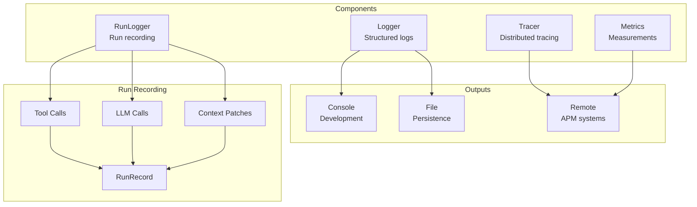
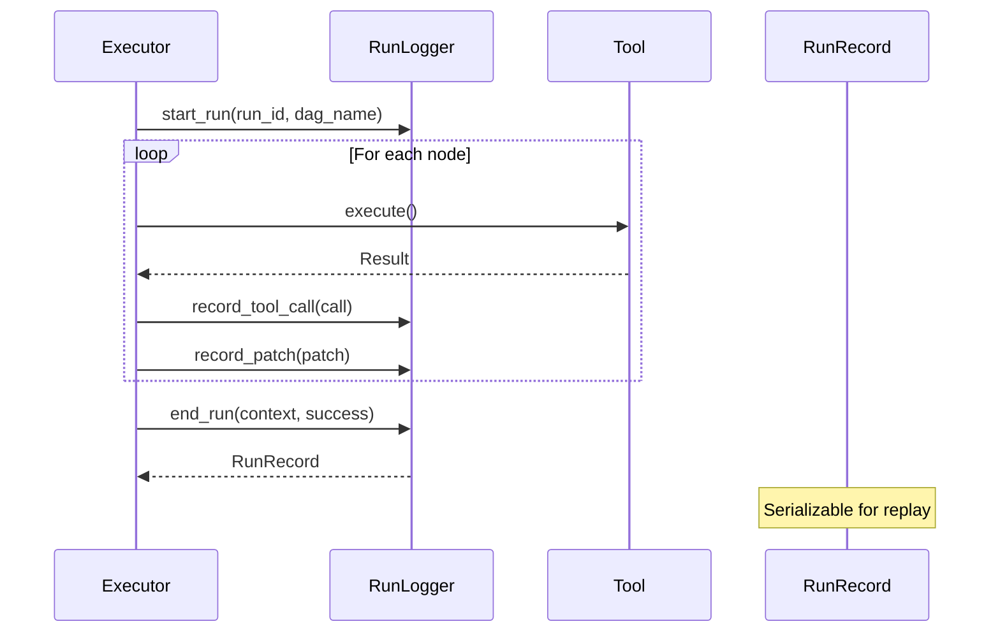
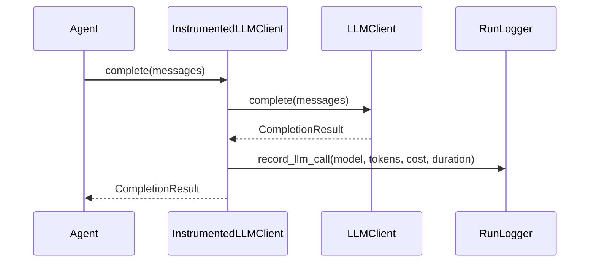

# Observability

Logging, tracing, and metrics for monitoring.

## Observability Architecture



## Run Recording Flow



## Budget Guard

Enforces cost and token limits across a DAG run with configurable alert thresholds:

```python
from cemaf.observability.budget_guard import BudgetGuard, AlertLevel

guard = BudgetGuard(
    max_cost_usd=5.0,
    max_total_tokens=500_000,
    warning_threshold=0.7,   # Alert at 70%
    critical_threshold=0.9,  # Alert at 90%
)

# Record usage after each node
alert = guard.record_usage(cost_usd=0.10, tokens=2000)
if alert and alert.level == AlertLevel.HALT:
    print("Budget exhausted - stopping execution")

# Check budget status
guard.cost_utilization    # 0.0 - 1.0
guard.token_utilization   # 0.0 - 1.0
guard.should_halt()       # True if either >= 1.0
guard.alerts              # All alerts generated
```

Integrated with DAGExecutor — pass `budget_guard` to automatically halt execution when limits are exceeded:

```python
from cemaf.orchestration.executor import DAGExecutor

executor = DAGExecutor(
    node_executor=my_executor,
    budget_guard=BudgetGuard(max_cost_usd=1.0, max_total_tokens=100_000),
)
result = await executor.run(dag=dag)
# result.metadata["budget_guard"] contains final budget state
```

## Glass Box Reporter

Generates complete audit reports from a `RunRecord`, cross-referencing provenance chains, LLM calls, citations, and costs:

```python
from cemaf.observability.glass_box import GlassBoxReporter

reporter = GlassBoxReporter()
report = reporter.generate(record=run_record)

# Decision trace: what each LLM saw vs decided
for step in report.decision_trace:
    print(f"LLM {step.llm_call_id}: saw {step.sources_seen}, excluded {step.sources_excluded}")
    print(f"  Cited: {step.citation_ids}, Cost: ${step.cost_usd}")

# Token audit: per-source, per-node, per-agent breakdown
audit = report.token_audit
print(f"Input: {audit.total_input_tokens}, Output: {audit.total_output_tokens}")
print(f"Included: {audit.sources_included}, Excluded: {audit.sources_excluded}")
print(f"Exclusion reasons: {audit.exclusion_reasons}")

# Citation coverage: did the LLM see what it cited?
coverage = report.citation_coverage
print(f"Verified: {coverage.verified_citations}/{coverage.total_citations}")
if coverage.unverified_ids:
    print(f"Unverified citations: {coverage.unverified_ids}")

# Cost breakdown: per-model, per-node, per-agent
costs = report.cost_breakdown
print(f"Total: ${costs.total_cost_usd}, By model: {costs.by_model}")

# Serialize for storage or external systems
report_dict = report.to_dict()
```

## Instrumented LLM Recording

The `InstrumentedLLMClient` (see [LLM docs](./llm.md#instrumented-llm-client)) is the primary mechanism for transparent LLM call recording. It wraps any `LLMClient` and auto-records every call into the `RunLogger`:



The `ContextNodeExecutor` automatically wraps agents' LLM clients when a `RunLogger` is present — every LLM call in a DAG run is recorded without manual wiring.

## Logger

```python
from cemaf.observability.simple import SimpleLogger

logger = SimpleLogger()
logger.info("Operation started")
logger.error("Operation failed", exc_info=True)
```

## StructuredLogger

Production JSON-lines logger that writes structured records to stdout. Satisfies the `Logger` protocol with context propagation.

```python
from cemaf.observability.structured import StructuredLogger

logger = StructuredLogger(name="my_service", level=logging.INFO)

# Standard log levels with lazy % formatting
logger.info("Processing item %s", item_id)
logger.warning("Slow query", duration_ms=523, query="SELECT ...")
logger.error("Failed to connect", host="db.example.com")
```

Output (one JSON object per line):

```json
{"timestamp": "2026-03-16T12:00:00+00:00", "level": "INFO", "logger": "my_service", "message": "Processing item abc-123"}
```

### Context Propagation

`with_context()` returns a new logger with merged context fields that appear in every log entry:

```python
# Create a scoped logger with persistent fields
request_logger = logger.with_context(
    request_id="req-abc",
    user_id="user-42",
)
request_logger.info("Starting request")
# Output includes request_id and user_id in every line

# Chain contexts
node_logger = request_logger.with_context(node_id="summarizer")
node_logger.info("Executing node")
# Output includes request_id, user_id, AND node_id
```

### Keyword Arguments

Any extra keyword arguments passed to log methods are included as top-level fields in the JSON output:

```python
logger.info("LLM call completed", model="gpt-4", tokens=1523, cost_usd=0.045)
# {"timestamp": "...", "level": "INFO", "message": "LLM call completed", "model": "gpt-4", "tokens": 1523, "cost_usd": 0.045}
```

## PrometheusMetrics

Production metrics collector backed by `prometheus_client`. Uses lazy registration to avoid duplicate metric errors and supports counters, gauges, histograms, and timing.

```python
from cemaf.observability.prometheus_metrics import PrometheusMetrics

metrics = PrometheusMetrics(prefix="cemaf")

# Counters
metrics.counter(name="requests_total", value=1, tags={"method": "POST", "status": "200"})

# Gauges
metrics.gauge(name="active_connections", value=42.0, tags={"service": "llm"})

# Histograms
metrics.histogram(name="response_size_bytes", value=1024.0)

# Timing (converts ms to seconds for histogram)
metrics.timing(name="llm_latency", value_ms=523.0, tags={"model": "gpt-4"})

# Export Prometheus text format (for /metrics endpoint)
exposition = metrics.generate_metrics()
```

### Lazy Registration

Metrics are created on first use and cached. Calling the same metric name with the same label set reuses the existing Prometheus collector:

```python
# First call registers the counter
metrics.counter(name="llm_calls", tags={"model": "gpt-4"})

# Subsequent calls increment the existing counter
metrics.counter(name="llm_calls", tags={"model": "gpt-4"})
```

### Integration with ResilientLLMClient

Pass `PrometheusMetrics` as the `MetricsCollector` to `ResilientLLMClient` for automatic LLM call tracking:

```python
from cemaf.llm.resilient import create_resilient_client

client = create_resilient_client(
    client=my_llm_client,
    metrics=metrics,
)
# Every complete() call records: prompt_tokens, completion_tokens, duration, success/error
```

### Installation

Requires the `prometheus-client` package:

```bash
uv add prometheus-client
```
