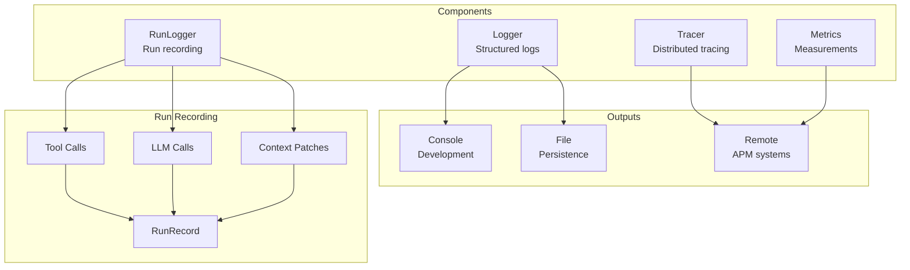
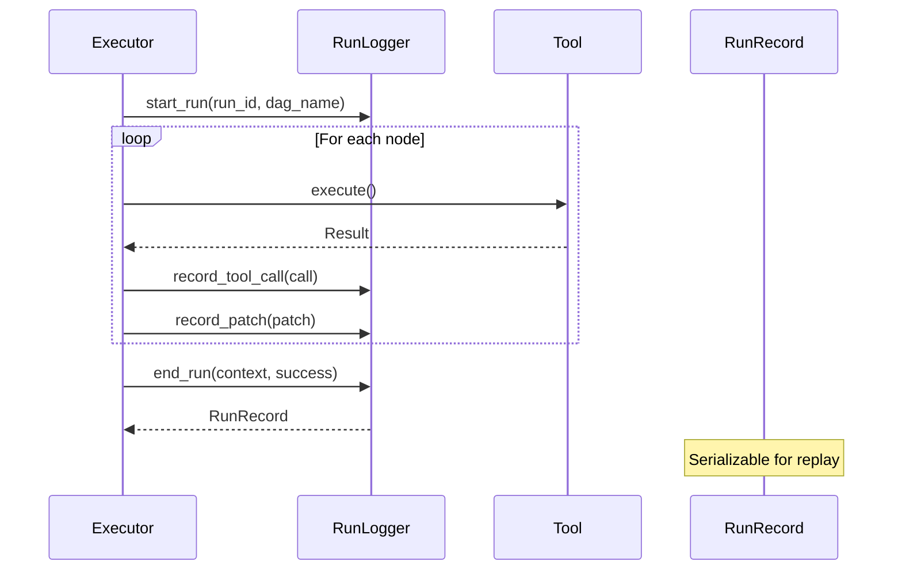
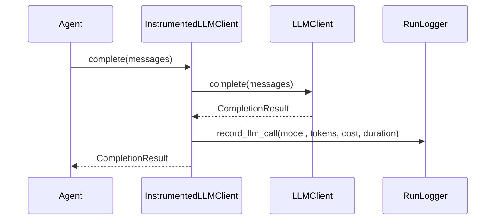

# Observability

Logging, tracing, and metrics for monitoring.

## Observability Architecture



## Run Recording Flow



## Budget Guard

Enforces cost and token limits across a DAG run with configurable alert thresholds:

```python
from cemaf.observability.budget_guard import BudgetGuard, AlertLevel

guard = BudgetGuard(
    max_cost_usd=5.0,
    max_total_tokens=500_000,
    warning_threshold=0.7,   # Alert at 70%
    critical_threshold=0.9,  # Alert at 90%
)

# Record usage after each node
alert = guard.record_usage(cost_usd=0.10, tokens=2000)
if alert and alert.level == AlertLevel.HALT:
    print("Budget exhausted - stopping execution")

# Check budget status
guard.cost_utilization    # 0.0 - 1.0
guard.token_utilization   # 0.0 - 1.0
guard.should_halt()       # True if either >= 1.0
guard.alerts              # All alerts generated
```

Integrated with DAGExecutor — pass `budget_guard` to automatically halt execution when limits are exceeded:

```python
from cemaf.orchestration.executor import DAGExecutor

executor = DAGExecutor(
    node_executor=my_executor,
    budget_guard=BudgetGuard(max_cost_usd=1.0, max_total_tokens=100_000),
)
result = await executor.run(dag=dag)
# result.metadata["budget_guard"] contains final budget state
```

## Glass Box Reporter

Generates complete audit reports from a `RunRecord`, cross-referencing provenance chains, LLM calls, citations, and costs:

```python
from cemaf.observability.glass_box import GlassBoxReporter

reporter = GlassBoxReporter()
report = reporter.generate(record=run_record)

# Decision trace: what each LLM saw vs decided
for step in report.decision_trace:
    print(f"LLM {step.llm_call_id}: saw {step.sources_seen}, excluded {step.sources_excluded}")
    print(f"  Cited: {step.citation_ids}, Cost: ${step.cost_usd}")

# Token audit: per-source, per-node, per-agent breakdown
audit = report.token_audit
print(f"Input: {audit.total_input_tokens}, Output: {audit.total_output_tokens}")
print(f"Included: {audit.sources_included}, Excluded: {audit.sources_excluded}")
print(f"Exclusion reasons: {audit.exclusion_reasons}")

# Citation coverage: did the LLM see what it cited?
coverage = report.citation_coverage
print(f"Verified: {coverage.verified_citations}/{coverage.total_citations}")
if coverage.unverified_ids:
    print(f"Unverified citations: {coverage.unverified_ids}")

# Cost breakdown: per-model, per-node, per-agent
costs = report.cost_breakdown
print(f"Total: ${costs.total_cost_usd}, By model: {costs.by_model}")

# Serialize for storage or external systems
report_dict = report.to_dict()
```

## Instrumented LLM Recording

The `InstrumentedLLMClient` (see [LLM docs](./llm.md#instrumented-llm-client)) is the primary mechanism for transparent LLM call recording. It wraps any `LLMClient` and auto-records every call into the `RunLogger`:



The `ContextNodeExecutor` automatically wraps agents' LLM clients when a `RunLogger` is present — every LLM call in a DAG run is recorded without manual wiring.

## Logger

```python
from cemaf.observability.simple import SimpleLogger

logger = SimpleLogger()
logger.info("Operation started")
logger.error("Operation failed", exc_info=True)
```
