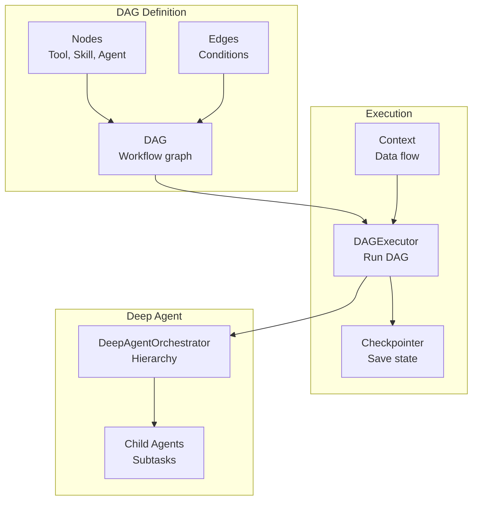
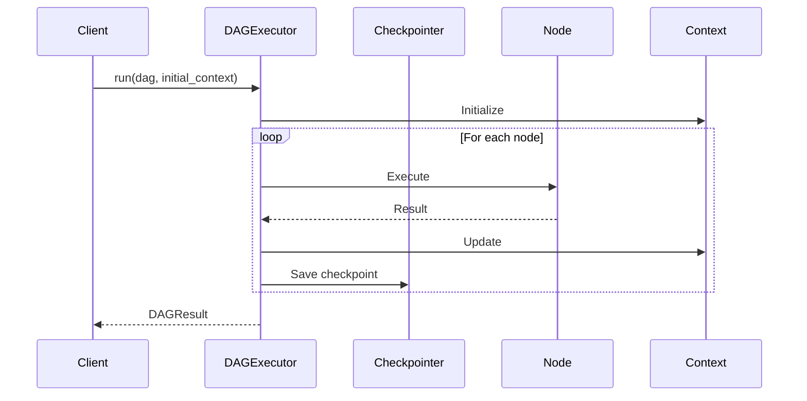
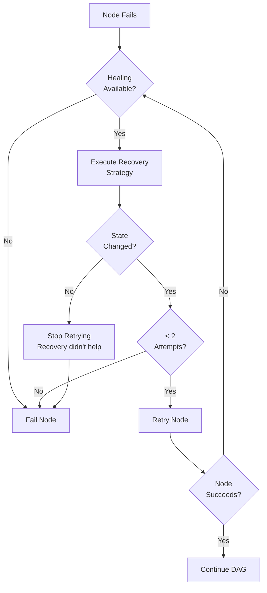

# Orchestration

CEMAF provides powerful orchestration capabilities through DAGs, executors, and deep agent hierarchies.

## Orchestration Architecture



## DAG Execution Flow



## Building DAGs

Create directed acyclic graphs for workflow execution:

```python
from cemaf.orchestration.dag import DAG, Node, Edge
from cemaf.core.types import NodeID

# Create DAG
dag = DAG(name="research-pipeline")

# Add nodes
dag = dag.add_node(Node.tool(id="search", name="Search", tool_id="search", output_key="results"))
dag = dag.add_node(Node.skill(id="analyze", name="Analyze", skill_id="analyzer", output_key="analysis"))
dag = dag.add_node(Node.agent(id="review", name="Review", agent_id="reviewer", output_key="review"))

# Add edges
dag = dag.add_edge(Edge(source=NodeID("search"), target=NodeID("analyze")))
dag = dag.add_edge(Edge(source=NodeID("analyze"), target=NodeID("review")))

# Validate
dag.validate()
```

## Node Types

```python
# Tool node
Node.tool(id="t1", name="Tool", tool_id="tool_id", output_key="result")

# Skill node
Node.skill(id="s1", name="Skill", skill_id="skill_id", output_key="result")

# Agent node
Node.agent(id="a1", name="Agent", agent_id="agent_id", output_key="result")

# Router node (conditional routing)
Node.router(id="r1", name="Router", routes={"success": "next", "failure": "retry"})

# Parallel node
Node.parallel(id="p1", name="Parallel", parallel_nodes=["t1", "t2"], output_key="results")

# Conditional node (evaluates condition, routes by boolean result)
Node.conditional(
    id="c1",
    name="Check Quality",
    condition="quality_score",  # context key, callable, or Condition object
    routes={True: "publish", False: "revise"},
)

# Loop node (iterates body nodes until exit condition or max iterations)
Node.loop(
    id="l1",
    name="Refine Loop",
    body_node_ids=("draft", "review"),
    max_iterations=5,
    exit_condition="review_passed",  # context key evaluated as truthy
    output_key="refined_output",
)
```

### Loop Node Execution

The `DAGExecutor` handles loop nodes by iterating the body subgraph:

1. Each iteration executes body nodes in sequence
2. After each iteration, checks the `exit_condition` context key
3. Stops when exit condition is truthy or `max_iterations` reached
4. Body node results are merged into context after the loop completes

## Edge Conditions

```python
# Always traverse
Edge(source="a", target="b", condition=EdgeCondition.ALWAYS)

# On success
Edge(source="a", target="b", condition=EdgeCondition.ON_SUCCESS)

# On failure
Edge(source="a", target="b", condition=EdgeCondition.ON_FAILURE)

# Conditional rule
rule = Condition(field="status", operator=ConditionOperator.EQUALS, value="done")
Edge(source="a", target="b", condition=EdgeCondition.JSON_RULE, condition_rule=rule)
```

## DAG Visualization

Visualize DAGs as Mermaid diagrams:

```python
# Print to console
dag.print_mermaid()

# Save to file (auto-wraps in markdown if .md)
dag.save_mermaid("pipeline.md")

# Get raw Mermaid code
mermaid_code = dag.to_mermaid(direction="TD")  # TD, LR, BT, RL
```

## Executing DAGs

```python
from cemaf.orchestration.executor import DAGExecutor
from cemaf.context.context import Context

executor = DAGExecutor(node_executor=my_executor)

initial_context = Context(data={"query": "test"})
result = await executor.run(dag, initial_context=initial_context)

if result.status == RunStatus.COMPLETED:
    print(result.final_context.get("summary"))
```

### Cooperative Cancellation

Pass a `CancellationToken` to `run()` for cooperative cancellation:

```python
from cemaf.core.execution import CancellationToken

token = CancellationToken()

# In another coroutine or thread:
# token.cancel(reason="User requested stop")

result = await executor.run(dag, initial_context=context, cancellation_token=token)
# Executor checks token before each node — if cancelled, returns failed result with reason
```

## Auto-Healing & Recovery

CEMAF automatically recovers from execution errors using configurable recovery strategies with intelligent loop prevention:

```python
from cemaf.orchestration.executor import DAGExecutor
from cemaf.core.recovery import AutoHealManager, RecoveryStrategy
from cemaf.core.result import Result

# Define recovery strategies
class SummarizeContextStrategy(RecoveryStrategy):
    def recover(self, error_result: Result, context: Context) -> Result[Context]:
        """Recover from token limit by summarizing context."""
        summary = summarize(context.to_dict())
        return Result.ok(context.set("summary", summary))

# Setup auto-heal manager
heal_manager = AutoHealManager()
heal_manager.register("TokenLimitExceeded", SummarizeContextStrategy())
heal_manager.register_pattern(r"timeout.*", TimeoutRecoveryStrategy())

# Run with auto-healing
executor = DAGExecutor(node_executor=my_executor, auto_heal_manager=heal_manager)
result = await executor.run(dag, initial_context=context)
```

### Healing Safeguards

Auto-healing includes safeguards to prevent infinite loops:

1. **State Hash Verification** - Healing must change the context state to retry
   - If healing succeeds but doesn't modify context, retry loop exits
   - Prevents wasted resources on ineffective recoveries

2. **Healing Attempt Limit** - Maximum 2 healing attempts per node
   - After limit reached, node fails permanently
   - Prevents exponential retry explosion

3. **Fallback Chain** - Tries multiple recovery strategies in order
   - Exact error type match
   - Pattern matching on error message
   - Default recovery strategy
   - Graceful failure if no strategy works

### Healing Flow



## Health Checks & Pre-execution Validation

Register health checks to validate prerequisites before executing DAG nodes:

```python
from cemaf.orchestration.executor import DAGExecutor
from cemaf.orchestration.health import HealthCheckService, HealthStatus

class APIAvailabilityCheck(HealthCheckService):
    async def check_health(self) -> HealthStatus:
        """Check if external API is available."""
        try:
            response = await check_api_endpoint()
            return HealthStatus.HEALTHY if response.ok else HealthStatus.UNHEALTHY
        except Exception as e:
            return HealthStatus.UNHEALTHY

# Register health check
health_check = APIAvailabilityCheck()
executor = DAGExecutor(
    node_executor=my_executor,
    health_check_service=health_check
)

# Health check blocks execution if unhealthy
result = await executor.run(dag, initial_context=context)
if result.metadata.get("health_check_failed"):
    print("Pre-execution health check failed - DAG not executed")
```

### Health Check Behavior

- **Before DAG execution**: Health checks run and block if unhealthy
- **Prevents cascading failures**: Catches issues before wasting node execution
- **Metadata recording**: Failure reason recorded in result metadata
- **Allows graceful degradation**: Clients can implement fallback strategies

## Checkpointing

Resume DAG execution from checkpoints:

```python
from cemaf.orchestration.checkpointer import CheckpointingDAGExecutor, InMemoryCheckpointer

checkpointer = InMemoryCheckpointer()
executor = CheckpointingDAGExecutor(
    node_executor=my_executor,
    checkpointer=checkpointer,
    checkpoint_interval=5  # Save every 5 nodes
)

# Run with checkpointing
result = await executor.run(dag, initial_context=context)

# Resume from checkpoint
checkpoint = await checkpointer.load(run_id)
result = await executor.resume(checkpoint)
```

## Context Node Executor

The `ContextNodeExecutor` bridges DAG nodes to agents via the dynamic registry, threading provenance and domain context through every execution:

```python
from cemaf.orchestration.context_node_executor import ContextNodeExecutor
from cemaf.agents.registry import AgentRegistry

registry = AgentRegistry()
registry.register_agent(agent_instance=my_librarian)
registry.register_agent(agent_instance=my_summarizer)

executor = ContextNodeExecutor(
    agent_registry=registry,
    run_logger=InMemoryRunLogger(),
    domain_context=my_domain_context,  # Optional domain rules
)

# Each node execution: resolves agent, builds goal, records ProvenanceLink
result = await executor.execute_node(node=node, context=ctx)
```

## Budget-Guarded Execution

Pass a `BudgetGuard` to `DAGExecutor` for automatic cost and token enforcement:

```python
from cemaf.orchestration.executor import DAGExecutor
from cemaf.observability.budget_guard import BudgetGuard

executor = DAGExecutor(
    node_executor=my_executor,
    budget_guard=BudgetGuard(max_cost_usd=2.0, max_total_tokens=200_000),
    run_logger=InMemoryRunLogger(),
)
result = await executor.run(dag=dag)

if not result.success and "Budget exhausted" in (result.error or ""):
    print("Execution halted due to budget limits")
    print(result.metadata["budget_guard"])  # Final budget state
```

## Deep Agent Orchestration

Hierarchical multi-agent execution with context isolation:

```python
from cemaf.orchestration.deep_agent import DeepAgentOrchestrator

orchestrator = DeepAgentOrchestrator(
    agent_registry=my_registry,
    max_depth=3,
    max_children_per_agent=5
)

result = await orchestrator.run(
    agent_id="root_agent",
    goal={"task": "complex task"},
    initial_context=Context()
)
```

## Node Handlers

Complex node-type execution logic is extracted into dedicated handler functions in `orchestration/node_handlers.py`, keeping `DAGExecutor` focused on graph traversal.

### Handler Functions

| Handler | Node Type | Behavior |
|---------|-----------|----------|
| `execute_router_node()` | `ROUTER` | Evaluates route function/key, selects downstream targets, supports `default_route` fallback |
| `execute_conditional_node()` | `CONDITIONAL` | Evaluates condition (callable, rule, or context key), routes by boolean result |
| `execute_loop_node()` | `LOOP` | Iterates body nodes up to `max_iterations`, checks `exit_condition` context key each iteration |
| `execute_parallel_node()` | `PARALLEL` | Runs sub-nodes concurrently with semaphore-limited concurrency, merges branch contexts |

All handlers receive a `NodeHandlerContext` that bundles shared execution utilities:

```python
from cemaf.orchestration.node_handlers import NodeHandlerContext

handler_ctx = NodeHandlerContext(
    route_choices=route_choices_dict,
    apply_output=apply_output_fn,
    execute_with_retry=execute_with_retry_fn,
    merge_strategy=my_merge_strategy,
    max_parallel=4,
    run_logger=my_run_logger,
    correlation_id="run-abc-123",
)
```

### Parallel Execution Details

`execute_parallel_node()` and `run_parallel_nodes()` handle:
- Semaphore-bounded concurrency (configurable via `max_parallel`)
- Context isolation per branch (each branch gets a copy)
- Context merging after all branches complete (via `MergeStrategy`)
- Merge conflict recording as context patches when `RunLogger` is available
- Exception handling: failed branches produce error `NodeResult` without crashing others

## RuntimeServices

A frozen dataclass that bundles all optional runtime dependencies for orchestration. Avoids 16+ constructor parameters on `DAGExecutor`.

```python
from cemaf.orchestration.services import RuntimeServices

services = RuntimeServices(
    # Observability
    run_logger=my_run_logger,
    event_bus=my_event_bus,
    health_monitor=my_health_monitor,
    budget_guard=my_budget_guard,

    # Quality
    online_eval_pipeline=my_eval_pipeline,
    quality_police=my_police,

    # Memory
    memory_manager=my_memory_manager,
    session_manager=my_session_manager,

    # Content safety
    moderation_pipeline=my_moderation,

    # Context
    context_compiler=my_compiler,
    token_budget=my_budget,
    domain_context=my_domain_context,

    # LLM + Retrieval
    llm_client=my_llm,
    vector_store=my_vector_store,

    # Knowledge (SPEC-02/07)
    knowledge_graph=my_kg,

    # Agent selection (SPEC-09) / Council (SPEC-10)
    agent_selector=my_selector,
    council_aggregator=my_aggregator,

    # Interceptor spine (SPEC-01a) — PRE/POST chain + RECOVER budget
    interceptor_pipeline=my_pipeline,
    max_recovery_attempts=2,

    # Blueprints
    blueprint_library=my_library,
    blueprint_selector=my_selector_hook,

    # Recovery / tracing
    auto_heal_manager=my_heal_manager,
    tracer=my_tracer,
)
```

### Field Groups

| Group | Fields | Purpose |
|-------|--------|---------|
| Observability | `run_logger`, `event_bus`, `health_monitor`, `budget_guard` | Logging, events, health, cost limits |
| Quality | `online_eval_pipeline`, `quality_police` | Online evals, quality monitoring |
| Memory | `memory_manager`, `session_manager` | Memory recall/ingest, session lifecycle |
| Content Safety | `moderation_pipeline` | Input/output moderation |
| Context | `context_compiler`, `token_budget`, `domain_context` | Context compilation, budget, domain rules |
| LLM + Retrieval | `llm_client`, `vector_store` | LLM access, vector search |
| Recovery | `auto_heal_manager` | Auto-healing strategies |

All fields are `None` by default. The composition root reads them and wires only what is provided.

## Composition Root

`bootstrap.create_executor()` is the single entry point for creating a fully-wired `DAGExecutor`. It reads `RuntimeServices` and `ExecutorConfig`, then wires everything together.

```python
from cemaf.bootstrap import create_executor
from cemaf.orchestration.executor import ExecutorConfig
from cemaf.orchestration.services import RuntimeServices
from cemaf.agents.registry import AgentRegistry

registry = AgentRegistry()
registry.register_agent(agent_instance=my_agent)

executor = create_executor(
    agent_registry=registry,
    config=ExecutorConfig(
        max_parallel=4,
        enable_logging=True,
        enable_events=True,
        enable_moderation=False,
        node_timeout_seconds=30.0,
    ),
    services=RuntimeServices(
        run_logger=my_logger,
        event_bus=my_bus,
        memory_manager=my_memory,
        session_manager=my_sessions,
    ),
)
```

### What create_executor() Wires

1. Creates `ContextNodeExecutor` with agent registry, domain context, LLM, memory, and context compilation
2. If `event_bus` is enabled, subscribes `OnlineEvalPipeline` and `QualityPolice` to events
3. Creates `DAGExecutor` with node executor, logging, events, moderation, health, auto-healing, budget guard, session manager, and quality police
4. Config flags (`enable_logging`, `enable_events`, `enable_moderation`) control which optional components are active
