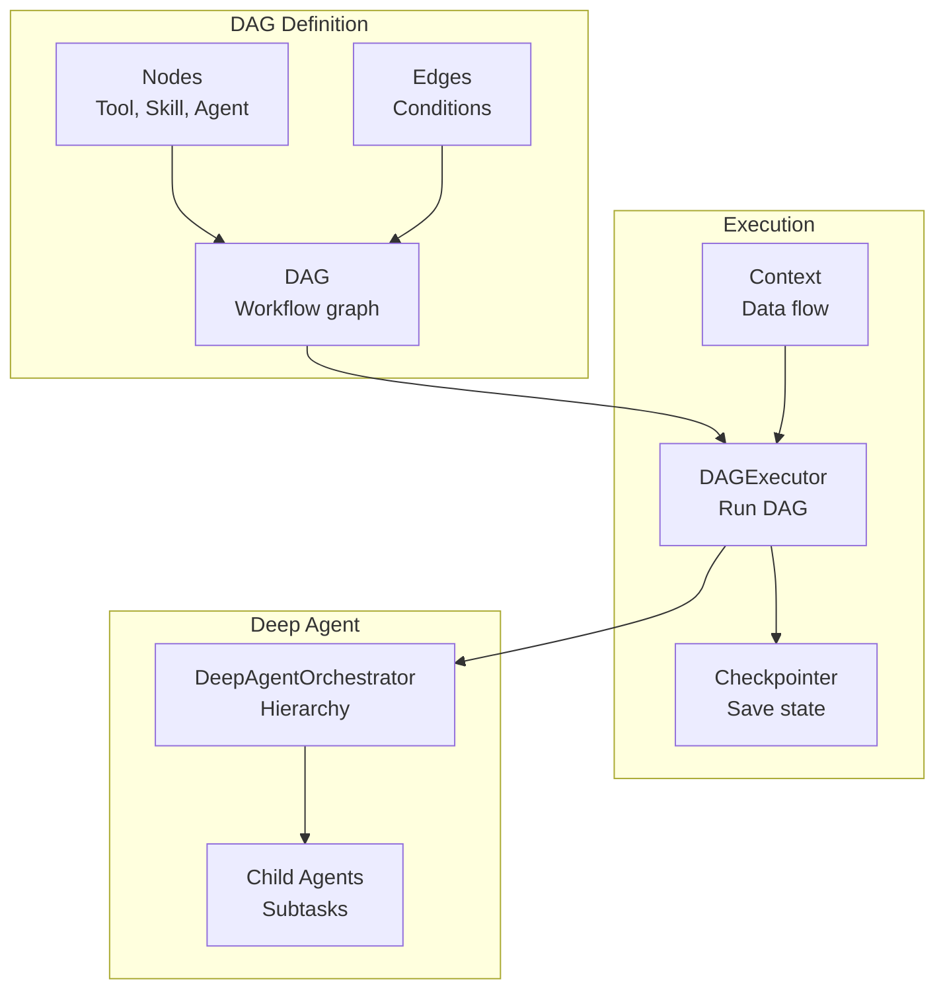
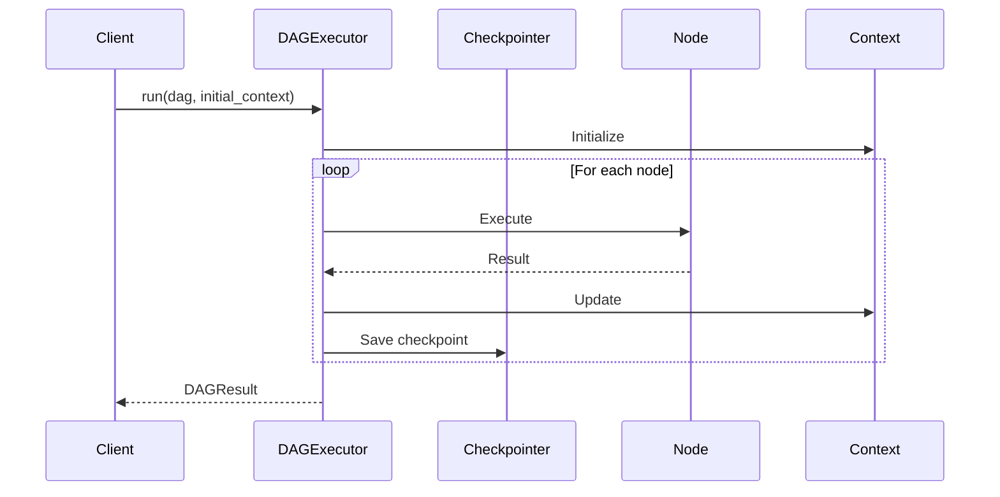
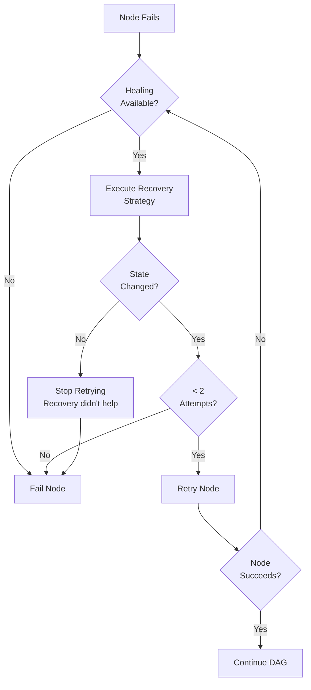

# Orchestration

CEMAF provides powerful orchestration capabilities through DAGs, executors, and deep agent hierarchies.

## Orchestration Architecture



## DAG Execution Flow



## Building DAGs

Create directed acyclic graphs for workflow execution:

```python
from cemaf.orchestration.dag import DAG, Node, Edge
from cemaf.core.types import NodeID

# Create DAG
dag = DAG(name="research-pipeline")

# Add nodes
dag = dag.add_node(Node.tool(id="search", name="Search", tool_id="search", output_key="results"))
dag = dag.add_node(Node.skill(id="analyze", name="Analyze", skill_id="analyzer", output_key="analysis"))
dag = dag.add_node(Node.agent(id="review", name="Review", agent_id="reviewer", output_key="review"))

# Add edges
dag = dag.add_edge(Edge(source=NodeID("search"), target=NodeID("analyze")))
dag = dag.add_edge(Edge(source=NodeID("analyze"), target=NodeID("review")))

# Validate
dag.validate()
```

## Node Types

```python
# Tool node
Node.tool(id="t1", name="Tool", tool_id="tool_id", output_key="result")

# Skill node
Node.skill(id="s1", name="Skill", skill_id="skill_id", output_key="result")

# Agent node
Node.agent(id="a1", name="Agent", agent_id="agent_id", output_key="result")

# Router node (conditional routing)
Node.router(id="r1", name="Router", routes={"success": "next", "failure": "retry"})

# Parallel node
Node.parallel(id="p1", name="Parallel", parallel_nodes=["t1", "t2"], output_key="results")
```

## Edge Conditions

```python
# Always traverse
Edge(source="a", target="b", condition=EdgeCondition.ALWAYS)

# On success
Edge(source="a", target="b", condition=EdgeCondition.ON_SUCCESS)

# On failure
Edge(source="a", target="b", condition=EdgeCondition.ON_FAILURE)

# Conditional rule
rule = Condition(field="status", operator=ConditionOperator.EQUALS, value="done")
Edge(source="a", target="b", condition=EdgeCondition.JSON_RULE, condition_rule=rule)
```

## DAG Visualization

Visualize DAGs as Mermaid diagrams:

```python
# Print to console
dag.print_mermaid()

# Save to file (auto-wraps in markdown if .md)
dag.save_mermaid("pipeline.md")

# Get raw Mermaid code
mermaid_code = dag.to_mermaid(direction="TD")  # TD, LR, BT, RL
```

## Executing DAGs

```python
from cemaf.orchestration.executor import DAGExecutor
from cemaf.context.context import Context

executor = DAGExecutor(node_executor=my_executor)

initial_context = Context(data={"query": "test"})
result = await executor.run(dag, initial_context=initial_context)

if result.status == RunStatus.COMPLETED:
    print(result.final_context.get("summary"))
```

## Auto-Healing & Recovery

CEMAF automatically recovers from execution errors using configurable recovery strategies with intelligent loop prevention:

```python
from cemaf.orchestration.executor import DAGExecutor
from cemaf.core.recovery import AutoHealManager, RecoveryStrategy
from cemaf.core.result import Result

# Define recovery strategies
class SummarizeContextStrategy(RecoveryStrategy):
    def recover(self, error_result: Result, context: Context) -> Result[Context]:
        """Recover from token limit by summarizing context."""
        summary = summarize(context.to_dict())
        return Result.ok(context.set("summary", summary))

# Setup auto-heal manager
heal_manager = AutoHealManager()
heal_manager.register("TokenLimitExceeded", SummarizeContextStrategy())
heal_manager.register_pattern(r"timeout.*", TimeoutRecoveryStrategy())

# Run with auto-healing
executor = DAGExecutor(node_executor=my_executor, auto_heal_manager=heal_manager)
result = await executor.run(dag, initial_context=context)
```

### Healing Safeguards

Auto-healing includes safeguards to prevent infinite loops:

1. **State Hash Verification** - Healing must change the context state to retry
   - If healing succeeds but doesn't modify context, retry loop exits
   - Prevents wasted resources on ineffective recoveries

2. **Healing Attempt Limit** - Maximum 2 healing attempts per node
   - After limit reached, node fails permanently
   - Prevents exponential retry explosion

3. **Fallback Chain** - Tries multiple recovery strategies in order
   - Exact error type match
   - Pattern matching on error message
   - Default recovery strategy
   - Graceful failure if no strategy works

### Healing Flow



## Health Checks & Pre-execution Validation

Register health checks to validate prerequisites before executing DAG nodes:

```python
from cemaf.orchestration.executor import DAGExecutor
from cemaf.orchestration.health import HealthCheckService, HealthStatus

class APIAvailabilityCheck(HealthCheckService):
    async def check_health(self) -> HealthStatus:
        """Check if external API is available."""
        try:
            response = await check_api_endpoint()
            return HealthStatus.HEALTHY if response.ok else HealthStatus.UNHEALTHY
        except Exception as e:
            return HealthStatus.UNHEALTHY

# Register health check
health_check = APIAvailabilityCheck()
executor = DAGExecutor(
    node_executor=my_executor,
    health_check_service=health_check
)

# Health check blocks execution if unhealthy
result = await executor.run(dag, initial_context=context)
if result.metadata.get("health_check_failed"):
    print("Pre-execution health check failed - DAG not executed")
```

### Health Check Behavior

- **Before DAG execution**: Health checks run and block if unhealthy
- **Prevents cascading failures**: Catches issues before wasting node execution
- **Metadata recording**: Failure reason recorded in result metadata
- **Allows graceful degradation**: Clients can implement fallback strategies

## Checkpointing

Resume DAG execution from checkpoints:

```python
from cemaf.orchestration.checkpointer import CheckpointingDAGExecutor, InMemoryCheckpointer

checkpointer = InMemoryCheckpointer()
executor = CheckpointingDAGExecutor(
    node_executor=my_executor,
    checkpointer=checkpointer,
    checkpoint_interval=5  # Save every 5 nodes
)

# Run with checkpointing
result = await executor.run(dag, initial_context=context)

# Resume from checkpoint
checkpoint = await checkpointer.load(run_id)
result = await executor.resume(checkpoint)
```

## Deep Agent Orchestration

Hierarchical multi-agent execution with context isolation:

```python
from cemaf.orchestration.deep_agent import DeepAgentOrchestrator

orchestrator = DeepAgentOrchestrator(
    agent_registry=my_registry,
    max_depth=3,
    max_children_per_agent=5
)

result = await orchestrator.run(
    agent_id="root_agent",
    goal={"task": "complex task"},
    initial_context=Context()
)
```
