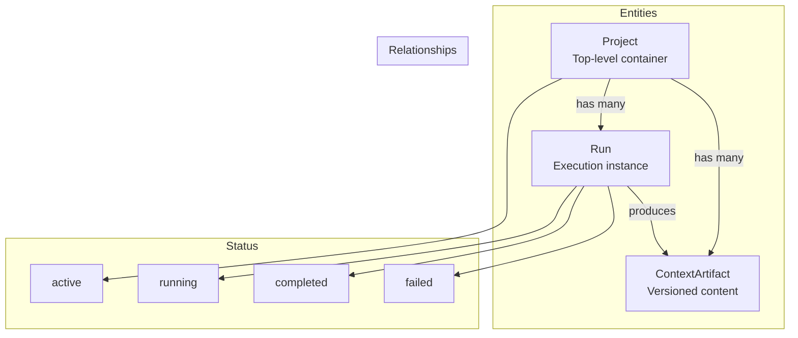
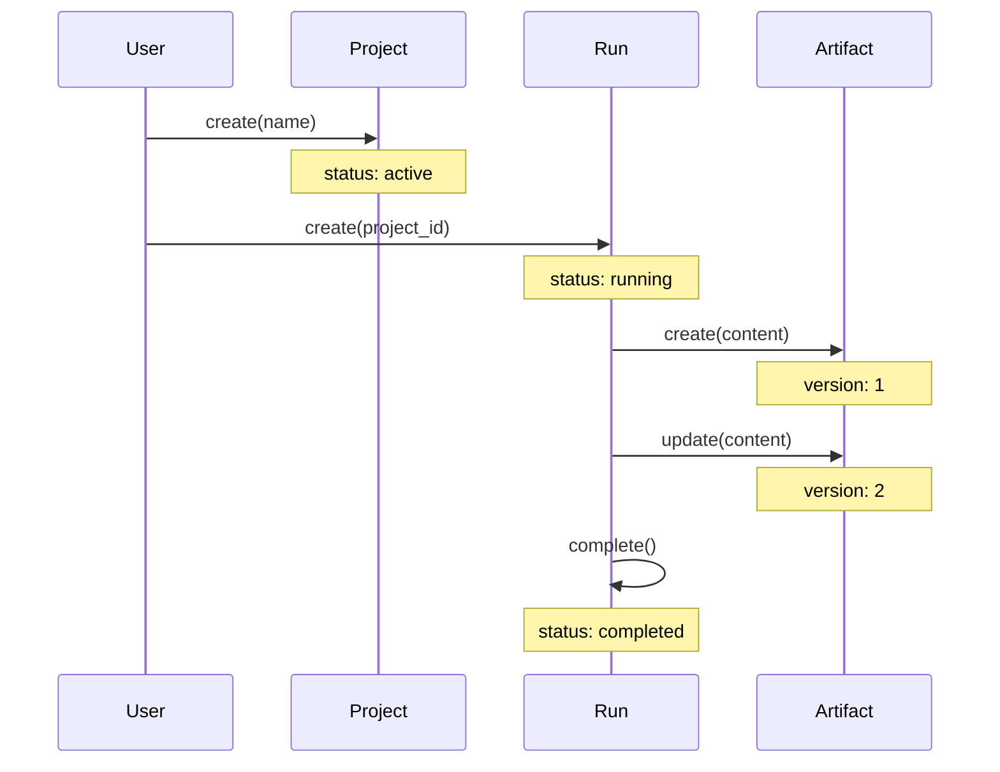

# Persistence

Entities for tracking projects, runs, and artifacts.

## Persistence Architecture



## Entity Lifecycle



## Entities

```python
from cemaf.persistence.entities import Project, Run, ContextArtifact

# Project
project = Project(id="proj1", name="My Project", status="active")

# Run
run = Run(id="run1", project_id="proj1", status=RunStatus.RUNNING)

# Artifact
artifact = ContextArtifact(
    id="art1",
    project_id="proj1",
    content="artifact content",
    version=1
)
```

## Store Factories

CEMAF defines storage protocols but does not ship concrete persistence stores. Register application-specific stores at the composition root, then construct them by backend name:

```python
from cemaf.persistence import project_store_registry, create_project_store


class PostgresProjectStore:
    ...


project_store_registry.register(
    backend="postgres",
    factory=lambda **options: PostgresProjectStore(
        database_url=options["database_url"],
    ),
)

store = create_project_store(
    backend="postgres",
    database_url="postgresql://...",
)
```

The same pattern exists for all persistence surfaces:

| Registry | Factory | Protocol |
| --- | --- | --- |
| `project_store_registry` | `create_project_store()` | `ProjectStore` |
| `artifact_store_registry` | `create_artifact_store()` | `ArtifactStore` |
| `content_store_registry` | `create_content_store()` | `ContentStore` |
| `run_store_registry` | `create_run_store()` | `RunStore` |

The config helpers select registered backends from environment variables:

- `CEMAF_PERSISTENCE_PROJECT_STORE_BACKEND`
- `CEMAF_PERSISTENCE_ARTIFACT_STORE_BACKEND`
- `CEMAF_PERSISTENCE_CONTENT_STORE_BACKEND`
- `CEMAF_PERSISTENCE_RUN_STORE_BACKEND`

Common environment values such as `DATABASE_URL`, `MONGODB_URI`, `S3_ARTIFACTS_BUCKET`, `AWS_REGION`, and `TIMESCALE_URL` are forwarded to custom factories as keyword options.
