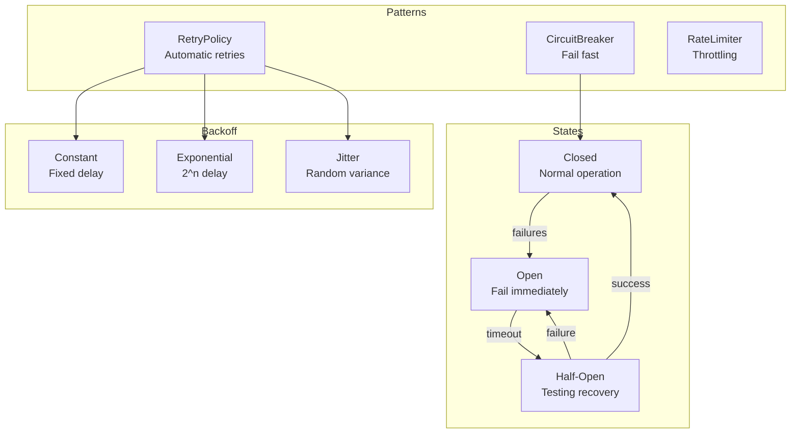
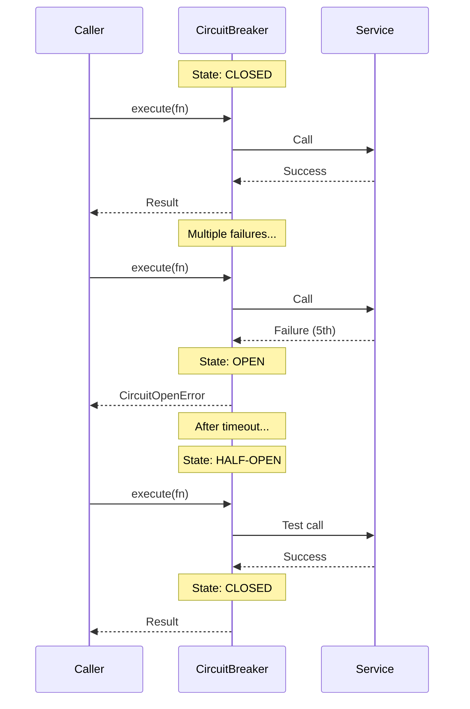

# Resilience

Retry, circuit breaker, and rate limiting for robust operations.

## Resilience Architecture



## Circuit Breaker Flow



## Retry Policy

```python
from cemaf.resilience.retry import RetryPolicy

policy = RetryPolicy(
    max_attempts=3,
    backoff_type="exponential",
    initial_delay=1.0
)

result = await policy.execute(async_function)
```

## Circuit Breaker

```python
from cemaf.resilience.circuit_breaker import CircuitBreaker

breaker = CircuitBreaker(
    failure_threshold=5,
    timeout_seconds=60
)

result = await breaker.execute(async_function)
```

## Rate Limiter

```python
from cemaf.resilience.rate_limiter import RateLimiter

limiter = RateLimiter(max_calls=10, time_window=60)

result = await limiter.execute(async_function)
```

## Factory Registries

Use the factory APIs when resilience wiring should be config-driven:

```python
from cemaf.resilience import (
    create_circuit_breaker,
    create_rate_limiter,
    create_retry_policy,
)

retry = create_retry_policy(max_attempts=3)
circuit = create_circuit_breaker(failure_threshold=5)
limiter = create_rate_limiter(requests_per_second=10.0, burst=20)
```

Applications can register custom resilience implementations without editing framework source:

```python
from cemaf.resilience import create_retry_policy, retry_policy_registry


class AdaptiveRetryPolicy:
    ...


retry_policy_registry.register(
    backend="adaptive",
    factory=lambda **options: AdaptiveRetryPolicy(
        max_attempts=options["max_attempts"],
        service=options["service"],
    ),
)

retry = create_retry_policy(
    backend="adaptive",
    max_attempts=5,
    service="search",
)
```

Available registries:

| Registry | Factory | Built-ins |
| --- | --- | --- |
| `retry_policy_registry` | `create_retry_policy()` | `default` |
| `circuit_breaker_registry` | `create_circuit_breaker()` | `default` |
| `rate_limiter_registry` | `create_rate_limiter()` | `token_bucket` |

Config helpers read backend selectors plus tuning variables:

- `CEMAF_RESILIENCE_RETRY_BACKEND`
- `CEMAF_RESILIENCE_CIRCUIT_BREAKER_BACKEND`
- `CEMAF_RESILIENCE_RATE_LIMITER_BACKEND`

## ResilientLLMClient

Composes retry, circuit breaker, and rate limiter into a single LLM client wrapper. Implements the `LLMClient` protocol so it can be used as a drop-in replacement.

### Execution Order

Requests flow through three layers in order:

```
Rate Limiter -> Circuit Breaker -> Retry -> LLMClient.complete()
```

1. **Rate limiter** checks token bucket; rejects immediately if exceeded
2. **Circuit breaker** fails fast if open (too many recent failures)
3. **Retry** attempts the call up to `max_attempts` with exponential backoff
4. **Inner client** makes the actual LLM API call

```python
from cemaf.llm.resilient import ResilientLLMClient
from cemaf.resilience.retry import RetryPolicy, RetryConfig, BackoffStrategy
from cemaf.resilience.circuit_breaker import CircuitBreaker, CircuitConfig
from cemaf.resilience.rate_limiter import RateLimiter, RateLimitConfig

client = ResilientLLMClient(
    client=my_llm_client,
    retry=RetryPolicy(
        config=RetryConfig(
            max_attempts=3,
            initial_delay_seconds=1.0,
            backoff_strategy=BackoffStrategy.EXPONENTIAL,
        ),
    ),
    circuit_breaker=CircuitBreaker(
        config=CircuitConfig(failure_threshold=5),
    ),
    rate_limiter=RateLimiter(
        config=RateLimitConfig(rate=10.0, burst=20),
    ),
    metrics=my_prometheus_metrics,  # optional MetricsCollector
)

# Use like any LLMClient
result = await client.complete(messages=messages)
```

### Factory Function

`create_resilient_client()` creates a `ResilientLLMClient` with sensible production defaults:

```python
from cemaf.llm.resilient import create_resilient_client

client = create_resilient_client(
    client=my_llm_client,
    metrics=my_metrics,  # optional
)
```

Default configuration:
- **Retry**: 3 attempts, 1s initial delay, exponential backoff
- **Circuit breaker**: Opens after 5 consecutive failures
- **Rate limiter**: 10 requests/second, burst of 20

### Streaming

Streaming uses rate limiter and circuit breaker but skips retry (streaming responses can't be retried mid-stream):

```python
stream = await client.stream(messages=messages)
async for chunk in stream:
    print(chunk.content, end="")
```

### Metrics Integration

When a `MetricsCollector` is provided, every `complete()` call records:
- Model name, prompt/completion tokens, duration
- Success/failure status and finish reason
- Error type for rate limit and circuit breaker rejections

```python
from cemaf.observability.prometheus_metrics import PrometheusMetrics

metrics = PrometheusMetrics(prefix="cemaf")
client = create_resilient_client(client=my_llm, metrics=metrics)

# After usage, export metrics
print(metrics.generate_metrics())
```

### Error Handling

Failures return `CompletionResult.fail()` instead of raising exceptions:

| Error | Returned Message |
|-------|-----------------|
| Rate limit exceeded | `"Rate limit exceeded: ..."` |
| Circuit breaker open | `"Circuit breaker open: ..."` |
| All retries exhausted | `"All retry attempts failed"` |
| Unexpected exception | `"LLM call failed: ..."` |
