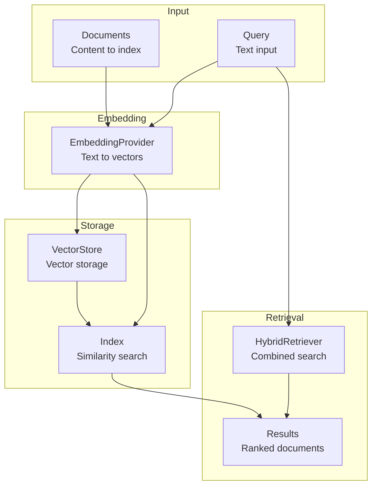
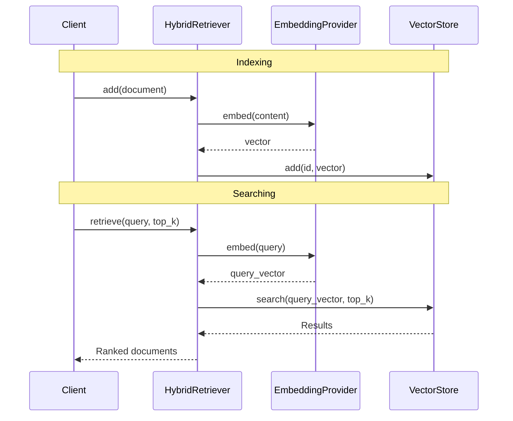

# Retrieval

Vector stores and embedding providers for semantic search.

## Retrieval Architecture



## Search Flow



## Vector Store

```python
from cemaf.retrieval.protocols import VectorStore, Document

store: VectorStore = InMemoryVectorStore()

# Add documents
doc = Document(id="1", content="text", metadata={})
await store.add(doc)

# Search
results = await store.search(query_vector, top_k=5)
```

## Hybrid Retriever

Combines vector and keyword search:

```python
from cemaf.retrieval.hybrid import HybridRetriever

retriever = HybridRetriever(
    vector_store=my_vector_store,
    embedding_provider=my_embeddings
)

results = await retriever.retrieve("query", top_k=10)
```

