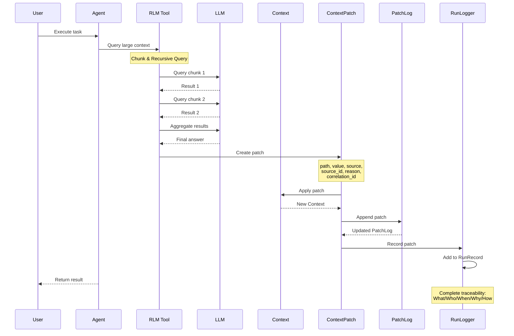
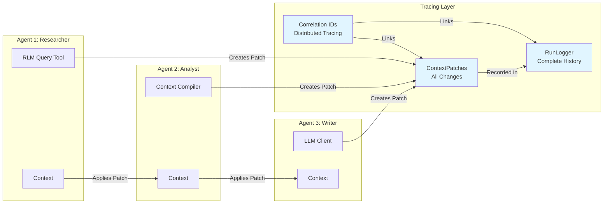

# RLM Context Engineering Research

**Total Perception Capture for Multi-Agent Systems with 1M+ Token Contexts**

This document provides a comprehensive analysis of how CEMAF implements Recursive LLMs (RLM) for context engineering, enabling multi-agent systems to handle arbitrarily large contexts (1M+ tokens) with full traceability, automatic summarization, and recursive aggregation.

---

## Table of Contents

1. [Executive Summary](#executive-summary)
2. [RLM Architecture](#rlm-architecture)
3. [Total Perception Capture](#total-perception-capture)
4. [Summarization & Aggregation](#summarization--aggregation)
5. [Multi-Agent Traceability](#multi-agent-traceability)
6. [Complete Flow: 1M Token Context](#complete-flow-1m-token-context)
7. [Architecture Diagrams](#architecture-diagrams)
8. [Code Examples](#code-examples)
9. [Traceability Examples](#traceability-examples)

---

## Executive Summary

CEMAF's RLM (Recursive Language Models) implementation solves the fundamental problem of handling arbitrarily large contexts in multi-agent AI systems. Instead of trying to fit everything into an LLM's context window, RLM treats context as **external state** and queries it recursively using divide-and-conquer strategies.

### Key Innovations

1. **Context as External State**: Content lives outside the LLM, queried on-demand
2. **Total Perception Capture**: Every context change tracked with full provenance (what/who/when/why/how)
3. **Recursive Divide-and-Conquer**: Large contexts split into chunks, queried recursively, results aggregated
4. **Automatic Summarization**: Low-priority sources automatically summarized to fit token budgets
5. **Full Traceability**: Complete execution history with correlation IDs for distributed tracing

### Core Principle

> **"Infinite context that works"** - RLM enables querying of arbitrarily large context by treating context as external state and using recursive self-query with divide-and-conquer strategies.

---

## RLM Architecture

### Core Concept

RLM doesn't try to fit everything into the LLM's context window. Instead, it:

1. **Chunks** large content into manageable pieces (~500 tokens each)
2. **Queries** chunks recursively using divide-and-conquer
3. **Aggregates** results from recursive queries using the LLM itself
4. **Tracks** complete execution metadata for observability

### Architecture Components

#### 1. Chunking Strategy (`src/cemaf/rlm/chunking.py`)

The `FixedSizeChunkingStrategy` breaks content into chunks:

```python
class FixedSizeChunkingStrategy:
    """
    Simple fixed-size chunking strategy.

    Breaks content into chunks of approximately equal size based on
    token count estimation. Respects paragraph boundaries when possible.
    """
```

**How It Works**:
- Splits content on paragraph boundaries when possible
- Falls back to sentence boundaries for large paragraphs
- Falls back to word boundaries for very large sentences
- Each chunk has: `chunk_id`, `content`, `token_count`, `depth`, `metadata`

**Example**:
```python
from cemaf.rlm.chunking import FixedSizeChunkingStrategy
from cemaf.context.compiler import SimpleTokenEstimator

estimator = SimpleTokenEstimator()
chunking = FixedSizeChunkingStrategy(estimator, chunk_size=500)

# 1M token document → ~2000 chunks of ~500 tokens each
chunks = chunking.chunk(large_document, max_chunk_tokens=500)
```

#### 2. Recursive Query Engine (`src/cemaf/rlm/engine.py`)

The `DivideAndConquerQueryEngine` implements the recursive querying strategy:

```python
class DivideAndConquerQueryEngine:
    """
    Simple divide-and-conquer query engine.

    Strategy:
    - Base case: If chunks fit in budget, make single LLM call
    - Recursive case: Split chunks, query each recursively, aggregate
    - Respect max_depth to prevent infinite recursion
    """
```

**Algorithm**:

1. **Base Case**: If all chunks fit within token budget → single LLM call
2. **Recursive Case**:
   - Split chunks in half (left/right)
   - Query left half recursively
   - Query right half recursively
   - Aggregate results using LLM
3. **Fallback**: At max depth or single large chunk → query first chunk only

**Recursive Flow**:
```
Query(2000 chunks, budget=4000)
  ├─ Doesn't fit → Split
  ├─ Query(1000 chunks, budget=4000) [Left]
  │   ├─ Doesn't fit → Split
  │   ├─ Query(500 chunks, budget=4000) [Left-Left]
  │   │   └─ Fits! → Single LLM call
  │   └─ Query(500 chunks, budget=4000) [Left-Right]
  │       └─ Fits! → Single LLM call
  │   └─ Aggregate(Left-Left, Left-Right)
  └─ Query(1000 chunks, budget=4000) [Right]
      ├─ Similar recursive process...
      └─ Aggregate(Right-Left, Right-Right)
  └─ Aggregate(Left, Right) → Final Answer
```

#### 3. Result Aggregation

When recursive queries return results, they're aggregated using the LLM:

```python
async def _aggregate_results(
    self,
    instruction: str,
    left_result: RecursiveQueryResult,
    right_result: RecursiveQueryResult,
    budget: TokenBudget,
) -> dict[str, Any]:
    """Aggregate results from left and right recursive queries."""
    prompt = f"""{instruction}

I have gathered information from two parts of the context:

Part 1:
{left_answer}

Part 2:
{right_answer}

Please synthesize these answers into a single, coherent response."""
```

The LLM synthesizes partial results into a coherent final answer, maintaining context coherence across the entire large document.

#### 4. Execution Metadata

Every RLM query returns rich metadata:

```python
@dataclass(frozen=True)
class RecursiveQueryResult:
    success: bool
    answer: str | None
    relevant_chunks: tuple[ContextChunk, ...]
    depth_reached: int
    chunks_examined: int
    llm_calls_made: int
    total_tokens_used: TokenCount
    metadata: JSON
```

**Metadata Includes**:
- `depth_reached`: Maximum recursion depth used
- `chunks_examined`: Total chunks processed
- `llm_calls_made`: Total LLM API calls
- `total_tokens_used`: Total tokens consumed
- `strategy`: Execution strategy used (single_query, divide_and_conquer, fallback)

#### 5. RLM as a Tool (`src/cemaf/rlm/tool.py`)

RLM integrates as a standard CEMAF tool, making it available to any agent:

```python
class RLMQueryTool(Tool):
    """
    Tool for recursive context querying.

    Enables agents to query large context recursively instead of
    loading everything into LLM context window.
    """
```

**Tool Schema**:
- `instruction`: Query instruction (e.g., "Find all mentions of X")
- `content`: Content to query (can be very large)
- `max_depth`: Maximum recursion depth (default=3)
- `max_tokens`: Token budget per query (default=4000)
- `chunk_size`: Target tokens per chunk (default=500)

---

## Total Perception Capture

CEMAF implements **total perception capture** - every context change is tracked with full provenance. This enables complete traceability and deterministic replay.

### ContextPatch System

Every context change is recorded as an immutable `ContextPatch`:

```python
@dataclass(frozen=True)
class ContextPatch:
    """
    An immutable record of a context change with full provenance.

    Tracks:
    - What changed (path, operation, value)
    - Who changed it (source, source_id)
    - When it changed (timestamp)
    - Why it changed (reason)
    - How (correlation_id for tracing)
    """
    path: str                    # What: e.g., "user.preferences.theme"
    operation: PatchOperation     # What: SET, DELETE, MERGE, APPEND
    value: Any                   # What: The new value

    # Provenance
    source: PatchSource          # Who: TOOL, AGENT, LLM, SYSTEM, USER
    source_id: str               # Who: e.g., "web_search", "research_agent"
    timestamp: datetime          # When: When the change occurred
    reason: str                  # Why: Human-readable explanation
    correlation_id: str | None   # How: For distributed tracing
```

### Provenance Dimensions

| Dimension | Field | Example |
|-----------|-------|---------|
| **What** | `path`, `operation`, `value` | `"results.search"`, `SET`, `{"items": [...]}` |
| **Who** | `source`, `source_id` | `PatchSource.TOOL`, `"rlm_query"` |
| **When** | `timestamp` | `2026-01-15T10:30:00Z` |
| **Why** | `reason` | `"RLM query result for instruction: Find mentions of X"` |
| **How** | `correlation_id` | `"run-123-agent-1-task-5"` |

### PatchLog: Append-Only History

All patches are recorded in an append-only `PatchLog`:

```python
@dataclass(frozen=True)
class PatchLog:
    """
    An append-only log of context patches.

    Provides:
    - Immutable append (returns new PatchLog)
    - Replay capability
    - Filtering by source, time range, correlation_id
    """
    patches: tuple[ContextPatch, ...]
```

**Key Features**:
- **Replay**: Reconstruct context from patches
- **Filtering**: Filter by source, path, time range, correlation_id
- **Inspection**: Get affected paths, latest patch for path

**Example**:
```python
log = PatchLog()
log = log.append(ContextPatch.set("results", {...}, source=PatchSource.TOOL))
log = log.append(ContextPatch.set("summary", "...", source=PatchSource.AGENT))

# Replay on initial context
initial = Context()
final = log.replay(initial)

# Filter patches
tool_patches = log.filter_by_source(PatchSource.TOOL)
agent_patches = log.filter_by_source_id("research_agent")
```

### Immutable Context

The `Context` class is immutable - all operations return new instances:

```python
class Context(BaseModel):
    """
    Immutable context object for state management.

    All operations return new Context instances, never mutate.
    """
```

**Operations**:
- `ctx.set(path, value)` → Returns new Context
- `ctx.delete(path)` → Returns new Context
- `ctx.apply(patch)` → Returns new Context
- `ctx.merge(other)` → Returns new Context

This immutability ensures:
- **Deterministic Replay**: Same patches → same final context
- **Safe Concurrency**: No race conditions from mutations
- **Full History**: Every state is preserved

---

## Summarization & Aggregation

CEMAF provides automatic summarization through the `AdvancedContextCompiler`, which intelligently compresses low-priority sources to fit token budgets while maintaining traceability.

### AdvancedContextCompiler

The `AdvancedContextCompiler` extends the base compiler with LLM-powered summarization:

```python
class AdvancedContextCompiler:
    """
    An advanced context compiler that uses an LLM to summarize low-priority
    sources when the token budget is exceeded.
    """
```

### Dual-Mode Operation

#### Mode 1: Pure Summarization (Default)

When no algorithm is provided, all sources are included and low-priority ones are summarized:

```python
compiler = AdvancedContextCompiler(
    llm_client=llm,
    token_estimator=estimator,
    # No algorithm → Pure summarization mode
)

compiled = await compiler.compile(
    artifacts=(("doc1", content1), ("doc2", content2)),
    budget=TokenBudget(max_tokens=1000),
    priorities={"doc1": 10, "doc2": 0}  # doc2 will be summarized if needed
)
```

**Flow**:
1. Gather all sources (sorted by priority)
2. Check if total tokens exceed budget
3. If yes, summarize lowest-priority sources first
4. Continue until budget is met or all sources processed
5. Return `CompiledContext` with selected/compressed sources

**Use When**:
- All sources must be represented in output
- Information preservation is critical
- Compliance/audit scenarios

#### Mode 2: Two-Stage Optimization

When an algorithm is provided, it first selects best sources, then applies summarization:

```python
from cemaf.context.algorithm import KnapsackSelectionAlgorithm

algorithm = KnapsackSelectionAlgorithm()
compiler = AdvancedContextCompiler(
    llm_client=llm,
    token_estimator=estimator,
    algorithm=algorithm,  # Two-stage mode
)

compiled = await compiler.compile(
    artifacts=artifacts,
    memories=memories,
    budget=budget,
    priorities=priorities,
)
```

**Flow**:
1. **Stage 1**: Algorithm selects best sources within budget
2. **Stage 2**: If still over budget, summarize low-priority selected sources
3. Return `CompiledContext` with optimal selection + summarization

**Use When**:
- Performance-critical (minimize LLM calls)
- Large source sets need optimal selection
- Some information loss is acceptable

### Summarization Process

When a source needs summarization:

```python
async def _summarize_source(
    self,
    source: ContextSource,
    budget: TokenBudget,
) -> ContextSource | None:
    """Summarizes a source using LLM."""
    target_summary_tokens = self._estimate_target_summary_tokens(source, budget)
    prompt = SUMMARIZATION_PROMPT_TEMPLATE.format(
        target_summary_tokens=target_summary_tokens,
        text=source.content
    )

    result = await self._llm_client.complete([Message.user(prompt)])
    # Returns summarized ContextSource with metadata linking to original
```

**Key Features**:
- Target token count based on budget
- Preserves source metadata (original key, priority)
- Links summarized source to original via metadata
- Graceful failure handling

### CompiledContext

The result of compilation:

```python
@dataclass(frozen=True)
class CompiledContext:
    """
    Result of compiling multiple context sources within a budget.

    Contains the selected and potentially compressed sources that fit
    within the token budget.
    """
    sources: tuple[ContextSource, ...]
    total_tokens: TokenCount
    excluded_sources: tuple[ContextSource, ...] = ()
    compressed_sources: tuple[ContextSource, ...] = ()
    metadata: JSON = {}
```

**Metadata Tracks**:
- Which sources were included/excluded
- Which sources were summarized
- Compilation mode used
- Algorithm used (if applicable)

---

## Multi-Agent Traceability

CEMAF provides complete observability for multi-agent systems through the `RunLogger`, which tracks every aspect of execution with correlation IDs for distributed tracing.

### RunLogger Architecture

The `RunLogger` protocol records complete execution history:

```python
@runtime_checkable
class RunLogger(Protocol):
    """
    Protocol for recording agent runs.

    Tracks:
    - Initial and final context
    - All patches applied (with provenance)
    - All tool calls (input/output/duration)
    - All LLM calls (tokens/model/messages)
    - Correlation IDs for distributed tracing
    """
```

### RunRecord

A complete record of an agent run:

```python
@dataclass
class RunRecord:
    """
    Complete record of an agent run.

    Contains:
    - Run metadata (run_id, dag_name, started_at, completed_at)
    - Initial and final context
    - All patches applied
    - All tool calls made
    - All LLM calls made
    """
    run_id: str
    dag_name: str
    initial_context: Context | None
    final_context: Context | None
    patches: list[ContextPatch]
    tool_calls: list[ToolCall]
    llm_calls: list[LLMCall]
    started_at: datetime
    completed_at: datetime | None
    success: bool
    error: str | None
    metadata: JSON
```

### ToolCall Tracking

Every tool invocation is recorded:

```python
@dataclass(frozen=True)
class ToolCall:
    """
    Record of a single tool invocation.

    Captures:
    - What tool was called (tool_id)
    - What input it received (input)
    - What output it produced (output)
    - How long it took (duration_ms)
    - When it happened (timestamp)
    - Tracing info (correlation_id)
    """
    tool_id: str
    input: JSON
    output: JSON
    duration_ms: float
    timestamp: datetime
    correlation_id: str
    success: bool
    error: str | None
```

### LLMCall Tracking

Every LLM call is recorded:

```python
@dataclass(frozen=True)
class LLMCall:
    """
    Record of a single LLM invocation.

    Captures:
    - Model used
    - Input messages/prompt
    - Output response
    - Token usage
    - Duration
    """
    model: str
    input_messages: list[dict[str, Any]]
    output: str
    input_tokens: int
    output_tokens: int
    duration_ms: float
    timestamp: datetime
    correlation_id: str
```

### Correlation IDs

Correlation IDs link related operations across the system:

```python
# In DAGExecutor
correlation_id = f"{run_id}-{node_id}-{task_id}"

# All patches, tool calls, LLM calls use same correlation_id
patch = ContextPatch.set(
    path="results",
    value=result,
    source=PatchSource.TOOL,
    source_id="rlm_query",
    correlation_id=correlation_id,
)
```

**Benefits**:
- **Distributed Tracing**: Follow a request across agents/tools
- **Debugging**: Find all operations related to a specific task
- **Performance Analysis**: Track token usage per correlation
- **Error Investigation**: See complete execution path

### Traceability Features

#### 1. Filter Patches by Source

```python
# Get all patches from a specific agent
agent_patches = run_record.get_patch_log().filter_by_source(PatchSource.AGENT)

# Get all patches from a specific tool
tool_patches = run_record.get_patch_log().filter_by_source_id("rlm_query")
```

#### 2. Filter by Correlation ID

```python
# Get all operations for a specific task
task_operations = run_record.get_patch_log().filter_by_correlation_id(correlation_id)
```

#### 3. Replay Execution

```python
from cemaf.replay import Replayer

replayer = Replayer(run_record)
result = await replayer.replay()

# Deterministic: Same patches → same final context
assert result.final_context == run_record.final_context
```

#### 4. Token Usage Analysis

```python
# Total tokens across all LLM calls
total_tokens = run_record.total_tokens

# Tokens per agent
agent_tokens = {}
for llm_call in run_record.llm_calls:
    agent_id = llm_call.correlation_id.split("-")[1]
    agent_tokens[agent_id] = agent_tokens.get(agent_id, 0) + llm_call.input_tokens + llm_call.output_tokens
```

---

## Complete Flow: 1M Token Context

Here's how a 1M token context flows through the system with full traceability:

### Step 1: Large Context Enters System

```python
# 1M token document
large_document = read_file("massive_document.txt")  # ~1,000,000 tokens

# Create initial context
initial_ctx = Context(data={"document": large_document})

# Start run logging
run_logger.start_run(
    run_id="run-123",
    dag_name="document_analysis",
    initial_context=initial_ctx,
)
```

### Step 2: RLM Chunks Content

```python
from cemaf.rlm import create_rlm_tool

rlm_tool = create_rlm_tool(
    llm_client=llm,
    chunk_size=500,      # ~2000 chunks
    max_depth=5,         # Deep recursion
    max_tokens=4000,     # Budget per query
)

# Chunking happens internally
chunks = chunking_strategy.chunk(large_document, max_chunk_tokens=500)
# → ~2000 chunks of ~500 tokens each
```

### Step 3: Recursive Queries with Aggregation

```python
# Execute RLM query
result = await rlm_tool.execute(
    instruction="Summarize the main themes and key findings",
    content=large_document,
)

# Internally:
# - Query(2000 chunks) → Split
# - Query(1000 chunks) → Split
# - Query(500 chunks) → Fits! → LLM call
# - Query(500 chunks) → Fits! → LLM call
# - Aggregate(left, right) → LLM call
# - ... (recursive process)
# - Final aggregation → Answer
```

### Step 4: Results Create ContextPatches

```python
# RLM result creates a patch
patch = ContextPatch.set(
    path="analysis.summary",
    value=result.data,
    source=PatchSource.TOOL,
    source_id="rlm_query",
    reason="RLM query result for instruction: Summarize main themes",
    correlation_id="run-123-agent-1-task-1",
)

# Apply patch to context
new_ctx = initial_ctx.apply(patch)

# Record patch
run_logger.record_patch(patch)
```

### Step 5: Patches Tracked in PatchLog

```python
# All patches are in the run record
run_record = run_logger.get_current_record()

# Get patch log
patch_log = run_record.get_patch_log()

# Filter by source
rlm_patches = patch_log.filter_by_source_id("rlm_query")

# Get affected paths
affected_paths = patch_log.get_affected_paths()
# → {"analysis.summary", "results.search", ...}
```

### Step 6: RunLogger Records Execution

```python
# Complete run record includes:
run_record = run_logger.end_run(
    final_context=new_ctx,
    success=True,
)

# Contains:
# - initial_context: Original 1M token context
# - final_context: Context with analysis results
# - patches: All context changes with provenance
# - tool_calls: All RLM tool invocations
# - llm_calls: All LLM calls (recursive queries + aggregation)
# - metadata: Execution statistics
```

### Step 7: Full Traceability Maintained

```python
# Trace a value back to its source
summary = new_ctx.get("analysis.summary")
latest_patch = patch_log.get_latest_for_path("analysis.summary")

print(f"Summary: {summary}")
print(f"Source: {latest_patch.source} ({latest_patch.source_id})")
print(f"Reason: {latest_patch.reason}")
print(f"Correlation: {latest_patch.correlation_id}")

# Replay execution
replayer = Replayer(run_record)
replayed = await replayer.replay()
assert replayed.final_context == new_ctx  # Deterministic!
```

---

## Architecture Diagrams

### RLM Recursive Query Flow

```mermaid
flowchart TB
    subgraph Input["Input Layer"]
        INST[Instruction<br/>"Find all mentions of X"]
        CONTENT[Large Content<br/>1M tokens]
    end

    subgraph Chunking["Chunking Layer"]
        STRATEGY[FixedSizeChunkingStrategy<br/>chunk_size=500]
        CHUNKS[ContextChunk[]<br/>~2000 chunks]
    end

    subgraph QueryEngine["Query Engine Layer"]
        ENGINE[DivideAndConquerQueryEngine<br/>max_depth=5]
        COMPILER[ContextCompiler<br/>Budget Enforcement]
        BUDGET[TokenBudget<br/>max_tokens=4000]
    end

    subgraph Recursion["Recursive Processing"]
        BASE{Chunks fit<br/>in budget?}
        SINGLE[Single LLM Call<br/>Base Case]
        SPLIT[Split Chunks<br/>in Half]
        LEFT[Query Left<br/>Recursively]
        RIGHT[Query Right<br/>Recursively]
        AGG[Aggregate Results<br/>LLM Synthesis]
    end

    subgraph Output["Output Layer"]
        RESULT[RecursiveQueryResult<br/>Answer + Metadata]
        PATCH[ContextPatch<br/>Provenance Tracked]
        LOG[PatchLog<br/>Append-Only History]
    end

    CONTENT --> STRATEGY
    STRATEGY --> CHUNKS
    CHUNKS --> ENGINE
    INST --> ENGINE
    ENGINE --> COMPILER
    ENGINE --> BUDGET
    ENGINE --> BASE

    BASE -->|Yes| SINGLE
    BASE -->|No| SPLIT
    SPLIT --> LEFT
    SPLIT --> RIGHT
    LEFT --> AGG
    RIGHT --> AGG

    SINGLE --> RESULT
    AGG --> RESULT
    RESULT --> PATCH
    PATCH --> LOG
```

### Context Provenance Chain



### Multi-Agent Context Flow



---

## Code Examples

### Example 1: RLM with 1M Token Context

```python
from cemaf.rlm import create_rlm_tool
from cemaf.llm.anthropic import AnthropicLLMClient
from cemaf.context import Context
from cemaf.observability import InMemoryRunLogger

# Setup
llm = AnthropicLLMClient(api_key="...")
run_logger = InMemoryRunLogger()

# Create RLM tool configured for large contexts
rlm_tool = create_rlm_tool(
    llm_client=llm,
    chunk_size=500,      # 500 tokens per chunk
    max_depth=5,        # Deep recursion for 1M tokens
    max_tokens=4000,    # Budget per query
)

# Load large document (1M tokens)
large_document = read_file("massive_research_paper.txt")

# Start run logging
initial_ctx = Context(data={"document": large_document})
run_logger.start_run(
    run_id="run-123",
    dag_name="paper_analysis",
    initial_context=initial_ctx,
)

# Execute RLM query
result = await rlm_tool.execute(
    instruction="Extract all key findings, methodologies, and conclusions",
    content=large_document,
)

if result.success:
    print(f"Answer: {result.data}")
    print(f"Metadata:")
    print(f"  - Depth reached: {result.metadata['depth_reached']}")
    print(f"  - Chunks examined: {result.metadata['chunks_examined']}")
    print(f"  - LLM calls made: {result.metadata['llm_calls_made']}")
    print(f"  - Total tokens: {result.metadata['total_tokens_used']}")

    # Create patch for result
    from cemaf.context import ContextPatch, PatchSource

    patch = ContextPatch.set(
        path="analysis.key_findings",
        value=result.data,
        source=PatchSource.TOOL,
        source_id="rlm_query",
        reason="RLM query result for paper analysis",
        correlation_id="run-123-agent-1-task-1",
    )

    # Apply patch and record
    new_ctx = initial_ctx.apply(patch)
    run_logger.record_patch(patch)

    # End run
    record = run_logger.end_run(final_context=new_ctx, success=True)
    print(f"\nRun completed: {record.run_id}")
    print(f"Total patches: {record.total_patches}")
    print(f"Total LLM calls: {record.total_llm_calls}")
    print(f"Total tokens: {record.total_tokens}")
```

### Example 2: Context Tracking with Patches

```python
from cemaf.context import Context, ContextPatch, PatchSource, PatchLog

# Create initial context
ctx = Context(data={"user_id": "123", "preferences": {}})

# Track changes with patches
patches = PatchLog()

# Change 1: User preference (from user input)
patch1 = ContextPatch.set(
    path="preferences.theme",
    value="dark",
    source=PatchSource.USER,
    source_id="settings_form",
    reason="User changed theme preference",
)
ctx = ctx.apply(patch1)
patches = patches.append(patch1)

# Change 2: Search results (from tool)
patch2 = ContextPatch.set(
    path="search_results",
    value={"items": [...]},
    source=PatchSource.TOOL,
    source_id="web_search",
    reason="Web search results for query",
)
ctx = ctx.apply(patch2)
patches = patches.append(patch2)

# Change 3: Analysis (from RLM tool)
patch3 = ContextPatch.set(
    path="analysis.summary",
    value="...",
    source=PatchSource.TOOL,
    source_id="rlm_query",
    reason="RLM analysis of document",
)
ctx = ctx.apply(patch3)
patches = patches.append(patch3)

# Query patches
print("All patches:")
for patch in patches:
    print(f"  {patch.path}: {patch.source} ({patch.source_id})")

# Filter by source
tool_patches = patches.filter_by_source(PatchSource.TOOL)
print(f"\nTool patches: {len(tool_patches)}")

# Get latest for path
latest = patches.get_latest_for_path("preferences.theme")
print(f"\nLatest theme change: {latest.value} by {latest.source}")

# Replay from initial
initial = Context(data={"user_id": "123", "preferences": {}})
replayed = patches.replay(initial)
assert replayed.to_dict() == ctx.to_dict()  # Deterministic!
```

### Example 3: Query Execution History

```python
from cemaf.observability import InMemoryRunLogger
from cemaf.context import ContextPatch, PatchSource

# Get run record
run_record = run_logger.get_record("run-123")

# Analyze execution
print(f"Run: {run_record.run_id}")
print(f"Duration: {run_record.duration_ms}ms")
print(f"Success: {run_record.success}")
print(f"\nStatistics:")
print(f"  - Total patches: {run_record.total_patches}")
print(f"  - Total tool calls: {run_record.total_tool_calls}")
print(f"  - Total LLM calls: {run_record.total_llm_calls}")
print(f"  - Total tokens: {run_record.total_tokens}")

# Analyze patches
patch_log = run_record.get_patch_log()

# Patches by source
sources = {}
for patch in patch_log:
    sources[patch.source] = sources.get(patch.source, 0) + 1

print(f"\nPatches by source:")
for source, count in sources.items():
    print(f"  - {source}: {count}")

# Tool calls analysis
print(f"\nTool calls:")
for call in run_record.tool_calls:
    print(f"  - {call.tool_id}: {call.duration_ms}ms")
    if call.tool_id == "rlm_query":
        print(f"    Input: {call.input.get('instruction', 'N/A')[:50]}...")
        print(f"    Output tokens: {call.output.get('total_tokens_used', 0)}")

# LLM calls analysis
print(f"\nLLM calls:")
total_input = 0
total_output = 0
for llm_call in run_record.llm_calls:
    total_input += llm_call.input_tokens
    total_output += llm_call.output_tokens
    print(f"  - {llm_call.model}: {llm_call.input_tokens} in, {llm_call.output_tokens} out")

print(f"\nTotal: {total_input} input, {total_output} output tokens")
```

### Example 4: Replay Runs for Debugging

```python
from cemaf.replay import Replayer

# Get run record
run_record = run_logger.get_record("run-123")

# Create replayer
replayer = Replayer(run_record)

# Replay execution
replayed_result = await replayer.replay()

# Verify determinism
assert replayed_result.final_context == run_record.final_context
print("Replay successful - deterministic!")

# Analyze differences (if any)
if replayed_result.final_context != run_record.final_context:
    print("Non-deterministic behavior detected!")
    # Compare contexts
    original = run_record.final_context.to_dict()
    replayed = replayed_result.final_context.to_dict()

    # Find differences
    for key in set(original.keys()) | set(replayed.keys()):
        if original.get(key) != replayed.get(key):
            print(f"  Difference in {key}")
```

### Example 5: Handle 1M+ Token Contexts

```python
from cemaf.rlm import create_rlm_tool
from cemaf.context.budget import TokenBudget

# Configure for very large contexts
rlm_tool = create_rlm_tool(
    llm_client=llm,
    chunk_size=500,        # Small chunks for granularity
    max_depth=10,          # Deep recursion for 1M+ tokens
    max_tokens=8000,       # Larger budget per query
)

# Load massive document
massive_doc = load_document("1_million_token_document.txt")

# Execute with custom parameters
result = await rlm_tool.execute(
    instruction="Analyze the document structure and extract all key concepts",
    content=massive_doc,
    max_depth=10,          # Override default
    max_tokens=8000,       # Override default
    chunk_size=500,        # Override default
)

# Check metadata
metadata = result.metadata
print(f"Execution details:")
print(f"  - Depth reached: {metadata['depth_reached']}")
print(f"  - Strategy: {metadata.get('strategy', 'unknown')}")
print(f"  - Chunks created: {metadata['total_chunks_created']}")
print(f"  - Chunks examined: {metadata['chunks_examined']}")
print(f"  - LLM calls: {metadata['llm_calls_made']}")
print(f"  - Total tokens: {metadata['total_tokens_used']}")

# Estimate cost
cost_per_1k_tokens = 0.01  # Example pricing
estimated_cost = (metadata['total_tokens_used'] / 1000) * cost_per_1k_tokens
print(f"  - Estimated cost: ${estimated_cost:.2f}")
```

---

## Traceability Examples

### Example 1: Trace Context Value to Source

```python
def trace_value_source(ctx: Context, path: str, patch_log: PatchLog) -> dict:
    """Trace a context value back to its source."""
    value = ctx.get(path)
    latest_patch = patch_log.get_latest_for_path(path)

    if not latest_patch:
        return {"value": value, "source": "unknown"}

    return {
        "value": value,
        "path": path,
        "source": latest_patch.source.value,
        "source_id": latest_patch.source_id,
        "reason": latest_patch.reason,
        "timestamp": latest_patch.timestamp.isoformat(),
        "correlation_id": latest_patch.correlation_id,
    }

# Usage
summary = ctx.get("analysis.summary")
trace = trace_value_source(ctx, "analysis.summary", patch_log)

print(f"Summary: {summary[:100]}...")
print(f"Source: {trace['source']} ({trace['source_id']})")
print(f"Reason: {trace['reason']}")
print(f"Time: {trace['timestamp']}")
print(f"Correlation: {trace['correlation_id']}")
```

### Example 2: See All Changes by Agent

```python
def get_agent_changes(run_record: RunRecord, agent_id: str) -> dict:
    """Get all changes made by a specific agent."""
    patch_log = run_record.get_patch_log()

    # Filter patches by agent
    agent_patches = [
        p for p in patch_log
        if p.source == PatchSource.AGENT and p.source_id == agent_id
    ]

    # Get tool calls by agent
    agent_tool_calls = [
        call for call in run_record.tool_calls
        if call.correlation_id.startswith(f"{run_record.run_id}-{agent_id}")
    ]

    # Get LLM calls by agent
    agent_llm_calls = [
        call for call in run_record.llm_calls
        if call.correlation_id.startswith(f"{run_record.run_id}-{agent_id}")
    ]

    return {
        "agent_id": agent_id,
        "patches": [p.to_dict() for p in agent_patches],
        "tool_calls": [call.to_dict() for call in agent_tool_calls],
        "llm_calls": [call.to_dict() for call in agent_llm_calls],
        "total_tokens": sum(
            c.input_tokens + c.output_tokens
            for c in agent_llm_calls
        ),
    }

# Usage
agent_changes = get_agent_changes(run_record, "research_agent")
print(f"Agent: {agent_changes['agent_id']}")
print(f"Patches: {len(agent_changes['patches'])}")
print(f"Tool calls: {len(agent_changes['tool_calls'])}")
print(f"LLM calls: {len(agent_changes['llm_calls'])}")
print(f"Total tokens: {agent_changes['total_tokens']}")
```

### Example 3: Replay Multi-Agent Execution

```python
from cemaf.replay import Replayer

def replay_multi_agent_run(run_id: str):
    """Replay a complete multi-agent execution."""
    # Get run record
    run_record = run_logger.get_record(run_id)

    if not run_record:
        raise ValueError(f"Run {run_id} not found")

    # Create replayer
    replayer = Replayer(run_record)

    # Replay
    print(f"Replaying run: {run_id}")
    print(f"Initial context keys: {list(run_record.initial_context.to_dict().keys())}")

    result = await replayer.replay()

    print(f"Final context keys: {list(result.final_context.to_dict().keys())}")
    print(f"Patches applied: {len(run_record.patches)}")
    print(f"Deterministic: {result.final_context == run_record.final_context}")

    return result

# Usage
replayed = await replay_multi_agent_run("run-123")
```

### Example 4: Analyze Token Usage Across Agents

```python
def analyze_token_usage(run_record: RunRecord) -> dict:
    """Analyze token usage across all agents."""
    # Group LLM calls by agent (from correlation_id)
    agent_tokens = {}

    for llm_call in run_record.llm_calls:
        # Parse correlation_id: "run-123-agent-1-task-5"
        parts = llm_call.correlation_id.split("-")
        if len(parts) >= 3:
            agent_id = parts[2]  # "agent-1"
        else:
            agent_id = "unknown"

        if agent_id not in agent_tokens:
            agent_tokens[agent_id] = {
                "input_tokens": 0,
                "output_tokens": 0,
                "calls": 0,
            }

        agent_tokens[agent_id]["input_tokens"] += llm_call.input_tokens
        agent_tokens[agent_id]["output_tokens"] += llm_call.output_tokens
        agent_tokens[agent_id]["calls"] += 1

    # Calculate totals
    total_input = sum(t["input_tokens"] for t in agent_tokens.values())
    total_output = sum(t["output_tokens"] for t in agent_tokens.values())

    return {
        "by_agent": agent_tokens,
        "total_input": total_input,
        "total_output": total_output,
        "total": total_input + total_output,
    }

# Usage
usage = analyze_token_usage(run_record)

print("Token Usage by Agent:")
for agent_id, stats in usage["by_agent"].items():
    print(f"  {agent_id}:")
    print(f"    Input: {stats['input_tokens']:,} tokens")
    print(f"    Output: {stats['output_tokens']:,} tokens")
    print(f"    Calls: {stats['calls']}")
    print(f"    Total: {stats['input_tokens'] + stats['output_tokens']:,} tokens")

print(f"\nOverall:")
print(f"  Total input: {usage['total_input']:,} tokens")
print(f"  Total output: {usage['total_output']:,} tokens")
print(f"  Grand total: {usage['total']:,} tokens")
```

---

## Key Insights

### 1. Context as External State

RLM doesn't try to fit everything in the LLM context window. Instead, it treats context as external state and queries chunks on-demand. This enables handling arbitrarily large contexts (1M+ tokens) without hitting context window limits.

### 2. Total Perception Capture

Every context change is tracked with full provenance:
- **What**: `path`, `operation`, `value`
- **Who**: `source`, `source_id`
- **When**: `timestamp`
- **Why**: `reason`
- **How**: `correlation_id`

This enables complete traceability and deterministic replay.

### 3. Automatic Summarization

`AdvancedContextCompiler` automatically summarizes low-priority sources to fit token budgets while maintaining traceability. Sources can be linked back to their originals via metadata.

### 4. Recursive Aggregation

RLM uses the LLM itself to aggregate results from recursive queries, maintaining coherence across the entire large document. The aggregation process is itself tracked and traceable.

### 5. Full Traceability

`RunLogger` + `PatchLog` + correlation IDs enable complete execution replay. Every operation can be traced back to its source, and runs can be deterministically replayed for debugging.

### 6. Multi-Agent Safe

Context patches track source, enabling multi-agent systems to know what changed and why. Correlation IDs link related operations across agents, tools, and LLM calls.

---

## Conclusion

CEMAF's RLM implementation provides a robust solution for handling arbitrarily large contexts in multi-agent systems. By treating context as external state, using recursive divide-and-conquer querying, and maintaining total perception capture through provenance tracking, CEMAF enables:

- **Scalability**: Handle 1M+ token contexts without hitting limits
- **Traceability**: Complete provenance for every context change
- **Determinism**: Replay runs deterministically for debugging
- **Efficiency**: Automatic summarization and smart context compilation
- **Observability**: Full execution history with correlation IDs

This architecture makes CEMAF suitable for production multi-agent systems that need to process large amounts of context while maintaining full observability and traceability.
