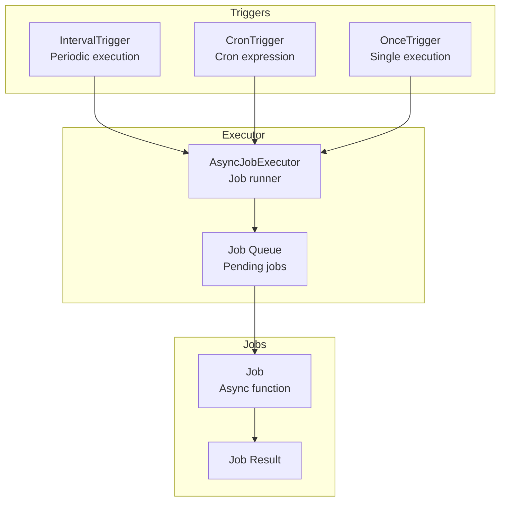
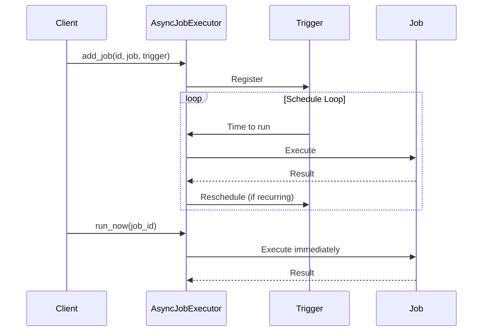

# Scheduler

Job scheduling with various trigger types.

## Scheduler Architecture



## Scheduling Flow



## Job Scheduling

```python
from cemaf.scheduler.executor import AsyncJobExecutor
from cemaf.scheduler.triggers import IntervalTrigger

executor = AsyncJobExecutor()

# Schedule job
await executor.add_job(
    job_id="daily_task",
    job=my_async_function,
    trigger=IntervalTrigger(seconds=86400)
)

# Run now
await executor.run_now("daily_task")
```

## Execution Gates

Execution gates are protocol-first preconditions for autonomous/background runs:

```python
from cemaf.scheduler import create_execution_gate, create_execution_gates, execution_gate_registry

gates = create_execution_gates(
    (
        {"type": "time", "min_interval_seconds": 86_400},
        {"type": "session_count", "min_sessions": 5, "current_count": 7},
        {"type": "lock"},
    )
)

execution_gate_registry.register(
    backend="business_hours",
    factory=lambda **kwargs: BusinessHoursGate(timezone=kwargs["timezone"]),
)

gate = create_execution_gate("business_hours", timezone="UTC")
```
