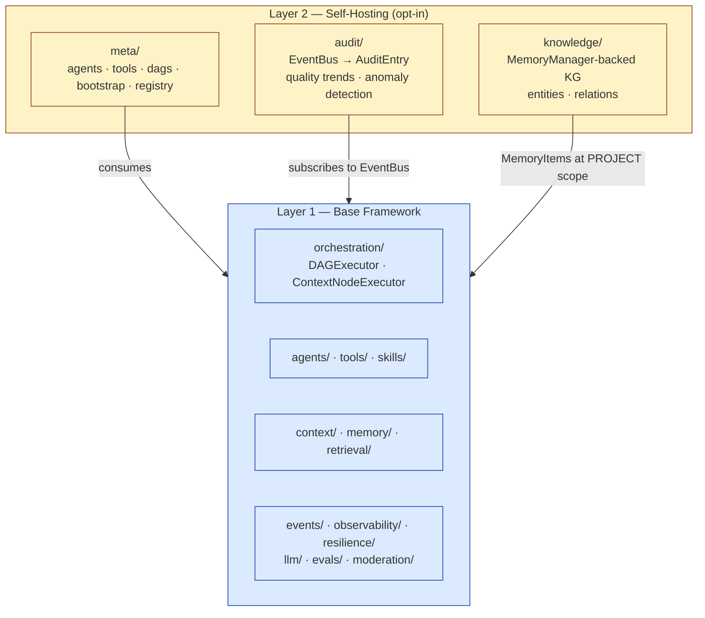
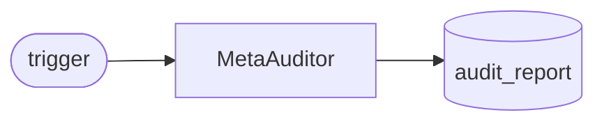
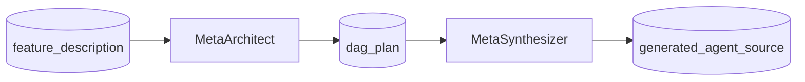
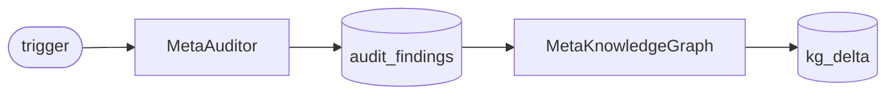

# Self-Hosting Layer

> CEMAF uses CEMAF to introspect, audit, spec, and extend itself. The self-hosting layer is CEMAF's first client — every meta-component is a standard CEMAF citizen.

## Why self-hosting matters

A framework that cannot operate on itself ships two implementations: the one users call, and the private one maintainers use to evolve it. Over time the two drift, and the maintainer-only path becomes unobservable, untyped, and untestable.

CEMAF takes the opposite stance:

- **Same primitives end-to-end.** Meta-agents implement the same `Agent[GoalT, ResultT]` protocol as user agents. Meta-tools implement the same `Tool` ABC. Meta-DAGs are ordinary `DAG` instances dispatched by the same `DAGExecutor`.
- **One composition root.** `meta.bootstrap.create_meta_executor()` is a thin wrapper around `bootstrap.create_executor()`. It adds meta-registrations and auto-wires `audit/` (from `EventBus`) and `knowledge/` (from `MemoryManager`) — nothing else.
- **One-way dependency.** The base framework never imports from `meta/`, `audit/`, or `knowledge/`. The arrow points strictly upward. Self-hosting is opt-in; the engine has no idea it exists.

The result: the same observability, evals, resilience, and provenance that protect user runs also protect the framework's own meta-runs. When `MetaAuditor` analyzes a trace, that analysis is itself a traced, audited CEMAF run.

## Architecture



The dependency arrow is enforced by import discipline: grep `cemaf/{core,orchestration,agents,context,memory,llm,evals}/` for `from cemaf.meta`, `from cemaf.audit`, `from cemaf.knowledge` — there are zero hits.

## Meta-agent catalog

| Agent | Goal type | Result type | Role | Tools used |
|---|---|---|---|---|
| `ArchitectAgent` (a.k.a. `MetaArchitect`) | `ArchitectGoal` | `ArchitectResult` | Designs DAG pipelines from a feature description | `IntrospectRegistryTool`, `GenerateDAGTool` |
| `AgentSynthesizer` (a.k.a. `MetaSynthesizer`) | `SynthesizerGoal` | `SynthesizerResult` | Generates CEMAF agent Python source from templates | (template-based, no tools) |
| `AuditAgent` (a.k.a. `MetaAuditor`) | `AuditGoal` | `AuditResult` | Analyzes execution traces for quality and anomalies | `TraceAnalyzerTool` |
| `KnowledgeGraphAgent` (a.k.a. `MetaKnowledgeGraph`) | `KnowledgeGraphGoal` | `KnowledgeGraphResult` | Queries and refreshes the entity knowledge graph | `KnowledgeGraphTool` |
| `DreamAgent` | `DreamGoal` | `DreamResult` | Speculative pipeline brainstorming for offline ideation | (varies) |
| `SolutionDesignerAgent` | `SolutionGoal` | `SolutionResult` | Maps a problem statement to candidate CEMAF solutions | (varies) |

All meta-agents are registered by `meta.registry.register_meta_agents()` and discoverable via `IntrospectRegistryTool` — meta-DAGs that compose meta-agents discover their peers the same way user DAGs discover user agents.

## Meta-tool catalog

| Tool | Output | Purpose |
|---|---|---|
| `IntrospectRegistryTool` | Registry snapshot (agents, tools, schemas) | Lets `ArchitectAgent` see what's available before designing a DAG |
| `GenerateDAGTool` | Validated `DAG` instance | Produces a topologically-sorted `DAG` from an architect's plan |
| `TraceAnalyzerTool` | Trace summary + anomaly findings | Pulls execution events from `audit/`, runs z-score detection on quality scores |
| `KnowledgeGraphTool` | KG query result / mutation receipt | Reads/writes entities + relations stored as `MemoryItem`s at PROJECT scope |

All meta-tools implement the standard `Tool` ABC, return `Result[T]`, and emit the same OTel GenAI spans as user tools.

## Pre-built meta-DAGs

### `self_audit`



- **Input context**: `audit_window_seconds` (int), `min_runs` (int)
- **Flow**: `MetaAuditor` calls `TraceAnalyzerTool` → produces `AuditResult` with quality stats and anomaly flags.
- **Output context key**: `audit_report` — `dict` containing `mean_quality`, `z_scores`, `anomalies`, `runs_analyzed`.

```python
from cemaf.meta.bootstrap import create_meta_executor
from cemaf.meta.dags import create_self_audit_dag

executor = create_meta_executor()
result = await executor.run(create_self_audit_dag())
print(result.final_context.get("audit_report"))
```

### `feature_synthesis`



- **Input context**: `feature_description` (str), `target_module` (str, optional)
- **Flow**: `MetaArchitect` introspects the registry, designs a DAG plan → `MetaSynthesizer` emits Python source for any new agent in the plan.
- **Output context keys**: `dag_plan`, `generated_agent_source` — the source string is `ast.parse()`-clean by contract.

### `knowledge_refresh`



- **Input context**: optional filters (`scope_path`, `entity_types`)
- **Flow**: `MetaAuditor` extracts execution data → `MetaKnowledgeGraph` promotes new entities/relations into the KG-backed `MemoryManager` at PROJECT scope.
- **Output context key**: `kg_delta` — counts of added/updated entities and relations.

### Other meta-DAGs

`meta.dags` also exposes `create_dream_dag`, `create_context_compaction_dag`, `create_solution_engine_dag`, `create_app_synthesis_dag`, and `create_self_spec_dag`. These are experimental — use at your own risk and pin to a specific commit if you depend on them.

## Adding a new meta-agent

The pattern mirrors user-agent extension. There is no meta-only ceremony.

1. **Define typed goal/result models** in `meta/goals.py` (Pydantic `BaseModel` with `frozen=True`).
2. **Implement the agent** in `meta/agents.py` as `Agent[YourGoal, YourResult]`. If it needs registry introspection or KG access, request the corresponding tool from `ToolRegistry` in `__init__`.
3. **(Optional) Add a tool** in `meta/tools.py` if your agent needs a new capability — implement `Tool`, return `Result[T]`, declare a `ToolSchema`.
4. **Register** the agent and tool in `meta/registry.py` (`register_meta_agents`, `register_meta_tools`).
5. **Compose a DAG** in `meta/dags.py` if the agent participates in a reusable pipeline.
6. **Test in three layers** per project rules:
   - Contract test: protocol conformance (it's an `Agent`, returns the right type).
   - Unit test: agent in isolation with stub tools.
   - Integration test: `create_meta_executor()` → run the DAG → assert outputs land in `final_context`.

Because meta-agents are standard agents, they automatically inherit observability (`gen_ai.*` spans), eval gating (if registered with `OnlineEvalPipeline`), and budget guardrails.

## Operational notes

- **Audit subscriber lifecycle**: `create_meta_executor()` instantiates `EventBusAudit` and attaches it to the executor's `EventBus`. The subscriber persists across DAG runs — anomaly detection needs a rolling window.
- **KG storage**: entities are stored as `MemoryItem`s at PROJECT scope. They survive session disposal and are queryable via the standard `MemoryManager.recall()` API.
- **No singletons**: `MetaServices` is a frozen dataclass instantiated per-call. Override any field to swap a meta-tool, audit backend, or KG implementation.
- **Spec→module mapping**: For where each Enterprise Context Brain (SPEC-00..06) concept lands in the codebase — including pending scaffolding — see [architecture/spec-module-map.md](architecture/spec-module-map.md).

## References

- Project instructions: [`CLAUDE.md`](../CLAUDE.md) — section "Layer 2: Self-Hosting Engine"
- Specs: [`docs/specs/SPEC-00`..`SPEC-06`](specs/) — Enterprise Context Brain target architecture
- Source: [`src/cemaf/meta/`](../src/cemaf/meta/), [`src/cemaf/audit/`](../src/cemaf/audit/), [`src/cemaf/knowledge/`](../src/cemaf/knowledge/)
- Integration tests: [`tests/integration/test_meta_*.py`](../tests/integration/) prove the loop end-to-end
