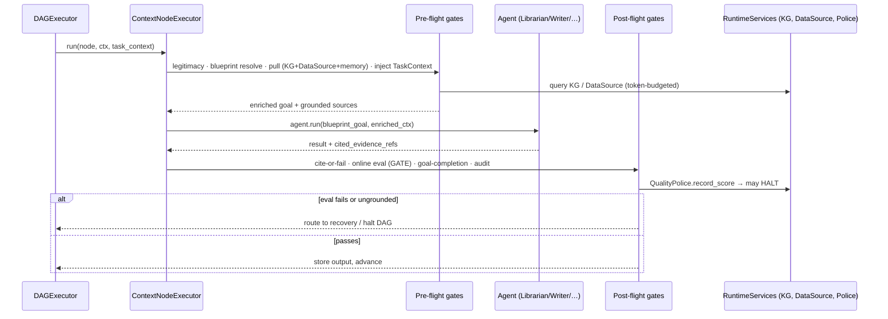

# SPEC-00: Enterprise Context Brain

> Umbrella spec. Defines the north-star architecture and the single seam that
> operationalizes it. Child specs (SPEC-01..06) own the implementation detail of
> each subsystem; this document owns the contract between them and the invariants
> that hold across all of them.

## Glossary

| Term | Meaning |
|---|---|
| **Context Brain** | The capability whereby a CEMAF DAG resolves the knowledge it needs by *pulling* from enterprise sources and the Knowledge Graph on demand, rather than having data *pushed* into a system prompt up front. |
| **Pull-not-push** | Context enters a node via on-demand retrieval bounded by a `TokenBudget`, not via static prompt stuffing. |
| **Blueprint** | A structured, typed specification of *what* an LLM must produce (goal, entities, style, policies). The canonical node input — replaces free-form English prompts. |
| **Node interceptor** | A pre-flight/post-flight middleware step wrapping every node's `agent.run`. The seam that operationalizes the brain. |
| **KG (Knowledge Business Graph)** | `knowledge/` entity-relation graph backed by `MemoryManager`. Promoted here from a meta-only asset to a shared `RuntimeService`. |
| **DataSource** | A `@runtime_checkable` connector protocol over an enterprise system (warehouse, ticketing, docs) exposing read-only, citeable retrieval. |
| **TaskContext** | The long-horizon awareness object: goal, step N of M, prior decisions, budget remaining — injected into every node of an autonomous run. |
| **Guardian** | An auto-injected agent enforcing a gate (legitimacy, security, moderation, citation/grounding, quality) without the DAG author wiring it manually. |
| **Goal-completion / success-mark** | An evaluator answering "is the declared goal achieved?", distinct from per-output quality scores. |
| **Cite-or-fail** | A post-flight gate that rejects any generative node output whose claims are not grounded in retrieved, citeable evidence. |

## 1. Context

CEMAF must act as a **context brain for a full enterprise**: given a goal, it
pulls the relevant business knowledge on demand, drives generation from
**Blueprints rather than English**, keeps every node aware that it is one step of
a **long-running autonomous task**, grounds every claim in a **shared Knowledge
Graph** plus live enterprise data, and polices the path to completion with
**internal guardian agents and online evals** so the result is **assertive,
audited, secure, and low-to-zero hallucination**.

Assessment of the current codebase (2026-05-26) found that nearly every primitive
already exists — `MemoryContextProvider`, Librarian/Researcher agents, `Blueprint.to_prompt()`,
`knowledge/`, `OnlineEvalPipeline`, `QualityPolice`, `citation/`, `moderation/`,
`audit/`, `replay/` — **but none are wired into the default DAG execution path**.
They are opt-in, manually invoked, or sealed in the meta/self-hosting layer. This
program is therefore **~70% operationalization, ~30% net-new** (enterprise
connectors + task state machine). It is not a rewrite.

The unifying architectural change is a **node-execution interceptor pipeline** in
`ContextNodeExecutor`. Six of the eight requirements collapse onto this one seam.



## 2. Interface Contract (MDE)

This umbrella declares only the **cross-cutting seams**. Field-level schemas live
in the child spec named in each row.

```python
# The seam — SPEC-01 owns the detail
@runtime_checkable
class NodeInterceptor(Protocol):
    async def pre(self, *, node: DAGNode, goal: Goal, ctx: Context,
                 task: TaskContext, services: RuntimeServices) -> PreflightResult: ...
    async def post(self, *, node: DAGNode, result: AgentResult, ctx: Context,
                   task: TaskContext, services: RuntimeServices) -> PostflightResult: ...

# PreflightResult either enriches the goal/context or rejects (legitimacy/security).
# PostflightResult is one of: ACCEPT | REJECT(reason) | RECOVER(strategy) | HALT(reason).

# RuntimeServices gains two shared deps — SPEC-02
#   knowledge_graph: KnowledgeGraph | None      (was meta-only)
#   data_sources:    DataSourceRegistry | None  (net-new)

@runtime_checkable
class DataSource(Protocol):
    """Read-only, citeable connector over an enterprise system."""
    source_id: str
    async def retrieve(self, query: RetrievalQuery, *, budget: TokenBudget) -> tuple[CiteableChunk, ...]: ...

# Blueprint becomes the canonical node input — SPEC-03
#   ContextNodeExecutor resolves a node's input to a Blueprint and calls
#   blueprint.to_request() (structured) instead of passing an English string.

# Long-horizon awareness — SPEC-04
@dataclass(frozen=True, slots=True)
class TaskContext:
    task_id: TaskID
    goal: Goal
    step_index: int
    step_count: int
    prior_decisions: tuple[Decision, ...]
    budget_remaining: TokenBudget
    state: TaskState   # QUEUED | RUNNING | PAUSED | RESUMED | COMPLETED | HALTED
```

The interceptor chain is **ordered and composable**: guardians (SPEC-05),
blueprint resolution (SPEC-03), context pull (SPEC-02), and task injection
(SPEC-04) each contribute one interceptor. Order is part of the contract (§3).

## 3. Invariants (DbC)

Cross-cutting rules that hold regardless of which child subsystem is active.

1. `IF a node produces generative output AND any claim lacks a citeable evidence ref, THEN THE System SHALL reject the output (cite-or-fail).`
2. `WHEN the pre-flight legitimacy gate denies a node, THE System SHALL NOT execute the agent and SHALL emit an audit entry.`
3. `WHILE a DAG is executing, THE System SHALL pull context within the node's TokenBudget and SHALL NOT stuff full source bodies into the system prompt.`
4. `WHEN QualityPolice raises AlertLevel.HALT, THE System SHALL stop dispatching new nodes and transition the task to HALTED.`
5. `WHERE a node declares a Blueprint input, THE System SHALL drive generation from the Blueprint structure, not a free-form English prompt.`
6. `Every node receives a TaskContext; step_index < step_count for all non-terminal nodes.`
7. `THE Knowledge Graph SHALL be queryable by any node via RuntimeServices — access SHALL NOT be restricted to the meta layer.`
8. `Every interceptor decision (ACCEPT/REJECT/RECOVER/HALT) carries source, reason, correlation_id (ContextPatch provenance).`
9. `Interceptor ordering SHALL be: legitimacy → blueprint → pull → task-inject → EXECUTE → cite-or-fail → online-eval → goal-completion → audit.`
10. `A DataSource SHALL expose read-only retrieval only — no write path port exists on the protocol.`

Budget: 10 invariants. Detailed per-subsystem invariants live in child specs.

## 4. Acceptance Criteria (BDD)

Cross-cutting scenarios. Subsystem scenarios live in child specs.

```gherkin
Feature: Enterprise Context Brain end-to-end

  Scenario: Pull-not-push grounding
    Given a DAG node with a goal referencing enterprise entities
    And a DataSource and Knowledge Graph registered in RuntimeServices
    When the node executes
    Then context is retrieved on demand within the node TokenBudget
    And the system prompt does not contain full source bodies
    And the output's claims each carry a citeable evidence ref

  Scenario: Cite-or-fail blocks an ungrounded claim
    Given a generative node whose draft asserts a fact with no retrieved evidence
    When the post-flight cite-or-fail gate runs
    Then the output is rejected with reason "ungrounded_claim"
    And the node is routed to recovery, not stored

  Scenario: Online eval halts a degrading run
    Given a long-running task whose recent node scores trend below the HALT threshold
    When QualityPolice records the next score
    Then it raises AlertLevel.HALT
    And the DAGExecutor stops dispatching new nodes
    And the task transitions to HALTED with an audit entry

  Scenario: Legitimacy gate denies an out-of-scope action
    Given a node requesting an action outside the task's authorized scope
    When the pre-flight legitimacy gate runs
    Then the agent is not invoked
    And an audit entry records the denial with correlation_id

  Scenario: Task awareness across steps
    Given a 10-step autonomous task at step 3
    When step 3's node executes
    Then it receives a TaskContext with step_index=2, step_count=10
    And prior_decisions from steps 1-2 are present

  Scenario: Blueprint drives generation
    Given a node whose input resolves to a Blueprint
    When the node executes
    Then generation is driven from the Blueprint structure
    And no free-form English prompt is constructed from the goal text

  Scenario: KG queryable by a normal node
    Given a non-meta DAG and a Knowledge Graph in RuntimeServices
    When a node queries neighbors of an entity
    Then it receives KG relations as citeable context sources
```

Budget: 7 cross-cutting scenarios. Split into child specs if a subsystem needs more.

## 5. Out of Scope

- **Implementation detail of each subsystem** — owned by SPEC-01..06.
- **Specific enterprise connectors** (Salesforce, SAP, Snowflake adapters) — the
  `DataSource` *protocol* is in scope (SPEC-02); concrete adapters are follow-on specs.
- **Write-back to enterprise systems** — the brain is read-only this cycle.
- **Multi-tenant pricing / per-org rate negotiation** — `BudgetGuard` territory.
- **UI / dashboard surfaces** for task progress — backend awareness only.
- **Replacing the existing meta self-hosting layer** — SPEC-06 *connects* it to
  mid-DAG dispatch; it does not rewrite `meta/`.

## 6. Dependencies

Build order (each row is a child spec; later rows depend on earlier):

| Order | Spec | Unblocks | Depends on |
|---|---|---|---|
| 1 | SPEC-01 Node interceptor pipeline | the seam itself | existing `ContextNodeExecutor` |
| 2 | SPEC-02 KG + DataSource RuntimeServices | pull-not-push, KG-in-engine | SPEC-01, `knowledge/`, `retrieval/` |
| 3 | SPEC-03 Blueprint-as-LLM-input | structured generation | SPEC-01, `blueprint/`, `generation/` |
| 4 | SPEC-04 Task state machine | long-horizon awareness | SPEC-01, `persistence/`, `replay/` |
| 5 | SPEC-05 Guardian mesh + gates | quality/safety/grounding | SPEC-01..04, `evals/`, `citation/`, `moderation/`, `audit/` |
| 6 | SPEC-06 Self-resolving DAG | framework-uses-itself mid-run | SPEC-01, SPEC-05, `meta/` |

Existing POC decisions feed the context layer: model-catalog (selection),
anchored-compaction (session memory), tool-output-bucket (context budgeting).

## 7. Correctness Properties

### Property 1: Grounding membership

*For any* generative node output `o`, every claim in `o.cited_evidence_refs` is a
member of the set of sources actually surfaced to the node during pre-flight pull.
Claims citing non-surfaced sources are rejected.

**Validates: §3 Invariant 1, §4 Scenario "Cite-or-fail blocks an ungrounded claim"**

### Property 2: Read-only enterprise boundary

*For any* `DataSource` implementation, no method mutates the underlying enterprise
system — the protocol exposes `retrieve` only; no write port exists.

**Validates: §3 Invariant 10, §4 Scenario "Pull-not-push grounding"**

### Property 3: Halt safety

*For any* task in state RUNNING, once QualityPolice emits HALT no further node is
dispatched; the task reaches HALTED and never silently resumes.

**Validates: §3 Invariant 4, §4 Scenario "Online eval halts a degrading run"**

### Property 4: Interceptor order determinism

*For any* node, interceptors run in the §3-Invariant-9 order; the same inputs
produce the same accept/reject/recover/halt decision (replay-safe).

**Validates: §3 Invariant 9**

### Property 5: KG access symmetry

*For any* node (meta or non-meta), KG queries resolve through the same
`RuntimeServices.knowledge_graph` handle — the graph is used both *in* and *by* the engine.

**Validates: §3 Invariant 7, §4 Scenario "KG queryable by a normal node"**

Budget: 5 properties. Subsystem properties live in child specs.

## 8. Eval Criteria

| Evaluator | Node | Mode | Threshold | Method |
|---|---|---|---|---|
| GroundingEvaluator | every generative node | GATE | groundedness >= 0.9 | hybrid (citation membership + LLM judge) |
| GoalCompletionEvaluator | terminal node | GATE | achieved == true | LLM judge |
| LegitimacyEvaluator | every node (pre) | GATE | authorized == true | deterministic (scope check) |
| HallucinationProbe | every generative node | OBSERVE | rate <= 0.02 | LLM judge |
| QualityTrendMonitor | DAG-wide | GATE | no HALT alert | deterministic (z-score, QualityPolice) |

Detailed evaluator wiring and thresholds-per-tenant live in SPEC-05.

## 9. Observability Contract

- **Spans**:
  - `gen_ai.node.preflight` — `node.id`, `legitimacy.decision`, `pull.sources_count`, `pull.tokens`, `blueprint.resolved`
  - `gen_ai.node.execute` — `gen_ai.request.model`, `task.step_index`, `task.step_count`
  - `gen_ai.node.postflight` — `cite.decision`, `eval.score`, `goal.achieved`, `police.alert_level`
- **Log events**: `preflight.legitimacy_denied`, `pull.completed`, `cite_or_fail.rejected`, `eval.gate_failed`, `task.halted`, `kg.queried`, `datasource.retrieved`
- **Metrics**: `node_interceptor_decisions_total{decision}`, `grounding_score`, `task_steps_completed`, `eval_halts_total`

Per-subsystem telemetry refines this in the child specs.

## Next Steps

1. Review this umbrella. On approval, write **SPEC-01 (node interceptor pipeline)** —
   the keystone — before any code.
2. Each child spec carries its own §2–§9 and a `/write-poc` where the approach is
   not yet proven (e.g., the legitimacy gate, goal-completion evaluator).
3. Implementation is per-child-spec, one PR per spec, flat against `main`.
