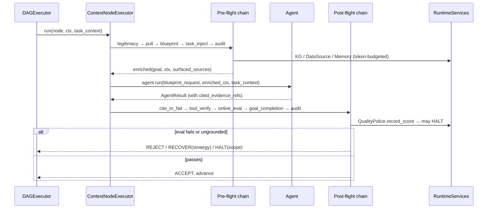

# SPEC-00: Enterprise Context Brain

> Umbrella spec. Defines the north-star architecture, the single seam that
> operationalizes it, and the **common types** every child spec reuses. Child
> specs (SPEC-01..06) own per-subsystem detail; this document owns the
> contract between them and the invariants that hold across all of them.

## Glossary

| Term | Meaning |
|---|---|
| **Context Brain** | The capability whereby a CEMAF DAG resolves the knowledge it needs by *pulling* from enterprise sources and the Knowledge Graph on demand, rather than having data *pushed* into a system prompt up front. |
| **Pull-not-push** | Context enters a node via on-demand retrieval bounded by a `TokenBudget`, not via static prompt stuffing. |
| **Blueprint** | A structured, typed specification of *what* an LLM must produce (goal, entities, style, policies). The canonical node input — replaces free-form English prompts. |
| **Node interceptor** | A pre-flight/post-flight middleware step wrapping every node's `agent.run`. The seam that operationalizes the brain. |
| **KG (Knowledge Business Graph)** | `knowledge/` entity-relation graph backed by `MemoryManager`. Promoted here from a meta-only asset to a shared `RuntimeService`. |
| **DataSource** | A `@runtime_checkable` connector protocol over an enterprise system (warehouse, ticketing, docs) exposing read-only, citeable retrieval. |
| **TaskContext** | The long-horizon awareness object: goal, step N of M, prior decisions, retry ledger, budget remaining — injected into every node of an autonomous run. |
| **Decision** | A material choice or output from a prior node worth carrying forward. Append-only on `TaskContext.prior_decisions`. |
| **SurfacedSources** | The set of `CiteableChunk`s the PullInterceptor placed in `Context` for a given node — the membership set every cite-or-fail check uses. |
| **Claim** | A factual proposition emitted by a node's output (text span or schema field) that requires a citation. Extraction algorithm is defined in SPEC-05 §2. |
| **Guardian** | An auto-injected interceptor enforcing a gate (legitimacy, cite-or-fail, online eval, goal-completion, audit) without the DAG author wiring it manually. |
| **Goal-completion / success-mark** | An evaluator answering "is the declared goal achieved?", distinct from per-output quality scores. |
| **Cite-or-fail** | A post-flight gate that rejects any node output whose claims are not grounded in `SurfacedSources` or whose `cited_evidence_refs` are not members of `SurfacedSources`. |
| **ChainProfile** | The set of guardians active for a given run. `DEFAULT` for parent runs, `RECOVERY` (reduced) for meta sub-DAG runs. |

## 1. Context

CEMAF must act as a **context brain for a full enterprise**: given a goal, it
pulls the relevant business knowledge on demand, drives generation from
**Blueprints rather than English**, keeps every node aware that it is one step of
a **long-running autonomous task**, grounds every claim in a **shared Knowledge
Graph** plus live enterprise data, and polices the path to completion with
**internal guardian agents and online evals** so the result is **assertive,
audited, secure, and low-to-zero hallucination**.

Assessment of the current codebase (2026-05-26) found that nearly every primitive
already exists — `MemoryContextProvider`, Librarian/Researcher agents,
`Blueprint.to_prompt()`, `knowledge/`, `OnlineEvalPipeline`, `QualityPolice`,
`citation/`, `moderation/`, `audit/`, `replay/` — but none are wired into the
default DAG execution path. The unifying architectural change is a
**node-execution interceptor pipeline** in `ContextNodeExecutor`. Six of the
eight requirements collapse onto this one seam.



## 2. Interface Contract (MDE)

### Common Types (single source of truth)

These types are referenced by every child spec. Child specs may extend them but
SHALL NOT redefine them.

```python
from typing import NewType, Protocol, runtime_checkable
from dataclasses import dataclass, field
from datetime import datetime
from enum import Enum

# IDs
TaskID         = NewType("TaskID", str)
NodeID         = NewType("NodeID", str)
DAGID          = NewType("DAGID", str)
ChunkID        = NewType("ChunkID", str)
BlueprintID    = NewType("BlueprintID", str)
CorrelationID  = NewType("CorrelationID", str)
TokenCount     = NewType("TokenCount", int)
Confidence     = NewType("Confidence", float)

# Context-brain primitives
@dataclass(frozen=True, slots=True)
class TokenBudget:
    total: TokenCount
    pull_tokens: TokenCount       # cap for PullInterceptor
    generation_tokens: TokenCount # cap for the agent's LLM call
    timeout_ms: int = 30_000

@dataclass(frozen=True, slots=True)
class Citation:
    citation_id: str
    source_id: str
    locator: str                  # URL, file path, KG entity ref
    retrieved_at: datetime

@dataclass(frozen=True, slots=True)
class CiteableChunk:
    chunk_id: ChunkID
    citation: Citation
    content: str
    token_count: TokenCount
    confidence: Confidence

@dataclass(frozen=True, slots=True)
class Goal:
    text: str
    metadata: dict[str, object] = field(default_factory=dict)
    # Value type is `object` (not `str`) because reserved keys carry structured
    # payloads — e.g. SPEC-01 Inv 10 stores `metadata["remediation"]: tuple[RecoveryHint, ...]`.
    # Reserved keys and their value types are documented in their owning specs:
    #   "remediation"    : tuple[RecoveryHint, ...]   — SPEC-01 Inv 10
    #   "blueprint_request" : str (canonical JSON)    — SPEC-03 §2 BlueprintInterceptor
    # Free-form caller metadata SHOULD use only `str` values to keep canonical
    # serialization (SPEC-03 Inv 4) replay-deterministic.

@dataclass(frozen=True, slots=True)
class EntityRef:
    """A typed reference to a business entity surfaced by KG or extraction."""
    entity_id: str
    kind: str                                       # "Order", "Customer", "Product", ...
    label: str | None = None

@dataclass(frozen=True, slots=True)
class ToolCallOutput:
    """One observable tool invocation captured on AgentResult."""
    tool_name: str
    arguments: dict[str, str]
    output: str
    citations: tuple[Citation, ...] = ()
    consumed_by_node: NodeID | None = None          # set by executor when downstream node reads this output

@dataclass(frozen=True, slots=True)
class Claim:
    """A factual proposition that requires a citation. Hoisted here from SPEC-05
    §2 so AgentResult.unverified_claims types cleanly without a layer inversion.
    SPEC-05 §2 owns the extraction algorithms and policy; this is the type only.
    """
    claim_id: str
    text: str
    span: tuple[int, int] | None
    citations: tuple[Citation, ...]

@dataclass(frozen=True, slots=True)
class AgentResult:
    output: object                                  # may be a Pydantic model when blueprint.output_schema is set
    raw_text: str | None
    cited_evidence_refs: tuple[Citation, ...] = ()
    tool_calls: tuple[ToolCallOutput, ...] = ()     # consumed by SPEC-05 ToolOutputVerifier
    unverified_claims: tuple[Claim, ...] = ()       # OWNED BY THE EXECUTOR, NOT THE AGENT. Agents SHALL emit unverified_claims=(); the chain (SPEC-05 CiteOrFail under GroundingPolicy.BEST_EFFORT) populates this tuple via PostflightDecision.derived_unverified_claims, which the executor merges into a NEW AgentResult per SPEC-01 Inv 6. Surfaced to users as "[unverified]".
    metadata: dict[str, str] = field(default_factory=dict)

class GroundingPolicy(Enum):
    REQUIRED    = "required"      # cite-or-fail enforced; ungrounded → RECOVER(RETRY_WITH_HINTS) subject to SPEC-05 Inv 15 budget escalation to HALT
    BEST_EFFORT = "best_effort"   # cite-or-fail downgrades ungrounded claims to AgentResult.unverified_claims and ACCEPTs (claim still surfaces in user copy as "[unverified]")
    OPTIONAL    = "optional"      # cite if present, do not reject if absent (no flagging)
    DISABLED    = "disabled"      # router/conditional/parallel non-output nodes

class SchemaFailurePolicy(Enum):
    REJECT  = "reject"      # post-flight REJECT on schema validation failure
    RECOVER = "recover"     # RECOVER(RETRY_WITH_HINTS) on schema failure
    HALT    = "halt"        # HALT(scope=TASK) on schema failure

# Chain primitives — full detail in SPEC-01
@dataclass(frozen=True, slots=True)
class DAGNode:
    node_id: NodeID
    display_name: str                               # ≤40 chars, human-readable; rendered in user-facing copy (SPEC-05 §10) e.g. task.retry_started, halt notifications. NEVER node_id.
    is_terminal: bool
    is_llm_node: bool
    retry_budget: int = 1                           # max RECOVER dispatches before HALT escalation
    grounding: GroundingPolicy = GroundingPolicy.REQUIRED
    schema_failure_policy: SchemaFailurePolicy = SchemaFailurePolicy.RECOVER
    online_evaluators: tuple[str, ...] = ()         # SPEC-05 OnlineEvalInterceptor binding — names of evaluators registered with QualityPolice that score this node's output

# TaskContext is fully defined in SPEC-04. SPEC-00 declares the type symbol so
# protocol signatures here resolve without forward-referencing implementation.
# Same for Context (existing CEMAF type, see context/context.py) and
# RuntimeServices (orchestration/services.py).

class ChainProfile(Enum):
    DEFAULT  = "default"    # legitimacy → pull → blueprint → task_inject → audit ; cite_or_fail → tool_verify → online_eval → goal_completion → audit
    RECOVERY = "recovery"   # legitimacy → pull → blueprint → task_inject → audit ; cite_or_fail → tool_verify → audit  (no online_eval, no goal_completion)

class InterceptorPhase(Enum):
    PRE  = "pre"
    POST = "post"
    BOTH = "both"

# TaskState lives in SPEC-04 §2 (single source of truth). Listed here only as
# a forward-referenced symbol for completeness of the umbrella common-types
# block — do NOT redefine the enum body.
```

### Cross-cutting seams

This umbrella declares only the seams. Field-level schemas live in the child
spec named in each row.

```python
# NodeInterceptor: full ABC definition lives in SPEC-01 §2 (single source of
# truth). SPEC-00 only declares that the symbol exists and what fields it
# carries. Do not duplicate the class body here.

# Symbols declared in SPEC-00 referenced by child specs but owned elsewhere:
#   DAG                      — orchestration/dag.py::DAG (existing CEMAF type)
#   Context                  — context/context.py::Context (existing). This
#                              spec amends Context with two new fields owned
#                              jointly by SPEC-01 (correlation_id) and SPEC-02
#                              (surfaced_sources), set out in the
#                              "Context extensions" subsection below.
#   RuntimeServices          — orchestration/services.py (existing)
#   TaskContext, Task, TaskState — full def in SPEC-04 §2
#   Decision                 — full def in SPEC-04 §2
#   PreflightDecision/PostflightDecision — full def in SPEC-01 §2
#   NodeInterceptor (ABC)    — full def in SPEC-01 §2
#   Blueprint                — blueprint/base.py::Blueprint (existing)
#   ContextPatch             — context/patch.py::ContextPatch (existing). Carries
#                              source: str, correlation_id: CorrelationID, applied_at: datetime;
#                              SPEC-06 splices recovery outputs back into the parent
#                              run via patches with source="meta:<sub_dag_id>".

# Context extensions — owned by this umbrella so child specs do not redefine.
# Both fields are required at construction time once the chain runs:
#   Context.correlation_id   : CorrelationID  — assigned by DAGExecutor at node
#                              dispatch; threaded into every PreflightDecision /
#                              PostflightDecision and AuditEntry of the attempt.
#   Context.surfaced_sources : tuple[CiteableChunk, ...] — populated by the
#                              PullInterceptor (SPEC-02) before BlueprintInterceptor;
#                              the canonical membership set for SPEC-05 cite-or-fail.
#                              Defaults to () pre-PullInterceptor.
#
# Mutable-collection fields on frozen dataclasses (e.g. metadata: dict[str, str])
# SHALL be wrapped at construction with types.MappingProxyType to honor the
# "increment-only / append-only" invariants stated in §3 and child specs.
# Canonical pattern (apply to AgentResult, Goal, ContextPatch, every metadata
# field below — child specs inherit this without restating):
#
#   from types import MappingProxyType
#   def __post_init__(self) -> None:
#       if not isinstance(self.metadata, MappingProxyType):
#           object.__setattr__(self, "metadata", MappingProxyType(dict(self.metadata)))
#
# `object.__setattr__` is required because the dataclass is frozen=True; the
# wrapped MappingProxyType disallows downstream `instance.metadata["k"] = "v"`
# mutation, making the immutability invariants enforceable rather than advisory.

# Canonical chain order — single source of truth. SPEC-01 ChainConfig
# pre_order/post_order SHALL equal these tuples for the matching profile.
DEFAULT_PRE_ORDER   = ("legitimacy", "pull", "blueprint", "task_inject", "audit")
DEFAULT_POST_ORDER  = ("cite_or_fail", "tool_verify", "online_eval", "goal_completion", "audit")
RECOVERY_PRE_ORDER  = ("legitimacy", "pull", "blueprint", "task_inject", "audit")
RECOVERY_POST_ORDER = ("cite_or_fail", "tool_verify", "audit")
```

### RuntimeServices additions (consolidation)

Existing `RuntimeServices` (16 fields, see CLAUDE.md) gains the following.
This table is the single source of truth — child specs consume these.

| Field | Type | Owning spec | Purpose |
|---|---|---|---|
| `interceptors` | `tuple[NodeInterceptor, ...]` | SPEC-01 | Ordered chain |
| `token_budget` | `TokenBudget` | SPEC-00 / SPEC-01 / SPEC-04 | The default per-call parent metering authority. SPEC-01 reads `services.token_budget.timeout_ms` for chain-bound precedence; SPEC-04 `Task.budget_remaining` is initialized from this value at task creation; SPEC-06 recovery runs are metered against `meta_budget` and SHALL NOT decrement this. Already present on the existing `RuntimeServices` (CLAUDE.md); listed here so child specs reference it from the umbrella table. |
| `chain_profile` | `ChainProfile` | SPEC-01 / SPEC-06 | Default profile a new executor uses; per-call `DAGExecutor.run(..., chain_profile=)` overrides (SPEC-06). Precedence: call-arg > services-default. |
| `knowledge_graph` | `KnowledgeGraph \| None` | SPEC-02 | Shared KG (meta + non-meta) |
| `data_sources` | `DataSourceRegistry \| None` | SPEC-02 | Read-only enterprise connectors |
| `blueprint_library` | `BlueprintLibrary \| None` | SPEC-03 | Blueprint resolution |
| `task_repository` | `TaskRepository \| None` | SPEC-04 | Task state machine + snapshot |
| `authorization_policy` | `AuthorizationPolicy \| None` | SPEC-05 | Legitimacy gate backend |
| `goal_completion_evaluator` | `GoalCompletionEvaluator \| None` | SPEC-05 | Terminal-node goal check |
| `tool_output_verifier` | `ToolOutputVerifier \| None` | SPEC-05 | Tool-layer hallucination gate |
| `claim_extractor` | `ClaimExtractor \| None` | SPEC-05 | Claim segmentation for cite-or-fail |
| `structured_generator` | `StructuredGenerator \| None` | SPEC-03 | Blueprint → typed result generator |
| `meta_dispatcher` | `MetaDispatcher \| None` | SPEC-06 | Mid-run self-resolving recovery |
| `meta_budget` | `MetaInvocationBudget` | SPEC-06 | Recursion bounds |

`RuntimeServices` is a frozen dataclass; mutation is forbidden. Per-call
state (e.g., active `ChainProfile` for a specific `DAGExecutor.run` call)
SHALL be passed as a method parameter, not stored on `services`. The
`chain_profile` field on `RuntimeServices` is the *default* profile a new
executor uses; child specs that need to override (SPEC-06) do so via
`DAGExecutor.run(..., chain_profile=ChainProfile.RECOVERY)`.

## 3. Invariants (DbC)

Cross-cutting rules that hold regardless of which child subsystem is active.

1. `IF a node has GroundingPolicy.REQUIRED AND any element of result.cited_evidence_refs ∉ ctx.surfaced_sources, THEN THE System SHALL NOT accept the output (cite-or-fail). SPEC-05 §3 Inv 2 binds the concrete decision: RECOVER(RETRY_WITH_HINTS, reason="non_member_citation") subject to SPEC-05 Inv 15 retry-budget escalation to HALT.`
2. `WHEN the pre-flight legitimacy gate denies a node, THE System SHALL NOT execute the agent and SHALL emit an audit entry.`
3. `WHILE a DAG is executing, THE System SHALL pull context within node.budget.pull_tokens and SHALL NOT stuff full source bodies into the system prompt.`
4. `WHEN any guardian raises HALT(scope=DAG) or HALT(scope=TASK), THE System SHALL stop dispatching new nodes and transition the task to HALTED.`
5. `WHERE a node has is_llm_node == True, THE System SHALL drive generation from a Blueprint-derived structured request, not a free-form English prompt.`
6. `Every node SHALL receive a TaskContext; 0 ≤ step_index < step_count.`
7. `THE Knowledge Graph SHALL be queryable by any node via RuntimeServices.knowledge_graph — access SHALL NOT be restricted to the meta layer.`
8. `Every interceptor decision (ACCEPT/REJECT/RECOVER/HALT) carries source, reason, correlation_id (ContextPatch provenance).`
9. `Interceptor ordering for ChainProfile.DEFAULT SHALL be DEFAULT_PRE_ORDER then EXECUTE then DEFAULT_POST_ORDER. For ChainProfile.RECOVERY (used by SPEC-06 sub-DAG runs) it SHALL be RECOVERY_PRE_ORDER then EXECUTE then RECOVERY_POST_ORDER.`
10. `A DataSource SHALL expose read-only retrieval only — no write port exists on the protocol.`
11. `WHEN tool output is consumed by a downstream node, THE ToolOutputVerifier SHALL inspect it for hallucinated facts before downstream dispatch (SPEC-05).`

Per-subsystem invariants live in child specs.

## 4. Acceptance Criteria (BDD)

```gherkin
Feature: Enterprise Context Brain end-to-end

  Scenario: Pull-not-push grounding
    Given a DAG node with a goal referencing enterprise entities
    And a DataSource and Knowledge Graph registered in RuntimeServices
    When the node executes under ChainProfile.DEFAULT
    Then context is retrieved on demand within node.budget.pull_tokens
    And ctx.surfaced_sources is populated before BlueprintInterceptor runs
    And the system prompt does not contain full source bodies
    And every Citation in result.cited_evidence_refs is a member of ctx.surfaced_sources

  Scenario: Cite-or-fail blocks an ungrounded claim
    Given a generative node with GroundingPolicy.REQUIRED
    And a Claim with no Citation in cited_evidence_refs
    And the node's retry_ledger value is below node.retry_budget
    When the post-flight cite-or-fail gate runs
    Then the PostflightDecision is RECOVER(RETRY_WITH_HINTS, reason="ungrounded_claim")
    And the output is not stored as-is — SPEC-05 Inv 15 escalates RECOVER → HALT once the ledger reaches retry_budget

  Scenario: Online eval halts a degrading run
    Given a long-running task whose recent node scores trend below the HALT threshold
    When QualityPolice records the next score
    Then it raises AlertLevel.HALT
    And the DAGExecutor stops dispatching new nodes
    And the task transitions to HALTED with an audit entry

  Scenario: Legitimacy gate denies an out-of-scope action
    Given a node requesting an action outside the task's authorized scope
    When the pre-flight legitimacy gate runs
    Then the agent is not invoked
    And an audit entry records the denial with correlation_id

  Scenario: Task awareness across steps
    Given a 10-step autonomous task at step 3
    When step 3's node executes
    Then it receives a TaskContext with step_index=2, step_count=10
    And prior_decisions from steps 1-2 are present
    And retry_count[node_id] is observable

  Scenario: Blueprint drives generation
    Given a node with is_llm_node=True
    When the node executes
    Then BlueprintInterceptor produces a BlueprintRequest
    And no free-form English prompt is constructed from the goal text

  Scenario: KG queryable by a normal node
    Given a non-meta DAG and a Knowledge Graph in RuntimeServices
    When a node queries neighbors of an entity
    Then it receives KG relations as CiteableChunks in ctx.surfaced_sources

  Scenario: Tool-output hallucination is caught
    Given a tool that returns fabricated facts consumed by a downstream node
    When the post-flight tool_verify guardian runs
    Then the output is rejected with reason "tool_unverified"
    And the parent decision is RECOVER or HALT per node policy

  Scenario: Recovery sub-DAG runs the reduced chain
    Given a guardian emits RECOVER(INVOKE_META_ARCHITECT)
    When the meta dispatcher executes the sub-DAG
    Then the active chain profile is ChainProfile.RECOVERY
    And online_eval and goal_completion are NOT invoked inside the sub-DAG
```

## 5. Out of Scope

- **Implementation detail of each subsystem** — owned by SPEC-01..06.
- **Specific enterprise connectors** (Salesforce, SAP, Snowflake) — protocol in scope (SPEC-02); concrete adapters are follow-on.
- **Streaming generation** — all post-flight gates inspect a complete `AgentResult`. Streaming is out-of-scope this cycle; mid-stream grounding is a follow-on spec.
- **Write-back to enterprise systems** — read-only this cycle.
- **Multi-tenant pricing / per-org rate negotiation** — `BudgetGuard` territory.
- **UI / dashboard surfaces** for task progress — backend awareness only.
- **Replacing the existing meta self-hosting layer** — SPEC-06 *connects* it; does not rewrite `meta/`.

## 6. Dependencies

Build order (each row is a child spec; later rows depend on earlier):

| Order | Spec | Unblocks | Depends on |
|---|---|---|---|
| 1 | SPEC-01 Node interceptor pipeline | the seam itself | existing `ContextNodeExecutor` |
| 2 | SPEC-02 KG + DataSource RuntimeServices | pull-not-push, KG-in-engine | SPEC-01, `knowledge/`, `retrieval/` |
| 3 | SPEC-03 Blueprint-as-LLM-input | structured generation | SPEC-01, SPEC-02 (consumes ctx.surfaced_sources), `blueprint/`, `generation/` |
| 4 | SPEC-04 Task state machine | long-horizon awareness | SPEC-01, `persistence/`, `replay/` |
| 5 | SPEC-05 Guardian mesh + gates | quality/safety/grounding | SPEC-01..04, `evals/`, `citation/`, `moderation/`, `audit/` |
| 6 | SPEC-06 Self-resolving DAG | framework-uses-itself mid-run | SPEC-01, SPEC-04, SPEC-05, `meta/` |

POC decisions feed the context layer: model-catalog (selection),
anchored-compaction (session memory), tool-output-bucket (context budgeting).

### Spec Audit (build-time gate)

A CI-level audit (`scripts/spec_audit.py`) SHALL run on every PR touching
`docs/specs/**` or `cemaf/blueprint/**`. Audits and the spec rule that owns
each:

| Audit | Owner | Failure mode |
|---|---|---|
| Grounding-annotation gate | SPEC-03 §3 Inv 10 | Build fails when a registered blueprint output_schema has a free-text factual field without `grounding_required=True` and no waiver in `cemaf/data/eval_pins/grounding_audit_waivers.json` |
| §10 copy-coverage | SPEC-05 §10 user-facing copy table + `normalize_reason()` | Build fails when any reason string emitted in code is missing a §10 row, or any §10 row is unreachable |
| Cassette presence | SPEC-00 Property 6 | Build fails when an LLM-judge interceptor has no cassette file matching its hash key |
| Hallucination-baseline diff | SPEC-05 §8 HallucinationProbe | PR fails when current rate > baseline + 0.5pp |

The audit script is part of `make check` and the GitHub Actions workflow.

## 7. Correctness Properties

### Property 1: Grounding membership

*For any* node output `r` with `node.grounding == REQUIRED`,
`set(r.cited_evidence_refs) ⊆ set(c.citation for c in ctx.surfaced_sources)`.
Outputs violating this are rejected.

**Validates: §3 Invariant 1, §4 "Cite-or-fail blocks an ungrounded claim"**

### Property 2: Read-only enterprise boundary

*For any* `DataSource` implementation, no method mutates the underlying
enterprise system — the protocol exposes `retrieve` only; no write port exists
in `dir(DataSource)`.

**Validates: §3 Invariant 10, §4 "Pull-not-push grounding"**

### Property 3: Halt safety

*For any* task in state RUNNING, once any guardian emits HALT no further node is
dispatched; the task reaches HALTED and never silently resumes.

**Validates: §3 Invariant 4, §4 "Online eval halts a degrading run"**

### Property 4: Interceptor order determinism

*For any* node, interceptors run in the §3-Invariant-9 order for the active
ChainProfile; the same inputs produce the same accept/reject/recover/halt
decision sequence (replay-safe).

**Validates: §3 Invariant 9**

### Property 5: KG access symmetry

*For any* node (meta or non-meta), KG queries resolve through the same
`RuntimeServices.knowledge_graph` handle.

**Validates: §3 Invariant 7, §4 "KG queryable by a normal node"**

### Property 6: End-to-end replay determinism

*For any* fixed inputs `(node, goal, ctx, task, services_snapshot)` and a fixed
random seed, the full chain (PRE → EXECUTE → POST) produces an identical
sequence of decisions and an identical `AgentResult`. LLM-judge evaluators
inside the chain SHALL be replayed via recorded fixtures (cassettes) keyed by
`(prompt_template_version, model_id, decoding_params, input_hash)` — fixtures
are part of the test contract.

**Validates: §3 Invariant 9 / SPEC-01 Inv 8 / SPEC-03 "Determinism" / SPEC-05 "Replay determinism"**

**Cassette path convention** (single source of truth — child specs inherit):
`tests/fixtures/cassettes/<spec_id>/<judge_name>/<input_hash>.json` where
`input_hash = sha256(canonical_json({prompt_template_version, model_id,
decoding_params, input}))[:16]`. Missing cassette in CI fails the test loud,
not silent regenerate. Cassettes are checked into git.

## 8. Eval Criteria

Cross-cutting evaluators. Per-subsystem evaluators (with pinned prompts, models,
baselines) live in child specs.

| Evaluator | Node | Mode | Threshold | Method |
|---|---|---|---|---|
| GroundingEvaluator | every REQUIRED-grounding node | GATE | membership violations == 0 | deterministic (SPEC-05 §2) |
| GoalCompletionEvaluator | terminal node | GATE | achieved == true ∧ confidence ≥ 0.8 | LLM judge (pinned prompt+model in SPEC-05) |
| LegitimacyEvaluator | every node (pre) | GATE | authorized == true | deterministic |
| HallucinationProbe | every generative node | OBSERVE | rate ≤ 0.02 (95% CI) on labeled corpus | LLM judge (pinned in SPEC-05) |
| QualityTrendMonitor | per-Task | GATE | no HALT alert | deterministic z-score (QualityPolice) |
| ToolOutputVerifier | every node consuming tool output | GATE | unverified == 0 | hybrid (SPEC-05 §2) |

## 9. Observability Contract

### Cross-cutting conventions (apply to every child spec)

**OTel GenAI semantic-convention compliance.** Every span SHALL carry:
- `gen_ai.system = "cemaf"` and `gen_ai.operation.name` (e.g. `"chain.preflight"`, `"agent.run"`, `"meta.dispatch"`).
- For agent-execute spans: `gen_ai.request.model`, `gen_ai.usage.input_tokens`, `gen_ai.usage.output_tokens`, `gen_ai.response.finish_reason`.
- Guardian spans use the namespace `gen_ai.guardian.<name>` as a documented CEMAF extension to the GenAI conv; they additionally set `gen_ai.operation.name = "guardian.<name>"` so standard GenAI dashboards still slice them.

**Required baggage on every span.** `task.id`, `tenant.id`, `workspace.id`, `correlation_id`, `chain_profile`, `dag.id`, `node.id`, `attempt`. Set once at executor entry, propagated via OTel baggage so child specs do not redeclare them.

**Trace-context propagation across recovery.** Recovery sub-DAG execution is in-process (SPEC-06 Inv 9 — same DAGExecutor instance). Propagation rules:
- **In-process (default):** the sub-DAG's root span SHALL be a child of the parent node's `gen_ai.node.postflight` span via the SDK parent-context (`opentelemetry.trace.use_span(parent)` or equivalent). Parent and sub-DAG share one trace, no `traceparent` header injection needed.
- **Cross-process (when `MetaDispatcher` is implemented as RPC):** the dispatcher SHALL inject the W3C `traceparent` header per OTel HTTP/gRPC spec; the receiver SHALL extract and continue the trace.
- In addition to the OTel-native parent-context linkage above, every recovery span SHALL carry CEMAF-specific denormalization attributes for query-side joins without trace lookups: `parent_correlation_id`, `parent_task_id`, `parent_node_id`. These are CEMAF extensions, NOT replacements for OTel parent-context — they exist to support log-pipeline queries that don't have access to the trace store.

**Metric label cardinality rules.** Unbounded identifiers (`task.id`, `node.id`, `correlation_id`, `parent_task`, `dag.id`, `source_id` in multi-tenant deploys) SHALL appear ONLY as span attributes, NEVER as metric labels. Allowed metric labels are bounded enums or hashed buckets:
- `chain_profile ∈ {default, recovery}`, `decision ∈ {accept, reject, recover, halt}`, `phase ∈ {pre, post}`.
- `node_type` (bounded by registry).
- `source_kind` (bounded enum: kg, vector, memory, datasource), NOT `source_id`.
- Hashed bucket label `tenant_bucket = int.from_bytes(sha256(tenant.id.encode("utf-8")).digest()[:8], "big") % 64` when per-tenant slicing is needed (hash function, byte slice, and modulus are part of the contract for telemetry replay determinism); raw `tenant.id` is span-attribute-only.
- `evaluator` label (used by `cemaf_eval_halts_total`) is bounded by the `services.online_eval_pipeline` registry — implementations SHALL cap the registry at ≤32 distinct evaluator IDs; over-cap is a startup error, not a metric explosion.

**Metric units.** All durations are seconds (`*_seconds` histograms, Prometheus convention). The legacy `*_ms` names elsewhere in this document and child specs are **renamed** to `*_seconds` at implementation; spec text retains historic names for traceability but the contract is seconds. Span attributes carrying durations follow the same rule — e.g. `latency_seconds`, `wall_time_seconds`. Any `*_ms` span attribute appearing in a child spec (SPEC-01, SPEC-02 use `latency_ms`) is renamed to `*_seconds` at implementation; spec text retains historic names for traceability.

**Required RED metrics for the orchestration hot path.**
- `cemaf_node_execute_duration_seconds` (histogram, labels: `chain_profile`, `node_type`, `outcome ∈ {success,rejected,recovered,halted,failed}`).
- `cemaf_node_execute_errors_total` (counter, same labels).
- `cemaf_guardian_duration_seconds{guardian,phase}` (histogram).
- `cemaf_chain_duration_seconds{phase,chain_profile}` (histogram).

### Umbrella-level telemetry

- **Spans**:
  - `gen_ai.node.preflight` — `node.id`, `chain_profile`, `legitimacy.decision`, `pull.sources_count`, `pull.tokens`, `blueprint.resolved`
  - `gen_ai.node.execute` — `gen_ai.request.model`, `gen_ai.usage.input_tokens`, `gen_ai.usage.output_tokens`, `task.step_index`, `task.step_count`
  - `gen_ai.node.postflight` — `cite.decision`, `tool_verify.decision`, `eval.score`, `goal.achieved`, `police.alert_level`
- **Log events**: `preflight.legitimacy_denied`, `pull.completed`, `cite_or_fail.rejected`, `tool_verify.rejected`, `eval.gate_failed`, `task.halted`, `kg.queried`, `datasource.retrieved`, `recovery.dispatched`
- **Metrics**: `cemaf_node_interceptor_decisions_total{decision,chain_profile}`, `cemaf_grounding_score` (gauge, no labels), `cemaf_task_steps_completed_total` (counter, no labels), `cemaf_eval_halts_total{evaluator}`, `cemaf_tool_verify_rejections_total`

Per-subsystem telemetry refines this in the child specs and SHALL inherit the cross-cutting conventions above without redeclaring them.

## Next Steps

1. With this umbrella consolidated, implementation proceeds per SPEC-01.
2. Each child spec carries its own §2–§9 and a `/write-poc` where the approach
   is not yet proven (legitimacy gate, goal-completion evaluator, claim
   extractor, tool-output verifier).
3. One PR per spec, flat against `main`.
