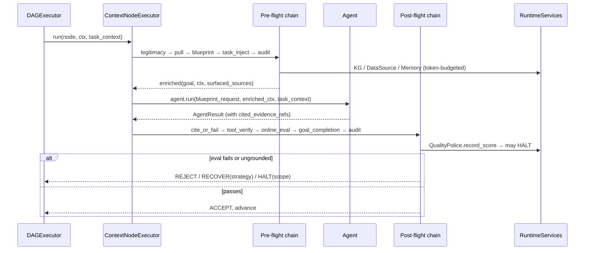

# SPEC-00: Enterprise Context Brain

> Umbrella spec. Defines the north-star architecture, the single seam that
> operationalizes it, and the **common types** every child spec reuses. Child
> specs (SPEC-01..06) own per-subsystem detail; this document owns the
> contract between them and the invariants that hold across all of them.

## Glossary

| Term | Meaning |
|---|---|
| **Context Brain** | The capability whereby a CEMAF DAG resolves the knowledge it needs by *pulling* from enterprise sources and the Knowledge Graph on demand, rather than having data *pushed* into a system prompt up front. |
| **Pull-not-push** | Context enters a node via on-demand retrieval bounded by a `TokenBudget`, not via static prompt stuffing. |
| **Blueprint** | A structured, typed specification of *what* an LLM must produce (goal, entities, style, policies). The canonical node input — replaces free-form English prompts. |
| **Node interceptor** | A pre-flight/post-flight middleware step wrapping every node's `agent.run`. The seam that operationalizes the brain. |
| **KG (Knowledge Business Graph)** | `knowledge/` entity-relation graph backed by `MemoryManager`. Promoted here from a meta-only asset to a shared `RuntimeService`. |
| **DataSource** | A `@runtime_checkable` connector protocol over an enterprise system (warehouse, ticketing, docs) exposing read-only, citeable retrieval. |
| **TaskContext** | The long-horizon awareness object: goal, step N of M, prior decisions, retry ledger, budget remaining — injected into every node of an autonomous run. |
| **Decision** | A material choice or output from a prior node worth carrying forward. Append-only on `TaskContext.prior_decisions`. |
| **SurfacedSources** | The set of `CiteableChunk`s the PullInterceptor placed in `Context` for a given node — the membership set every cite-or-fail check uses. |
| **Claim** | A factual proposition emitted by a node's output (text span or schema field) that requires a citation. Extraction algorithm is defined in SPEC-05 §2. |
| **Guardian** | An auto-injected interceptor enforcing a gate (legitimacy, cite-or-fail, online eval, goal-completion, audit) without the DAG author wiring it manually. |
| **Goal-completion / success-mark** | An evaluator answering "is the declared goal achieved?", distinct from per-output quality scores. |
| **Cite-or-fail** | A post-flight gate that rejects any node output whose claims are not grounded in `SurfacedSources` or whose `cited_evidence_refs` are not members of `SurfacedSources`. |
| **ChainProfile** | The set of guardians active for a given run. `DEFAULT` for parent runs, `RECOVERY` (reduced) for meta sub-DAG runs. |

## 1. Context

CEMAF must act as a **context brain for a full enterprise**: given a goal, it
pulls the relevant business knowledge on demand, drives generation from
**Blueprints rather than English**, keeps every node aware that it is one step of
a **long-running autonomous task**, grounds every claim in a **shared Knowledge
Graph** plus live enterprise data, and polices the path to completion with
**internal guardian agents and online evals** so the result is **assertive,
audited, secure, and low-to-zero hallucination**.

Assessment of the current codebase (2026-05-26) found that nearly every primitive
already exists — `MemoryContextProvider`, Librarian/Researcher agents,
`Blueprint.to_prompt()`, `knowledge/`, `OnlineEvalPipeline`, `QualityPolice`,
`citation/`, `moderation/`, `audit/`, `replay/` — but none are wired into the
default DAG execution path. The unifying architectural change is a
**node-execution interceptor pipeline** in `ContextNodeExecutor`. Six of the
eight requirements collapse onto this one seam.



## 2. Interface Contract (MDE)

### Common Types (single source of truth)

These types are referenced by every child spec. Child specs may extend them but
SHALL NOT redefine them.

```python
from typing import ClassVar, NewType, Protocol, runtime_checkable
from collections.abc import Mapping
from dataclasses import dataclass, field
from datetime import datetime
from enum import Enum

# IDs
TaskID         = NewType("TaskID", str)
NodeID         = NewType("NodeID", str)
DAGID          = NewType("DAGID", str)
ChunkID        = NewType("ChunkID", str)
BlueprintID    = NewType("BlueprintID", str)
CorrelationID  = NewType("CorrelationID", str)
TokenCount     = NewType("TokenCount", int)
Confidence     = NewType("Confidence", float)

# Context-brain primitives
@dataclass(frozen=True, slots=True)
class TokenBudget:
    total: TokenCount
    pull_tokens: TokenCount       # cap for PullInterceptor
    generation_tokens: TokenCount # cap for the agent's LLM call
    timeout_ms: int = 30_000

@dataclass(frozen=True, slots=True)
class Citation:
    citation_id: str
    source_id: str
    locator: str                  # URL, file path, KG entity ref
    retrieved_at: datetime

# **Citation membership predicate (single source of truth)**: two Citations
# are members of the same surfaced set iff their (citation_id, source_id,
# locator) triples are equal. retrieved_at is excluded — it is metadata for
# audit, NOT part of identity. CiteOrFail and GoalCompletion membership
# checks SHALL use this predicate, not Python __eq__. Implementations SHALL
# define Citation.__eq__/__hash__ over the 3-tuple, OR use the explicit
# helper:
#
#   def citations_match(a: Citation, b: Citation) -> bool:
#       return (a.citation_id, a.source_id, a.locator) == (b.citation_id, b.source_id, b.locator)
#
# exported from cemaf.core.types.

@dataclass(frozen=True, slots=True)
class CiteableChunk:
    chunk_id: ChunkID
    citation: Citation
    content: str
    token_count: TokenCount
    confidence: Confidence
    priority: int = 0           # ContextCompiler drop key — set by PullInterceptor per source_kind mapping (SPEC-02 Inv 12); default 0 for chunks not produced by Pull

@dataclass(frozen=True, slots=True)
class Goal:
    text: str
    metadata: Mapping[str, object] = field(default_factory=dict)
    # Annotated as Mapping[str, object] (not dict[...]) because the canonical
    # MappingProxyType wrap below replaces the field with a read-only view —
    # `dict[...]` would lie about the post-init runtime type. Constructors may
    # pass a plain dict; __post_init__ wraps it.
    # Value type is `object` (not `str`) because reserved keys carry structured
    # payloads — e.g. SPEC-01 Inv 10 stores `metadata["remediation"]: tuple[RecoveryHint, ...]`.
    # Reserved keys and their value types are documented in their owning specs:
    #   "remediation"    : tuple[RecoveryHint, ...]   — SPEC-01 Inv 10
    #   "blueprint_request" : str (canonical JSON)    — SPEC-03 §2 BlueprintInterceptor
    # Free-form caller metadata SHOULD use only `str` values to keep canonical
    # serialization (SPEC-03 Inv 4) replay-deterministic.

@dataclass(frozen=True, slots=True)
class EntityRef:
    """A typed reference to a business entity surfaced by KG or extraction."""
    entity_id: str
    kind: str                                       # "Order", "Customer", "Product", ...
    label: str | None = None

@dataclass(frozen=True, slots=True)
class ToolCallOutput:
    """One observable tool invocation captured on AgentResult."""
    tool_name: str
    tool_call_id: str    # provider-emitted call id, echoed back to the provider on tool-result; canonical across Anthropic tool_use.id and OpenAI tool_calls[].id
    arguments: Mapping[str, object]      # JSON-shaped tool-call arguments (numbers/bools/nested objects)
    output: str                          # producing tool SHALL truncate to ≤ TOOL_OUTPUT_MAX_TOKENS (default 8192) before emitting; downstream verifier rejects untruncated outputs whose token_count > cap and truncated=False
    truncated: bool = False               # True when the tool truncated; consumed by SPEC-05 ToolOutputVerifier for budget enforcement
    citations: tuple[Citation, ...] = ()
    consumed_by_node: NodeID | None = None          # populated by the executor at the producer's POST chain assembly (BEFORE post() runs) by inspecting static DAG successors of the producing node — see SPEC-05 §2 ToolOutputVerifierInterceptor and SPEC-01 Inv 6e. NOT a runtime consumer-time write; static-DAG-derived so tool_verify can decide whether to gate the output on its first post-chain call.

# Tool-output token cap (single source of truth). Producing tools enforce this
# at emission; SPEC-05 ToolOutputVerifier rejects on violation.
TOOL_OUTPUT_MAX_TOKENS: int = 8_192

@dataclass(frozen=True, slots=True)
class Claim:
    """A factual proposition that requires a citation. Hoisted here from SPEC-05
    §2 so AgentResult.unverified_claims types cleanly without a layer inversion.
    SPEC-05 §2 owns the extraction algorithms and policy; this is the type only.
    """
    claim_id: str
    text: str
    span: tuple[int, int] | None
    citations: tuple[Citation, ...]

@dataclass(frozen=True, slots=True)
class AgentResult:
    output: object                                  # may be a Pydantic model when blueprint.output_schema is set
    raw_text: str | None
    cited_evidence_refs: tuple[Citation, ...] = ()
    tool_calls: tuple[ToolCallOutput, ...] = ()     # consumed by SPEC-05 ToolOutputVerifier
    unverified_claims: tuple[Claim, ...] = ()       # OWNED BY THE EXECUTOR, NOT THE AGENT. Agents SHALL emit unverified_claims=(); the chain (SPEC-05 CiteOrFail under GroundingPolicy.BEST_EFFORT) populates this tuple via PostflightDecision.derived_unverified_claims, which the executor merges into a NEW AgentResult per SPEC-01 Inv 6. Surfaced to users as "[unverified]".
    metadata: Mapping[str, str] = field(default_factory=dict)   # Mapping, not dict — see MappingProxyType wrap pattern below

class GroundingPolicy(Enum):
    REQUIRED    = "required"      # cite-or-fail enforced; ungrounded → RECOVER(RETRY_WITH_HINTS) subject to SPEC-05 Inv 15 budget escalation to HALT
    BEST_EFFORT = "best_effort"   # cite-or-fail downgrades ungrounded claims to AgentResult.unverified_claims and ACCEPTs (claim still surfaces in user copy as "[unverified]")
    OPTIONAL    = "optional"      # cite if present, do not reject if absent (no flagging)
    DISABLED    = "disabled"      # router/conditional/parallel non-output nodes

class SchemaFailurePolicy(Enum):
    REJECT  = "reject"      # post-flight REJECT on schema validation failure
    RECOVER = "recover"     # RECOVER(RETRY_WITH_HINTS) on schema failure
    HALT    = "halt"        # HALT(scope=TASK) on schema failure

class FinishReason(Enum):
    """Provider-normalized terminal/partial reason for an LLM completion. Adapters
    SHALL map provider-native values to FinishReason at the boundary before
    constructing AgentResult / StructuredResult."""
    TERMINAL_STOP  = "stop"
    TERMINAL_TOOL  = "tool"
    PARTIAL_LENGTH = "length"
    PARTIAL_FILTER = "content_filter"
    PARTIAL_ERROR  = "error"
```

### Provider-native finish_reason → FinishReason mapping (canonical)

Adapters SHALL implement this mapping at the boundary; downstream specs SHALL reference FinishReason members only (per §3 Inv 12).

| Provider | Native value | FinishReason |
|---|---|---|
| OpenAI | `stop` | TERMINAL_STOP |
| OpenAI | `tool_calls`, `function_call` | TERMINAL_TOOL |
| OpenAI | `length` | PARTIAL_LENGTH |
| OpenAI | `content_filter` | PARTIAL_FILTER |
| Anthropic | `end_turn`, `stop_sequence` | TERMINAL_STOP |
| Anthropic | `tool_use` | TERMINAL_TOOL |
| Anthropic | `max_tokens` | PARTIAL_LENGTH |
| Anthropic | `pause_turn` (extended-thinking pause) | PARTIAL_ERROR |
| Adapter | (stream error / cancellation) | PARTIAL_ERROR |
| Adapter | `null` / unknown / unmapped provider value | PARTIAL_ERROR (+ adapter SHALL emit log event `finish_reason.unmapped{provider, native_value}`; SHALL NOT produce a TERMINAL_* mapping for unknown values) |

### Provider-native tool-call envelope mapping (canonical)

CEMAF carries tool calls and results in the canonical `ToolCallOutput` shape (`tool_call_id`, `tool_name`, `arguments`, `output`). The LLM adapter SHALL translate to/from provider-native envelopes at the boundary:

| Provider | Tool call (assistant turn) | Tool result (user turn echo) |
|---|---|---|
| Anthropic | `{type: "tool_use", id, name, input}` → `tool_call_id ← id`, `tool_name ← name`, `arguments ← input` | `{role: "user", content: [{type: "tool_result", tool_use_id, content}]}` ← `tool_call_id` populates `tool_use_id` |
| OpenAI | `tool_calls[].id, .function.name, .function.arguments` | `{role: "tool", tool_call_id, content}` ← `tool_call_id` populates `tool_call_id` |

Adapters SHALL preserve `tool_call_id` round-trip; downstream specs SHALL reference the canonical shape only.

```python
# NodeBudget — per-node pull/generation/timeout caps; required on every DAGNode
# so SPEC-02 PullInterceptor and SPEC-03 StructuredGenerator have a deterministic
# bound independent of services.token_budget (parent metering authority).
@dataclass(frozen=True, slots=True)
class NodeBudget:
    pull_tokens: TokenCount
    generation_tokens: TokenCount
    timeout_ms: int

@dataclass(slots=True)
class EvalBudgetCounter:
    """Live per-(node_id, attempt_idx) counter cloned from the eval_budget template
    (services.eval_budget). Owned by the Executor; passed by reference to every
    guardian judge in the active attempt's chain. Not shared across nodes or
    attempts; not serialized into RuntimeServices.

    INTENTIONALLY NOT frozen — `reserve()` / `true_up()` mutate `remaining` in
    place under the executor-held `(node_id, attempt_idx)` `asyncio.Lock`
    (SPEC-05 Inv 17b). A frozen dataclass returning copies would defeat
    serialization (each judge would observe its own copy and never see peer
    debits). The counter object identity is the synchronization anchor."""
    template: TokenBudget        # source it was cloned from (read-only reference)
    remaining: int               # generation_tokens budget left, debited per-judge

    async def reserve(self, *, tokens: int, lock: "asyncio.Lock") -> int:
        """Pre-flight reservation under the caller's lock.

        Returns the post-debit `remaining`. Caller MUST hold `lock` for the
        duration of the reserve+await-call+true_up cycle; the lock is keyed on
        `(node_id, attempt_idx)` and held by the Executor for that attempt's
        lifetime (SPEC-05 Inv 17b). On `tokens > self.remaining`, raises
        `EvalBudgetExhausted` without debiting (judge MUST then return
        `score=0, level='budget_exhausted'`)."""
        ...

    async def true_up(self, *, reserved: int, actual: int, lock: "asyncio.Lock") -> int:
        """Post-flight true-up under the caller's lock.

        Refunds `reserved - actual` to `remaining` (delta MAY be negative if
        the call exceeded reservation; in that case the over-debit stands).
        Returns the post-true-up `remaining`."""
        ...

# Chain primitives — full detail in SPEC-01
@dataclass(frozen=True, slots=True)
class DAGNode:
    node_id: NodeID
    display_name: str                               # ≤40 chars, human-readable; rendered in user-facing copy (SPEC-05 §10) e.g. task.retry_started, halt notifications. NEVER node_id.
    is_terminal: bool
    is_llm_node: bool
    budget: NodeBudget                              # required — pull/generation/timeout caps for this node
    retry_budget: int = 1                           # max RECOVER dispatches before HALT escalation
    grounding: GroundingPolicy = GroundingPolicy.REQUIRED
    schema_failure_policy: SchemaFailurePolicy = SchemaFailurePolicy.RECOVER
    online_evaluators: tuple[str, ...] = ()         # SPEC-05 OnlineEvalInterceptor binding — names of evaluators registered with QualityPolice that score this node's output
    entities: tuple[EntityRef, ...] = ()            # optional — for blueprint binding (SPEC-03)
    blueprint_id: BlueprintID | None = None         # optional — explicit blueprint pin (SPEC-03)

# TaskContext is fully defined in SPEC-04. SPEC-00 declares the type symbol so
# protocol signatures here resolve without forward-referencing implementation.
# Same for Context (existing CEMAF type, see context/context.py) and
# RuntimeServices (orchestration/services.py).

class ChainProfile(Enum):
    DEFAULT  = "default"    # legitimacy → pull → blueprint → task_inject → audit ; cite_or_fail → tool_verify → online_eval → goal_completion → audit
    RECOVERY = "recovery"   # legitimacy → pull → blueprint → task_inject → audit ; cite_or_fail → tool_verify → audit  (no online_eval, no goal_completion)

class InterceptorPhase(Enum):
    PRE  = "pre"
    POST = "post"
    BOTH = "both"

# TaskState lives in SPEC-04 §2 (single source of truth). Listed here only as
# a forward-referenced symbol for completeness of the umbrella common-types
# block — do NOT redefine the enum body.

# JudgeDescriptor — referenced by §6 spec audit's discovery surface
# (OnlineEvalPipeline.list_judges). Owned here to avoid a layer inversion;
# SPEC-05 OnlineEvalInterceptor consumes it without redefining.
@dataclass(frozen=True, slots=True)
class JudgeDescriptor:
    judge_id: str                            # stable name, used as metric label (bounded ≤32; see §9)
    prompt_template_version: str             # semver-pinned, content-addressed in eval_pins/
    model_id: str                             # MUST encode model + revision pin: "<family>@<YYYY-MM-DD>" (e.g. "claude-sonnet-4-6@2026-04-12"). The bare family form is NOT valid because point-release greedy tokens drift across silent provider revisions; baselines would be falsely attributed without the revision pin. Spec audit (§6) SHALL fail when any registered judge has a bare-family model_id without a revision suffix.
    decoding_params: "DecodingParams"         # canonical TypedDict — see §6 cassette schema
    blueprint_compat: tuple[tuple[BlueprintID, str], ...] = ()   # (blueprint_id, semver-range) pairs the prompt template is validated against. Spec audit fails when a Blueprint's output_schema fields drift outside the declared compat range — closes the judge/schema drift hole where a blueprint adds a grounding_required field the judge prompt never asks about.

# Evaluator — per-attempt evaluator returning a numeric score; consumed by
# OnlineEvalInterceptor and QualityPolice. Hoisted here so OnlineEvalPipeline.get
# resolves without a forward reference.
@runtime_checkable
class Evaluator(Protocol):
    """Per-attempt evaluator returning a numeric score; consumed by OnlineEvalInterceptor and QualityPolice."""
    evaluator_id: ClassVar[str]
    async def evaluate(self, *, result: AgentResult, ctx: Context, task: TaskContext) -> "EvalScore": ...

@dataclass(frozen=True, slots=True)
class EvalScore:
    evaluator_id: str
    score: float                           # 0.0..1.0
    confidence: Confidence
    reason: str | None = None
    citations: tuple[Citation, ...] = ()   # judge-cited evidence (subject to membership re-validation)

# OnlineEvalPipeline — owned here to avoid layer inversion (SPEC-05 consumes
# without redefining). The .size property is consumed by the per-judge cap
# formula on `eval_budget` (RuntimeServices table above).
@runtime_checkable
class OnlineEvalPipeline(Protocol):
    def list_judges(self) -> tuple[JudgeDescriptor, ...]: ...
    def get(self, judge_id: str) -> Evaluator: ...
    @property
    def size(self) -> int: ...  # equals len(self.list_judges()); used by per-judge cap formula

# JudgeInputSanitizer — RuntimeServices.judge_input_sanitizer (see table).
# Deterministic; version bump invalidates cassettes via SPEC-05 Inv 16.
@runtime_checkable
class JudgeInputSanitizer(Protocol):
    version: ClassVar[str]  # bumping invalidates cassettes
    def sanitize(self, text: str) -> str: ...

# RunResult — returned by DAGExecutor.run (canonical signature above).
# Composes terminal outcome + halt scope + recovery summary so child specs
# (SPEC-04, SPEC-05, SPEC-06) reference one symbol instead of redeclaring.
@dataclass(frozen=True, slots=True)
class RunResult:
    """Returned by DAGExecutor.run."""
    task: Task
    terminal_outcome: NodeOutcome | None     # None if HALT before terminal
    halt_scope: HaltScope | None = None      # set when task ended in HALTED
    recovery_summary: tuple[RecoveryResult, ...] = ()  # all recoveries, in dispatch order
# RunResult lives in `cemaf/orchestration/executor.py` alongside
# `DAGExecutor.run`; declared inline here for umbrella documentation only.
# Implementation imports its field types (`Task`, `NodeOutcome`, `HaltScope`,
# `RecoveryResult`) directly from their owning modules (SPEC-04, SPEC-01,
# SPEC-01, SPEC-06 respectively) — no `core.types` re-export, avoiding the
# import cycle that would arise from a single-module home.

# ChainContractError — single source of truth for chain-phase contract
# violations. Owned here per shared type registry (round-42 budget_override);
# child specs (SPEC-01 §2 import list) reference this declaration without
# redefining. Raised when an interceptor or executor observes a chain-contract
# violation (correlation_id_unset, PRE mutating AgentResult, POST re-issuing
# agent.run, etc.). The chain catches it and converts to REJECT with
# reason="<id>:exception:ChainContractError". The reason string passed to the
# constructor is the contract code.
class ChainContractError(RuntimeError):
    """Raised on chain-phase contract violations; reason string is the contract code."""

# Per-recovery / per-attempt tool-loop bound (SPEC-03 Inv 11 enforcement).
# Default; child specs MAY override per node via BlueprintRequest.tool_loop_budget.
MAX_PARALLEL_TOOL_CALLS: int = 8
"""Hard cap on parallel tool_use blocks emitted by the LLM in a single
TERMINAL_TOOL turn (SPEC-03 Inv 11 — both Anthropic and OpenAI emit parallel
tool calls). Exceeding raises StreamingIncompleteError(PARTIAL_ERROR)."""

# PatchDropReason — closed enum for ContextPatch application drops, owned by
# SPEC-00 type registry per shared-types rule. Referenced by SPEC-05 Inv 14/22
# (drop on unverified promotion) and SPEC-06 Inv 15/§9 (cemaf_meta_patch_drops_total).
# Adding a new reason is a SPEC-00 amendment (same governance pattern as
# §9 outcome-enum); child specs cite members only.
class PatchDropReason(Enum):
    PATCH_UNVERIFIED_PROMOTION       = "patch_unverified_promotion"        # SPEC-05 Inv 14
    TOOL_OUTPUT_UNVERIFIED_PROMOTION = "tool_output_unverified_promotion"  # SPEC-05 Inv 22

# ToolLoopFabricationError — SPEC-03 Inv 11 sub-clause: a tool output produced
# inside the structured-generator tool loop fails ToolOutputVerifier inspection
# BEFORE being fed back into the LLM. Converted by post-flight to
# RECOVER(RETRY_WITH_HINTS, reason='tool_unverified_in_loop'); subject to
# SPEC-05 Inv 15 budget escalation.
class ToolLoopFabricationError(RuntimeError):
    """Raised when an intra-loop tool output fails grounding-membership check.

    Carries (tool_call_id, tool_name, fabricated_citation_ids: tuple[str, ...]).
    Caller MUST NOT feed the unverified output back into the LLM stream;
    the structured generator stops, emits StreamingIncompleteError(PARTIAL_ERROR)
    with a chained ToolLoopFabricationError, and the chain converts to
    RECOVER per SPEC-05."""

# get_retry helper — consumed by SPEC-04 Inv 10/11 and SPEC-05 Inv 3a/3b/15.
# Single source of truth so child specs cite the same signature.
def get_retry(ledger: tuple[tuple[NodeID, int], ...], node_id: NodeID) -> int:
    """Return current attempt count for node_id in retry_ledger, 0 if absent."""
    for nid, count in ledger:
        if nid == node_id:
            return count
    return 0
```

### Cross-cutting seams

This umbrella declares only the seams. Field-level schemas live in the child
spec named in each row.

```python
# NodeInterceptor: full ABC definition lives in SPEC-01 §2 (single source of
# truth). SPEC-00 only declares that the symbol exists and what fields it
# carries. Do not duplicate the class body here.

# Symbols declared in SPEC-00 referenced by child specs but owned elsewhere:
#   DAG                      — orchestration/dag.py::DAG (existing CEMAF type)
#   Context                  — context/context.py::Context (existing). This
#                              spec amends Context with two new fields owned
#                              jointly by SPEC-01 (correlation_id) and SPEC-02
#                              (surfaced_sources), set out in the
#                              "Context extensions" subsection below.
#   RuntimeServices          — orchestration/services.py (existing)
#   TaskContext, Task, TaskState — full def in SPEC-04 §2
#   Decision                 — full def in SPEC-04 §2
#   NodeOutcome              — full def in SPEC-01 §2; per-node terminal record
#                              (node_id, status, result, pre_decisions,
#                              post_decisions); referenced by
#                              RunResult.terminal_outcome.
#   HaltScope                — full def in SPEC-01 §2; enum {DAG, TASK}
#                              identifying the blast radius of a HALT decision;
#                              referenced by RunResult.halt_scope.
#   RecoveryResult           — full def in SPEC-06 §2; per-recovery summary
#                              (accepted, patches, retry_hints, sub_dag_id,
#                              halt, tokens_consumed, wall_time_ms) returned by
#                              recovery sub-DAGs; referenced by
#                              RunResult.recovery_summary.
#   PreflightDecision/PostflightDecision — full def in SPEC-01 §2
#   NodeInterceptor (ABC)    — full def in SPEC-01 §2
#   Blueprint                — blueprint/base.py::Blueprint (existing)
#   ContextPatch             — context/patch.py::ContextPatch (existing). Carries
#                              source: str, parent_task_correlation_id: CorrelationID,
#                              parent_ctx_correlation_id: CorrelationID, applied_at: datetime.
#                              The two correlation_id fields scope distinctly:
#                                parent_task_correlation_id — task-scoped, replay key
#                                parent_ctx_correlation_id  — attempt-scoped, audit key
#                              SPEC-06 Inv 7 / Property 5 use parent_ctx_correlation_id
#                              as the primary linker (per-attempt audit), with
#                              parent_task_correlation_id as the secondary index
#                              for cross-attempt task-level queries.
#                              SPEC-06 splices recovery outputs back into the parent
#                              run via patches with source="meta:<sub_dag_id>".

# Context extensions — owned by this umbrella so child specs do not redefine.
# Context is a frozen dataclass (matching the rest of CEMAF's value objects:
# AgentResult, Goal, ContextPatch, RuntimeServices, Task). The canonical
# declaration (every field including round-46 additions) is:
#
#   @dataclass(frozen=True, slots=True)
#   class Context:
#       data: Mapping[str, Any] = field(default_factory=dict)
#       patch_history: tuple[ContextPatch, ...] = ()
#       correlation_id: CorrelationID | None = None
#       surfaced_sources: tuple[CiteableChunk, ...] = ()
#       pending_meta_patches: tuple[CiteableChunk, ...] = ()
#
#       def __post_init__(self) -> None:
#           # Canonical wrap pattern (SPEC-00 §2): freeze the data mapping so
#           # downstream `ctx.data["k"] = v` raises TypeError instead of
#           # silently mutating shared state.
#           object.__setattr__(self, "data", MappingProxyType(dict(self.data)))
#
# Field semantics (defaults preserve backwards-compatibility with existing
# `Context(...)` constructors):
#   Context.correlation_id   : CorrelationID | None = None
#                              — DAGExecutor SHALL replace None with a freshly
#                              minted CorrelationID via
#                              `ctx = dataclasses.replace(ctx, correlation_id=new_id)`
#                              BEFORE invoking the PRE chain. Any interceptor
#                              that observes ctx.correlation_id is None SHALL
#                              raise ChainContractError("correlation_id_unset").
#                              PreflightDecision.correlation_id and
#                              PostflightDecision.correlation_id are therefore
#                              non-Optional; the default-None on Context is
#                              ONLY a constructor-convenience for non-runtime
#                              code paths (tests, fixtures, replay loaders).
#   Context.surfaced_sources : tuple[CiteableChunk, ...] = ()
#                              — populated by PullInterceptor (SPEC-02) before
#                              BlueprintInterceptor; canonical membership set
#                              for SPEC-05 cite-or-fail. () pre-PullInterceptor.
#   Context.pending_meta_patches : tuple[CiteableChunk, ...] = ()
#                              — transient channel set BEFORE re-dispatch of a
#                              parent node per SPEC-06 Inv 17; consumed once
#                              by PullInterceptor.pre (SPEC-02 Inv 13), which
#                              unions the chunks into its candidate set AND
#                              clears the field via enriched_context in its
#                              returned PreflightDecision (single-use;
#                              idempotent re-runs observe ()).
#
# Frozen-dataclass replacement idiom.
# Context is `@dataclass(frozen=True, slots=True)`; in-place attribute
# assignment raises `dataclasses.FrozenInstanceError`. All "set" / "clear" /
# "replace" mutations described in this umbrella and child specs SHALL be
# implemented as `ctx = dataclasses.replace(ctx, **updates)` returning a new
# instance. Specifically: (a) Executor mints `correlation_id` via
# `dataclasses.replace(ctx, correlation_id=new_id)`; (b) Executor stages meta
# patches via `ctx = dataclasses.replace(ctx, pending_meta_patches=chunks)`
# immediately before `chain.run_pre` per SPEC-06 Inv 17; (c) PullInterceptor
# clears the channel by returning a `PreflightDecision` whose
# `enriched_context = dataclasses.replace(ctx, surfaced_sources=..., pending_meta_patches=())`
# per SPEC-02 Inv 13. The `data` mapping is wrapped in `MappingProxyType` by
# `__post_init__` per the canonical wrap pattern.

# DAG consumed surface — declared here so SPEC-01 Inv 6e and SPEC-05
# ToolOutputVerifier resolve without forward-referencing implementation:
#   class DAG (Protocol, runtime_checkable):
#       dag_id: DAGID
#       def successors(self, node_id: NodeID) -> tuple[NodeID, ...]: ...
#       def predecessors(self, node_id: NodeID) -> tuple[NodeID, ...]: ...
#       def get_node(self, node_id: NodeID) -> DAGNode: ...
#       def topological_order(self) -> tuple[NodeID, ...]: ...
# Existing orchestration/dag.py::DAG SHALL satisfy this protocol structurally;
# additions to that protocol require a SPEC-00 amendment.
#
# Mutable-collection fields on frozen dataclasses SHALL be:
#   (a) annotated as `Mapping[K, V]` (NOT `dict[K, V]`) — `dict[...]` would
#       lie about the runtime type after __post_init__ wraps it, breaking
#       strict-mode pyright/mypy callers that store the field elsewhere; and
#   (b) wrapped at construction with types.MappingProxyType to honor the
#       "increment-only / append-only" invariants stated in §3 and child specs.
# Canonical pattern (apply to AgentResult, Goal, ContextPatch, ToolCallOutput
# .arguments, RetrievalQuery.filters, BlueprintRequest.metadata, every other
# metadata/arguments/filters field below — child specs inherit this without
# restating):
#
#   from types import MappingProxyType
#   def __post_init__(self) -> None:
#       if not isinstance(self.metadata, MappingProxyType):
#           object.__setattr__(self, "metadata", MappingProxyType(dict(self.metadata)))
#
# `object.__setattr__` is required because the dataclass is frozen=True; the
# wrapped MappingProxyType disallows downstream `instance.metadata["k"] = "v"`
# mutation, making the immutability invariants enforceable rather than advisory.

# Canonical chain order — single source of truth. SPEC-01 ChainConfig
# pre_order/post_order SHALL equal these tuples for the matching profile.
DEFAULT_PRE_ORDER   = ("legitimacy", "pull", "blueprint", "task_inject", "audit")
DEFAULT_POST_ORDER  = ("cite_or_fail", "tool_verify", "online_eval", "goal_completion", "audit")
RECOVERY_PRE_ORDER  = ("legitimacy", "pull", "blueprint", "task_inject", "audit")
RECOVERY_POST_ORDER = ("cite_or_fail", "tool_verify", "audit")
```

### RuntimeServices additions (consolidation)

Existing `RuntimeServices` (16 fields, see CLAUDE.md) gains the following.
This table is the single source of truth — child specs consume these.

| Field | Type | Owning spec | Purpose |
|---|---|---|---|
| `interceptors` | `tuple[NodeInterceptor, ...]` | SPEC-01 | Ordered chain |
| `token_budget` | `TokenBudget` | SPEC-00 / SPEC-01 / SPEC-04 | The default per-call parent metering authority. SPEC-01 reads `services.token_budget.timeout_ms` for chain-bound precedence; SPEC-04 `Task.budget_remaining` is initialized from this value at task creation; SPEC-06 recovery runs are metered against `meta_budget` and SHALL NOT decrement this. Already present on the existing `RuntimeServices` (CLAUDE.md); listed here so child specs reference it from the umbrella table. **Default**: `TokenBudget(total=20_000, pull_tokens=4_000, generation_tokens=4_000, timeout_ms=30_000)` — applied at dataclass construction so existing tenants instantiating `RuntimeServices` without passing this field do not regress. |
| `chain_profile` | `ChainProfile` | SPEC-01 / SPEC-06 | Default profile a new executor uses; per-call `DAGExecutor.run(..., chain_profile=)` overrides (SPEC-06). Precedence: call-arg > services-default. **Default**: `ChainProfile.DEFAULT` (so omitting the field on construction does not break tenants who never opt into recovery). |
| `knowledge_graph` | `KnowledgeGraph \| None` | SPEC-02 | Shared KG (meta + non-meta) |
| `data_sources` | `DataSourceRegistry \| None` | SPEC-02 | Read-only enterprise connectors |
| `entity_extractor` | `EntityExtractor \| None` | SPEC-02 | Pinned entity extractor for PullInterceptor step 1; deterministic regex+gazetteer default at `retrieval/entity_extractor.py`. None disables KG entity-driven retrieval (PullInterceptor falls back to text-only DataSource/vector queries). |
| `blueprint_library` | `BlueprintLibrary \| None` | SPEC-03 | Blueprint resolution |
| `task_repository` | `TaskRepository \| None` | SPEC-04 | Task state machine + snapshot |
| `authorization_policy` | `AuthorizationPolicy \| None` | SPEC-05 | Legitimacy gate backend |
| `goal_completion_evaluator` | `GoalCompletionEvaluator \| None` | SPEC-05 | Terminal-node goal check |
| `tool_output_verifier` | `ToolOutputVerifier \| None` | SPEC-05 | Tool-layer hallucination gate |
| `claim_extractor` | `ClaimExtractor \| None` | SPEC-05 | Claim segmentation for cite-or-fail |
| `structured_generator` | `StructuredGenerator \| None` | SPEC-03 | Blueprint → typed result generator |
| `meta_dispatcher` | `MetaDispatcher \| None` | SPEC-06 | Mid-run self-resolving recovery |
| `meta_budget` | `MetaInvocationBudget` | SPEC-06 | Recursion bounds. **Default**: `MetaInvocationBudget()` (max_depth=2, max_token_total=50_000, max_wall_time_ms=30_000) — applied at dataclass construction so existing tenants do not need to know about the field to remain valid; meta_dispatcher=None still downgrades RECOVER(INVOKE_META_ARCHITECT) to REJECT(meta_unavailable) per SPEC-01 Inv 16. |
| `eval_budget` | `TokenBudget` | SPEC-05 | Per-attempt cost cap **template** for LLM-judge calls inside the chain (OnlineEvalInterceptor, GoalCompletionInterceptor, ToolOutputVerifier policy judge, BlueprintInterceptor policy judge). Judges SHALL debit this budget — NOT `task.budget_remaining` — so adversarial inputs that inflate judge prompts cannot exhaust the parent task's budget. `eval_budget` is a TEMPLATE TokenBudget, not a live counter: the Executor SHALL clone an `EvalBudgetCounter` from this template at the START of each `(node_id, attempt_idx)` pair and pass that fresh per-attempt counter to all guardian judges in that attempt's chain. Per-attempt counters do NOT cross node or attempt boundaries (see SPEC-05 Inv 17b). **Default**: `TokenBudget(total=8_000, pull_tokens=0, generation_tokens=8_000, timeout_ms=15_000)`. Per-judge cap = `eval_budget.generation_tokens / max(1, count_active_judge_sites(node))` (canonical formula — owned by SPEC-05 Inv 17; counts distinct active judge sites from {online_eval (per-bound judge), goal_completion, tool_verify, blueprint_policy}; denominator recorded in cassette payload as `denom_judge_sites`). Judges exceeding the per-judge cap SHALL truncate the prompt with a logged event `eval.judge_input_truncated`; on hard exhaustion the judge returns `score=0, level="budget_exhausted"` (counted in QualityPolice as a non-passing observation, NOT silently dropped). |
| `judge_input_sanitizer` | `JudgeInputSanitizer \| None` | SPEC-05 | Deterministic regex+heuristic stripper threading untrusted segments through XML envelopes; bumping `version` invalidates cassettes via `judge_input_projection_version` (SPEC-05 Inv 16) |
| `tool_registry` | `ToolRegistry \| None` | SPEC-03 | Bound to StructuredGenerator.generate(); registry surface for `tool_schemas` resolution. None disables blueprint tool-loop dispatch (StructuredGenerator returns single-shot). |

`RuntimeServices` is a frozen dataclass; mutation is forbidden. Per-call
state (e.g., active `ChainProfile` for a specific `DAGExecutor.run` call)
SHALL be passed as a method parameter, not stored on `services`. The
`chain_profile` field on `RuntimeServices` is the *default* profile a new
executor uses; child specs that need to override (SPEC-06) do so via
`DAGExecutor.run(..., chain_profile=ChainProfile.RECOVERY)`.

### Canonical `DAGExecutor.run` signature

Single source of truth — child specs (SPEC-04, SPEC-05, SPEC-06) reference
fragments of this signature; the umbrella declares the full contract:

```python
async def run(
    self,
    dag: DAG,
    *,
    task_id: TaskID | None = None,                 # SPEC-04: resume an existing Task; None creates a new one
    chain_profile: ChainProfile | None = None,     # SPEC-05/06: per-call override; falls back to services.chain_profile
    budget: TokenBudget | MetaInvocationBudget | None = None,  # SPEC-06: per-call metering authority; None → services.token_budget
) -> RunResult:
```

Resolution rules:
- `task_id is None` → executor calls `services.task_repository.create(...)`; `task_id is not None` → calls `acquire()` then resumes.
- `chain_profile` precedence: call-arg > `services.chain_profile` (default `ChainProfile.DEFAULT`).
- `budget` precedence: call-arg > `services.token_budget`. For recovery calls (SPEC-06) the dispatcher passes `services.meta_budget` here, isolating sub-DAG token consumption from the parent Task's `budget_remaining` (SPEC-04 Inv 6).
- The signature is stable across reentrant calls — the same `DAGExecutor` instance runs both parent and sub-DAGs (SPEC-06 Inv 9).

### Bootstrap composition root

`bootstrap.create_executor(*, agent_registry, services) -> DAGExecutor` is
the sole composition root for both parent and recovery executors.
Guardian auto-injection (SPEC-05 Inv 10) and chain assembly happen here,
in this deterministic order — owned by SPEC-05 algorithmically and
exposed via this factory:

1. Start from `services.interceptors` (caller-provided, may be empty).
2. For each non-None guardian-related field in `services` (legitimacy →
   `authorization_policy`, pull → `data_sources`/`knowledge_graph`,
   blueprint → `blueprint_library`, task_inject → `task_repository`,
   cite_or_fail → `claim_extractor`, tool_verify →
   `tool_output_verifier` (activates whenever ToolCallOutput tuple is
   non-empty — terminal or not, per SPEC-05 Inv updated), online_eval →
   `online_eval_pipeline`,
   goal_completion → `goal_completion_evaluator`), append the
   corresponding interceptor if not already present.
3. Append `AuditInterceptor` last — unconditional (SPEC-05 Inv 10) and
   independent of any service field.
4. Sort the resulting tuple by `(phase, position)` against
   `DEFAULT_PRE_ORDER` / `DEFAULT_POST_ORDER`. Interceptor IDs not in
   the canonical orders are appended after the canonical entries in
   their declared `phase` (PRE or POST) preserving insertion order —
   custom user-supplied interceptors are a supported extension point
   (SPEC-01 Inv 14 permits arbitrary `NodeInterceptor` subclasses) and
   SHALL NOT block startup. Duplicate `interceptor_id` (same id present
   twice in the resolved tuple) IS a startup `ValueError` — that's the
   actual unsafe case.
5. Freeze the tuple onto a new `RuntimeServices` instance via
   `dataclasses.replace(services, interceptors=...)`.

This algorithm is deterministic — two instances of `create_executor`
called with the same `services` produce byte-identical `interceptors`
tuples, which is the contract `replay/` depends on.

### Concurrency contract during recovery dispatch

SPEC-06 Inv 12 states the parent `DAGExecutor` SHALL NOT dispatch peer
parent nodes while a recovery sub-DAG runs. This is the *dispatch*
boundary; nodes already in flight at the moment a guardian emits
`RECOVER(INVOKE_META_ARCHITECT)` SHALL be allowed to **complete their
post chain** (so their tokens charge to `task.budget_remaining` cleanly
per SPEC-04 Inv 6 and their AuditEntries land in causal order per
SPEC-05 Inv 8) before `MetaDispatcher.dispatch` is invoked. The executor
maintains a "drain peers, then dispatch sub-DAG" barrier:
- New parent dispatches: blocked until sub-DAG returns.
- In-flight parent nodes: drain to completion (success, REJECT, or HALT)
  before sub-DAG starts.
- HALT during drain: if any draining peer emits HALT, the sub-DAG SHALL
  NOT be dispatched and the Task transitions to HALTED via SPEC-04 Inv 8.

### Startup-error owner

Cardinality caps and registry constraints declared across these specs are
enforced in one place — `bootstrap.create_executor()` — at executor
construction, before the first `run()` call:

- `services.online_eval_pipeline` registry size > 32 → `StartupError`
  (SPEC-00 §9 evaluator-label cap). Skipped when the pipeline is None.
- `services.blueprint_library` registry size > 200 distinct `(id, version)`
  pairs → `StartupError` (SPEC-03 §9). Skipped when the library is None.
- Duplicate `interceptor_id` in the resolved chain → `StartupError`
  (above, step 4).
- `services.token_budget is None` → `StartupError` ("RuntimeServices.token_budget
  is required for parent metering; default is provided at dataclass
  construction — explicit None means a misconfigured factory.")
- `DataSourceRegistry.register()` raising `DuplicateSourceError` (SPEC-02 Inv 9)
  or `ReadOnlyViolationError` (SPEC-02 Inv 1) → wrapped and re-raised as
  `StartupError` (single deploy-tool catch path).
- Custom `NodeInterceptor` subclass `__init_subclass__` `TypeError` (SPEC-01
  Inv 15 — empty/None `interceptor_id`/`phase`/`display_name`) → wrapped as
  `StartupError` when the offending interceptor is in the resolved chain.
- Resolved chain `interceptor_id` set size > 16 (canonical chains are 5+5;
  user-supplied additions raise `StartupError` past the cap; matches the
  metric label-cardinality bound in §9).
- `SentenceClaimExtractor` selected as the active extractor AND the spaCy
  model (`en_core_web_sm` per SPEC-05 §6) cannot be loaded → `StartupError`.

`StartupError` is the single exception class raised here so deployment
tooling has one path to catch and report. Liveness probes SHALL surface
this as "not ready" (next subsection).

### Readiness contract

Production deploys need a readiness probe distinguishing "process up" from
"process up AND configured for the workload it claims to serve."
`DAGExecutor.readiness() -> ReadinessReport` returns:

```python
@dataclass(frozen=True, slots=True)
class ReadinessReport:
    ready: bool                                       # AND of every required-field check below
    chain_profile: ChainProfile
    required_fields_present: Mapping[str, bool]       # field name -> presence; only includes fields required for chain_profile
    optional_fields_present: Mapping[str, bool]
    datasource_health: Mapping[str, HealthStatus]     # SPEC-02 §2 HealthStatus — empty when services.data_sources is None
    reason: str | None                                # human-readable explanation when ready=False
```

Required-fields rule (per active chain_profile):
- `ChainProfile.DEFAULT`: `task_repository`, `token_budget`. Guardians
  with non-None services activate; guardians with None services are
  silently skipped (SPEC-05 Inv 10) and listed under `optional_fields_present`.
- `ChainProfile.RECOVERY`: same baseline; `meta_dispatcher` is NOT
  required (sub-DAGs run inside the parent's executor and the dispatcher
  is the *invoker*, not a sub-DAG dependency).

Additionally, `ChainProfile.DEFAULT` readiness SHALL fail (`ready=False`,
reason `"claim_extractor_required"`) when any registered DAGNode has
`grounding == GroundingPolicy.REQUIRED` and `services.claim_extractor is None`.
Default construction SHOULD wire `SchemaFieldClaimExtractor()` to satisfy
this gate without explicit configuration.

Further readiness clauses:

(a) When `services.claim_extractor` is a `SentenceClaimExtractor` instance,
readiness SHALL invoke `claim_extractor.health_check() -> bool`; failure →
`ready=False, reason='claim_extractor_unhealthy'`.

(b) When `chain_profile=ChainProfile.DEFAULT` AND any registered DAGNode has
non-empty `online_evaluators`, `services.online_eval_pipeline` SHALL be
required (`ready=False, reason='online_eval_pipeline_required'` when None).

(c) Readiness SHALL invoke `services.task_repository.health() -> HealthStatus`;
UNHEALTHY → `ready=False, reason='task_repository_unhealthy'`.

`/healthz` (liveness) maps to "process running, no `StartupError`".
`/readyz` (readiness) maps to `readiness().ready`.
`CassetteDivergenceError` is explicitly excluded from the `StartupError` set —
it is a CI-only, test-harness assertion and is never raised in production
code paths; liveness/readiness SHALL NOT consider it. Tenants opting out of
specific guardians SHALL see `ready=True` with the unsupplied guardians
listed in `optional_fields_present={...: False}` rather than a hard fail.

**DataSource health policy.** `datasource_health` is observability-only —
it does NOT factor into `ready`. Rationale: PullInterceptor (SPEC-02 Inv 5)
already skips UNHEALTHY sources at runtime and surviving sources still
populate `ctx.surfaced_sources`; flipping `/readyz` red on a single
flaky upstream would cause false rolling-deploy aborts. Operators wanting
strict source-health gating SHALL deploy a sidecar that ANDs
`readiness().ready` with their own DataSource health policy.

### Graceful shutdown contract

On SIGTERM (K8s pod terminationGracePeriodSeconds, typically 30s):

1. The executor SHALL stop accepting new `run()` calls and reject with
   `ExecutorShuttingDownError` mapped to HTTP 503.
2. In-flight DAG runs SHALL be allowed to drain to a terminal state
   (`success`, `REJECT`, `HALT`) OR snapshot to PAUSED via
   `TaskRepository.transition(state=PAUSED, reason="shutdown_drain")`
   when `(deadline - now) < node.budget.timeout_ms`.
3. Active SPEC-06 sub-DAGs SHALL be allowed to complete OR HALT — they
   are NOT snapshotted, since the parent's drain-then-dispatch barrier
   already serializes them. When a sub-DAG HALTs during shutdown drain,
   the Executor SHALL convert it to `RecoveryResult(accepted=False,
   halt=True, reason='shutdown_halt')` AND decrement `retry_ledger` for
   the parent node via `task_repository.decrement_retry(task_id, node_id)`
   so the resumed pod sees an accurate counter.
4. The drain-then-dispatch barrier SHALL be **per-call-frame**, not
   instance-shared (closes the SPEC-06 §"Concurrency model" race when
   nested executors share a single `DAGExecutor` instance).
5. The executor `Task` adds a transient internal flag `is_shutting_down`
   queried by `readiness()`; `ready=False` with `reason="shutting_down"`
   so K8s rolling deploys see the pod leave the load-balancer pool.

6. Service dispose order SHALL be: (i) drain in-flight runs to terminal/PAUSED;
   (ii) flush AuditInterceptor pending entries via `audit_log.flush()`;
   (iii) flush EventBus subscribers; (iv) snapshot+release leases via
   `task_repository.flush()`; (v) close LLM/vector/KG/DataSource clients;
   (vi) close StructuredLogger / metrics exporter. Dispose failures at any
   stage SHALL be logged but SHALL NOT block subsequent stages — last-resort
   `os._exit(1)` after `terminationGracePeriodSeconds - 2s`.

`SHUTTING_DOWN` is NOT a `TaskState` — it's an executor-level state. Tasks
either drain to terminal or PAUSED; the lease (SPEC-04) is released on
either path so a replacement pod can resume PAUSED tasks.

## 3. Invariants (DbC)

Cross-cutting rules that hold regardless of which child subsystem is active.

1. `IF a node has GroundingPolicy.REQUIRED AND any element of result.cited_evidence_refs ∉ ctx.surfaced_sources, THEN THE System SHALL NOT accept the output (cite-or-fail). SPEC-05 §3 Inv 2 binds the concrete decision: RECOVER(RETRY_WITH_HINTS, reason="non_member_citation") subject to SPEC-05 Inv 15 retry-budget escalation to HALT.`
2. `WHEN the pre-flight legitimacy gate denies a node, THE System SHALL NOT execute the agent and SHALL emit an audit entry.`
3. `WHILE a DAG is executing, THE System SHALL pull context within node.budget.pull_tokens and SHALL NOT stuff full source bodies into the system prompt.`
4. `WHEN any guardian raises HALT(scope=DAG) or HALT(scope=TASK), THE System SHALL stop dispatching new nodes and transition the task to HALTED.`
5. `WHERE a node has is_llm_node == True, THE System SHALL drive generation from a Blueprint-derived structured request, not a free-form English prompt.`
6. `Every node SHALL receive a TaskContext; 0 ≤ step_index < step_count.`
7. `THE Knowledge Graph SHALL be queryable by any node via RuntimeServices.knowledge_graph — access SHALL NOT be restricted to the meta layer.`
8. `Every interceptor decision (ACCEPT/REJECT/RECOVER/HALT) carries source, reason, correlation_id (ContextPatch provenance).`
9. `Interceptor ordering for ChainProfile.DEFAULT SHALL be DEFAULT_PRE_ORDER then EXECUTE then DEFAULT_POST_ORDER. For ChainProfile.RECOVERY (used by SPEC-06 sub-DAG runs) it SHALL be RECOVERY_PRE_ORDER then EXECUTE then RECOVERY_POST_ORDER.`
10. `A DataSource SHALL expose read-only retrieval only — no write port exists on the protocol.`
11. `WHEN tool output is consumed by a downstream node, THE ToolOutputVerifier SHALL inspect it for hallucinated facts before downstream dispatch (SPEC-05).`
12. `LLM adapters SHALL map provider-native finish_reason values to FinishReason (§2) at the adapter boundary; downstream specs SHALL reference FinishReason members, never provider-native strings.`

Per-subsystem invariants live in child specs.

## 4. Acceptance Criteria (BDD)

```gherkin
Feature: Enterprise Context Brain end-to-end

  Scenario: Pull-not-push grounding
    Given a DAG node with a goal referencing enterprise entities
    And a DataSource and Knowledge Graph registered in RuntimeServices
    When the node executes under ChainProfile.DEFAULT
    Then context is retrieved on demand within node.budget.pull_tokens
    And ctx.surfaced_sources is populated before BlueprintInterceptor runs
    And the system prompt does not contain full source bodies
    And every Citation in result.cited_evidence_refs is a member of ctx.surfaced_sources

  Scenario: Cite-or-fail blocks an ungrounded claim
    Given a generative node with GroundingPolicy.REQUIRED
    And a Claim with no Citation in cited_evidence_refs
    And the node's retry_ledger value is below node.retry_budget
    When the post-flight cite-or-fail gate runs
    Then the PostflightDecision is RECOVER(RETRY_WITH_HINTS, reason="ungrounded_claim")
    And the output is not stored as-is — SPEC-05 Inv 15 escalates RECOVER → HALT once the ledger reaches retry_budget

  Scenario: Online eval halts a degrading run
    Given a long-running task whose recent node scores trend below the HALT threshold
    When QualityPolice records the next score
    Then it raises AlertLevel.HALT
    And the DAGExecutor stops dispatching new nodes
    And the task transitions to HALTED with an audit entry

  Scenario: Legitimacy gate denies an out-of-scope action
    Given a node requesting an action outside the task's authorized scope
    When the pre-flight legitimacy gate runs
    Then the agent is not invoked
    And an audit entry records the denial with correlation_id

  Scenario: Task awareness across steps
    Given a 10-step autonomous task at step 3
    When step 3's node executes
    Then it receives a TaskContext with step_index=2, step_count=10
    And prior_decisions from steps 1-2 are present
    And retry_count[node_id] is observable

  Scenario: Blueprint drives generation
    Given a node with is_llm_node=True
    When the node executes
    Then BlueprintInterceptor produces a BlueprintRequest
    And no free-form English prompt is constructed from the goal text

  Scenario: KG queryable by a normal node
    Given a non-meta DAG and a Knowledge Graph in RuntimeServices
    When a node queries neighbors of an entity
    Then it receives KG relations as CiteableChunks in ctx.surfaced_sources

  Scenario: Tool-output hallucination is caught
    Given a tool that returns fabricated facts consumed by a downstream node
    When the post-flight tool_verify guardian runs
    Then the output is rejected with reason "tool_unverified"
    And the parent decision is RECOVER or HALT per node policy

  Scenario: Recovery sub-DAG runs the reduced chain
    Given a guardian emits RECOVER(INVOKE_META_ARCHITECT)
    When the meta dispatcher executes the sub-DAG
    Then the active chain profile is ChainProfile.RECOVERY
    And online_eval and goal_completion are NOT invoked inside the sub-DAG

  Scenario: Adapter normalizes provider-native finish_reason
    Given an Anthropic adapter receives a completion with stop_reason="max_tokens"
    When the adapter constructs AgentResult
    Then AgentResult.finish_reason == FinishReason.PARTIAL_LENGTH
    And no provider-native string ("max_tokens", "end_turn", "tool_use", "stop_sequence", "length", "tool_calls", "function_call") appears on AgentResult

  Scenario: OpenAI-compat adapter normalizes finish_reason
    Given an OpenAI-compat adapter receives a completion with finish_reason="tool_calls"
    When the adapter constructs AgentResult
    Then AgentResult.finish_reason == FinishReason.TERMINAL_TOOL
```

## 5. Out of Scope

- **Implementation detail of each subsystem** — owned by SPEC-01..06.
- **Specific enterprise connectors** (Salesforce, SAP, Snowflake) — protocol in scope (SPEC-02); concrete adapters are follow-on.
- **Streaming generation** — all post-flight gates inspect a complete `AgentResult`. Streaming is out-of-scope this cycle; mid-stream grounding is a follow-on spec.
- **Write-back to enterprise systems** — read-only this cycle.
- **Multi-tenant pricing / per-org rate negotiation** — `BudgetGuard` territory.
- **UI / dashboard surfaces** for task progress — backend awareness only.
- **Replacing the existing meta self-hosting layer** — SPEC-06 *connects* it; does not rewrite `meta/`.

## 6. Dependencies

Build order (each row is a child spec; later rows depend on earlier):

| Order | Spec | Unblocks | Depends on |
|---|---|---|---|
| 1 | SPEC-01 Node interceptor pipeline | the seam itself | existing `ContextNodeExecutor` |
| 2 | SPEC-02 KG + DataSource RuntimeServices | pull-not-push, KG-in-engine | SPEC-01, `knowledge/`, `retrieval/` |
| 3 | SPEC-03 Blueprint-as-LLM-input | structured generation | SPEC-01, SPEC-02 (consumes ctx.surfaced_sources), `blueprint/`, `generation/` |
| 4 | SPEC-04 Task state machine | long-horizon awareness | SPEC-01, `persistence/`, `replay/` |
| 5 | SPEC-05 Guardian mesh + gates | quality/safety/grounding | SPEC-01..04, `evals/`, `citation/`, `moderation/`, `audit/` |
| 6 | SPEC-06 Self-resolving DAG | framework-uses-itself mid-run | SPEC-01, SPEC-04, SPEC-05, `meta/` |

POC decisions feed the context layer: model-catalog (selection),
anchored-compaction (session memory), tool-output-bucket (context budgeting).

### Spec Audit (build-time gate)

A CI-level audit (`scripts/spec_audit.py`) SHALL run on every PR touching
`docs/specs/**` or `cemaf/blueprint/**`. Audits and the spec rule that owns
each:

| Audit | Owner | Failure mode |
|---|---|---|
| Grounding-annotation gate | SPEC-03 §3 Inv 10 | Build fails when a registered blueprint output_schema has a free-text factual field without `grounding_required=True` and no waiver in `cemaf/data/eval_pins/grounding_audit_waivers.json` |
| §10 copy-coverage | SPEC-05 §10 user-facing copy table + `normalize_reason()` | Build fails when any reason string emitted in code is missing a §10 row, or any §10 row is unreachable |
| Cassette presence | SPEC-00 Property 6 | Build fails when an LLM-judge interceptor has no cassette file matching its hash key |
| Hallucination-baseline diff | SPEC-05 §8 HallucinationProbe | PR fails when current rate > baseline + 0.5pp |
| Judge–agent family isolation | SPEC-05 §3 Inv 23 | Build fails when any registered judge's `model_id` family equals the family of any agent bound to a node the judge gates (cross-referenced via `OnlineEvalPipeline.list_judges()` × `AgentRegistry.list_bindings()`) |

**Audit script contract** (`scripts/spec_audit.py`):

- **Invocation**: `python -m scripts.spec_audit [--audit <name>...] [--allowlist <path>]`. With no `--audit` flag, runs all four. Reads emitted-reason allowlist from `scripts/spec_audit.allowlist.txt` (one canonical reason per line, `#` comments allowed); the file is required to exist (empty file is valid); missing file is itself an audit failure.
- **Discovery**: blueprints are enumerated by importing `cemaf.blueprint.registry` and iterating `BlueprintLibrary.list_all() -> tuple[Blueprint, ...]` (added to SPEC-03 BlueprintLibrary protocol below). LLM-judge interceptors are enumerated by importing `cemaf.evals.registry` and iterating `OnlineEvalPipeline.list_judges() -> tuple[JudgeDescriptor, ...]` (`JudgeDescriptor` carries `prompt_template_version, model_id, decoding_params`, and the `node_pattern` it gates). Agent-to-node bindings are enumerated by importing `cemaf.agents.registry` and iterating `AgentRegistry.list_bindings() -> tuple[AgentBinding, ...]` where `AgentBinding = (NodeID, model_id: str, model_family: str)`; this surface is REQUIRED for the judge–agent family isolation audit (Inv 23). Reason strings are discovered by `ast`-walking `cemaf/**/*.py` for `PreflightDecision(...)` / `PostflightDecision(...)` constructor calls and collecting their `reason=` literal string arguments.
- **Exit codes**: `0` all audits pass, `1` any audit fails (CI failure), `2` configuration error (missing allowlist, broken import, malformed blueprint registry). `1` is a normal PR failure; `2` is an infra failure that pages the on-call.
- **Output**: each failure emits one line to stderr in the form `<audit_name>: <file_or_artifact>: <message>`; stdout summarises `<n_pass>/<n_total>` audits. CI surfaces stderr in the PR check annotation.
- **Make target**: `make check` includes `python -m scripts.spec_audit` as a non-skippable step.

**Cassette decoding-params schema** (canonical, hash-stable):

`decoding_params` in the Property 6 hash key SHALL be canonicalised to this
exact dict before JSON-encoding, with keys sorted alphabetically and any
absent field omitted (NOT defaulted) so adding a field later does not
invalidate every existing cassette:

```python
class _DecodingRequired(TypedDict):
    max_tokens: int
    temperature: float
    top_p: float

class DecodingParams(_DecodingRequired, total=False):
    top_k: int
    stop: tuple[str, ...]
```

Implementations SHALL normalise floats to 6 decimal places (`round(v, 6)`)
before serialising and SHALL emit `tuple[str, ...]` `stop` sequences in
their declared order (NOT sorted) so adapters that treat stop sequences as
ordered prefix matchers replay deterministically. Adding a non-listed key
to the dict before hashing is forbidden — extension requires a SPEC update.

The audit script is part of `make check` and the GitHub Actions workflow.

## 7. Correctness Properties

### Property 1: Grounding membership

*For any* node output `r` with `node.grounding == REQUIRED`,
`set(r.cited_evidence_refs) ⊆ set(c.citation for c in ctx.surfaced_sources)`.
Outputs violating this are rejected.

**Validates: §3 Invariant 1, §4 "Cite-or-fail blocks an ungrounded claim"**

### Property 2: Read-only enterprise boundary

*For any* `DataSource` implementation, no method mutates the underlying
enterprise system — the protocol exposes `retrieve` only; no write port exists
in `dir(DataSource)`.

**Validates: §3 Invariant 10, §4 "Pull-not-push grounding"**

### Property 3: Halt safety

*For any* task in state RUNNING, once any guardian emits HALT no further node is
dispatched; the task reaches HALTED and never silently resumes.

**Validates: §3 Invariant 4, §4 "Online eval halts a degrading run"**

### Property 4: Interceptor order determinism

*For any* node, interceptors run in the §3-Invariant-9 order for the active
ChainProfile; the same inputs produce the same accept/reject/recover/halt
decision sequence (replay-safe).

**Validates: §3 Invariant 9**

### Property 5: KG access symmetry

*For any* node (meta or non-meta), KG queries resolve through the same
`RuntimeServices.knowledge_graph` handle.

**Validates: §3 Invariant 7, §4 "KG queryable by a normal node"**

### Property 6: End-to-end replay determinism

*For any* fixed inputs `(node, goal, ctx, task, services_snapshot)` and a fixed
random seed, the full chain (PRE → EXECUTE → POST) produces an identical
sequence of decisions and an identical `AgentResult`. LLM-judge evaluators
inside the chain SHALL be replayed via recorded fixtures (cassettes) keyed by
`(prompt_template_version, model_id, decoding_params, input_hash)` — fixtures
are part of the test contract.

**Validates: §3 Invariant 9 / SPEC-01 Inv 8 / SPEC-03 "Determinism" / SPEC-05 "Replay determinism"**

**Cassette path convention** (single source of truth — child specs inherit):
`tests/fixtures/cassettes/<spec_id>/<judge_name>/<input_hash>.json` where
`input_hash = sha256(canonical_json({prompt_template_version, model_id,
decoding_params, judge_input_projection_version, input_projected, attempt_kind}))[:16]`.
`attempt_kind ∈ {first, retry_after_hints, retry_after_meta, retry_after_reroute}` makes
attempt-class cassettes deterministic without including drifting integers.
Missing cassette in CI fails the test loud, not silent regenerate.
Cassettes are checked into git.

**Canonical judge input projection** (closes the timestamp/non-determinism
gap). Raw judge inputs (`AgentResult`, `tuple[CiteableChunk, ...]`,
`tuple[ToolCallOutput, ...]`) carry mutable fields like `Citation.retrieved_at`
and `CiteableChunk.confidence` that drift across runs. Each judge SHALL
declare a `judge_input_projection_version: str` and a pure projection
function that:

1. Drops `retrieved_at` (replay-irrelevant timestamps).
2. Rounds `confidence` and any float to 4 decimals.
3. Sorts tuples by stable keys (`Citation.citation_id`,
   `CiteableChunk.chunk_id`, `ToolCallOutput.tool_name+arguments_hash`).
4. Strips `metadata` keys not in a per-judge allowlist.
5. Truncation applied by SPEC-05 Inv 17's per-judge cap SHALL be reflected in `input_projected` itself — the projection records the post-truncation chunk set with a boolean `truncation_applied` and `dropped_chunk_ids: tuple[str, ...]`. Truncation logic changes SHALL bump `judge_input_projection_version`.

The projection is itself a versioned artifact — bumping it invalidates
every prior cassette under that judge, forcing deliberate re-record.
Projection drift without version bump is a spec audit (§6) failure.

**Cassette payload schema** (canonical, per-judge-type):

```python
class CassettePayload(TypedDict, total=False):
    # Identity (REQUIRED on every cassette)
    prompt_template_version: str
    model_id: str
    decoding_params: DecodingParams
    input_hash: str                                # the path's <input_hash>
    recorded_at: str                               # ISO-8601 UTC

    # Judgment (REQUIRED for every judge type)
    score: float                                    # primary 0..1 score
    level: str                                      # bounded enum per judge

    # Optional payloads (REQUIRED when judge surfaces them at runtime)
    judge_citations: list[dict[str, str]]           # SPEC-05 GoalCompletionEvaluator
    missing_criteria: list[str]                     # SPEC-05 GoalCompletionEvaluator
    raw_response: str                               # full LLM response when judge consumes it post-score
    attempt_idx: int                                # SPEC-05 OnlineEvalInterceptor

    # Budget accounting (REQUIRED for any judge that debits eval_budget — Inv 17/17b)
    denom_judge_sites: int
    eval_budget_snapshot_at_judge: int
    input_tokens_recorded: int                    # parity check vs gen_ai.usage.input_tokens (§9)

    # Truncation evidence (REQUIRED when input_projection truncates — Inv 17, §6)
    truncation_applied: bool
    dropped_chunk_ids: list[str]

    # Sanitizer pinning (REQUIRED — see "Sanitizer version pinning" below)
    judge_input_sanitizer_version: str            # JudgeInputSanitizer.version at capture
    judge_input_projection_version: str           # per-judge projection version (Inv 16)

    # Judge dispatch ordering (REQUIRED for replay determinism per Inv 17b)
    judge_id: str                                 # the judge that produced this cassette entry
```

A judge that surfaces an output field at runtime (e.g.
`GoalCompletionEvaluator.judge_citations`) and reads it post-replay SHALL
record that field in the cassette. Replay loaders SHALL fail loud on
missing required fields per judge-type — score-only cassettes are valid
ONLY for judges whose entire surface is `(score, level, attempt_idx)`.

The budget-accounting trio (`denom_judge_sites`, `eval_budget_snapshot_at_judge`, `input_tokens_recorded`) is required for `online_eval`, `goal_completion`, `tool_verify`, and `blueprint_policy` judge types. The truncation pair (`truncation_applied`, `dropped_chunk_ids`) is required when `truncation_applied=True`; loaders SHALL accept `truncation_applied=False` with empty `dropped_chunk_ids` as the no-truncation case.

**Sanitizer version pinning.** `judge_input_sanitizer_version` records `JudgeInputSanitizer.version` (SPEC-00 §2) and `judge_input_projection_version` records the per-judge projection version (SPEC-05 Inv 16) at capture. Replay loaders SHALL fail loud (`CassetteDivergenceError(kind="sanitizer_version")`) when either pinned version differs from the runtime version — a sanitizer or projection bump invalidates pre-existing cassettes by design. Both versions also participate in `input_hash` per Inv 16.

```python
class CassetteDivergenceError(AssertionError):
    """Replay-time fail-loud: cassette payload diverges from runtime span/counter.
    Test-only; never raised in production code paths. Carries:
      kind ∈ {input_tokens,        # input_tokens_recorded mismatch ≥ 1 token
              eval_budget,         # eval_budget_snapshot_at_judge drift
              denom,               # denom_judge_sites mismatch
              truncation,          # truncation_applied flag mismatch
              dropped_chunks,      # dropped_chunk_ids set differs
              sanitizer_version,   # judge_input_sanitizer_version mismatch
              projection_version,  # judge_input_projection_version mismatch
              judge_dispatch_order # cassette judge_id ordering ≠ lex-ascending
                                   # runtime dispatch (Inv 17b)},
      expected, actual, cassette_path, span_id."""
```

**Recording mode.** `CEMAF_CASSETTE_RECORD=1` enables developer-mode
re-recording — the test harness MAY hit live LLMs, write cassettes, and
SHALL print a banner naming each new/updated cassette path so the developer
commits them deliberately. Default (`CEMAF_CASSETTE_RECORD` unset or `0`)
forbids network egress in tests; missing/stale cassettes fail the run.

## 8. Eval Criteria

Cross-cutting evaluators. Per-subsystem evaluators (with pinned prompts, models,
baselines) live in child specs.

All evaluators in this table are eval_kind=`guardian` unless explicitly marked `online` (per SPEC-05 Inv 20). Only `eval_kind='online'` evaluators bind through `node.online_evaluators`; guardian-internal evaluators are auto-bound by their owning interceptor.

### GATE evaluator SLOs

Every GATE-mode evaluator SHALL declare a `(window, target_pass_rate, error_budget_burn_rate)` triple in `cemaf/data/eval_pins/slo/<evaluator_id>.yaml`. Spec audit (§6) SHALL fail when a GATE evaluator listed in any §8 table has no SLO file. Canonical defaults:
- Safety gates (legitimacy, cite_or_fail, tool_verify): `window=1h, target=0.995, burn_rate=14.4`
- Quality gates (goal_completion, blueprint_policy, online_eval): `window=24h, target=0.95, burn_rate=2`

Per-evaluator SLO compliance is exposed as `cemaf_eval_pass_rate{evaluator_id, window}` (gauge); alert routing references this metric, not raw counters.

| Evaluator | Node | Mode | Threshold | Method |
|---|---|---|---|---|
| GroundingEvaluator | every REQUIRED-grounding node | GATE | membership violations == 0 | deterministic (SPEC-05 §2) |
| GoalCompletionEvaluator | terminal node | GATE | achieved == true ∧ confidence ≥ 0.8 | LLM judge (pinned prompt+model in SPEC-05) |
| LegitimacyEvaluator | every node (pre) | GATE | authorized == true | deterministic |
| HallucinationProbe | every generative node | OBSERVE | rate ≤ 0.02 (95% CI) on labeled corpus | LLM judge (pinned in SPEC-05) |
| QualityTrendMonitor | per-Task | GATE | no HALT alert | deterministic z-score (QualityPolice) |
| ToolOutputVerifier | every node consuming tool output | GATE | unverified == 0 | hybrid (SPEC-05 §2) |

## 9. Observability Contract

### Cross-cutting conventions (apply to every child spec)

**OTel GenAI semantic-convention compliance.** Every span SHALL carry:
- `gen_ai.system = "cemaf"` and `gen_ai.operation.name` (e.g. `"chain.preflight"`, `"agent.run"`, `"meta.dispatch"`).
- For agent-execute spans: `gen_ai.request.model`, `gen_ai.usage.input_tokens`, `gen_ai.usage.output_tokens`, `gen_ai.response.finish_reason`.
- Guardian spans use the namespace `gen_ai.guardian.<name>` as a documented CEMAF extension to the GenAI conv; they additionally set `gen_ai.operation.name = "guardian.<name>"` so standard GenAI dashboards still slice them.

**Token usage canonical source.** On every span emitting `gen_ai.usage.input_tokens` (`gen_ai.generate.structured`, `gen_ai.guardian.online_eval`, `gen_ai.guardian.goal_completion`, `gen_ai.guardian.tool_verify`), the value SHALL equal the token count of the **post-sanitization, post-truncation** prompt actually sent to the provider — i.e., the same byte sequence whose hash feeds the cassette `input_hash`. `gen_ai.usage.output_tokens` reflects the provider's reported output. Cassette payloads SHALL additionally record `input_tokens_recorded` matching the span attribute; replay loaders SHALL fail loud on cassette/runtime divergence ≥ 1 token.

**Budget-exhausted (no provider dispatch).** WHEN a guardian judge returns `level="budget_exhausted"` (SPEC-05 Inv 17) without dispatching to the provider, the span SHALL still emit `gen_ai.usage.*` attributes. `gen_ai.usage.input_tokens` SHALL equal the projected-prompt token count that *would have been* sent (count of the post-sanitization, post-truncation projection); `gen_ai.usage.output_tokens` SHALL equal `0`; the span SHALL carry `gen_ai.skipped_dispatch = true`. This makes budget-exhaustion attribution observable while keeping cassette parity (no provider call → no provider-reported usage to compare).

**Required baggage on every span.** `task.id`, `tenant.id`, `workspace.id`, `correlation_id`, `chain_profile`, `dag.id`, `node.id`, `attempt`. Set once at executor entry, propagated via OTel baggage so child specs do not redeclare them.

**Trace-context propagation across recovery.** Recovery sub-DAG execution is in-process (SPEC-06 Inv 9 — same DAGExecutor instance). Propagation rules:
- **In-process (default):** the sub-DAG's root span SHALL be a child of the parent node's `gen_ai.node.postflight` span via the SDK parent-context (`opentelemetry.trace.use_span(parent)` or equivalent). Parent and sub-DAG share one trace, no `traceparent` header injection needed.
- **Cross-process (when `MetaDispatcher` is implemented as RPC):** the dispatcher SHALL inject the W3C `traceparent` header per OTel HTTP/gRPC spec; the receiver SHALL extract and continue the trace.
- In addition to the OTel-native parent-context linkage above, every recovery span SHALL carry CEMAF-specific denormalization attributes for query-side joins without trace lookups: `parent_correlation_id`, `parent_task_id`, `parent_node_id`. These are CEMAF extensions, NOT replacements for OTel parent-context — they exist to support log-pipeline queries that don't have access to the trace store.

**Metric label cardinality rules.** Unbounded identifiers (`task.id`, `node.id`, `correlation_id`, `parent_task`, `dag.id`, `source_id` in multi-tenant deploys) SHALL appear ONLY as span attributes, NEVER as metric labels. Allowed metric labels are bounded enums or hashed buckets:
- `chain_profile ∈ {default, recovery}`, `decision ∈ {accept, reject, recover, halt}`, `phase ∈ {pre, post}`.
- `node_type` (bounded by registry).
- `source_kind` (bounded enum: kg, vector, memory, datasource), NOT `source_id`.
- Hashed bucket label `tenant_bucket = int.from_bytes(sha256(tenant.id.encode("utf-8")).digest()[:8], "big") % 64` when per-tenant slicing is needed (hash function, byte slice, and modulus are part of the contract for telemetry replay determinism); raw `tenant.id` is span-attribute-only.
- `evaluator` label (used by `cemaf_eval_halts_total`) is bounded by the `services.online_eval_pipeline` registry — implementations SHALL cap the registry at ≤32 distinct evaluator IDs; over-cap is a startup error, not a metric explosion.
- `attempt_kind ∈ {first, retry_after_hints, retry_after_meta, retry_after_reroute}` is allowlisted; combined cap with `evaluator` is `evaluator (≤32) × attempt_kind (4) = 128`.
- `interceptor_id` label (used by SPEC-01 `cemaf_node_interceptor_*` metrics) is bounded by the resolved chain — `bootstrap.create_executor()` enforces ≤16 distinct IDs across PRE+POST after user-supplied additions; over-cap is a `StartupError` (see "Startup-error owner"). Custom interceptors past the cap are a hard fail, not a silent metric explosion.
- `outcome` label (used by `cemaf_recovery_attempts_total`, `cemaf_meta_dispatches_total`, `cemaf_datasource_duration_seconds`, `cemaf_node_execute_*`) SHALL be drawn from the closed enum `{success, rejected, recovered, halted, failed, timeout, skipped}` — child specs MAY use a strict subset but SHALL NOT introduce new outcome values without a SPEC-00 amendment.
- `strategy ∈ {retry_with_hints, reroute_to_agent, invoke_meta_architect, skip_node}` — authorized on `cemaf_recovery_attempts_total` (mirrors SPEC-01 RecoveryStrategy enum; cardinality bound 4).
- `category ∈ {citation, goal, eval, tool, other}` — authorized on `cemaf_meta_dispatches_total` (mirrors SPEC-06 FailureCategory enum; cardinality bound 5).
- `tenant_bucket` label is allowlisted ONLY on metrics that explicitly declare it in their cardinality contract; the canonical RED metrics in this section do NOT carry `tenant_bucket` (multiplicative explosion against `chain_profile × node_type × outcome`). Child specs adding `tenant_bucket` to a metric SHALL declare the resulting cardinality bound.

**`cemaf_task_state_current{state}` reporting cadence (SPEC-04 §9).** Sampled gauge — owned by a single leader-elected reporter per deployment (the executor instance whose pod has the lowest hostname-hash on the registered TaskRepository), scraped at the Prometheus default interval. Multi-replica deploys without leader election SHALL emit the gauge as instance-local with `sum`-aggregated dashboards; spec mandates the labels, deploy mandates the topology.

**Metric units.** All durations are seconds (`*_seconds` histograms, Prometheus convention). The legacy `*_ms` names elsewhere in this document and child specs are **renamed** to `*_seconds` at implementation; spec text retains historic names for traceability but the contract is seconds. Span attributes carrying durations follow the same rule — e.g. `latency_seconds`, `wall_time_seconds`. Any `*_ms` span attribute appearing in a child spec (SPEC-01, SPEC-02 use `latency_ms`) is renamed to `*_seconds` at implementation; spec text retains historic names for traceability.

**Required RED metrics for the orchestration hot path.**
- `cemaf_node_execute_duration_seconds` (histogram, labels: `chain_profile`, `node_type`, `outcome ∈ {success,rejected,recovered,halted,failed}`).
- `cemaf_node_execute_errors_total` (counter, same labels).
- `cemaf_guardian_duration_seconds{guardian,phase}` (histogram).
- `cemaf_chain_duration_seconds{phase,chain_profile}` (histogram).

### Umbrella-level telemetry

- **Spans**:
  - `gen_ai.node.preflight` — `node.id`, `chain_profile`, `legitimacy.decision`, `pull.sources_count`, `pull.tokens`, `blueprint.resolved`
  - `gen_ai.node.execute` — `gen_ai.request.model`, `gen_ai.usage.input_tokens`, `gen_ai.usage.output_tokens`, `task.step_index`, `task.step_count`
  - `gen_ai.node.postflight` — `cite.decision`, `tool_verify.decision`, `eval.score`, `goal.achieved`, `police.alert_level`
- **Log events**: `preflight.legitimacy_denied`, `pull.completed`, `cite_or_fail.rejected`, `tool_verify.rejected`, `eval.gate_failed`, `task.halted`, `kg.queried`, `datasource.retrieved`, `recovery.dispatched`
- **Metrics**: `cemaf_node_interceptor_decisions_total{interceptor_id,decision,chain_profile}` (cardinality bound: interceptor_id ≤ 16 (per startup-error rule); decision ∈ {ACCEPT,REJECT,RECOVER,HALT}; chain_profile ∈ {DEFAULT,RECOVERY}), `cemaf_grounding_score` (gauge, no labels), `cemaf_task_steps_completed_total` (counter, no labels), `cemaf_eval_halts_total{evaluator,attempt_kind}` (combined cap 32×4=128 — same dimensions as `cemaf_eval_score` so HALT slices align with rolling-window scoping per SPEC-05 Inv 18), `cemaf_tool_verify_rejections_total`

Per-subsystem telemetry refines this in the child specs and SHALL inherit the cross-cutting conventions above without redeclaring them.

**Exemplar linkage.** Every counter increment in `cemaf_guardian_decisions_total{decision ∈ {REJECT,HALT}}` SHALL emit a paired log event carrying `correlation_id`, `task_id`, `node_id` matching the active span. Each guardian SHALL register its `interceptor_id → log_event_name` mapping at startup; missing mapping is a `StartupError(reason='exemplar_mapping_missing', interceptor_id=...)`.

## Next Steps

1. With this umbrella consolidated, implementation proceeds per SPEC-01.
2. Each child spec carries its own §2–§9 and a `/write-poc` where the approach
   is not yet proven (legitimacy gate, goal-completion evaluator, claim
   extractor, tool-output verifier).
3. One PR per spec, flat against `main`.
