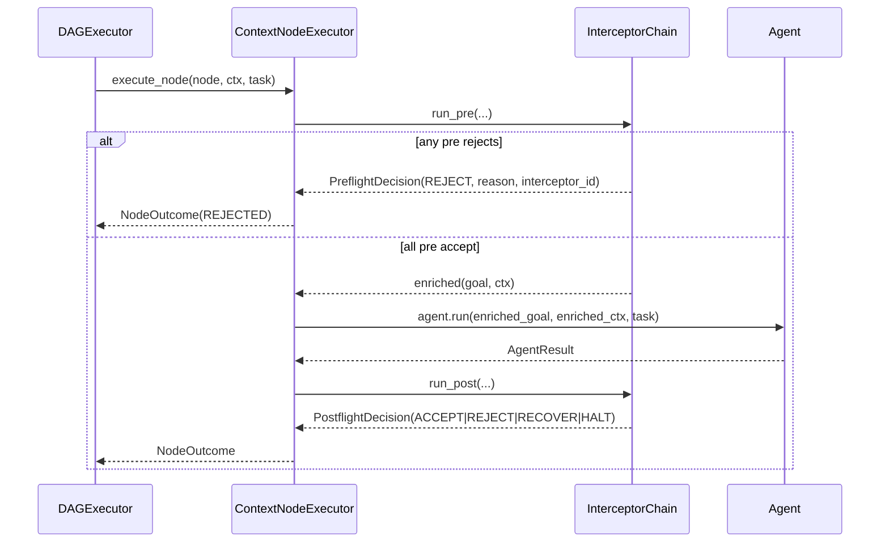

# SPEC-01: Node Interceptor Pipeline

> The keystone seam. Wraps every node's `agent.run` with an ordered pre-flight
> and post-flight middleware chain. Six of the eight Context Brain pillars
> compose on this one mechanism.

## 1. Context

Today `ContextNodeExecutor.execute_node()` resolves the agent, builds the goal,
and calls `agent.run`. Cross-cutting concerns (legitimacy, blueprint resolution,
on-demand pull, task awareness, citation enforcement, online-eval, goal-completion,
audit) are scattered or absent.

This spec defines a **single ordered middleware chain** running around every
node execution. Interceptors are composable, replay-safe, and observable.
Subsystems (SPEC-02..06) plug in by providing one or more interceptors. The
chain order is part of the contract — set in SPEC-00 §3 Invariant 9.



## 2. Interface Contract (MDE)

Common types (`Goal`, `AgentResult`, `DAGNode`, `TokenBudget`, `Citation`,
`CiteableChunk`, `ChainProfile`, IDs) live in **SPEC-00 §2**; this spec
references them.

```python
from typing import Protocol, runtime_checkable
from dataclasses import dataclass, field
from abc import ABC
from enum import Enum

class InterceptorPhase(Enum):
    PRE = "pre"
    POST = "post"
    BOTH = "both"

class PreflightKind(Enum):
    ACCEPT = "accept"
    REJECT = "reject"

class PostflightKind(Enum):
    ACCEPT  = "accept"
    REJECT  = "reject"
    RECOVER = "recover"
    HALT    = "halt"

class HaltScope(Enum):
    DAG  = "dag"
    TASK = "task"

class ChainContractError(RuntimeError):
    """Raised when an interceptor violates a chain-phase contract — e.g. a
    POST interceptor attempts to re-issue agent.run, or a PRE interceptor
    mutates AgentResult. The chain catches it and converts to REJECT
    (reason=\"<id>:exception:ChainContractError\")."""

class RecoveryStrategy(Enum):
    RETRY_WITH_HINTS       = "retry_with_hints"
    REROUTE_TO_AGENT       = "reroute_to_agent"
    INVOKE_META_ARCHITECT  = "invoke_meta_architect"   # SPEC-06
    SKIP_NODE              = "skip_node"

@dataclass(frozen=True, slots=True)
class RecoveryHint:
    """Carried in goal.metadata['remediation'] when re-dispatching."""
    code: str                         # "ungrounded_claim", "schema_failed", ...
    detail: str                       # human-readable
    suggested_action: str             # "cite source X", "re-pull KG entity Y"

@dataclass(frozen=True, slots=True)
class PreflightDecision:
    kind: PreflightKind
    interceptor_id: str
    correlation_id: CorrelationID
    enriched_goal: Goal | None = None
    enriched_context: Context | None = None
    reason: str | None = None
    # Semantics: when ACCEPT, enriched_* of None means "use prior value unchanged".
    #            Successive interceptors see the cumulative enrichment.

@dataclass(frozen=True, slots=True)
class PostflightDecision:
    kind: PostflightKind
    interceptor_id: str
    correlation_id: CorrelationID
    reason: str | None = None
    recovery_strategy: RecoveryStrategy | None = None   # required when kind == RECOVER
    recovery_hints: tuple[RecoveryHint, ...] = ()
    halt_scope: HaltScope | None = None                 # required when kind == HALT
    derived_unverified_claims: tuple[Claim, ...] = ()   # see "Executor merge semantics" below
```

#### Executor merge semantics for derived fields

`PostflightDecision.derived_unverified_claims` (Claim type defined in SPEC-00 §2)
is set by `CiteOrFailInterceptor` when `node.grounding == BEST_EFFORT` and
ungrounded claims appear. Its lifecycle:

1. The interceptor returns ACCEPT with this tuple populated (it does not
   mutate the agent's `AgentResult` — Inv 6 forbids in-place mutation).
2. The Executor builds a NEW `AgentResult` via `dataclasses.replace`, merging
   `derived_unverified_claims` into `result.unverified_claims`.
3. The merged result becomes the canonical `NodeOutcome.result`.
4. Per SPEC-05 Inv 14, these claims are NOT promoted into downstream
   `ctx.surfaced_sources` — they have no Citation and surface only as
   user-facing `[unverified]` copy.

### NodeInterceptor — abstract base, not bare Protocol

A Protocol forces every implementer to define both `pre()` and `post()`. We
use an abstract base with default ACCEPT methods so implementers override only
what they need. The `ABC` base is load-bearing for two reasons even without
`@abstractmethod` on `pre`/`post`: (1) `__init_subclass__` uses cooperative
`super().__init_subclass__(**kwargs)` and ABC integrates cleanly with that
chain; (2) `isinstance(x, NodeInterceptor)` is the registration check used
by the chain assembler. The required-attribute enforcement (Inv 15) lives in
`__init_subclass__` rather than via `@abstractmethod` because it covers
class-level `ClassVar`s, not methods.

```python
from typing import ClassVar

class NodeInterceptor(ABC):
    interceptor_id: ClassVar[str]       # required class attribute on every subclass
    phase: ClassVar[InterceptorPhase]   # required class attribute on every subclass
    display_name: ClassVar[str]         # required, ≤30 chars, human-readable; per Inv 15

    def __init__(self) -> None:
        """Block direct instantiation of the abstract base. ABC alone does not
        prevent instantiation when no method is decorated @abstractmethod;
        pre()/post() carry default ACCEPT bodies and cannot be abstract. This
        guard short-circuits `NodeInterceptor()` so the AttributeError on
        self.interceptor_id never surfaces from the default methods."""
        if type(self) is NodeInterceptor:
            raise TypeError("NodeInterceptor is abstract; subclass and assign "
                            "interceptor_id/phase/display_name")

    def __init_subclass__(cls, **kwargs: object) -> None:
        """Runtime guard: subclasses without interceptor_id/phase/display_name fail
        at class creation rather than at first dispatch. Uses cls.__dict__ rather
        than getattr so annotation-only declarations (no value) are caught — pure
        annotations populate __annotations__ but not __dict__, so an unassigned
        ClassVar would otherwise pass hasattr() and AttributeError at first use.
        """
        super().__init_subclass__(**kwargs)
        for attr in ("interceptor_id", "phase", "display_name"):
            value = cls.__dict__.get(attr)
            if value is None:
                raise TypeError(f"{cls.__name__} must assign a value to {attr!r}")
        display_name = cls.__dict__["display_name"]
        if not isinstance(display_name, str) or len(display_name) > 30:
            raise TypeError(f"{cls.__name__}.display_name must be a str ≤30 chars")

    async def pre(self, *, node: DAGNode, goal: Goal, ctx: Context,
                  task: TaskContext, services: RuntimeServices) -> PreflightDecision:
        """Default no-op ACCEPT. Override when phase in {PRE, BOTH}."""
        return PreflightDecision(kind=PreflightKind.ACCEPT,
                                  interceptor_id=self.interceptor_id,
                                  correlation_id=ctx.correlation_id)

    async def post(self, *, node: DAGNode, dag: DAG, result: AgentResult, ctx: Context,
                   task: TaskContext, services: RuntimeServices) -> PostflightDecision:
        """Default no-op ACCEPT. Override when phase in {POST, BOTH}.
        `dag` is provided so post-flight interceptors (e.g., tool_verify) can
        inspect downstream edges without reaching into shared services state.
        """
        return PostflightDecision(kind=PostflightKind.ACCEPT,
                                   interceptor_id=self.interceptor_id,
                                   correlation_id=ctx.correlation_id)
```

### InterceptorChain

```python
@dataclass(frozen=True, slots=True)
class ChainConfig:
    """Per-call chain configuration. The chain instance itself is profile-agnostic;
    the profile is passed at run_pre/run_post so a single chain serves both
    DEFAULT (parent) and RECOVERY (sub-DAG) calls without mutating services.
    """
    pre_order: tuple[str, ...]                     # interceptor_ids in order; SHALL equal SPEC-00 *_PRE_ORDER for the active profile (the executor builds ChainConfig per-call FROM the resolved chain_profile, so pre_order/post_order are derived, not user-set)
    post_order: tuple[str, ...]                    # SHALL equal SPEC-00 *_POST_ORDER for the active profile
    per_interceptor_timeout_ms: int = 5_000
    chain_timeout_ms: int = 30_000
    # Precedence vs services.token_budget.timeout_ms: the smaller of
    # (chain_timeout_ms, services.token_budget.timeout_ms) wins for the chain
    # bound; per_interceptor_timeout_ms always applies to a single interceptor.

class InterceptorChain:
    """Sequential, reentrant. No mutable state on the chain or services."""
    def __init__(self, interceptors: tuple[NodeInterceptor, ...]) -> None: ...

    async def run_pre(self, *, node: DAGNode, dag: DAG, goal: Goal, ctx: Context,
                      task: TaskContext, services: RuntimeServices,
                      chain_profile: ChainProfile, config: ChainConfig
                      ) -> tuple[PreflightDecision, ...]:
        """Returns the full sequence; first REJECT short-circuits remaining
        guardians except `audit`, which SHALL still emit its PRE entry so
        SPEC-05 audit-completeness invariants hold for pre-rejected nodes."""

    async def run_post(self, *, node: DAGNode, dag: DAG, result: AgentResult,
                       ctx: Context, task: TaskContext, services: RuntimeServices,
                       chain_profile: ChainProfile, config: ChainConfig
                       ) -> tuple[PostflightDecision, ...]:
        """Returns the full sequence; first REJECT/RECOVER/HALT short-circuits
        remaining guardians except `audit`."""

# Outcome propagated to DAGExecutor
class NodeStatus(Enum):
    SUCCESS   = "success"
    REJECTED  = "rejected"
    RECOVERED = "recovered"
    HALTED    = "halted"
    FAILED    = "failed"

@dataclass(frozen=True, slots=True)
class NodeOutcome:
    node_id: NodeID
    status: NodeStatus
    result: AgentResult | None
    pre_decisions: tuple[PreflightDecision, ...]
    post_decisions: tuple[PostflightDecision, ...]
```

`ContextNodeExecutor.execute_node()` becomes a thin orchestrator: build the
`InterceptorChain` from `RuntimeServices.interceptors` filtered by
`services.chain_profile`, run pre, dispatch agent if accepted, run post, return
`NodeOutcome`.

## 3. Invariants (DbC)

1. `WHEN any PreflightDecision in the sequence has kind == REJECT, THE Executor SHALL NOT invoke the agent.`
2. `WHEN any PostflightDecision has kind == HALT, THE DAGExecutor SHALL stop dispatching new nodes.`
3. `THE chain SHALL run interceptors in the order specified by ChainConfig; the order is observable on every NodeOutcome.`
4. `Every PreflightDecision and PostflightDecision SHALL carry interceptor_id and correlation_id.`
5. `WHEN an interceptor raises an exception, THE chain SHALL convert it to REJECT(reason="<id>:exception:<class>") and emit an audit entry; subsequent NON-AUDIT interceptors in the same phase SHALL NOT run, BUT THE audit interceptor SHALL still emit its phase entry.`
6. `AgentResult immutability + executor-side construction. Four sub-rules, each independently testable:
   - 6a. WHILE in PRE phase, an interceptor SHALL NOT touch AgentResult (it does not exist yet).
   - 6b. WHILE in POST phase, an interceptor SHALL NOT re-issue the agent.
   - 6c. WHILE in POST phase, an interceptor SHALL NOT mutate the existing AgentResult in place.
   - 6d. WHEN a PostflightDecision.kind == ACCEPT carries derived fields (e.g. derived_unverified_claims under GroundingPolicy.BEST_EFFORT per SPEC-05 §2), THE Executor SHALL construct a NEW AgentResult via dataclasses.replace merging those fields with the agent-emitted result, and persist that as NodeOutcome.result; the agent-emitted AgentResult SHALL remain unchanged in audit storage.`
7. `IF an interceptor declares phase=PRE, THEN only its pre() is invoked. IF phase=POST, only post(). IF phase=BOTH, both.`
8. `THE chain SHALL be deterministic: same inputs (including services_snapshot + RNG seed) produce the same decision sequence (replay-safe). LLM-judge interceptors satisfy this via cassettes per SPEC-00 Property 6.`
9. `An interceptor SHALL NOT depend on a later interceptor's output (no forward references).`
10. `RECOVER decisions SHALL specify a RecoveryStrategy; recovery_hints SHALL be passed to the re-dispatched agent via goal.metadata["remediation"].`
11. `WHEN per_interceptor_timeout_ms is exceeded for any interceptor, THE chain SHALL convert it to REJECT(reason="<id>:timeout") and emit an audit entry.`
12. `THE InterceptorChain SHALL be reentrant: concurrent invocations on the same chain instance SHALL NOT share mutable state.`
13. `Successive PRE interceptors SHALL observe the cumulative enrichment from earlier interceptors (ctx and goal carry forward).`
14. `Empty chain (no interceptors registered) is a valid configuration; run_pre and run_post SHALL each return an empty tuple and the executor SHALL treat the absence of REJECT as ACCEPT.`
15. `Each NodeInterceptor subclass SHALL declare display_name: ClassVar[str] (≤30 chars, human-readable, e.g. "citation check"); InterceptorChain.display_name_for(id) -> str is a pure lookup over registered interceptors (unknown IDs raise KeyError, no fallback to id). User-copy renderers (SPEC-05 §10 "<id>:timeout"/"<id>:exception") SHALL resolve display_name via this surface; interceptor_id SHALL NOT leak verbatim into user-facing copy.`
16. `Recovery-target availability downgrade: WHEN a PostflightDecision is RECOVER and the RuntimeServices field referenced by its recovery_strategy is None, THE chain SHALL convert the decision to REJECT(reason="<strategy>_unavailable") before returning, and SHALL NOT invoke the absent service. Canonical mapping: RecoveryStrategy.INVOKE_META_ARCHITECT → services.meta_dispatcher → reason "meta_unavailable" (SPEC-06 §3 Inv 8). Strategies whose target is always present in RuntimeServices (RETRY_WITH_HINTS, REROUTE_TO_AGENT, SKIP_NODE) are no-ops under this rule. The downgrade emits one AuditEntry with the converted REJECT and the original recovery_strategy in metadata for traceability.`

## 4. Acceptance Criteria (BDD)

```gherkin
Feature: Interceptor pipeline

  Scenario: Pre-flight rejection skips the agent
    Given an interceptor that returns REJECT in pre()
    When the node executes
    Then the agent's run() is never called
    And NodeOutcome.status == REJECTED
    And the decision carries interceptor_id and correlation_id

  Scenario: Post-flight HALT stops the DAG
    Given a node whose post-flight returns HALT(scope=DAG)
    When the chain finishes
    Then the DAGExecutor stops dispatching new nodes
    And the task state transitions to HALTED

  Scenario: Recover strategy re-dispatches with hints
    Given a post-flight returning RECOVER(RETRY_WITH_HINTS, hints=[h1])
    When the node is re-dispatched
    Then the agent receives goal.metadata["remediation"] containing h1.code and h1.suggested_action
    And the second attempt produces a separate NodeOutcome

  Scenario: Interceptor exception is contained
    Given an interceptor that raises a RuntimeError
    When the chain runs
    Then the failure is converted to REJECT with reason "<id>:exception:RuntimeError"
    And subsequent interceptors are not invoked
    And the audit log records the stack trace

  Scenario: Interceptor timeout is contained
    Given an interceptor that exceeds per_interceptor_timeout_ms
    When the chain runs
    Then the failure is converted to REJECT with reason "<id>:timeout"
    And subsequent interceptors are not invoked

  Scenario: Default DEFAULT order is observed
    Given ChainProfile.DEFAULT and the canonical pre_order ("legitimacy","pull","blueprint","task_inject","audit")
    When pre() runs end-to-end (all ACCEPT)
    Then decisions appear in that exact order
    And audit emits its PRE entry last

  Scenario: Phase filtering — PRE-only interceptor
    Given an interceptor with phase=PRE and only pre() overridden
    When the chain runs
    Then its pre() is called and its post() returns the default ACCEPT

  Scenario: Replay determinism (non-LLM)
    Given the same node, ctx, task, services snapshot, and RNG seed
    When the chain is run twice
    Then the decision sequence is byte-identical

  Scenario: Empty chain is a no-op
    Given an InterceptorChain with no interceptors
    When run_pre and run_post are invoked
    Then both return ()
    And the executor treats the absence of REJECT as ACCEPT and dispatches the agent

  Scenario: Cumulative enrichment carried forward
    Given two PRE interceptors A and B
    And A returns enriched_context with key "x"=1
    And B returns enriched_context with key "y"=2
    When the agent is dispatched
    Then the agent's context contains both x=1 and y=2

  Scenario: POST interceptor cannot re-issue the agent
    Given a POST interceptor that attempts to invoke agent.run during post()
    When the chain runs
    Then the chain raises ChainContractError("post phase MAY NOT re-issue agent")
    And the failure is converted to REJECT with reason "<id>:exception:ChainContractError"
    And no second AgentResult is produced

  Scenario: Executor merges post-flight derived fields into NodeOutcome.result
    Given a POST interceptor whose ACCEPT decision carries derived field unverified_claims=(c1,)
    When the chain finishes
    Then NodeOutcome.result is a new AgentResult with unverified_claims=(c1,)
    And the agent-emitted AgentResult is unchanged in audit storage

  Scenario: Subclass missing display_name fails at class creation
    Given a NodeInterceptor subclass that declares interceptor_id and phase but not display_name
    When the class body is evaluated
    Then TypeError is raised with message containing "display_name"

  Scenario: Reentrant under concurrent dispatch
    Given an InterceptorChain instance shared by two concurrent execute_node calls
    When both run to completion
    Then neither call observes the other's PreflightDecision sequence
    And both produce correct independent NodeOutcomes
```

## 5. Out of Scope

- Per-tenant interceptor configuration (config layer, follow-on).
- Concrete interceptor implementations — owned by SPEC-02..06.
- Parallel interceptor execution within a phase — sequential by contract.
- Streaming results (deferred per SPEC-00 §5).

## 6. Dependencies

- `orchestration/context_node_executor.py` (refactor target)
- `orchestration/services.py` — add `interceptors`, `chain_profile`
- SPEC-00 §2 (Common Types — referenced, not redefined)
- `events/` — emit `node.preflight`, `node.postflight`
- `audit/` — exception/timeout containment writes audit entries

## 7. Correctness Properties

### Property 1: Order determinism
*For any* InterceptorChain `C` with ordered interceptors `(i1..in)`, `C.run_pre`
produces decisions in that order; `C.run_post` likewise — independent of
interceptor internals.

**Validates: §3 Invariants 3, 8 / §4 "Default DEFAULT order is observed", "Replay determinism"**

### Property 2: Agent isolation under reject
*For any* node where any pre-interceptor returns REJECT, `agent.run` is not
called and no AgentResult is produced.

**Validates: §3 Invariant 1 / §4 "Pre-flight rejection skips the agent"**

### Property 3: Halt monotonicity
*Once* a PostflightDecision with HALT is emitted, subsequent calls to
`DAGExecutor.dispatch_next()` SHALL return None until the task transitions out
of HALTED.

**Validates: §3 Invariant 2 / §4 "Post-flight HALT stops the DAG"**

### Property 4: Failure containment
*For any* interceptor raising an exception or exceeding its timeout, the
chain's external observable result is REJECT — no exception escapes
`run_pre`/`run_post`, no chain hangs past `chain_timeout_ms`.

**Validates: §3 Invariants 5, 11 / §4 "Interceptor exception is contained", "Interceptor timeout is contained"**

### Property 5: Reentrancy
*For any* shared InterceptorChain instance under concurrent invocation, no
PreflightDecision or PostflightDecision sequence from one call appears in
another's NodeOutcome.

**Validates: §3 Invariant 12 / §4 "Reentrant under concurrent dispatch"**

## 8. Eval Criteria

| Evaluator | Node | Mode | Threshold | Method |
|---|---|---|---|---|
| ChainOrderEvaluator | every node | OBSERVE | order matches ChainConfig 100% | deterministic |
| ExceptionContainmentEvaluator | every node | GATE | escaped exceptions == 0 | deterministic |
| TimeoutContainmentEvaluator | every node | GATE | hangs past chain_timeout_ms == 0 | deterministic |

## 9. Observability Contract

- **Span**: `gen_ai.node.preflight` — `node.id`, `chain_profile`, `interceptor.count`, child span per interceptor with `interceptor.id`, `decision.kind`, `latency_ms`
- **Span**: `gen_ai.node.postflight` — `decision.kind`, `recovery.strategy`, `halt.scope`
- **Log events**: `interceptor.accepted`, `interceptor.rejected`, `interceptor.recovered`, `interceptor.halted`, `interceptor.exception`, `interceptor.timeout`
- **Metrics** (per SPEC-00 §9 — `interceptor_id` is bounded ≤16 by the canonical chain orders, safe as label): `cemaf_node_interceptor_decisions_total{interceptor_id,decision,chain_profile}`, `cemaf_node_interceptor_duration_seconds{interceptor_id,phase}` (histogram), `cemaf_chain_duration_seconds{phase,chain_profile}` (histogram), `cemaf_node_execute_duration_seconds{chain_profile,node_type,outcome}` (histogram — labels match SPEC-00 §9 RED block, redeclared here for child-spec readability per SPEC-00 §9 inheritance rule), `cemaf_node_execute_errors_total{chain_profile,node_type,outcome}` (same labels as SPEC-00 §9)
