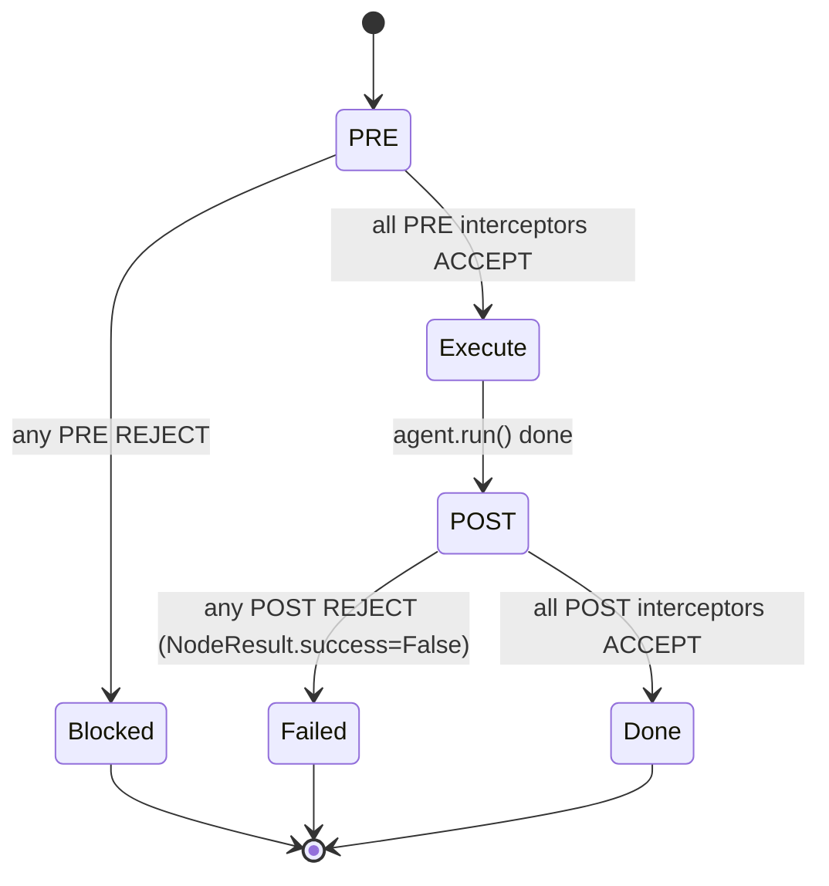

# SPEC-01a: Interceptor Spine

> The full SPEC-01 interceptor pipeline depends on SPEC-00 common types
> (`Context.surfaced_sources`, `AgentResult.cited_evidence_refs`, `ChainProfile`,
> `RecoveryStrategy`) that are not yet in the live code. This spec lands a
> **faithful minimal slice**: the PRE→execute→POST chain every AGENT node passes
> through, additive and flag-gated, plus the first real interceptor — a GATE
> evaluator that *blocks* downstream. It turns "a feature you opt into" into "a
> station every node passes through" — the move that makes CEMAF an engine, not
> a parts-bin. The richer SPEC-01 (recovery routing, cite-or-fail, guardian
> mesh) layers onto this spine later without re-architecting.

**Status: Draft.** Implementation target: `cemaf/interceptors/` (new module),
`cemaf/orchestration/context_node_executor.py`, `cemaf/orchestration/services.py`,
`cemaf/bootstrap.py`.

## Contents

- [1. Context](#1-context)
- [2. Interface Contract (MDE)](#2-interface-contract-mde)
- [3. Invariants (DbC)](#3-invariants-dbc)
- [4. Acceptance Criteria (BDD)](#4-acceptance-criteria-bdd)
- [5. Out of Scope](#5-out-of-scope)
- [6. Dependencies](#6-dependencies)
- [7. Correctness Properties](#7-correctness-properties)
- [9. Observability Contract](#9-observability-contract)

## 1. Context

The composed-engine evidence (`tests/integration/test_composed_engine.py`)
documented the core gap: capabilities thread through the executor as bespoke
`if` branches (auction, council) or post-hoc EventBus subscribers (online-eval,
harvest), not as a uniform chain. The standing audit P0 follows directly:
**GATE evaluators only publish a `QUALITY_ALERT` event — nothing blocks the next
node**; `EvalMode.GATE == EvalMode.OBSERVE` in practice.

This spec introduces one ordered chain per AGENT node:



- **PRE** interceptors run before `agent.run()`; they may enrich the context
  (return an updated `AgentContext`) or REJECT (short-circuit the node to a
  failed `NodeResult` before the agent runs).
- **POST** interceptors run after `agent.run()`; they inspect the `NodeResult`
  and may REJECT it (flip `success` to False with a reason). A REJECTed node
  blocks `ON_SUCCESS`/`JSON_RULE` downstream edges via the *existing* executor
  edge logic — no new gating mechanism.

An **empty pipeline is a no-op**: with no interceptors wired, `execute_node`
behaves exactly as today. This is the additive guarantee — zero behaviour change
for existing DAGs.

The first interceptor, `GateEvalInterceptor`, closes the P0: it runs bound
evaluators on the node output and REJECTs when a GATE evaluator fails, so the
gate genuinely blocks.

## 2. Interface Contract (MDE)

New module `cemaf/interceptors/`:

```python
from dataclasses import dataclass
from enum import StrEnum
from typing import Protocol, runtime_checkable

from cemaf.agents.base import AgentContext
from cemaf.core.types import JSON, NodeID
from cemaf.orchestration.dag import Node
from cemaf.orchestration.executor import NodeResult


class DecisionKind(StrEnum):
    ACCEPT = "accept"   # proceed (PRE: run agent / POST: keep result)
    REJECT = "reject"   # short-circuit (PRE: skip agent / POST: fail the node)


@dataclass(frozen=True, slots=True)
class PreDecision:
    kind: DecisionKind
    interceptor_id: str
    # On ACCEPT, an enriched context replaces the prior one for the next
    # interceptor + the agent. None = "use prior context unchanged".
    enriched_context: AgentContext | None = None
    reason: str | None = None        # required (non-empty) when REJECT


@dataclass(frozen=True, slots=True)
class PostDecision:
    kind: DecisionKind
    interceptor_id: str
    reason: str | None = None        # required (non-empty) when REJECT
    # Provenance the executor merges into NodeResult.metadata["interceptors"].
    metadata: JSON | None = None


@runtime_checkable
class NodeInterceptor(Protocol):
    """A station on the per-node chain. A given interceptor may implement PRE,
    POST, or both; the pipeline calls only the phase methods present."""

    @property
    def interceptor_id(self) -> str: ...

    async def pre(self, *, node: Node, context: AgentContext) -> PreDecision: ...

    async def post(
        self, *, node: Node, context: AgentContext, result: NodeResult
    ) -> PostDecision: ...


class InterceptorPipeline:
    """Ordered PRE/POST chain. Empty pipeline is a no-op (additive guarantee)."""

    def __init__(self, *, interceptors: tuple[NodeInterceptor, ...] = ()) -> None: ...

    async def run_pre(
        self, *, node: Node, context: AgentContext
    ) -> tuple[AgentContext, PreDecision | None]:
        """Run PRE chain. Returns (possibly-enriched context, first REJECT or None)."""
        ...

    async def run_post(
        self, *, node: Node, context: AgentContext, result: NodeResult
    ) -> tuple[NodeResult, PostDecision | None]:
        """Run POST chain. Returns (possibly-failed result, first REJECT or None)."""
        ...


def create_interceptor_pipeline(
    *, interceptors: tuple[NodeInterceptor, ...] = ()
) -> InterceptorPipeline:
    """Factory (BYO-X) — wired into RuntimeServices.interceptor_pipeline at bootstrap."""
    ...
```

First interceptor (`cemaf/interceptors/gate_eval.py`):

```python
from cemaf.evals.protocols import Evaluator

class GateEvalInterceptor:
    """POST interceptor: runs evaluators on the node output; REJECTs when any
    fails, flipping the NodeResult to success=False so downstream edges block.

    `node_pattern` is the node id this gate applies to, or "*" for all AGENT nodes.
    `threshold` is the minimum passing score; an evaluator result below it (or
    `passed=False`) → REJECT.
    """

    interceptor_id: str = "gate_eval"

    def __init__(
        self,
        *,
        evaluators: tuple[Evaluator, ...],
        node_pattern: str = "*",
        threshold: float = 0.5,
    ) -> None: ...

    async def post(self, *, node, context, result) -> PostDecision: ...
```

Executor + wiring:
- `ContextNodeExecutor.__init__` gains `interceptor_pipeline: InterceptorPipeline | None = None`.
- `execute_node`: after agent resolution + context build, run `run_pre`; if it
  REJECTs, return a failed `NodeResult` (agent never runs). After `agent.run()`,
  run `run_post`; adopt the (possibly-failed) result it returns.
- `RuntimeServices` gains `interceptor_pipeline: InterceptorPipeline | None = None`;
  `bootstrap.create_executor` threads it through.

## 3. Invariants (DbC)

1. **Empty = no-op**: a `None` or empty pipeline leaves `execute_node` behaviour
   byte-for-byte unchanged — no PRE/POST calls, identical `NodeResult`.
2. **PRE order + short-circuit**: PRE interceptors run in registration order; the
   first REJECT short-circuits — no further PRE runs, the agent does NOT run, and
   the node returns `success=False` with the REJECT reason.
3. **PRE enrichment is cumulative**: an ACCEPT with `enriched_context` replaces
   the context passed to subsequent interceptors and to the agent; ACCEPT with
   `None` leaves it unchanged.
4. **POST runs only after a successful agent run**: if the agent itself failed
   (or PRE rejected), POST interceptors do NOT run.
5. **POST REJECT fails the node**: the first POST REJECT yields a NodeResult with
   `success=False` and the REJECT reason; the agent's original output is preserved
   on `metadata["interceptors"]["rejected_output"]` for provenance.
6. **REJECT requires a reason**: a `PreDecision`/`PostDecision` with
   `kind=REJECT` and empty/None `reason` is a construction error.
7. **No in-place mutation**: interceptors never mutate the passed `NodeResult`
   or `AgentContext`; the executor builds new objects (`dataclasses.replace` /
   fresh `AgentContext`) from interceptor decisions.
8. **Downstream gating reuses existing edges**: a POST-rejected node blocks
   `ON_SUCCESS` and `JSON_RULE` edges through the unchanged
   `_edge_satisfied`/`_should_execute_node` logic — no new gating path.
9. **GATE blocks**: `GateEvalInterceptor` matching a node whose output scores
   below `threshold` (or `passed=False`) returns REJECT → the node fails → an
   `ON_SUCCESS` downstream node does not execute.

EARS form (selected):

```
WHEN no interceptor pipeline is wired, THE System SHALL execute the node exactly as before.
WHEN a PRE interceptor returns REJECT, THE System SHALL NOT run the agent and SHALL return a failed NodeResult.
WHEN a POST interceptor returns REJECT, THE System SHALL set NodeResult.success=False with the reason.
WHERE a GateEvalInterceptor's evaluator scores below threshold, THE System SHALL REJECT the node.
IF a decision is REJECT with no reason, THEN THE System SHALL raise a construction error.
```

Budget: 9 invariants.

## 4. Acceptance Criteria (BDD)

```gherkin
Feature: Interceptor spine

  Scenario: Empty pipeline is a no-op
    Given an executor with no interceptor pipeline
    When an AGENT node runs
    Then the result is identical to running without the pipeline feature

  Scenario: PRE enrichment reaches the agent
    Given a PRE interceptor that adds "hint" to the context global_memory
    When the node runs
    Then the agent observes "hint" in its context

  Scenario: PRE reject short-circuits the agent
    Given a PRE interceptor that REJECTs with reason "blocked"
    When the node runs
    Then the agent never runs
    And the NodeResult is success=False with error containing "blocked"

  Scenario: POST reject fails an otherwise-successful node
    Given an agent that succeeds
    And a POST interceptor that REJECTs with reason "bad output"
    When the node runs
    Then NodeResult.success is False
    And the original output is preserved in metadata["interceptors"]

  Scenario: POST does not run when the agent failed
    Given an agent that returns failure
    And a POST interceptor
    When the node runs
    Then the POST interceptor is not invoked

  Scenario: REJECT without a reason is rejected at construction
    When a PostDecision is built with kind=REJECT and no reason
    Then a ValueError is raised

  Scenario: GATE eval blocks downstream
    Given a 2-node DAG (gen → use) with an ON_SUCCESS edge
    And a GateEvalInterceptor on "gen" requiring length >= 100
    And the gen agent emits a 10-char output
    When the DAG runs
    Then gen fails the gate
    And the "use" node never executes

  Scenario: GATE eval passes lets downstream run
    Given the same DAG but gen emits a 200-char output
    When the DAG runs
    Then gen passes the gate
    And the "use" node executes
```

8 scenarios.

## 5. Out of Scope

- **RECOVER / HALT decisions** and recovery routing (SPEC-01 full / SPEC-06).
- **ChainProfile (DEFAULT/RECOVERY)** — single implicit chain here.
- **Cite-or-fail, guardian mesh, Pull/Blueprint interceptors** (SPEC-02/03/05) —
  they implement this protocol later; not shipped here.
- **SPEC-00 type-foundation rewrite** (`surfaced_sources`,
  `cited_evidence_refs`) — this slice deliberately avoids it.
- **TOOL/SKILL nodes** — spine applies to AGENT nodes only for now.
- **Migrating existing branches** (auction/council) onto the spine — additive
  first; migration is a later PR once the spine is proven.

## 6. Dependencies

- `cemaf.orchestration.dag.Node`, `executor.NodeResult`.
- `cemaf.agents.base.AgentContext`.
- `cemaf.evals.protocols.Evaluator` / `EvalResult` (for `GateEvalInterceptor`).
- `cemaf.orchestration.services.RuntimeServices`, `cemaf.bootstrap`.

> §8 Eval Criteria omitted — the spine is deterministic control flow; §3
> invariants + §7 properties cover it. The GATE interceptor *runs* evaluators
> but does not itself need an LLM-judge gate.

## 7. Correctness Properties

### Property 1: Additive transparency

*For any* DAG, running it with a `None` or empty `InterceptorPipeline` produces
the same `NodeResult`s (success, output, error) as running it without the
interceptor feature at all.

**Validates: §3 Invariant 1; §4 Scenario "Empty pipeline is a no-op"**

### Property 2: Reject ⇒ block

*For any* node `N` with a downstream node `D` reachable only by an `ON_SUCCESS`
edge: if any interceptor REJECTs `N`, then `D` does not execute.

**Validates: §3 Invariants 5, 8, 9; §4 Scenario "GATE eval blocks downstream"**

### Property 3: No mutation

*For any* interceptor decision, the `NodeResult` and `AgentContext` instances
passed in are not mutated; changes appear only on new objects the executor
constructs.

**Validates: §3 Invariant 7**

## 9. Observability Contract

- **Provenance**: each POST REJECT writes
  `NodeResult.metadata["interceptors"] = {"rejected_by": interceptor_id,
  "reason": ..., "rejected_output": <original>}`. ACCEPT POST decisions with
  metadata merge under `metadata["interceptors"][interceptor_id]`.
- **Log events**:
  - `interceptor.pre.reject` — `node_id`, `interceptor_id`, `reason`
  - `interceptor.post.reject` — `node_id`, `interceptor_id`, `reason`
  - `interceptor.gate.failed` — `node_id`, `score`, `threshold`
- **Metrics** (Prometheus, optional):
  - `cemaf_interceptor_rejects_total{phase, interceptor_id}` — counter
