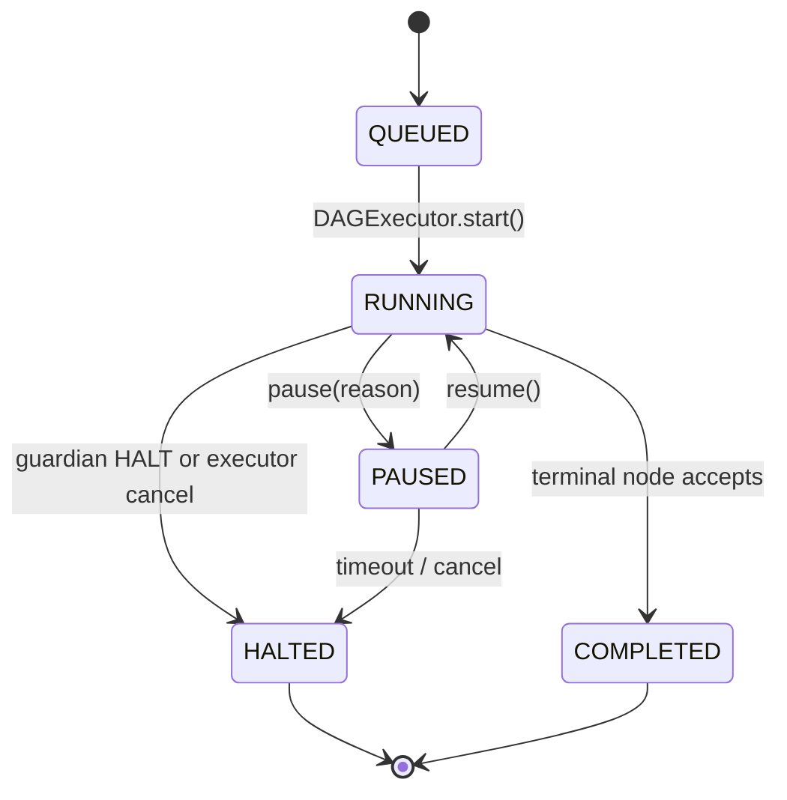

# SPEC-04: Long-Horizon Task State Machine

> Promotes a multi-step DAG run into a **Task** with a persistent state machine,
> step-aware progress, retry accounting, and resumable execution. Every node
> receives a `TaskContext` that names its position, prior decisions, and the
> retry ledger it inherits.
>
> This spec covers the **state-machine and lifecycle rules**. The persistence
> primitives (atomic metadata increment, child-task spawn, canonical projection
> migration, lease semantics, multi-pod safety) live in SPEC-04b — TaskRepository
> Contract.

## 1. Context

DAGs run today; tasks do not. There is no first-class concept of "this is step 3
of 10 in goal G", no progress, no pause/resume across processes, no inheritance
of prior decisions, and no retry counter that lets SPEC-05 enforce
"recover-once-then-halt" deterministically.

This spec adds a `Task` aggregate with a strict state machine, persists it via
`persistence/`, and adds a `TaskInjectInterceptor` (PRE phase, position 4 —
last in DEFAULT_PRE_ORDER) that populates each node's `TaskContext`.



`RUNNING` is the running state — there is no `RESUMED` state; `resume()` is a
transition (PAUSED → RUNNING), not a state. SPEC-00 §2 forwards `TaskState`
here as the single source of truth.

## 2. Interface Contract (MDE)

Common types in SPEC-00 §2 (`TaskID`, `NodeID`, `TokenBudget`, `Citation`).
The `TaskRepository` Protocol surface (create, get, transition, snapshot,
restore, acquire, release, increment_retry, decrement_retry,
atomic_fetch_add_metadata, spawn_child_task, health) is defined in
**SPEC-04b §2**. This spec consumes it; it does not redefine it.

```python
from typing import Protocol, runtime_checkable
from dataclasses import dataclass, field
from datetime import datetime
from enum import Enum

class TaskState(Enum):
    QUEUED    = "queued"
    RUNNING   = "running"
    PAUSED    = "paused"
    COMPLETED = "completed"
    HALTED    = "halted"

class DecisionKind(Enum):
    """Outcome class of a post-flight decision — used by Inv 12 windowing
    and SPEC-06 Inv 16 projection to retain HALT/REJECT entries preferentially."""
    ACCEPT  = "accept"
    REJECT  = "reject"
    RECOVER = "recover"
    HALT    = "halt"

@dataclass(frozen=True, slots=True)
class Decision:
    """A material choice or output from a prior step worth carrying forward."""
    node_id: NodeID
    kind: DecisionKind                             # mirrors PostflightDecision.kind on the attempt that produced this entry; populated by the executor when appending to Task.prior_decisions
    summary: str                                   # one-liner
    cited_evidence_refs: tuple[Citation, ...]
    at: datetime

@dataclass(frozen=True, slots=True)
class TaskContext:
    task_id: TaskID
    goal: Goal
    step_index: int                                # 0-based, into the executed step sequence
    step_count: int
    prior_decisions: tuple[Decision, ...]
    budget_remaining: TokenBudget                  # required, no default
    started_at: datetime                           # required, no default
    correlation_id: CorrelationID                  # required, no default
    retry_ledger: tuple[tuple[NodeID, int], ...] = ()   # SPEC-05 reads, executor rebuilds via dataclasses.replace; tuple-of-pairs preserves frozen+slots invariants while supporting increment-only updates (Inv 7)
    state: TaskState = TaskState.RUNNING
    meta_budget_remaining: "MetaInvocationBudget | None" = None  # set only inside recovery sub-DAGs (SPEC-06)

@dataclass(frozen=True, slots=True)
class Task:
    """The aggregate persisted by TaskRepository (SPEC-04b §2)."""
    task_id: TaskID
    goal: Goal
    dag_id: DAGID
    state: TaskState
    step_index: int
    step_count: int
    prior_decisions: tuple[Decision, ...]
    retry_ledger: tuple[tuple[NodeID, int], ...]
    budget_remaining: TokenBudget
    correlation_id: CorrelationID
    created_at: datetime
    updated_at: datetime

class TaskInjectInterceptor(NodeInterceptor):
    """PRE phase, position 4 — runs LAST in DEFAULT_PRE_ORDER."""
    interceptor_id = "task_inject"
    phase = InterceptorPhase.PRE
```

`DAGExecutor.run(dag, *, task_id=None)` either creates a new Task (via
`TaskRepository.create`) or resumes from `task_id` (via `TaskRepository.get` +
`acquire`). Bootstrap composition: `RuntimeServices.task_repository` (the
Protocol surface lives in SPEC-04b §2).

## 3. Invariants (DbC)

1. `Task state transitions SHALL follow this set: QUEUED→RUNNING, RUNNING→PAUSED, PAUSED→RUNNING, RUNNING→COMPLETED, RUNNING→HALTED, PAUSED→HALTED (timeout/cancel). All other transitions are forbidden.`
2. `WHEN a Task is HALTED or COMPLETED, transition() SHALL raise InvalidTransitionError on any further state change.`
3. `Every TaskContext.step_index SHALL satisfy 0 ≤ step_index < step_count.`
4. `TaskContext.prior_decisions SHALL be append-only and ordered by node execution sequence.`
5. `TaskContext.budget_remaining SHALL be monotonically non-increasing across the parent task's steps. Sub-DAG (recovery) consumption SHALL NOT decrement it (SPEC-06 metering boundary).`
6. `Every node SHALL receive a TaskContext via TaskInjectInterceptor — even single-step DAGs (step_count=1).`
7. `THE retry_ledger SHALL be append/increment-only; counters never decrement. Storage is tuple[tuple[NodeID, int], ...]; read access is via a helper get_retry(ledger, node_id) -> int (default 0); writes happen by rebuilding the Task aggregate via dataclasses.replace, not in-place mutation.`
8. `WHEN any guardian (SPEC-05) emits HALT, THE Repository SHALL transition the Task to HALTED before the next dispatch.`
9. `THE executor SHALL call TaskRepository.increment_retry(task_id, node_id) AFTER the post-flight chain emits RECOVER on attempt N AND BEFORE re-dispatching attempt N+1. Semantics: on attempt N (N starting at 1), guardians observe retry_ledger value (N-1). Combined with DAGNode.retry_budget, "budget=K" means up to K recoveries → up to (K+1) total attempts. Worked example with retry_budget=2: attempt 1 sees ledger=0 (RECOVER, ledger→1), attempt 2 sees ledger=1 (RECOVER, ledger→2), attempt 3 sees ledger=2 (HALT — 2 ≥ 2). With retry_budget=0: attempt 1 sees ledger=0 (HALT — 0 ≥ 0). SPEC-05 Inv 15 reads (ledger < retry_budget) → RECOVER, (ledger ≥ retry_budget) → HALT, which is the same boundary inverted.`
10. `WHEN a PostflightDecision is RECOVER(INVOKE_META_ARCHITECT), THE Executor SHALL call increment_retry(task_id, node_id) BEFORE invoking MetaDispatcher.dispatch (SPEC-06). Combined with Inv 9, the meta sub-DAG observes the incremented attempt counter via task.retry_ledger from its first node, so nested recoveries see correct attempt accounting.`
11. `task.correlation_id (per-task, assigned at create()) and ctx.correlation_id (per-attempt, assigned by DAGExecutor at node dispatch — SPEC-00 §2) are intentionally distinct scopes. Audit and recovery references resolve as follows: SPEC-05 §3 attempt-level audit SHALL use ctx.correlation_id; SPEC-06 §3 Inv 6 parent_correlation_id SHALL be the parent attempt's ctx.correlation_id (NOT task.correlation_id). On resume across PAUSED→RUNNING, task.correlation_id persists; new attempts mint fresh ctx.correlation_id. Every AuditEntry SHALL carry both fields explicitly so query paths over either are deterministic.`
12. `TaskContext.prior_decisions injected by TaskInjectInterceptor SHALL be windowed to the most-recent PRIOR_DECISIONS_INJECT_WINDOW (default 32) entries before injection — older entries remain in Task.prior_decisions for audit/replay but are NOT shipped to per-node chains. Window retention priority by Decision.kind: HALT > REJECT > RECOVER > ACCEPT (within the window cap; entries outside the window are kept only when retention upgrades them). Within the same Decision.kind, retention prefers Decision.at desc; ties broken by node_id ASC. This makes per-node injection deterministic for replay (SPEC-00 Property 6). Persistent storage (Task aggregate) is unbounded; only the per-node injection is windowed.`
13. `TaskContext.retry_ledger injected by TaskInjectInterceptor SHALL be filtered to entries where get_retry > 0 — nodes never retried do not occupy injection slots. Persistent Task.retry_ledger is unfiltered for audit determinism.`

## 4. Acceptance Criteria (BDD)

```gherkin
Feature: Long-horizon task state machine

  Scenario: Step awareness propagates
    Given a 5-node DAG started as a new Task
    When the node at index 2 executes
    Then its TaskContext.step_index == 2 and step_count == 5
    And prior_decisions contains decisions from nodes 0 and 1

  Scenario: Retry ledger observable to guardians
    Given a node that has failed once and been re-dispatched via RECOVER
    When the guardian post-flight inspects get_retry(task.retry_ledger, node.id) on the second attempt
    Then the value is 1 (incremented after the first attempt's RECOVER, before the second attempt)

  Scenario: task.retry_started emitted on every RECOVER re-dispatch
    Given a node with retry_budget=2 whose first attempt RECOVERs with reason "non_member_citation"
    When the executor re-dispatches attempt 2
    Then a task.retry_started log event is emitted carrying node_id, attempt=2, retry_budget=2, reason="non_member_citation"
    And one event is emitted per re-dispatch — including each meta-recovered retry — never coalesced

  Scenario: Pause and resume across processes
    Given a Task in state RUNNING with 3 of 10 steps complete
    When the executor pauses the task and the process exits
    And a new executor acquires the task and calls resume()
    Then state transitions PAUSED → RUNNING
    And the next dispatched node has step_index == 3
    And prior_decisions and retry_ledger from steps 0..2 are present

  Scenario: Halt is terminal
    Given a Task transitioned to HALTED
    When transition(to=RUNNING) is called
    Then the Repository raises InvalidTransitionError

  Scenario: Decisions are append-only
    Given a Task with 3 prior decisions
    When a 4th decision is appended
    Then the decision tuple has length 4 in original order
    And no prior decision has been mutated

  Scenario: Budget monotonicity
    Given a Task with budget_remaining=10000 at step 0
    When step 1 consumes 800 tokens and step 2 consumes 1200
    Then budget_remaining at step 3 is 8000 ± 0
    And budget_remaining never increases

  Scenario: Single-step DAG still receives TaskContext
    Given a 1-node DAG
    When the node executes
    Then it receives a TaskContext with step_index=0 and step_count=1

  Scenario: Recovery sub-DAG budget is metered separately (cross-ref SPEC-06)
    Given a parent Task with budget_remaining=10000
    When a recovery sub-DAG runs and consumes 3000 tokens via MetaInvocationBudget
    Then parent.budget_remaining stays 10000 (Inv 5 — see SPEC-06 §4 "Token budget isolation")

  Scenario: Guardian HALT propagates to Task
    Given any guardian post-flight returns HALT
    When the executor finishes the post chain
    Then TaskRepository.transition(to=HALTED) is invoked before next dispatch

  Scenario: increment_retry runs before MetaDispatcher.dispatch (Inv 10)
    Given a node whose post-flight returns RECOVER(INVOKE_META_ARCHITECT)
    And get_retry(task.retry_ledger, node.id) is 0 at decision time
    When the Executor invokes MetaDispatcher.dispatch
    Then TaskRepository.increment_retry(task.id, node.id) was called BEFORE dispatch
    And the meta sub-DAG's first TaskInjectInterceptor observes retry_ledger value 1

  Scenario: correlation_id scopes are distinct and both audited (Inv 11)
    Given a Task created with task.correlation_id="T-1"
    When attempt 1 of node N runs and Executor mints ctx.correlation_id="C-1"
    Then every AuditEntry for the attempt carries task_correlation_id="T-1" AND ctx_correlation_id="C-1"
    And the attempt's PostflightDecision.correlation_id == "C-1"
    When the task is paused and resumed and attempt 2 of N runs
    Then task.correlation_id is still "T-1"
    And the new ctx.correlation_id is freshly minted (≠ "C-1")
    And SPEC-06 parent_correlation_id (when meta dispatched) equals the parent attempt's ctx.correlation_id, NOT task.correlation_id

  Scenario: prior_decisions injection caps at PRIOR_DECISIONS_INJECT_WINDOW
    Given a Task with 50 historical Decisions
    When TaskInjectInterceptor builds the per-node TaskContext
    Then ctx.prior_decisions has at most 32 entries (PRIOR_DECISIONS_INJECT_WINDOW)
    And HALT and REJECT entries are retained over RECOVER and ACCEPT entries

  Scenario: prior_decisions retention priority within budget
    Given the window cap is 32 and the Task has 60 decisions: 5 HALT, 10 REJECT, 20 RECOVER, 25 ACCEPT
    When TaskInjectInterceptor projects them
    Then all 5 HALT and 10 REJECT entries are present
    And the remaining 17 slots are filled by most-recent RECOVER first then ACCEPT

  Scenario: retry_ledger injection filters to nodes with prior retries
    Given a Task whose retry_ledger contains 12 entries, 3 with count > 0
    When TaskInjectInterceptor projects retry_ledger
    Then ctx.retry_ledger contains exactly the 3 entries with count > 0
    And the 9 zero-count entries are dropped
```

## 5. Out of Scope

- Multi-tenant task quotas — separate spec.
- Distributed task coordination across executors (single-executor MVP via repository `acquire()` lock — see SPEC-04b §3).
- Human-in-the-loop pause approval workflows — captured at SPEC-05 layer only.
- Sub-task decomposition (Task spawning Task) — see SPEC-04b §3 Inv 6 (`spawn_child_task`); recovery sub-DAGs (SPEC-06) are NOT sub-tasks.
- Persistence primitives, lease TTL semantics, atomic metadata increment, canonical_projection migration — see **SPEC-04b**.

## 6. Dependencies

- SPEC-01 (interceptor protocol)
- SPEC-00 §2 (TokenBudget, Goal, Citation, CorrelationID)
- SPEC-04b — TaskRepository Contract (sibling spec; provides the persistence primitives this spec consumes)
- `persistence/entities.py`, `persistence/protocols.py`
- `replay/replayer.py` (deterministic step replay reuses Decision provenance)

## 7. Correctness Properties

### Property 1: Transition legality
*For any* Task, the sequence of states observed satisfies the §3 Invariant 1
DAG; no observed transition is outside the allowed set.

**Validates: §3 Invariants 1, 2 / §4 "Halt is terminal"**

### Property 2: Decision append-only
*For any* Task, any operation that produces a Task' with a `prior_decisions`
of shorter length OR with any earlier decision mutated is rejected.

**Validates: §3 Invariant 4 / §4 "Decisions are append-only"**

### Property 3: Budget non-increase (parent metering)
*For any* sequence of TaskContexts c1..cn for the same parent Task,
`c_i.budget_remaining ≥ c_{i+1}.budget_remaining` for all i. Recovery sub-DAG
consumption is metered separately (SPEC-06).

**Validates: §3 Invariant 5 / §4 "Budget monotonicity"**

### Property 4: Step bound
*For any* TaskContext c, `0 ≤ c.step_index < c.step_count`.

**Validates: §3 Invariant 3 / §4 "Step awareness propagates"**

### Property 5: Retry monotonicity
*For any* node, `task.retry_ledger[node_id]` is monotonically non-decreasing.

**Validates: §3 Invariant 7 / §4 "Retry ledger observable to guardians"**

## 8. Eval Criteria

State-machine spec — deterministic evaluators only.

All evaluators in this table are eval_kind=`repository` unless explicitly marked `online` (per SPEC-05 Inv 20).

| Evaluator | Node | Mode | Threshold | Method |
|---|---|---|---|---|
| TransitionLegalityEvaluator | repository transitions | GATE | illegal == 0 | deterministic |
| BudgetMonotonicityEvaluator | task lifetime | GATE | violations == 0 | deterministic |
| DecisionImmutabilityEvaluator | task lifetime | GATE | mutations == 0 | deterministic |
| RetryMonotonicityEvaluator | task lifetime | GATE | decrements == 0 | deterministic |

## 9. Observability Contract

- **Span**: `gen_ai.task.lifetime` — `task.id`, `task.state`, `step.index`, `step.count`, `budget.remaining`
- **Span**: `gen_ai.task.transition` — `from`, `to`, `reason`
- **Log events**: `task.created`, `task.paused`, `task.resumed`, `task.halted`, `task.completed`, `task.invalid_transition`, `task.retry_started` (emitted by the executor on every RECOVER re-dispatch — RETRY_WITH_HINTS, REROUTE_TO_AGENT, or post-recovery re-issue — carrying `node_id`, `attempt` (1-based), `retry_budget`, `reason` from the prior PostflightDecision; rendered to users via SPEC-05 §10 status-event copy as "Retrying step (`<DAGNode.display_name>`), attempt N of M". One event per re-dispatch — including each meta-recovered retry — so users see every attempt, not just the first.)
- **Metrics**: `cemaf_task_state_transitions_total{from,to}` (counter — emitted on every transition; replaces the earlier mis-shaped `cemaf_task_state_total{state}` counter), `cemaf_task_state_current{state}` (gauge — current count of tasks in each state, sampled), `cemaf_task_steps_completed_total` (counter, no per-task label), `cemaf_task_budget_remaining_tokens` (gauge, no labels — sampled snapshot only), `cemaf_task_retries_total{node_type,outcome}` — per-`node_id` labels are forbidden by SPEC-00 §9 cardinality rules; `node_id` stays a span attribute only.

> Lease, acquire, snapshot/restore, and stale-write metrics live in **SPEC-04b §9**.
