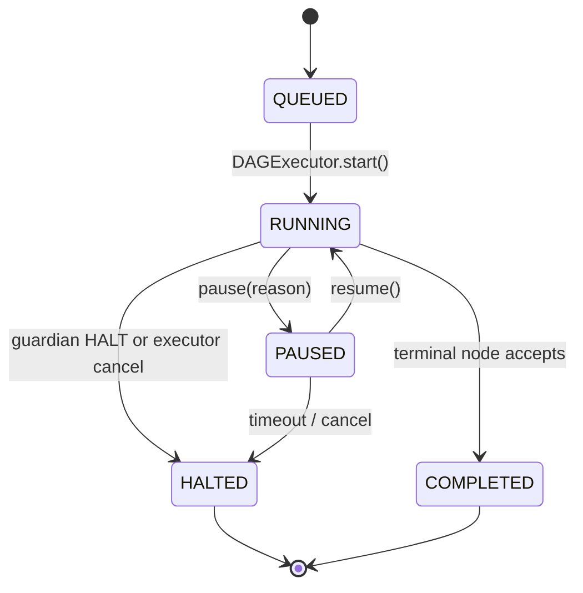

# SPEC-04: Long-Horizon Task State Machine

> Promotes a multi-step DAG run into a **Task** with a persistent state machine,
> step-aware progress, retry accounting, and resumable execution. Every node
> receives a `TaskContext` that names its position, prior decisions, and the
> retry ledger it inherits.

## 1. Context

DAGs run today; tasks do not. There is no first-class concept of "this is step 3
of 10 in goal G", no progress, no pause/resume across processes, no inheritance
of prior decisions, and no retry counter that lets SPEC-05 enforce
"recover-once-then-halt" deterministically.

This spec adds a `Task` aggregate with a strict state machine, persists it via
`persistence/`, and adds a `TaskInjectInterceptor` (PRE phase, position 4 —
last in DEFAULT_PRE_ORDER) that populates each node's `TaskContext`.



`RUNNING` is the running state — there is no `RESUMED` state; `resume()` is a
transition (PAUSED → RUNNING), not a state. SPEC-00 §2 has been corrected to
match.

## 2. Interface Contract (MDE)

Common types in SPEC-00 §2 (`TaskID`, `NodeID`, `TokenBudget`, `Citation`).

```python
from typing import Protocol, runtime_checkable
from dataclasses import dataclass, field
from datetime import datetime
from enum import Enum
from types import TracebackType

class TaskState(Enum):
    QUEUED    = "queued"
    RUNNING   = "running"
    PAUSED    = "paused"
    COMPLETED = "completed"
    HALTED    = "halted"

@dataclass(frozen=True, slots=True)
class Decision:
    """A material choice or output from a prior step worth carrying forward."""
    node_id: NodeID
    summary: str                                   # one-liner
    cited_evidence_refs: tuple[Citation, ...]
    at: datetime

@dataclass(frozen=True, slots=True)
class TaskContext:
    task_id: TaskID
    goal: Goal
    step_index: int                                # 0-based, into the executed step sequence
    step_count: int
    prior_decisions: tuple[Decision, ...]
    budget_remaining: TokenBudget                  # required, no default
    started_at: datetime                           # required, no default
    correlation_id: CorrelationID                  # required, no default
    retry_ledger: tuple[tuple[NodeID, int], ...] = ()   # SPEC-05 reads, executor rebuilds via dataclasses.replace; tuple-of-pairs preserves frozen+slots invariants while supporting increment-only updates (Inv 10)
    state: TaskState = TaskState.RUNNING

@dataclass(frozen=True, slots=True)
class AcquireToken:
    """Immutable lease handle returned by TaskRepository.acquire.
    Carries no behavior — the AcquiredLease wrapper below provides the async
    context-manager surface that calls TaskRepository.release on exit.
    """
    task_id: TaskID
    holder_id: str                                 # executor instance id
    acquired_at: datetime
    lease_ttl_ms: int = 60_000                     # auto-released after TTL on holder crash

class AcquiredLease:
    """Async context manager wrapping an AcquireToken + the owning repository."""
    def __init__(self, *, repository: "TaskRepository", token: AcquireToken) -> None: ...
    async def __aenter__(self) -> AcquireToken: ...
    async def __aexit__(self,
                         exc_type: type[BaseException] | None,
                         exc_val: BaseException | None,
                         exc_tb: "TracebackType | None") -> None:
        """Calls repository.release(self._token); re-raises after release."""

@dataclass(frozen=True, slots=True)
class Task:
    """The aggregate persisted by TaskRepository. Mirrors TaskSnapshot fields
    plus the immutable Goal+DAG binding chosen at create()."""
    task_id: TaskID
    goal: Goal
    dag_id: DAGID
    state: TaskState
    step_index: int
    step_count: int
    prior_decisions: tuple[Decision, ...]
    retry_ledger: tuple[tuple[NodeID, int], ...]
    budget_remaining: TokenBudget
    correlation_id: CorrelationID
    created_at: datetime
    updated_at: datetime

@dataclass(frozen=True, slots=True)
class TaskSnapshot:
    """Persistable snapshot for pause/resume across processes."""
    task_id: TaskID
    goal: Goal
    state: TaskState
    step_index: int
    step_count: int
    prior_decisions: tuple[Decision, ...]
    retry_ledger: tuple[tuple[NodeID, int], ...]
    budget_remaining: TokenBudget
    correlation_id: CorrelationID
    snapshot_at: datetime

@runtime_checkable
class TaskRepository(Protocol):
    async def create(self, *, goal: Goal, dag_id: DAGID,
                     budget: TokenBudget) -> Task: ...
    async def get(self, task_id: TaskID) -> Task: ...
    async def transition(self, task_id: TaskID, *, to: TaskState,
                         reason: str | None = None) -> Task:
        """Raises InvalidTransitionError if (from, to) violates §3 Invariant 1."""
    async def append_decision(self, task_id: TaskID, decision: Decision) -> None: ...
    async def snapshot(self, task_id: TaskID) -> TaskSnapshot: ...
    async def restore(self, snapshot: TaskSnapshot) -> Task: ...
    async def acquire(self, task_id: TaskID, *, holder_id: str) -> AcquiredLease:
        """Exclusive resume lock with TTL-bounded lease. Returns an AcquiredLease
        usable as `async with repo.acquire(task_id, holder_id=...) as token:`.
        Raises TaskInUseError when already held by a different holder with a
        non-expired lease."""
    async def release(self, token: AcquireToken) -> None: ...
    async def increment_retry(self, task_id: TaskID, node_id: NodeID) -> int:
        """Called by the executor at re-dispatch time, BEFORE the chain runs
        for the new attempt — so guardians observe the incremented value."""

class TaskInjectInterceptor(NodeInterceptor):
    """PRE phase, position 4 — runs LAST in DEFAULT_PRE_ORDER."""
    interceptor_id = "task_inject"
    phase = InterceptorPhase.PRE
```

`DAGExecutor.run(dag, *, task_id=None)` either creates a new Task or resumes
from `task_id`. Bootstrap composition: `RuntimeServices.task_repository`.

## 3. Invariants (DbC)

1. `Task state transitions SHALL follow this set: QUEUED→RUNNING, RUNNING→PAUSED, PAUSED→RUNNING, RUNNING→COMPLETED, RUNNING→HALTED, PAUSED→HALTED (timeout/cancel). All other transitions are forbidden.`
2. `WHEN a Task is HALTED or COMPLETED, transition() SHALL raise InvalidTransitionError on any further state change.`
3. `Every TaskContext.step_index SHALL satisfy 0 ≤ step_index < step_count.`
4. `TaskContext.prior_decisions SHALL be append-only and ordered by node execution sequence.`
5. `WHEN restoring from a snapshot, THE restored Task SHALL be structurally equal to the snapshot under canonical sorted-key JSON serialization for task_id, goal, state, prior_decisions, retry_ledger, and budget_remaining.`
6. `TaskContext.budget_remaining SHALL be monotonically non-increasing across the parent task's steps. Sub-DAG (recovery) consumption SHALL NOT decrement it (SPEC-06 metering boundary).`
7. `Every node SHALL receive a TaskContext via TaskInjectInterceptor — even single-step DAGs (step_count=1).`
8. `WHEN any guardian (SPEC-05) emits HALT, THE Repository SHALL transition the Task to HALTED before the next dispatch.`
9. `TaskRepository.acquire SHALL be exclusive — concurrent resumption attempts on the same task SHALL fail with TaskInUseError.`
10. `THE retry_ledger SHALL be append/increment-only; counters never decrement. Storage is tuple[tuple[NodeID, int], ...]; read access is via a helper get_retry(ledger, node_id) -> int (default 0); writes happen by rebuilding the Task aggregate via dataclasses.replace, not in-place mutation.`
11. `THE executor SHALL call TaskRepository.increment_retry(task_id, node_id) BEFORE running the interceptor chain for a re-dispatched node, so guardians observe the post-increment value.`
12. `WHEN AcquireToken.lease_ttl_ms elapses without explicit release, THE TaskRepository SHALL treat the lease as expired and permit a new acquire — preventing dead executors from holding tasks indefinitely.`

## 4. Acceptance Criteria (BDD)

```gherkin
Feature: Long-horizon task awareness

  Scenario: Step awareness propagates
    Given a 5-node DAG started as a new Task
    When the node at index 2 executes
    Then its TaskContext.step_index == 2 and step_count == 5
    And prior_decisions contains decisions from nodes 0 and 1

  Scenario: Retry ledger observable to guardians
    Given a node that has failed once and been re-dispatched via RECOVER
    When the guardian post-flight inspects task.retry_ledger[node.id]
    Then the value is 1 (incremented after the first failure)

  Scenario: Pause and resume across processes
    Given a Task in state RUNNING with 3 of 10 steps complete
    When the executor pauses the task and the process exits
    And a new executor acquire() the task and calls resume()
    Then state transitions PAUSED → RUNNING
    And the next dispatched node has step_index == 3
    And prior_decisions and retry_ledger from steps 0..2 are present

  Scenario: Halt is terminal
    Given a Task transitioned to HALTED
    When transition(to=RUNNING) is called
    Then the Repository raises InvalidTransitionError

  Scenario: Decisions are append-only
    Given a Task with 3 prior decisions
    When a 4th decision is appended
    Then the decision tuple has length 4 in original order
    And no prior decision has been mutated

  Scenario: Budget monotonicity
    Given a Task with budget_remaining=10000 at step 0
    When step 1 consumes 800 tokens and step 2 consumes 1200
    Then budget_remaining at step 3 is 8000 ± 0
    And budget_remaining never increases

  Scenario: Single-step DAG still receives TaskContext
    Given a 1-node DAG
    When the node executes
    Then it receives a TaskContext with step_index=0 and step_count=1

  Scenario: Concurrent resume rejected
    Given a Task being resumed by executor A
    When executor B attempts to acquire() the same task
    Then the second call raises TaskInUseError

  Scenario: Guardian HALT propagates to Task
    Given any guardian post-flight returns HALT
    When the executor finishes the post chain
    Then TaskRepository.transition(to=HALTED) is invoked before next dispatch
```

## 5. Out of Scope

- Multi-tenant task quotas — separate spec.
- Distributed task coordination across executors (single-executor MVP via `acquire()` lock only).
- Human-in-the-loop pause approval workflows — captured at SPEC-05 layer only.
- Sub-task decomposition (Task spawning Task) — follow-on; recovery sub-DAGs (SPEC-06) are NOT sub-tasks.

## 6. Dependencies

- SPEC-01 (interceptor protocol)
- SPEC-00 §2 (TokenBudget, Goal, Citation)
- `persistence/entities.py`, `persistence/protocols.py`
- `replay/replayer.py` (deterministic step replay reuses Decision provenance)

## 7. Correctness Properties

### Property 1: Transition legality
*For any* Task, the sequence of states observed satisfies the §3 Invariant 1
DAG; no observed transition is outside the allowed set.

**Validates: §3 Invariants 1, 2 / §4 "Halt is terminal"**

### Property 2: Snapshot fidelity
*For any* snapshot S taken at t1 and restored at t2 > t1, the restored Task's
`task_id`, `goal`, `state`, `prior_decisions`, `retry_ledger`, and
`budget_remaining` equal those of S.

**Validates: §3 Invariant 5 / §4 "Pause and resume across processes"**

### Property 3: Decision append-only
*For any* Task, any operation that produces a Task' with a `prior_decisions`
of shorter length OR with any earlier decision mutated is rejected.

**Validates: §3 Invariant 4 / §4 "Decisions are append-only"**

### Property 4: Budget non-increase (parent metering)
*For any* sequence of TaskContexts c1..cn for the same parent Task,
`c_i.budget_remaining ≥ c_{i+1}.budget_remaining` for all i. Recovery sub-DAG
consumption is metered separately (SPEC-06).

**Validates: §3 Invariant 6 / §4 "Budget monotonicity"**

### Property 5: Step bound
*For any* TaskContext c, `0 ≤ c.step_index < c.step_count`.

**Validates: §3 Invariant 3 / §4 "Step awareness propagates"**

### Property 6: Retry monotonicity
*For any* node, `task.retry_ledger[node_id]` is monotonically non-decreasing.

**Validates: §3 Invariant 10 / §4 "Retry ledger observable to guardians"**

## 8. Eval Criteria

State-machine spec — deterministic evaluators only.

| Evaluator | Node | Mode | Threshold | Method |
|---|---|---|---|---|
| TransitionLegalityEvaluator | repository transitions | GATE | illegal == 0 | deterministic |
| BudgetMonotonicityEvaluator | task lifetime | GATE | violations == 0 | deterministic |
| DecisionImmutabilityEvaluator | task lifetime | GATE | mutations == 0 | deterministic |
| RetryMonotonicityEvaluator | task lifetime | GATE | decrements == 0 | deterministic |

## 9. Observability Contract

- **Span**: `gen_ai.task.lifetime` — `task.id`, `task.state`, `step.index`, `step.count`, `budget.remaining`
- **Span**: `gen_ai.task.transition` — `from`, `to`, `reason`
- **Log events**: `task.created`, `task.paused`, `task.resumed`, `task.halted`, `task.completed`, `task.invalid_transition`, `task.acquire_conflict`
- **Metrics**: `task_state_total{state}`, `task_steps_completed`, `task_budget_remaining`, `task_retries_total{node_id}`
