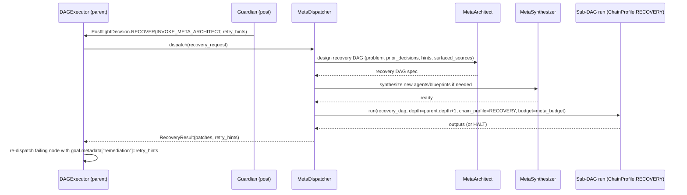

# SPEC-06: Self-Resolving DAG

> Connects the existing `meta/` self-hosting layer to mid-run dispatch. When a
> guardian emits `RecoveryStrategy.INVOKE_META_ARCHITECT`, the
> `MetaDispatcher` builds a small recovery sub-DAG via `MetaArchitect` (and
> `MetaSynthesizer` if new agents/blueprints are needed), runs it through the
> **same** DAGExecutor under `ChainProfile.RECOVERY`, and splices its outputs
> back into the parent run. The framework uses itself to fix itself.

## 1. Context

`create_meta_executor()` exists today as a parallel composition root — meta
runs in a different universe from user DAGs. The self-hosting promise (engine
fixes engine) is unrealized in mid-run scenarios.

This spec adds a `MetaDispatcher` to `RuntimeServices`. Recursion safety is
enforced by depth limits, a `MetaInvocationBudget` separate from the parent
Task's `TokenBudget`, and `ChainProfile.RECOVERY` (SPEC-05) which strips the
two recursion-sensitive guardians (`online_eval`, `goal_completion`).



## 2. Interface Contract (MDE)

Common types in SPEC-00 §2 (`TaskID`, `NodeID`, `DAGID`, `CorrelationID`,
`Citation`, `CiteableChunk`, `TokenCount`, `ChainProfile`). Recovery primitives
in SPEC-01 (`RecoveryStrategy`, `RecoveryHint`). `Decision` defined in SPEC-04.

```python
from typing import Protocol, runtime_checkable
from dataclasses import dataclass, field
from enum import Enum

class FailureCategory(Enum):
    CITATION = "citation"          # cite_or_fail rejection
    GOAL     = "goal"              # goal_completion rejection
    EVAL     = "eval"              # online_eval rejection
    TOOL     = "tool"              # tool_verify rejection
    OTHER    = "other"

@dataclass(frozen=True, slots=True)
class RecoveryRequest:
    parent_task_id: TaskID
    parent_node_id: NodeID
    parent_correlation_id: CorrelationID
    failure_reason: str
    failure_category: FailureCategory
    prior_decisions: tuple[Decision, ...]
    surfaced_sources: tuple[CiteableChunk, ...]
    inbound_hints: tuple[RecoveryHint, ...] = ()    # carried from the rejecting guardian
    depth: int = 0                                   # parent depth at request time

@dataclass(frozen=True, slots=True)
class RecoveryResult:
    accepted: bool                                   # MetaArchitect produced a plan
    patches: tuple[ContextPatch, ...] = ()           # spliced into parent context
    retry_hints: tuple[RecoveryHint, ...] = ()       # surfaced as goal.metadata["remediation"]
    sub_dag_id: DAGID | None = None
    halt: bool = False                               # meta gave up — escalate
    tokens_consumed: TokenCount = TokenCount(0)
    wall_time_ms: int = 0

@dataclass(frozen=True, slots=True)
class MetaInvocationBudget:
    max_depth: int = 2                               # parent (0) → recovery (1) → grand-recovery (2)
    max_token_total: TokenCount = TokenCount(50_000) # global cap across all nested recoveries for one parent task
    max_wall_time_ms: int = 30_000

@runtime_checkable
class MetaDispatcher(Protocol):
    async def dispatch(self, *, request: RecoveryRequest,
                       services: RuntimeServices) -> RecoveryResult: ...
```

`RuntimeServices` gains `meta_dispatcher: MetaDispatcher | None` and
`meta_budget: MetaInvocationBudget` (per SPEC-00 §2). When `meta_dispatcher`
is None, any `RECOVER(INVOKE_META_ARCHITECT)` decision downgrades to
`REJECT(reason="meta_unavailable")`.

### Parent metering point

Token consumption inside a recovery run is metered by `MetaInvocationBudget`
and **does not** decrement `task.budget_remaining`. SPEC-04 Inv 6 declares
the isolation. `RuntimeServices` is frozen — the budget guard is NOT swapped
in shared state. Instead, `DAGExecutor.run(dag, *, chain_profile, budget)`
takes the active `TokenBudget`/`MetaInvocationBudget` as a per-call
parameter; the parent run passes `services.token_budget`, the recovery run
passes `services.meta_budget`. Reentrancy on the same executor instance is
preserved (SPEC-01 Inv 12).

### Concurrency model

Sub-DAG execution is sequential w.r.t. the parent: while a recovery sub-DAG
is running, the parent `DAGExecutor` SHALL NOT dispatch peer nodes. The
executor pauses parent dispatch on `RECOVER(INVOKE_META_ARCHITECT)` and
resumes only after `MetaDispatcher.dispatch` returns.

## 3. Invariants (DbC)

1. `THE meta invocation depth SHALL NOT exceed MetaInvocationBudget.max_depth.`
2. `WHEN max_depth is reached, MetaDispatcher SHALL return RecoveryResult(accepted=False, halt=True) and the parent SHALL transition the Task to HALTED via SPEC-04 §3 Inv 8.`
3. `Recovery sub-DAGs SHALL run with chain_profile=ChainProfile.RECOVERY (SPEC-05) — online_eval and goal_completion guardians SHALL NOT be active inside a recovery run.`
4. `THE MetaDispatcher SHALL share RuntimeServices.knowledge_graph and data_sources with the parent — no isolated meta-only handles.`
5. `Token consumption inside a recovery run SHALL be charged to MetaInvocationBudget; parent task.budget_remaining SHALL be unchanged across the recovery boundary (SPEC-04 §3 Inv 6).`
6. `Recovery run AuditEntries SHALL carry parent_task_id, parent_node_id, and parent_correlation_id.`
7. `Splicing back into the parent SHALL be via ContextPatch with source="meta:<sub_dag_id>" and correlation_id linking parent and sub-run.`
8. `WHEN meta_dispatcher is None, RECOVER(INVOKE_META_ARCHITECT) SHALL downgrade to REJECT(reason="meta_unavailable") at the chain layer (SPEC-01).`
9. `MetaDispatcher SHALL be invocable from any node — no separate executor path. The same DAGExecutor instance SHALL run both parent and sub-DAGs.`
10. `THE total tokens consumed across all nested recoveries for one parent Task SHALL NOT exceed MetaInvocationBudget.max_token_total; on breach the dispatcher SHALL return halt=True.`
11. `RecoveryResult.retry_hints SHALL be propagated to the re-dispatched parent node via goal.metadata["remediation"] (SPEC-01 §3 Inv 10).`
12. `WHILE a recovery sub-DAG is executing, THE parent DAGExecutor SHALL NOT dispatch peer parent nodes — sub-DAG execution is sequential w.r.t. the parent.`
13. `THE active ChainProfile SHALL be passed as a parameter to DAGExecutor.run, NOT mutated on RuntimeServices — services is frozen.`
14. `Depth check semantics: a new recovery is permitted iff (parent.depth + 1) ≤ MetaInvocationBudget.max_depth. With max_depth=2: depth 0→1 allowed, 1→2 allowed, 2→3 rejected with halt=True.`

## 4. Acceptance Criteria (BDD)

```gherkin
Feature: Self-resolving DAG

  Scenario: MetaArchitect recovers from a citation failure
    Given a node rejected by CiteOrFail with reason "non_member_citation"
    And meta_dispatcher is configured
    When the recovery dispatcher runs
    Then MetaArchitect produces a recovery sub-DAG that adds a citation step
    And the parent node is re-dispatched with goal.metadata["remediation"] containing the hint code
    And the second attempt passes CiteOrFail

  Scenario: Depth limit triggers escalation
    Given MetaInvocationBudget.max_depth == 2
    And a recovery currently executing at depth 2
    When a nested guardian inside it emits RECOVER(INVOKE_META_ARCHITECT) (would reach depth 3)
    Then RecoveryResult.halt == True with reason "meta_depth_exceeded"
    And the parent task transitions to HALTED

  Scenario: Sub-DAG runs sequentially with parent paused
    Given a parent run with peer nodes ready to dispatch
    When a recovery sub-DAG is executing
    Then the parent DAGExecutor does not dispatch any peer node
    And resumes only after MetaDispatcher.dispatch returns

  Scenario: Reduced guardian chain inside recovery
    Given a recovery DAG running under ChainProfile.RECOVERY
    When its nodes execute
    Then OnlineEvalInterceptor and GoalCompletionInterceptor are not in the chain
    And LegitimacyInterceptor, PullInterceptor, BlueprintInterceptor, TaskInjectInterceptor, CiteOrFailInterceptor, ToolOutputVerifierInterceptor, AuditInterceptor are present

  Scenario: KG and DataSource shared with parent
    Given a parent task with KG entity "OrderPipeline"
    When MetaArchitect queries KG inside the recovery run
    Then it receives the same neighbor set as a parent-run query
    And both calls flow through RuntimeServices.knowledge_graph

  Scenario: Token budget isolation
    Given a parent Task with budget_remaining=10000
    And a recovery run consuming 3000 tokens
    When the recovery completes
    Then parent.budget_remaining == 10000 (unchanged)
    And meta_budget.consumed == 3000

  Scenario: Total token cap escalates to halt
    Given MetaInvocationBudget.max_token_total == 5000
    And prior recoveries have consumed 4500 tokens for this parent task
    When a new recovery would consume 1000 more
    Then RecoveryResult.halt == True with reason "meta_token_exhausted"

  Scenario: Audit linkage
    Given a recovery run completing
    When the audit log is inspected
    Then each entry carries parent_task_id, parent_node_id, and parent_correlation_id

  Scenario: No dispatcher → graceful downgrade
    Given meta_dispatcher is None
    And a guardian emits RECOVER(INVOKE_META_ARCHITECT)
    When the chain processes the decision
    Then the decision downgrades to REJECT with reason "meta_unavailable"

  Scenario: Splice provenance
    Given a recovery run produces a ContextPatch
    When it is applied to the parent context
    Then the patch carries source="meta:<sub_dag_id>" and a correlation_id linking parent and sub

  Scenario: Same DAGExecutor instance handles both
    Given a parent run on DAGExecutor instance X
    When a recovery sub-DAG dispatches
    Then the sub-DAG is executed by the same instance X (no parallel executor)
```

## 5. Out of Scope

- Distributed recovery across multiple executors.
- Recovery-of-recovery learning / fine-tuning of MetaArchitect from outcomes.
- UI surfacing of meta interventions.
- Auto-promotion of frequent recovery patterns into permanent DAG nodes (separate optimization spec).
- Streaming recovery (deferred per SPEC-00 §5).

## 6. Dependencies

- SPEC-01 (`RecoveryStrategy`, `RecoveryHint`, chain composition)
- SPEC-04 (`Decision`, `task.budget_remaining` non-decrement contract)
- SPEC-05 (`ChainProfile.RECOVERY`, guardians produce recovery requests)
- SPEC-00 §2 Common Types
- `meta/agents.py`, `meta/dags.py`, `meta/bootstrap.py` (expose dispatch surface)
- `context/patch.py` (`ContextPatch` with `source="meta:..."`)
- `audit/` (parent linkage)

## 7. Correctness Properties

### Property 1: Bounded recursion
*For any* parent task, the depth of nested recovery runs SHALL NOT exceed
`MetaInvocationBudget.max_depth`. Beyond that, halt is mandatory.

**Validates: §3 Invariants 1, 2 / §4 "Depth limit triggers escalation"**

### Property 2: Budget isolation
*For any* recovery run R nested in parent P, tokens consumed by R do not
decrement `P.budget_remaining`. The metering point switches to
`MetaInvocationBudget` when `chain_profile == RECOVERY`.

**Validates: §3 Invariant 5 / §4 "Token budget isolation" / SPEC-04 Property 4**

### Property 3: Reduced chain integrity
*Inside* any recovery run, the active POST chain excludes `online_eval` and
`goal_completion` (per `ChainProfile.RECOVERY` in SPEC-05).

**Validates: §3 Invariant 3 / §4 "Reduced guardian chain inside recovery" / SPEC-05 §1**

### Property 4: Shared services
*For any* node inside a recovery run, KG and DataSource queries flow through
the same `RuntimeServices` handles as the parent run.

**Validates: §3 Invariant 4 / §4 "KG and DataSource shared with parent" / SPEC-02 Property 4**

### Property 5: Splice provenance integrity
*For every* ContextPatch applied to a parent from a recovery,
`patch.source == f"meta:{sub_dag_id}"` and `patch.correlation_id` links to the
parent run.

**Validates: §3 Invariant 7 / §4 "Splice provenance"**

### Property 6: Total recovery cost cap
*For any* parent Task, `sum(r.tokens_consumed for r in recoveries) ≤
MetaInvocationBudget.max_token_total`. Once exceeded, no further recovery is
attempted.

**Validates: §3 Invariant 10 / §4 "Total token cap escalates to halt"**

### Property 7: Graceful downgrade
*For any* RECOVER(INVOKE_META_ARCHITECT) when `meta_dispatcher is None`, the
decision is converted to REJECT before any sub-DAG is dispatched.

**Validates: §3 Invariant 8 / §4 "No dispatcher → graceful downgrade"**

## 8. Eval Criteria

Recovery is structural — deterministic evaluators only. The
recovery-effectiveness signal lives in OBSERVE mode (no GATE on success rate
because failure to recover is already covered by parent HALT).

| Evaluator | Node | Mode | Threshold | Method |
|---|---|---|---|---|
| RecoverySuccessRate | recovery dispatches | OBSERVE | success ≥ 0.6 (90-day rolling) | deterministic |
| DepthBoundEvaluator | every recovery | GATE | depth ≤ max_depth | deterministic |
| BudgetIsolationEvaluator | every recovery | GATE | parent_budget_delta == 0 | deterministic |
| TotalTokenCapEvaluator | per parent task | GATE | sum_tokens ≤ max_token_total | deterministic |
| ReducedChainEvaluator | every recovery | GATE | online_eval ∉ chain ∧ goal_completion ∉ chain | deterministic |
| MetaCorrelationEvaluator | every recovery audit entry | GATE | parent_task_id ∧ parent_node_id present | deterministic |
| SpliceProvenanceEvaluator | every spliced patch | GATE | source matches `meta:<dag_id>` | deterministic |

## 9. Observability Contract

- **Span**: `gen_ai.meta.dispatch` — `parent_task_id`, `parent_node_id`, `failure_category`, `depth`, `accepted`, `halt`, `tokens_consumed`, `wall_time_ms`
- **Span**: `gen_ai.meta.subdag` — `sub_dag_id`, `nodes`, `chain_profile=recovery`, `tokens_consumed`, `wall_time_ms`
- **Log events**: `meta.dispatched`, `meta.depth_exceeded`, `meta.token_cap_exceeded`, `meta.unavailable_downgrade`, `meta.splice_applied`, `meta.subdag_halted`
- **Metrics**: `meta_dispatches_total{category,outcome}`, `meta_depth_distribution`, `meta_tokens_total{parent_task}`, `meta_recovery_success_rate`, `meta_wall_time_ms`
