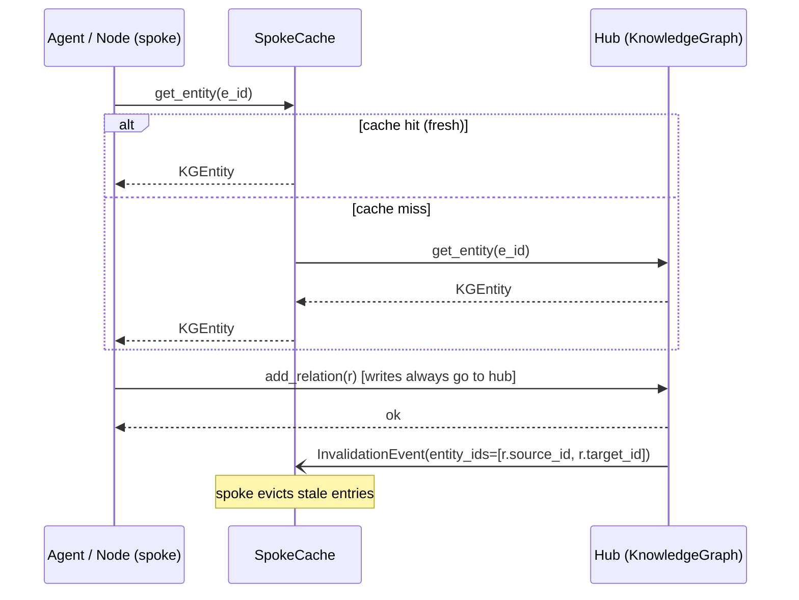

# SPEC-07: Hub & Spoke Knowledge Distribution

> Promotes the central `KnowledgeGraph` from a single hub to a **hub-and-spoke**
> topology: per-agent / per-node spokes hold a bounded local cache that
> answers reads at sub-millisecond latency, the hub remains the source of
> truth for writes, and a thin sync protocol propagates invalidations and
> deltas between them. Closes audit gap #9 — *"no spoke-local caching, no
> federated sync"*.

## Contents

- [1. Context](#1-context)
- [2. Interface Contract (MDE)](#2-interface-contract-mde)
- [3. Invariants (DbC)](#3-invariants-dbc)
- [4. Acceptance Criteria (BDD)](#4-acceptance-criteria-bdd)
- [5. Out of Scope](#5-out-of-scope)
- [6. Dependencies](#6-dependencies)
- [7. Correctness Properties](#7-correctness-properties)
- [8. Eval Criteria](#8-eval-criteria)
- [9. Observability Contract](#9-observability-contract)

## 1. Context

Today every KG read is a round-trip into `MemoryBackedKnowledgeGraph` →
`MemoryManager` → backing store (SQLite / Postgres / vector index). For
hot entities consulted on every node tick (e.g. `current_workspace`,
`active_user`, top-N domain entities) this is wasteful: O(N_nodes ×
N_ticks) reads against a near-static set of entities.

Centralised KGs scale poorly under three pressures:
- **Latency** — every read pays the manager's serialization + store cost.
- **Coupling** — every spoke depends on the hub being healthy *now*.
- **Bandwidth** — N spokes pulling the same entity in lockstep.

The standard fix is a **hub-and-spoke** topology, well known from CDNs,
DNS resolvers, and CPU caches:



**Reads** can be satisfied by a spoke. **Writes** always go to the hub.
The hub publishes invalidation events; spokes subscribe via the existing
`EventBus`. Spokes are bounded (LRU + max size + TTL) so they cannot
exceed a memory budget.

This is *not* a distributed-systems consensus problem — there is one hub
of record. We need only:
1. A **`SpokeCache` protocol** that wraps any `KnowledgeGraph`.
2. A **`HubKnowledgeGraph` decorator** that publishes invalidations on writes.
3. A **`KGInvalidationEvent`** type plus EventBus topic.
4. A **`HubSpokeKnowledgeGraph` factory** wiring a hub + N spokes.

### Cache scope

The spoke caches **only point lookups** — `get_entity(entity_id)`. The
following operations always go to the hub:

- `query_neighbors` — graph traversal, results depend on relation set
  consistency.
- `search` — text/embedding queries; cache invalidation across query
  predicates is open-ended and out of scope.
- All writes (`add_entity`, `add_relation`, `remove_entity`).

`HubKnowledgeGraph` is therefore **not** an unconditional drop-in for
`KnowledgeGraph` in caller code that issues many `search()` calls — it
is the same protocol, but the spoke layer optimises only the
point-lookup path. This is documented at the protocol boundary and
asserted by Property 4.

## 2. Interface Contract (MDE)

```python
from collections.abc import Iterable, Mapping
from dataclasses import dataclass, field
from datetime import timedelta
from enum import Enum
from typing import Protocol, runtime_checkable

from cemaf.events.protocols import EventBus
from cemaf.knowledge.protocols import KnowledgeGraph
from cemaf.knowledge.models import KGEntity, KGRelation


class InvalidationKind(Enum):
    ENTITY_UPDATED = "entity_updated"
    ENTITY_REMOVED = "entity_removed"
    RELATION_ADDED = "relation_added"


@dataclass(frozen=True, slots=True)
class KGInvalidationEvent:
    kind: InvalidationKind
    entity_ids: tuple[str, ...]                  # affected entities
    correlation_id: str = ""                     # joins with EventBus correlation


@dataclass(frozen=True, slots=True)
class SpokeCacheConfig:
    max_entities: int = 1024                     # bounded set
    ttl: timedelta = timedelta(minutes=5)        # passive expiry
    enable_negative_cache: bool = True           # cache "not found"


@runtime_checkable
class SpokeCache(Protocol):
    """Read-through cache fronting a KnowledgeGraph."""

    config: SpokeCacheConfig

    async def get_entity(self, entity_id: str) -> KGEntity | None: ...
    async def invalidate(self, event: KGInvalidationEvent) -> None: ...
    async def stats(self) -> "SpokeStats": ...


@dataclass(frozen=True, slots=True)
class SpokeStats:
    hits: int
    misses: int
    invalidations_received: int
    size: int

    @property
    def hit_rate(self) -> float:
        total = self.hits + self.misses
        return self.hits / total if total else 0.0


@runtime_checkable
class HubKnowledgeGraph(KnowledgeGraph, Protocol):
    """Hub: a KnowledgeGraph that emits invalidation events on writes."""

    def subscribe(self, spoke: SpokeCache) -> None: ...


def create_hub_spoke_kg(
    *,
    backing_kg: KnowledgeGraph,
    event_bus: EventBus,
    spoke_configs: Mapping[str, SpokeCacheConfig] | None = None,
) -> tuple[HubKnowledgeGraph, Mapping[str, SpokeCache]]:
    """Wire a hub around `backing_kg` and create one spoke per `spoke_configs` key."""
    ...
```

## 3. Invariants (DbC)

1. **Hub-of-record**: every successful write to any spoke-facing API has a
   corresponding write on the hub *before* the operation returns.
2. **Read-through**: a spoke `get_entity` returning a non-None value
   matches the hub's value at some moment ≤ `config.ttl` ago.
3. **Bounded spoke**: at no point does a spoke hold more than
   `config.max_entities` entries.
4. **Invalidation completeness**: every successful hub write produces
   exactly one `KGInvalidationEvent`. Affected `entity_ids` are:
   - `add_entity(e)` → `(e.id,)`
   - `remove_entity(e_id)` → `(e_id,)`
   - `add_relation(r)` → `(r.source_id, r.target_id)` (both sides,
     because the relation index attached to each is what changed)
5. **No stale-after-invalidate**: after a spoke processes
   `KGInvalidationEvent(entity_ids=E)`, its next `get_entity(e)` for
   `e ∈ E` MUST be a miss (re-fetch).
6. **No write amplification**: writes do NOT update spokes directly —
   only the hub writes; spokes refresh on demand or on next miss.
7. **Negative cache TTL**: when `enable_negative_cache=True`, a `None`
   result is cached with the same `config.ttl`.
8. **Best-effort delivery, eventual consistency**: the EventBus is
   not a transactional log. The hub publishes invalidation events
   *before* returning from a write (synchronous publish), and spoke
   handlers MUST NOT raise. Staleness windows are bounded by
   `config.ttl` even if a particular invalidation event is dropped or
   delayed — TTL is the safety net, the event is the fast path.

EARS form (selected):

```
WHEN a write succeeds on the hub, THE System SHALL publish exactly one KGInvalidationEvent.
WHEN a spoke processes KGInvalidationEvent(entity_ids=E), THE System SHALL evict each e ∈ E from its cache.
WHILE a spoke holds max_entities entries, THE System SHALL evict via LRU before inserting a new entry.
IF a spoke entry's age exceeds ttl, THEN THE System SHALL treat the read as a miss.
```

Budget: 8 invariants — within the ≤15 limit.

## 4. Acceptance Criteria (BDD)

```gherkin
Feature: Hub & Spoke Knowledge Distribution

  Scenario: Cache hit on second read
    Given a hub-spoke KG with one spoke S1
    And entity "user:42" exists on the hub
    When agent A on S1 calls get_entity("user:42") twice
    Then the second call returns without contacting the hub
    And S1.stats().hit_rate equals 0.5

  Scenario: Write propagates as invalidation
    Given a hub-spoke KG with two spokes S1 and S2
    And entity "user:42" is cached on both spokes
    When the hub receives add_entity replacing "user:42"
    Then both S1 and S2 receive a KGInvalidationEvent for "user:42"
    And the next get_entity on either spoke is a miss

  Scenario: Spoke respects max_entities
    Given a spoke with max_entities=10
    When 12 distinct entities are read through the spoke
    Then S.stats().size equals 10
    And the 2 oldest entries (LRU) are not present

  Scenario: TTL expiry
    Given a spoke with ttl=100ms
    And entity "x" was cached 200ms ago
    When get_entity("x") is called
    Then it is a miss
    And a hub fetch occurs

  Scenario: Negative cache prevents repeated lookups
    Given a spoke with enable_negative_cache=True
    And the hub has no entity "ghost"
    When get_entity("ghost") is called twice within ttl
    Then the hub is contacted only once
    And both calls return None

  Scenario: Spokes do not write
    Given a hub-spoke KG
    When add_entity is called on a spoke (which has no write API by design)
    Then the call goes through the hub
    And no spoke holds the new entity until first read

  Scenario: Hub failure isolates spokes for cache hits
    Given a spoke with cached entity "x"
    And the hub is unreachable
    When get_entity("x") is called within ttl
    Then the call returns the cached value
    And no error is raised

  Scenario: Hub failure on miss surfaces the error
    Given a spoke with no cached "y"
    And the hub is unreachable
    When get_entity("y") is called
    Then an error is raised (no silent None)
```

8 scenarios — within the ≤20 limit.

## 5. Out of Scope

- Multi-hub topologies (federation across regions / tenants).
- Strong consistency / linearizability — eventual consistency bounded
  by `ttl` is sufficient.
- Cache warming / prefetching — first hit is a miss by design.
- Persistent spokes — spokes are in-memory only.
- Coalescing concurrent identical hub fetches (a useful follow-up, not
  load-bearing for v1).

## 6. Dependencies

- `cemaf.knowledge.protocols.KnowledgeGraph` — the wrapped contract.
- `cemaf.events.protocols.EventBus` — invalidation transport.
- `cemaf.knowledge.models` — `KGEntity`, `KGRelation`.
- SPEC-02 — `KnowledgeGraph` is a `RuntimeService`.

## 7. Correctness Properties

### Property 1: Read consistency under bounded staleness

*For any* spoke `S`, entity `e`, and time `t`: if `S.get_entity(e, t) =
v ≠ None`, then there exists `t' ∈ [t - ttl, t]` such that the hub had
`e ↦ v` at `t'`.

**Validates: §3 Invariant 2, §4 Scenario "TTL expiry"**

### Property 2: No silent staleness across writes

*For any* successful hub write at time `t` to entity `e` and any spoke
`S`: `S` either (a) had no entry for `e` at `t`, or (b) receives an
invalidation event by `t + δ_event_bus` and evicts `e` before the next
read.

**Validates: §3 Invariants 4, 5; §4 Scenario "Write propagates as
invalidation"**

### Property 3: Memory bound

*For any* spoke `S` with `config.max_entities = N`: at all times,
`S.stats().size ≤ N`.

**Validates: §3 Invariant 3, §4 Scenario "Spoke respects max_entities"**

### Property 4: Cache surface bound

*For any* spoke `S`: `S.get_entity(...)` is the only operation served
locally. Calls to `query_neighbors`, `search`, `add_entity`,
`add_relation`, `remove_entity` traverse to the hub regardless of
`config`.

**Validates: §1 Cache scope, §3 Invariant 6**

## 8. Eval Criteria

| Evaluator              | Node                | Mode    | Threshold                            | Method        |
|---|---|---|---|---|
| HitRateEvaluator       | spoke.get_entity    | OBSERVE | hit_rate ≥ 0.5 on hot-entity bench   | Deterministic |
| InvalidationLatency    | hub.write           | OBSERVE | p99 ≤ 50ms in-process                | Deterministic |
| StalenessUpperBound    | spoke.get_entity    | GATE    | observed_staleness ≤ ttl in property test | Property-based |
| MemoryBoundEvaluator   | spoke               | GATE    | size ≤ max_entities under load       | Deterministic |

## 9. Observability Contract

- **Span**: `gen_ai.tool.execute` with `gen_ai.tool.name=kg.spoke.get_entity`
  - Attributes: `spoke.id`, `kg.entity.id`, `kg.cache.outcome`
    (`hit`|`miss`|`negative_hit`|`expired`)
  - Emits log event: `kg.spoke.miss` on miss with `entity_id`,
    `reason` (`cold`|`expired`|`evicted`|`invalidated`)

- **Span**: `gen_ai.tool.execute` with `gen_ai.tool.name=kg.hub.write`
  - Attributes: `kg.write.kind` (`add_entity`|`add_relation`|`remove_entity`),
    `kg.invalidation.entity_count`
  - Emits event: `KGInvalidationEvent` on EventBus topic `kg.invalidation`

- **Metrics** (Prometheus):
  - `cemaf_kg_spoke_hits_total{spoke_id}` — counter
  - `cemaf_kg_spoke_misses_total{spoke_id, reason}` — counter
  - `cemaf_kg_spoke_size{spoke_id}` — gauge
  - `cemaf_kg_invalidations_total` — counter
