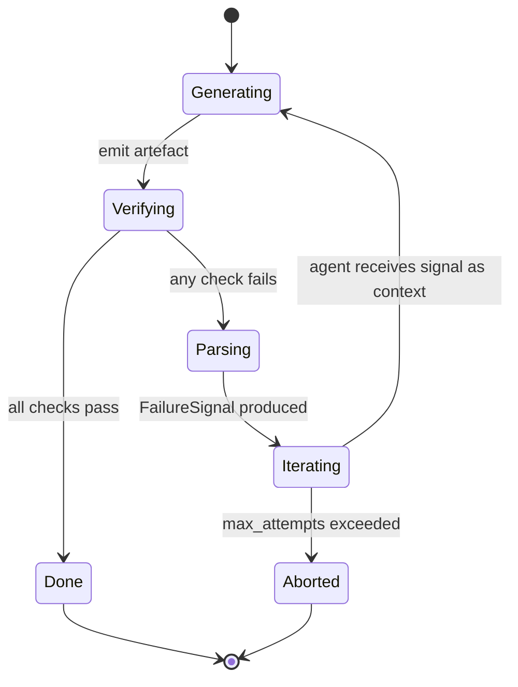

# SPEC-08: Structured Failure-Feedback Iteration Loop

> When an agent emits code that fails its verification step (pytest /
> ruff / mypy / shell exit), the framework today catches the *exception*
> via `AutoHealManager` but does NOT parse the structured failure into a
> goal-shaped feedback signal the agent can re-attempt against. This
> spec defines `FailureSignal`, the parsers that produce it, and the
> `IterationLoop` that turns a tool/skill failure into a fresh agent
> turn — closing audit gap #13.

**Status: Implemented.** Lives in `cemaf/iteration/` (`types.py`,
`protocols.py`, `parsers.py`, `loop.py`). It is a per-task substrate, not
a `RuntimeService` — the canonical caller is the `iccha_autonomy` control
plane. Unit tests: `tests/unit/iteration/`; integration (real
`ShellSandbox` + `RunTestsSkill`): `tests/integration/test_iteration_sandbox.py`.

## Contents

- [1. Context](#1-context)
- [2. Interface Contract (MDE)](#2-interface-contract-mde)
- [3. Invariants (DbC)](#3-invariants-dbc)
- [4. Acceptance Criteria (BDD)](#4-acceptance-criteria-bdd)
- [5. Out of Scope](#5-out-of-scope)
- [6. Dependencies](#6-dependencies)
- [7. Correctness Properties](#7-correctness-properties)
- [8. Eval Criteria](#8-eval-criteria)
- [9. Observability Contract](#9-observability-contract)

## 1. Context

CEMAF already has the substrate for an iteration loop:
- `skills/coding/RunTestsSkill`, `RunLintSkill`, `RunTypeCheckSkill` produce
  `Result[ShellResult]` with stdout/stderr/exit_code.
- `core/recovery.AutoHealManager` runs *exception* recovery strategies
  but cares only about `exception_type` / regex on `error.message`.
- `improvement/loop.SelfImprovementLoop` updates strategy memory after
  the fact.

What's missing is a **structured, agent-readable failure signal** and a
loop that re-invokes the producing agent with that signal as new goal
context. Without it, every retry is "try again" with no information
about what failed — strictly worse than what a human gets in their
terminal.



The loop is **bounded** (`max_attempts`, `max_total_seconds`,
`max_cost_usd`), **observable** (every iteration is a span with a
distinct `attempt_index`), and **deterministic at the boundary** — the
parser is pure, given the same stdout/stderr/exit_code it produces the
same `FailureSignal`.

This is the test-feedback half of agentic coding; the spec-feedback
half (spec ↔ test) is out of scope here and tracked separately.

### Boundary with `AutoHealManager`

`IterationLoop` and `AutoHealManager` cover **orthogonal failure
surfaces**:

|                     | `AutoHealManager`                    | `IterationLoop`                          |
|---------------------|--------------------------------------|------------------------------------------|
| Trigger             | Python exception in agent execution  | Verifier `ShellResult` with non-zero exit |
| Input               | `Result[Any]` + `exception_type`     | `ShellResult` (stdout/stderr/exit)     |
| Output              | `Result[Context]` (modified context) | New attempt with `FailureSignal`         |
| Layer               | Infrastructure recovery              | Behaviour iteration                      |

The loop **does not** consult `AutoHealManager`. Exceptions raised by
the `attempt` callable propagate through `run()` unchanged — they are
not parsed into `FailureSignal`s. This keeps the two retry stacks from
compounding (a transient network hiccup re-tried by `AutoHealManager`
must not also cost an iteration `attempt`).

### Cost reporting contract

The `attempt` callable is responsible for reporting its own cost. The
loop reads cost via the `Result` metadata convention:

```python
result.metadata.get("cost_usd", 0.0)  # float, defaults to 0
```

A callable that does not report cost contributes 0 to
`total_cost_usd`; the cost cap is therefore advisory in that case
(documented; not silently bypassed). For callables that drive
LLM-backed agents, wrap with `InstrumentedLLMClient` whose
`record_llm_call` already populates `cost_usd` — the loop's `attempt`
adapter copies that value into the result metadata.

## 2. Interface Contract (MDE)

```python
import asyncio
from collections.abc import Awaitable, Callable, Mapping
from dataclasses import dataclass, field
from datetime import timedelta
from enum import StrEnum
from typing import Any, Protocol, runtime_checkable

from cemaf.core.result import Result
from cemaf.sandbox.shell import ShellResult

# Truncation cap for FailureSignal.summary derived from raw stderr.
UNKNOWN_SUMMARY_MAX_CHARS = 512


class FailureKind(StrEnum):
    TEST_FAILURE     = "test_failure"
    LINT_FAILURE     = "lint_failure"
    TYPE_FAILURE     = "type_failure"
    BUILD_FAILURE    = "build_failure"
    RUNTIME_ERROR    = "runtime_error"
    UNKNOWN          = "unknown"


@dataclass(frozen=True, slots=True)
class FailureItem:
    """One concrete diagnostic — a failing test, lint warning, type error."""
    file: str | None
    line: int | None
    rule: str | None              # ruff rule, mypy error code, test id
    message: str
    snippet: str | None = None    # short excerpt for the agent


@dataclass(frozen=True, slots=True)
class FailureSignal:
    """Structured, agent-readable failure produced by a Parser."""
    kind: FailureKind
    summary: str                                  # one-line for the prompt header
    items: tuple[FailureItem, ...]                # bounded by parser config
    raw_command: str                              # what was run
    exit_code: int
    truncated: bool = False                       # items list was capped
    metadata: Mapping[str, str] = field(default_factory=lambda: {})


@runtime_checkable
class FailureParser(Protocol):
    """Pure function: structured failure for a (tool, command-result) pair."""

    @property
    def tool(self) -> str: ...                    # e.g. "pytest", "ruff", "mypy"

    @property
    def specificity(self) -> int:
        """Higher = more specific. Loop dispatches highest-specificity match first."""
        ...

    @property
    def max_items(self) -> int:
        """Hard cap on items returned by parse(); enforces FailureSignal.truncated."""
        ...

    def matches(self, result: ShellResult) -> bool:
        """Cheap predicate — does this parser claim ownership of this failure?"""
        ...

    def parse(self, result: ShellResult) -> FailureSignal | None:
        """Return None if the result is a success — only failures map."""
        ...


@dataclass(frozen=True, slots=True)
class IterationLimits:
    max_attempts: int = 5
    max_total: timedelta = timedelta(minutes=10)
    max_cost_usd: float = 1.00


class IterationOutcome(StrEnum):
    SUCCESS         = "success"
    EXHAUSTED       = "exhausted"     # hit max_attempts
    BUDGET_EXCEEDED = "budget_exceeded"
    HALTED          = "halted"        # caller cancelled via halt_event


@dataclass(frozen=True, slots=True)
class HaltSignal:
    """Caller-driven cancellation handed to IterationLoop at construction."""
    event: asyncio.Event              # set() to halt before next attempt


@dataclass(frozen=True, slots=True)
class IterationReport:
    outcome: IterationOutcome
    attempts: int
    total_duration_ms: float
    total_cost_usd: float
    last_signal: FailureSignal | None
    final_result: Result[object] | None


class IterationLoop:
    """Drives one (attempt → verify → parse → re-attempt) cycle until SUCCESS or limits hit."""

    def __init__(
        self,
        *,
        attempt: Callable[[FailureSignal | None], Awaitable[Result[Any]]],
        verify: Callable[[Result[Any]], Awaitable[ShellResult]],
        parsers: tuple[FailureParser, ...],
        limits: IterationLimits = IterationLimits(),
        halt: HaltSignal | None = None,
    ) -> None: ...

    async def run(self) -> IterationReport: ...
```

## 3. Invariants (DbC)

1. **Termination**: every `IterationLoop.run()` returns within
   `limits.max_total` with `attempts ≤ limits.max_attempts`. Cost is
   bounded *predictively*: before launching attempt N+1, the loop
   checks `total_cost_usd + avg_attempt_cost > limits.max_cost_usd`
   and aborts if so. Attempt 0 is unconditioned (Inv 6) — first-attempt
   cost is unknown until it runs. This means `total_cost_usd` may
   exceed `limits.max_cost_usd` by up to the cost of one attempt;
   callers needing a hard cap should set `max_cost_usd` below their
   true ceiling.
2. **Parser purity**: a `FailureParser.parse(r)` is deterministic — same
   `r` ⇒ same `FailureSignal`.
3. **Success ⇒ None**: `parse(success_result) = None`. Only failures
   produce signals.
4. **Bounded items**: `len(signal.items) ≤ parser.max_items`. If the
   parser truncates, `signal.truncated = True`.
5. **Outcome trichotomy**: `IterationOutcome` is exactly
   `{SUCCESS, EXHAUSTED, BUDGET_EXCEEDED, HALTED}` — no implicit
   in-between state.
6. **Attempt-zero is unconditioned**: the first call to `attempt()`
   passes `signal=None` (no prior failure to feed).
7. **Per-attempt span**: every iteration emits exactly one
   `gen_ai.iteration.attempt` span with attribute `attempt_index`
   monotonically increasing from 0.
8. **No silent retries**: a `FailureSignal` is never dropped. If the
   loop chooses to halt, it is recorded on `IterationReport.last_signal`.
9. **Parser dispatch ordering**: when multiple parsers' `matches()`
   return True, the one with highest `specificity` wins. Ties are
   broken by registration order (stable). UNKNOWN is produced ONLY
   when zero parsers match.
10. **Exception passthrough**: if `attempt()` raises, the exception
    propagates from `run()` unchanged. The loop does NOT catch it,
    parse it, or consult `AutoHealManager`.
11. **Loop scope**: `IterationLoop` is a per-task substrate, not a
    `RuntimeService`. It is constructed by callers (the
    `iccha_autonomy` control plane is the canonical caller) and is
    not registered in the cross-cutting `RuntimeServices` container.

EARS form (selected):

```
WHEN attempt N produces a success result, THE System SHALL exit with outcome=SUCCESS.
WHEN attempt N produces a failing ShellResult, THE System SHALL select the matching parser with highest specificity and adopt its FailureSignal.
WHEN attempt 0 begins, THE System SHALL invoke the attempt callable with signal=None.
IF attempts > 0 AND total_cost_usd + avg_attempt_cost > limits.max_cost_usd, THEN THE System SHALL exit with outcome=BUDGET_EXCEEDED before launching the next attempt.
IF halt.event is set before launching attempt N+1, THEN THE System SHALL exit with outcome=HALTED.
WHILE attempts < max_attempts AND no parser matched, THE System SHALL produce FailureSignal(kind=UNKNOWN) and continue.
```

Budget: 11 invariants — within ≤15 limit.

## 4. Acceptance Criteria (BDD)

```gherkin
Feature: Failure-feedback iteration loop

  Scenario: First attempt succeeds
    Given an IterationLoop with limits.max_attempts=3
    And an attempt callable that returns success on call 1
    When the loop runs
    Then the report outcome is SUCCESS
    And report.attempts equals 1
    And the attempt callable was invoked with signal=None

  Scenario: Pytest failure feeds back
    Given an IterationLoop with a PytestParser
    And an attempt callable that fails on call 1 (assert 1 == 2) then succeeds on call 2
    When the loop runs
    Then call 2 receives a FailureSignal with kind=TEST_FAILURE
    And the signal.items contain the failing test id
    And report.outcome equals SUCCESS

  Scenario: Ruff failure feeds back
    Given an IterationLoop with a RuffParser
    And the first attempt produces ruff errors F401 + E501
    When the loop runs and the second attempt fixes them
    Then signal.items has 2 entries with rule values "F401" and "E501"
    And report.outcome equals SUCCESS

  Scenario: Mypy failure feeds back
    Given an IterationLoop with a MypyParser
    And the first attempt produces "src/foo.py:12: error: incompatible types"
    When the loop runs and the second attempt fixes the type
    Then signal.items[0].file equals "src/foo.py"
    And signal.items[0].line equals 12
    And signal.kind equals TYPE_FAILURE

  Scenario: Max attempts exhausted
    Given an IterationLoop with limits.max_attempts=2
    And every attempt fails the same way
    When the loop runs
    Then report.outcome equals EXHAUSTED
    And report.attempts equals 2
    And report.last_signal is not None

  Scenario: Cost budget exhausts before next attempt launches
    Given an IterationLoop with limits.max_cost_usd=0.10
    And attempt 1 costs 0.06 usd and fails
    When the loop checks the budget before launching attempt 2
    Then report.outcome equals BUDGET_EXCEEDED
    And report.attempts equals 1
    And report.total_cost_usd equals 0.06
    And no second attempt is launched

  Scenario: Time budget exceeded
    Given an IterationLoop with limits.max_total=100ms
    And each attempt takes 60ms
    When the loop runs
    Then report.outcome equals BUDGET_EXCEEDED after attempt 2

  Scenario: Unknown failure kind
    Given an IterationLoop with parsers that don't recognize the failure
    When the loop runs and a tool fails
    Then a FailureSignal with kind=UNKNOWN is produced
    And the signal.summary equals the truncated stderr

  Scenario: Item count truncation
    Given a PytestParser with max_items=10
    And the first attempt produces 50 failing tests
    When the loop runs
    Then signal.items has length 10
    And signal.truncated equals True

  Scenario: Halt cancels between attempts
    Given an IterationLoop is between attempts 2 and 3
    When halt.event is set before attempt 3 launches
    Then report.outcome equals HALTED
    And report.attempts equals 2
    And no further attempts run

  Scenario: Specificity wins over registration order
    Given a generic ShellParser (specificity=10)
    And a PytestParser (specificity=100) that both match a pytest failure
    When the loop runs
    Then signal.kind equals TEST_FAILURE
    And the ShellParser was not consulted

  Scenario: Exception passthrough does not consume an attempt slot
    Given an IterationLoop with limits.max_attempts=3
    And the attempt callable raises ValueError on call 1
    When the loop runs
    Then ValueError propagates from run()
    And no FailureSignal is constructed

  Scenario: Verifier raises is treated as UNKNOWN failure
    Given an IterationLoop where verify() raises RuntimeError on call 1
    When the loop runs
    Then attempt 2 receives a FailureSignal with kind=UNKNOWN
    And the signal.summary references the RuntimeError message

  Scenario: Halt set before attempt 0 returns immediately
    Given an IterationLoop whose halt.event is already set at construction
    When run() is invoked
    Then report.outcome equals HALTED
    And report.attempts equals 0
    And the attempt callable is never invoked

  Scenario: max_cost_usd=0 still permits attempt 0
    Given an IterationLoop with limits.max_cost_usd=0
    And limits.max_attempts=3
    When the loop runs and attempt 0 succeeds with cost_usd=0
    Then report.outcome equals SUCCESS
    And report.attempts equals 1
```

15 scenarios — within ≤20 limit.

### Worked example: pytest stderr → FailureSignal

A `PytestParser` parsing this `ShellResult.stdout`:

```
============================= test session starts ==============================
collected 2 items

tests/unit/test_calc.py::test_add PASSED                                  [ 50%]
tests/unit/test_calc.py::test_sub FAILED                                  [100%]

=================================== FAILURES ===================================
__________________________________ test_sub ____________________________________

    def test_sub():
>       assert 2 - 1 == 0
E       assert 1 == 0

tests/unit/test_calc.py:7: AssertionError
=========================== short test summary info ============================
FAILED tests/unit/test_calc.py::test_sub - assert 1 == 0
```

…produces:

```python
FailureSignal(
    kind=FailureKind.TEST_FAILURE,
    summary="1 of 2 tests failed",
    items=(
        FailureItem(
            file="tests/unit/test_calc.py",
            line=7,
            rule="tests/unit/test_calc.py::test_sub",
            message="assert 1 == 0",
            snippet="    def test_sub():\n>       assert 2 - 1 == 0\nE       assert 1 == 0",
        ),
    ),
    raw_command="uv run pytest -q",
    exit_code=1,
    truncated=False,
    metadata={"framework": "pytest"},
)
```

This signal flows back into `attempt(signal=…)` as part of the agent's
goal context — the agent now sees *which* test, *which* line, and the
*assertion message*, instead of "tests failed."

### Worked example: attempt + verify wiring

```python
async def attempt(signal: FailureSignal | None) -> Result[Any]:
    """Drive the coding agent — generate or repair code."""
    goal = {"prior_failure": signal}
    result = await coding_agent.run(goal)
    return Result.ok(
        data=result.artefact,
        metadata={"cost_usd": result.cost_usd},   # required by Inv 1 cost cap
    )

async def verify(_attempt_result: Result[Any]) -> ShellResult:
    """Run the verifier — pytest in the sandbox."""
    return await sandbox.run(command="uv run pytest -q")

loop = IterationLoop(
    attempt=attempt,
    verify=verify,
    parsers=(PytestParser(), RuffParser(), MypyParser(), ShellFallbackParser()),
    limits=IterationLimits(max_attempts=5, max_cost_usd=2.0),
)
report = await loop.run()
```

## 5. Out of Scope

- LLM-based failure synthesis (turning raw stderr into prose) — handled
  by the agent prompt, not the parser.
- Patch suggestion / autofix — `ruff --fix` belongs in the agent's
  toolbox, not in `IterationLoop`.
- Cross-attempt deduplication of identical failures (a useful eval
  signal but not load-bearing).
- Multi-tool dependency ordering (test-then-lint-then-types) — the
  caller provides the verifier; the loop runs whatever it returns.
- Spec ↔ test bidirectional feedback — separate spec.

## 6. Dependencies

- `cemaf.skills.coding` — `RunTestsSkill`, `RunLintSkill`,
  `RunTypeCheckSkill`.
- `cemaf.sandbox.shell.ShellResult` — `(command, exit_code, stdout,
  stderr, duration_ms, timed_out, truncated)`. The verifier returns
  this directly; no new shape introduced.
- `cemaf.core.result.Result` — outcome wrapper.
- `cemaf.observability.run_logger` — `record_tool_call` for spans.
- `cemaf.observability.cost_tracking` — total_cost_usd tracking.
- `cemaf.core.recovery` — composes with, doesn't replace,
  `AutoHealManager`.

## 7. Correctness Properties

### Property 1: Determinism of parsers

*For any* parser `P`, command-result `r`, and any two invocations
`P.parse(r)` at times `t₁` and `t₂`: the resulting `FailureSignal` is
structurally equal.

**Validates: §3 Invariant 2, §4 Scenarios "Pytest failure feeds back",
"Ruff failure feeds back", "Mypy failure feeds back"**

### Property 2: Hard termination under budget

*For any* iteration loop with finite `limits`: the loop completes
`run()` with `attempts ≤ limits.max_attempts` AND
`total_duration_ms ≤ limits.max_total.total_ms` AND
`total_cost_usd ≤ limits.max_cost_usd`.

**Validates: §3 Invariant 1, §4 Scenarios "Max attempts exhausted",
"Cost budget exceeded", "Time budget exceeded"**

### Property 3: No information loss on failure

*For any* attempt `n ≥ 1` that received `FailureSignal s`: `s` was
produced by parsing the result of attempt `n-1`. No attempt receives a
`FailureSignal` from a different run.

**Validates: §3 Invariants 6, 8, §4 Scenario "Pytest failure feeds back"**

## 8. Eval Criteria

| Evaluator                  | Node               | Mode    | Threshold       | Method        |
|---|---|---|---|---|
| ParserAccuracyEvaluator    | parse              | GATE    | precision ≥ 0.95 on golden corpus | Deterministic |
| FixRateEvaluator           | iteration          | OBSERVE | success_rate ≥ 0.5 on bench tasks | Deterministic |
| TerminationEvaluator       | iteration          | GATE    | always_terminates_under_limits = True | Property-based |
| FailureSignalQualityJudge  | signal             | OBSERVE | helpful_to_agent ≥ 0.7  | LLM judge     |

## 9. Observability Contract

- **Span**: `gen_ai.iteration.run` (root)
  - Attributes: `iteration.outcome`, `iteration.attempts`,
    `iteration.total_cost_usd`, `iteration.total_duration_ms`,
    `iteration.last_failure_kind`
  - Child spans: one `gen_ai.iteration.attempt` per attempt with
    attributes `attempt_index`, `attempt.success`,
    `attempt.cost_usd`, `attempt.duration_ms`,
    `attempt.failure_kind` (if failed)

- **Log events**:
  - `iteration.attempt.started` — `attempt_index`, `signal_kind`
  - `iteration.attempt.succeeded` — `attempt_index`
  - `iteration.attempt.failed` — `attempt_index`, `signal_kind`,
    `signal_item_count`, `truncated`
  - `iteration.exhausted` — `attempts`, `last_signal_kind`
  - `iteration.budget_exceeded` — `dimension` (`time`|`cost`),
    `value`, `limit`

- **Metrics** (Prometheus):
  - `cemaf_iteration_attempts_total{outcome, last_failure_kind}` — counter
  - `cemaf_iteration_duration_ms` — histogram
  - `cemaf_iteration_cost_usd` — histogram
  - `cemaf_iteration_success_attempts` — histogram (which attempt
    finally succeeded)
