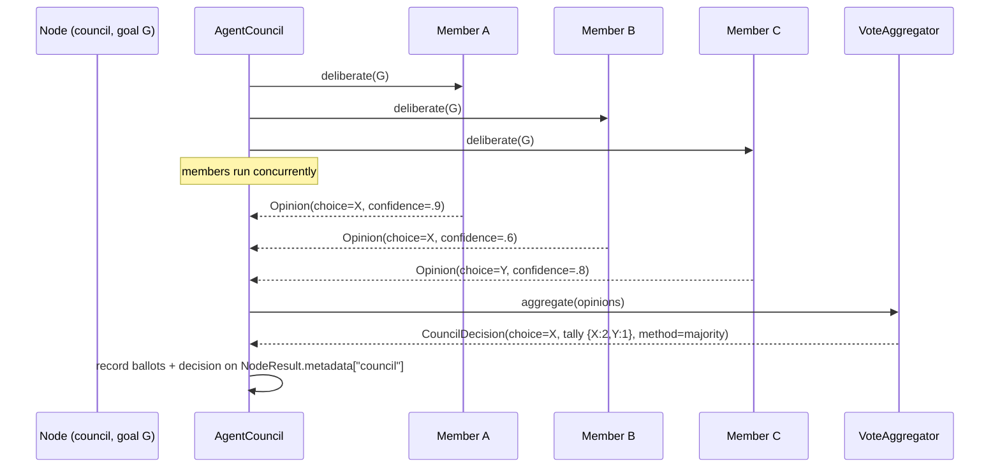

# SPEC-10: Agent Council — Deliberative Multi-Agent Decisions

> CEMAF can route a node to *one* agent (static or by auction, SPEC-09), but it
> cannot ask *several* agents the same question and decide collectively. This
> spec adds an **AgentCouncil**: N agents each produce an opinion on one goal,
> a pluggable **VoteAggregator** combines them into a single decision, and the
> outcome carries full provenance (who voted for what). It is the deliberative
> decision layer the eval hierarchy, halt gates, and auction only resemble.

**Status: Draft.** Implementation target: `cemaf/council/` (new module),
`cemaf/orchestration/dag.py` (`Node.council`), `cemaf/orchestration/services.py`,
`cemaf/orchestration/context_node_executor.py`.

## Contents

- [1. Context](#1-context)
- [2. Interface Contract (MDE)](#2-interface-contract-mde)
- [3. Invariants (DbC)](#3-invariants-dbc)
- [4. Acceptance Criteria (BDD)](#4-acceptance-criteria-bdd)
- [5. Out of Scope](#5-out-of-scope)
- [6. Dependencies](#6-dependencies)
- [7. Correctness Properties](#7-correctness-properties)
- [9. Observability Contract](#9-observability-contract)

## 1. Context

What exists today *resembles* a council but is not one:
- **Eval hierarchy** (`evals/hierarchy.py`) — tier1→2→3 is sequential *filtering*, not a vote.
- **QualityPolice + BudgetGuard** — independent unilateral halt gates; they don't confer.
- **DefaultAgentSelector** (SPEC-09) — single-round max-bid: picks *who runs*, not *what to decide*.
- **DeepAgentOrchestrator** — parent/child hierarchy, not peer deliberation.

None gather multiple agent perspectives on the *same* question and aggregate
them. An AgentCouncil fills exactly that gap — useful for high-stakes or
ambiguous decisions (which plan? is this output safe to ship? accept this
recovery?) where one agent's opinion is too thin.



Members run **concurrently** (asyncio.gather). A failed member is recorded as an
abstention, not a council failure — the council degrades, it doesn't crash.
Aggregation is a **pure function** of the opinion set, so the decision is
deterministic and replayable given the same opinions.

## 2. Interface Contract (MDE)

New module `cemaf/council/`:

```python
from collections.abc import Awaitable, Callable
from dataclasses import dataclass, field
from enum import StrEnum
from typing import Any, Protocol, runtime_checkable

from cemaf.agents.protocols import Agent
from cemaf.agents.base import AgentContext
from cemaf.core.types import JSON, AgentID


class AggregationMethod(StrEnum):
    MAJORITY = "majority"            # most votes wins; ties → tie_break
    WEIGHTED = "weighted"            # sum of confidence per choice wins
    QUORUM = "quorum"                # a choice needs >= quorum_fraction of votes, else NO_DECISION
    UNANIMOUS = "unanimous"          # all (non-abstaining) members must agree, else NO_DECISION


NO_DECISION = "__no_decision__"      # sentinel choice when aggregation reaches no verdict


@dataclass(frozen=True, slots=True)
class Opinion:
    """One member's vote on the goal."""
    member_id: AgentID
    choice: str                      # the option this member votes for
    confidence: float = 1.0          # in [0,1]; weight under WEIGHTED
    rationale: str = ""              # short human-readable justification
    abstained: bool = False          # True when the member failed or declined


@dataclass(frozen=True, slots=True)
class Ballot:
    """Provenance record of one member's participation."""
    member_id: AgentID
    choice: str
    confidence: float
    abstained: bool
    error: str | None = None


@dataclass(frozen=True, slots=True)
class CouncilDecision:
    choice: str                      # winning option, or NO_DECISION
    method: AggregationMethod
    tally: dict[str, float]          # choice → score (count or summed confidence)
    ballots: tuple[Ballot, ...]
    quorum_met: bool
    decided: bool                    # False when choice == NO_DECISION

    def to_metadata(self) -> JSON: ...   # projection for NodeResult.metadata["council"]


@runtime_checkable
class CouncilMember(Protocol):
    """An agent that can produce an Opinion. Any Agent is adaptable via a default adapter."""

    @property
    def id(self) -> AgentID: ...

    async def deliberate(self, *, goal: Any, context: AgentContext) -> Opinion: ...


@runtime_checkable
class VoteAggregator(Protocol):
    """BYO-X seam — combine opinions into a decision. Pure, deterministic."""

    def aggregate(self, *, opinions: tuple[Opinion, ...]) -> CouncilDecision: ...


@dataclass(frozen=True, slots=True)
class CouncilConfig:
    method: AggregationMethod = AggregationMethod.MAJORITY
    quorum_fraction: float = 0.5     # used by QUORUM; fraction of non-abstaining votes
    min_members: int = 1             # below this → NO_DECISION (degenerate council)


class DefaultVoteAggregator:
    """Implements all four AggregationMethods. Tie-break: lexically-smallest choice."""

    def __init__(self, *, config: CouncilConfig | None = None) -> None: ...
    def aggregate(self, *, opinions: tuple[Opinion, ...]) -> CouncilDecision: ...


class AgentCouncil:
    """Runs members concurrently, aggregates, records provenance."""

    def __init__(
        self,
        *,
        members: tuple[CouncilMember, ...],
        aggregator: VoteAggregator,
    ) -> None: ...

    async def decide(self, *, goal: Any, context: AgentContext) -> CouncilDecision: ...


def create_agent_council(
    *,
    members: tuple[Agent[Any, Any] | CouncilMember, ...],
    method: AggregationMethod = AggregationMethod.MAJORITY,
    quorum_fraction: float = 0.5,
    extract_choice: Callable[[object], str] | None = None,
) -> AgentCouncil:
    """Factory (BYO-X). Plain Agents are wrapped in an adapter that runs the agent and
    maps its AgentResult.output to an Opinion.choice via `extract_choice` (default: str())."""
    ...
```

## 3. Invariants (DbC)

1. **Concurrency, not crash**: members run concurrently; a member that raises or
   returns failure becomes an `abstained=True` Ballot — the council still
   produces a `CouncilDecision`.
2. **Pure aggregation**: `aggregate(opinions)` is deterministic — same opinion
   set ⇒ identical `CouncilDecision`. No I/O, no randomness.
3. **Tally completeness**: every non-abstaining opinion contributes to exactly
   one `tally` entry (its `choice`); abstentions contribute to none.
4. **Confidence bound**: every `Opinion.confidence` and weighted tally input is
   clamped to [0,1].
5. **Tie-break determinism**: under MAJORITY/WEIGHTED, a tie on top score is
   broken by lexically-smallest `choice` → unique winner.
6. **Quorum honesty**: under QUORUM, `decided=True` iff the winning choice's
   share of non-abstaining votes ≥ `quorum_fraction`; otherwise
   `choice == NO_DECISION`, `decided=False`, `quorum_met=False`.
7. **Unanimity**: under UNANIMOUS, `decided=True` iff all non-abstaining members
   share one choice AND at least one member voted; else NO_DECISION.
8. **Min-members floor**: if non-abstaining members < `config.min_members`, the
   decision is NO_DECISION regardless of method.
9. **Provenance completeness**: `CouncilDecision.ballots` has exactly one Ballot
   per member (including abstentions), recorded on
   `NodeResult.metadata["council"]` whether the node then succeeds or fails.

EARS form (selected):

```
WHEN a council member raises or returns failure, THE System SHALL record an abstaining Ballot and continue.
WHEN aggregation method is QUORUM AND the top choice's share < quorum_fraction, THE System SHALL return NO_DECISION.
WHEN non-abstaining members < min_members, THE System SHALL return NO_DECISION.
WHERE two choices tie on top score, THE System SHALL select the lexically-smallest choice.
```

Budget: 9 invariants — within ≤15.

## 4. Acceptance Criteria (BDD)

```gherkin
Feature: Agent Council deliberative decisions

  Scenario: Majority decides
    Given three members voting X, X, Y
    When the council decides with method=majority
    Then the decision choice is X with tally {X:2, Y:1} and decided is true

  Scenario: Weighted overrides raw count
    Given members voting X(0.3), X(0.3), Y(0.9)
    When the council decides with method=weighted
    Then the decision choice is Y (0.9 > 0.6)

  Scenario: Quorum not met yields NO_DECISION
    Given four members voting W, X, Y, Z (no majority)
    When the council decides with method=quorum and quorum_fraction=0.5
    Then the decision is NO_DECISION and decided is false and quorum_met is false

  Scenario: Unanimous agreement
    Given three members all voting X
    When the council decides with method=unanimous
    Then the decision choice is X and decided is true

  Scenario: Unanimous broken by one dissent
    Given three members voting X, X, Y
    When the council decides with method=unanimous
    Then the decision is NO_DECISION

  Scenario: Failed member abstains, council still decides
    Given two members voting X and one member that raises
    When the council decides with method=majority
    Then the decision choice is X
    And the failing member appears as an abstaining ballot with its error

  Scenario: Deterministic tie-break
    Given two members voting B and A (one each)
    When the council decides with method=majority
    Then the decision choice is A (lexically smallest)

  Scenario: Members run concurrently
    Given three members each sleeping 50ms
    When the council decides
    Then total wall-clock is well under 150ms (concurrent, not serial)

  Scenario: Below min_members yields NO_DECISION
    Given a council with min_members=3 and only 2 non-abstaining opinions
    When it decides
    Then the decision is NO_DECISION

  Scenario: Plain Agents adapted into members
    Given two plain Agents whose outputs map to choices via extract_choice
    When create_agent_council wraps them and decides
    Then each agent's output becomes an Opinion.choice and the vote tallies

  Scenario: Council node records provenance
    Given a council node executes
    Then NodeResult.metadata["council"] carries the decision + all ballots
```

11 scenarios — within ≤20.

## 5. Out of Scope

- **Multi-round debate** (members see each other's opinions and revise) — v1 is
  single-round; a `DebatingCouncil` is a future subclass.
- **LLM-judge as aggregator** — the default aggregators are deterministic;
  an LLM-based `VoteAggregator` is a valid BYO-X impl but not shipped here.
- **Dynamic member selection** — members are fixed at council construction
  (compose with SPEC-09 auction separately if needed).
- **Weighted-by-trust** — confidence is self-reported; a trust-ledger weighting
  is a future aggregator.
- **Persisting decisions** beyond `NodeResult.metadata`.

## 6. Dependencies

- `cemaf.agents.protocols.Agent`, `cemaf.agents.base.AgentContext`,
  `cemaf.core.types.AgentID`/`JSON`.
- `cemaf.orchestration.dag.Node` (`config` reuse), `services.RuntimeServices`,
  `context_node_executor.ContextNodeExecutor`.

## 7. Correctness Properties

### Property 1: Aggregation is a deterministic function of opinions

*For any* opinion set `O` and config `C`, `DefaultVoteAggregator(C).aggregate(O)`
returns the same `CouncilDecision` regardless of opinion ordering or invocation
count — winner unique via the lexical tie-break.

**Validates: §3 Invariants 2, 5; §4 Scenarios "Majority decides", "Deterministic tie-break"**

### Property 2: Graceful degradation

*For any* council where `k` of `n` members fail, the council returns a decision
computed over the `n−k` succeeding opinions, with `k` abstaining ballots — never
an exception.

**Validates: §3 Invariant 1; §4 Scenario "Failed member abstains"**

### Property 3: Quorum/unanimity honesty

*For any* opinion set, `decided=True` under QUORUM only when the winner's vote
share ≥ `quorum_fraction`, and under UNANIMOUS only when all non-abstaining
votes are identical. Otherwise `choice == NO_DECISION`.

**Validates: §3 Invariants 6, 7; §4 Scenarios "Quorum not met", "Unanimous broken"**

## 9. Observability Contract

- **Provenance**: `CouncilDecision.to_metadata()` → `NodeResult.metadata["council"]`
  = `{choice, method, decided, quorum_met, tally, ballots:[{member_id, choice,
  confidence, abstained, error}]}`.
- **Log events**:
  - `council.deliberation.started` — `node_id`, `member_count`, `method`
  - `council.member.abstained` — `member_id`, `error`
  - `council.decision` — `node_id`, `choice`, `decided`, `tally`
- **Metrics** (Prometheus, optional):
  - `cemaf_council_decisions_total{method, decided}` — counter
  - `cemaf_council_abstentions_total` — counter
