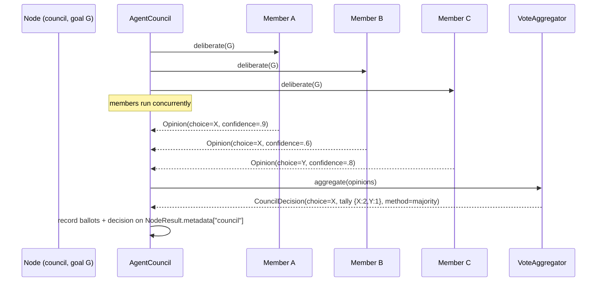

# SPEC-10: Agent Council — Deliberative Multi-Agent Decisions

> CEMAF can route a node to *one* agent (static or by auction, SPEC-09), but it
> cannot ask *several* agents the same question and decide collectively. This
> spec adds an **AgentCouncil**: N agents each produce an opinion on one goal,
> a pluggable **VoteAggregator** combines them into a single decision, and the
> outcome carries full provenance (who voted for what). It is the deliberative
> decision layer the eval hierarchy, halt gates, and auction only resemble.

**Status: Implemented.** Lives in `cemaf/council/` (`types.py`, `protocols.py`,
`aggregator.py`, `council.py`); `Node.council` in `cemaf/orchestration/dag.py`;
council node dispatch lives in `cemaf/orchestration/resolvers/council.py`
(`CouncilResolver`, part of the NodeResolver chain — it replaced the original
`_run_council` branch when execute_node migrated to the resolver seam); wired via
`RuntimeServices.council_aggregator` + `cemaf/bootstrap.py`. Unit tests:
`tests/unit/council/`; integration: `tests/integration/test_agent_council.py`.

> **Multi-round deliberation (shipped).** §5 originally listed multi-round debate
> as out of scope. It has since shipped via `CouncilConfig.rounds` (default 1):
> round 2+ broadcasts each member's prior-round opinions under
> `AgentContext.global_memory[COUNCIL_PRIOR_ROUND_KEY]` so members may revise;
> the council early-stops when a round's tally is unchanged. Reachable from the
> DAG via `Node.council(rounds=N)` (the `CouncilResolver` threads it into
> `CouncilConfig`). Tests: `tests/unit/council/test_multi_round.py`,
> `tests/integration/test_agent_council.py::test_council_node_rounds_propagates_through_resolver`.

## Contents

- [1. Context](#1-context)
- [2. Interface Contract (MDE)](#2-interface-contract-mde)
- [3. Invariants (DbC)](#3-invariants-dbc)
- [4. Acceptance Criteria (BDD)](#4-acceptance-criteria-bdd)
- [5. Out of Scope](#5-out-of-scope)
- [6. Dependencies](#6-dependencies)
- [7. Correctness Properties](#7-correctness-properties)
- [9. Observability Contract](#9-observability-contract)

## 1. Context

What exists today *resembles* a council but is not one:
- **Eval hierarchy** (`evals/hierarchy.py`) — tier1→2→3 is sequential *filtering*, not a vote.
- **QualityPolice + BudgetGuard** — independent unilateral halt gates; they don't confer.
- **DefaultAgentSelector** (SPEC-09) — single-round max-bid: picks *who runs*, not *what to decide*.
- **DeepAgentOrchestrator** — parent/child hierarchy, not peer deliberation.

None gather multiple agent perspectives on the *same* question and aggregate
them. An AgentCouncil fills exactly that gap — useful for high-stakes or
ambiguous decisions (which plan? is this output safe to ship? accept this
recovery?) where one agent's opinion is too thin.



Members run **concurrently** (asyncio.gather). A failed *or hung* member is
recorded as an abstention (per-member timeout), not a council failure — the
council degrades, it doesn't crash. Aggregation is a **pure function** of the
opinion set, so the decision is deterministic and replayable given the same
opinions.

### Shared option set (votes must align)

A vote is only meaningful if members choose from a **shared, enumerated option
set**. Free-form choice strings would never align (three agents asked "which
plan?" return three differently-worded strings → every tally bucket size 1 →
"majority" impossible). Therefore:

- A council decision is over a `CouncilQuestion(prompt, options)` where
  `options: tuple[str, ...]` is the closed candidate set.
- Each member's `Opinion.choice` **MUST** be one of `options` (or the member
  abstains). The default Agent-adapter maps the agent's output to the nearest
  option via `extract_choice`; a result that maps outside `options` is coerced
  to an **abstention** (recorded with the offending raw value), never a phantom
  tally bucket.
- `options` is the single source of truth for both "what can be voted for" and
  "what the tally keys are."

## 2. Interface Contract (MDE)

New module `cemaf/council/`:

```python
from collections.abc import Callable
from dataclasses import dataclass, field
from datetime import timedelta
from enum import StrEnum
from typing import Any, Protocol, runtime_checkable

from cemaf.agents.protocols import Agent
from cemaf.agents.base import AgentContext, AgentResult
from cemaf.core.types import JSON, AgentID


class AggregationMethod(StrEnum):
    MAJORITY = "majority"            # most votes wins; ties → lexical tie-break
    WEIGHTED = "weighted"            # sum of confidence per choice wins
    QUORUM = "quorum"                # winner needs >= quorum_fraction share, else no decision
    UNANIMOUS = "unanimous"          # all non-abstaining members agree, else no decision


@dataclass(frozen=True, slots=True)
class CouncilQuestion:
    """The closed decision: a prompt and the enumerated options members vote among."""
    prompt: str
    options: tuple[str, ...]         # the ONLY valid choices; also the tally key space

    def __post_init__(self) -> None:
        if len(self.options) < 2:
            raise ValueError("CouncilQuestion needs >= 2 options")
        if len(set(self.options)) != len(self.options):
            raise ValueError("CouncilQuestion options must be unique")


@dataclass(frozen=True, slots=True)
class Opinion:
    """One member's vote. choice MUST be in the question's options unless abstained."""
    member_id: AgentID
    choice: str | None               # an option, or None when abstaining
    confidence: float = 1.0          # weight under WEIGHTED
    rationale: str = ""
    abstained: bool = False
    raw_choice: str | None = None    # the un-coerced output when it mapped outside options

    def __post_init__(self) -> None:
        object.__setattr__(self, "confidence", min(1.0, max(0.0, self.confidence)))


@dataclass(frozen=True, slots=True)
class Ballot:
    """Provenance record of one member's participation."""
    member_id: AgentID
    choice: str | None
    confidence: float
    abstained: bool
    error: str | None = None

    def to_dict(self) -> JSON: ...


@dataclass(frozen=True, slots=True)
class CouncilDecision:
    winning_choice: str | None       # the option that won, or None = no decision (authoritative)
    method: AggregationMethod
    tally: dict[str, float]          # option → score (count or summed confidence)
    ballots: tuple[Ballot, ...]
    quorum_met: bool

    @property
    def decided(self) -> bool:
        return self.winning_choice is not None

    def to_metadata(self) -> JSON: ...   # projection for NodeResult.metadata["council"]


@runtime_checkable
class CouncilMember(Protocol):
    """Produces an Opinion on a question. Distinguished from a plain Agent by `deliberate`."""

    @property
    def id(self) -> AgentID: ...

    async def deliberate[GoalT](
        self, *, question: CouncilQuestion, goal: GoalT, context: AgentContext
    ) -> Opinion: ...


@runtime_checkable
class VoteAggregator(Protocol):
    """BYO-X seam — combine opinions into a decision. Pure, deterministic, no I/O."""

    def aggregate(
        self, *, question: CouncilQuestion, opinions: tuple[Opinion, ...]
    ) -> CouncilDecision: ...


@dataclass(frozen=True, slots=True)
class CouncilConfig:
    method: AggregationMethod = AggregationMethod.MAJORITY
    quorum_fraction: float = 0.5     # QUORUM: required share of non-abstaining votes (0,1]
    min_members: int = 1             # below this many non-abstaining votes → no decision
    member_timeout: timedelta = timedelta(seconds=30)   # per-member; hung member → abstention
    max_concurrency: int = 8         # semaphore cap on simultaneous member calls

    def __post_init__(self) -> None:
        if not (0.0 < self.quorum_fraction <= 1.0):
            raise ValueError("quorum_fraction must be in (0, 1]")


class DefaultVoteAggregator:
    """Implements all four methods. Tie-break: lexically-smallest option.

    Empty non-abstaining set ⇒ winning_choice=None (no division by zero).
    """

    def __init__(self, *, config: CouncilConfig | None = None) -> None: ...
    def aggregate(
        self, *, question: CouncilQuestion, opinions: tuple[Opinion, ...]
    ) -> CouncilDecision: ...


class AgentCouncil:
    """Runs members concurrently (bounded + timed), aggregates, records provenance."""

    def __init__(
        self,
        *,
        members: tuple[CouncilMember, ...],
        aggregator: VoteAggregator,
        config: CouncilConfig | None = None,
    ) -> None: ...

    async def decide[GoalT](
        self, *, question: CouncilQuestion, goal: GoalT, context: AgentContext
    ) -> CouncilDecision: ...


def create_agent_council[ResultT](
    *,
    members: tuple[Agent[Any, Any] | CouncilMember, ...],
    config: CouncilConfig | None = None,
    extract_choice: Callable[[ResultT], str] | None = None,
) -> AgentCouncil:
    """Factory (BYO-X). A member with a `deliberate` method is used as-is; any other
    Agent is wrapped in an adapter that runs `agent.run(goal)`, maps
    `AgentResult.output` to a choice via `extract_choice` (default: `str`), and:
      - if the agent fails OR the mapped choice is not in question.options → abstain
        (raw value preserved on Opinion.raw_choice / Ballot for provenance).
    """
    ...
```

### Council node + downstream flow

`Node.council(...)` (`dag.py` factory, `NodeType.AGENT` with
`config["council"] = {options, method, rounds, ...}`) is dispatched by
`CouncilResolver` in the NodeResolver chain — it matches on `config["council"]`
and returns its own `NodeResult` (it does **not** go through
`_build_goal`/`agent.run`). *(Originally a dedicated `_run_council()` branch in
`execute_node`; migrated to the resolver seam so adding a node "kind" is
registering a resolver, not a new `if`-branch.)*

- `NodeResult.output` = the `winning_choice` string (or `""` when no decision),
  so a downstream `$$node.output$$` ref and `EdgeCondition.JSON_RULE` can route
  on the verdict — the decision *steers* the DAG, not just decorates it.
- `NodeResult.metadata["council"]` = full `CouncilDecision.to_metadata()`.
- **No-decision is success with an empty output, not a failure.** A council that
  reaches no verdict is a legitimate outcome (deliberate abstention), distinct
  from a crash. `NodeResult.success = True`, `output = ""`,
  `metadata["council"]["winning_choice"] = None`. Downstream edges decide what a
  no-decision means (e.g. route to a fallback node); the council never silently
  injects a phantom choice. `min_members`/quorum failures take this path.

`RuntimeServices` gains `council_aggregator: VoteAggregator | None = None` (a
default `DefaultVoteAggregator` is used when a council node runs without one).

## 3. Invariants (DbC)

1. **Concurrency, not crash**: members run concurrently (bounded by
   `max_concurrency`); a member that raises, fails, or exceeds `member_timeout`
   becomes an `abstained=True` Ballot — the council still produces a
   `CouncilDecision`. Only `BaseException` (e.g. `SystemExit`, `CancelledError`)
   propagates; ordinary `Exception` → abstention.
2. **Pure aggregation**: `aggregate(question, opinions)` is deterministic — same
   inputs ⇒ identical `CouncilDecision`, independent of opinion ordering. No I/O,
   no randomness.
3. **Option-closed tally**: tally keys ⊆ `question.options`. An opinion whose
   `choice` is not in `options` is treated as an abstention (its raw value kept on
   the Ballot); it creates no phantom tally bucket.
4. **Tally completeness**: every non-abstaining opinion contributes to exactly
   one `tally` entry (its `choice`); abstentions contribute to none.
5. **Confidence bound**: `Opinion.confidence` is clamped to [0,1] at construction;
   weighted tallies sum clamped values.
6. **Empty-set safety**: when the non-abstaining set is empty (all abstained, or
   none voted), every method returns `winning_choice=None`, `quorum_met=False`,
   empty `tally` — no division by zero.
7. **Tie-break determinism**: under MAJORITY/WEIGHTED, a tie on top score is
   broken by lexically-smallest option → unique winner. Float ties are detected
   with a tolerance, not `==`.
8. **Quorum honesty**: under QUORUM, `winning_choice` is set iff the top option's
   share of non-abstaining votes ≥ `quorum_fraction`; else `winning_choice=None`,
   `quorum_met=False`.
9. **Unanimity**: under UNANIMOUS, `winning_choice` is set iff ≥1 member voted AND
   all non-abstaining members chose the same option; else None.
10. **Min-members floor**: if non-abstaining votes < `config.min_members`,
    `winning_choice=None` regardless of method.
11. **Provenance completeness**: `ballots` has exactly one Ballot per member
    (including abstentions), recorded on `NodeResult.metadata["council"]` whether
    the node result is success or no-decision.
12. **No-decision is success-with-empty-output**: a no-verdict council node
    returns `NodeResult.success=True`, `output=""`; a decided one returns
    `output=winning_choice`. A council node never returns `success=False` for a
    legitimate non-verdict (only for an internal crash).

EARS form (selected):

```
WHEN a council member raises, fails, or times out, THE System SHALL record an abstaining Ballot and continue.
WHEN the non-abstaining opinion set is empty, THE System SHALL return winning_choice=None without dividing by the vote count.
WHEN method is QUORUM AND the top option's share < quorum_fraction, THE System SHALL return winning_choice=None.
WHEN non-abstaining votes < min_members, THE System SHALL return winning_choice=None.
WHERE two options tie on top score, THE System SHALL select the lexically-smallest option.
IF an opinion's choice is not in question.options, THEN THE System SHALL treat it as an abstention.
```

Budget: 12 invariants — within ≤15.

## 4. Acceptance Criteria (BDD)

```gherkin
Feature: Agent Council deliberative decisions

  Scenario: Majority decides
    Given options (X, Y) and three members voting X, X, Y
    When the council decides with method=majority
    Then winning_choice is X with tally {X:2, Y:1} and decided is true

  Scenario: Weighted overrides raw count
    Given options (X, Y) and members voting X(0.3), X(0.3), Y(0.9)
    When the council decides with method=weighted
    Then winning_choice is Y (0.9 > 0.6)

  Scenario: Quorum not met yields no decision
    Given options (W, X, Y, Z) and four members voting W, X, Y, Z (no majority)
    When the council decides with method=quorum and quorum_fraction=0.5
    Then winning_choice is None and decided is false and quorum_met is false

  Scenario: Unanimous agreement
    Given options (X, Y) and three members all voting X
    When the council decides with method=unanimous
    Then winning_choice is X and decided is true

  Scenario: Unanimous broken by one dissent
    Given options (X, Y) and three members voting X, X, Y
    When the council decides with method=unanimous
    Then winning_choice is None

  Scenario: Failed member abstains, council still decides
    Given options (X, Y), two members voting X and one member that raises
    When the council decides with method=majority
    Then winning_choice is X
    And the failing member appears as an abstaining ballot with its error

  Scenario: Deterministic tie-break exercises the lexical rule
    Given the first member votes B and the second votes A (one each)
    When the council decides with method=majority
    Then the decision winning_choice is A (lexically smallest, NOT insertion order)

  Scenario: All members abstain yields no decision without crashing
    Given three members that all abstain (every method)
    When the council decides
    Then winning_choice is None, tally is empty, quorum_met is false, and no error is raised

  Scenario: Weighted tie broken lexically
    Given members voting A(0.5) and B(0.5) — an exact weighted tie
    When the council decides with method=weighted
    Then winning_choice is A (tie detected within tolerance, lexical break)

  Scenario: Members run concurrently (structural, not timing)
    Given three members each waiting on a shared asyncio.Barrier(3)
    When the council decides
    Then all three members reach the barrier (proving overlap; serial execution would deadlock)

  Scenario: Below min_members yields no decision
    Given a council with min_members=3 and only 2 non-abstaining opinions
    When it decides
    Then winning_choice is None

  Scenario: Choice outside options is coerced to abstention
    Given a member whose mapped choice "maybe" is not in options (A, B)
    When the council decides
    Then that member's ballot is abstained with raw_choice "maybe"
    And it contributes to no tally bucket

  Scenario: Plain Agents adapted into members
    Given two plain Agents whose run() outputs map to options A and B via extract_choice
    When create_agent_council wraps them and decides
    Then each agent's output becomes an Opinion.choice and the votes tally

  Scenario: Council node steers the DAG via its output
    Given a council node with output_key "verdict" that decides A
    When the node executes
    Then NodeResult.success is true and NodeResult.output is "A"
    And a downstream edge JSON_RULE on $$verdict$$ can route on it

  Scenario: No-decision council node is success with empty output
    Given a council node that reaches no verdict
    When it executes
    Then NodeResult.success is true and NodeResult.output is ""
    And metadata["council"]["winning_choice"] is null

  Scenario: Council node records full provenance
    Given a council node executes
    Then NodeResult.metadata["council"] carries winning_choice, method, tally, and one ballot per member
```

16 scenarios — within ≤20.

## 5. Out of Scope

- ~~**Multi-round debate**~~ — **shipped.** Members see each other's opinions and
  may revise via `CouncilConfig.rounds > 1` (no subclass needed — it's a config
  knob on the existing `AgentCouncil`). See the multi-round note above §1.
- **LLM-judge as aggregator** — the default aggregators are deterministic;
  an LLM-based `VoteAggregator` is a valid BYO-X impl but not shipped here.
- **Dynamic member selection** — members are fixed at council construction
  (compose with SPEC-09 auction separately if needed).
- **Weighted-by-trust** — confidence is self-reported; a trust-ledger weighting
  is a future aggregator.
- **Persisting decisions** beyond `NodeResult.metadata`.

## 6. Dependencies

- `cemaf.agents.protocols.Agent`, `cemaf.agents.base.{AgentContext, AgentResult}`,
  `cemaf.core.types.AgentID`/`JSON`.
- `cemaf.orchestration.dag.Node` (`config` reuse), `services.RuntimeServices`
  (new `council_aggregator` field), `context_node_executor.ContextNodeExecutor`.

> **§8 Eval Criteria omitted** — the shipped aggregators are deterministic pure
> functions; §3 invariants + §7 properties cover correctness. An LLM-judge
> `VoteAggregator` (§5, future) WOULD require §8 once LLM output gates a decision.

## 7. Correctness Properties

### Property 1: Aggregation is a deterministic function of (question, opinions)

*For any* question `Q`, opinion set `O`, and config `C`,
`DefaultVoteAggregator(C).aggregate(Q, O)` returns the same `CouncilDecision`
regardless of opinion ordering or invocation count — winner unique via the
lexical tie-break.

**Validates: §3 Invariants 2, 7; §4 Scenarios "Majority decides", "Deterministic tie-break exercises the lexical rule"**

### Property 2: Graceful degradation

*For any* council where `k` of `n` members fail or time out, the council returns
a decision computed over the `n−k` succeeding opinions, with `k` abstaining
ballots — never an exception (ordinary `Exception` only; `BaseException` propagates).

**Validates: §3 Invariants 1, 6; §4 Scenarios "Failed member abstains", "All members abstain"**

### Property 3: Quorum/unanimity honesty

*For any* opinion set, `winning_choice` is non-None under QUORUM only when the
winner's share ≥ `quorum_fraction`, and under UNANIMOUS only when ≥1 member voted
and all non-abstaining votes are identical. Otherwise `winning_choice is None`.

**Validates: §3 Invariants 8, 9; §4 Scenarios "Quorum not met", "Unanimous broken"**

## 9. Observability Contract

- **Provenance**: `CouncilDecision.to_metadata()` → `NodeResult.metadata["council"]`
  = `{winning_choice, method, decided, quorum_met, tally, ballots:[{member_id,
  choice, confidence, abstained, error}]}`.
- **Log events**:
  - `council.deliberation.started` — `node_id`, `member_count`, `method`, `options`
  - `council.member.abstained` — `member_id`, `error`/`raw_choice`
  - `council.decision` — `node_id`, `winning_choice`, `decided`, `tally`
- **Metrics** (Prometheus, optional):
  - `cemaf_council_decisions_total{method, decided}` — counter
  - `cemaf_council_abstentions_total` — counter
