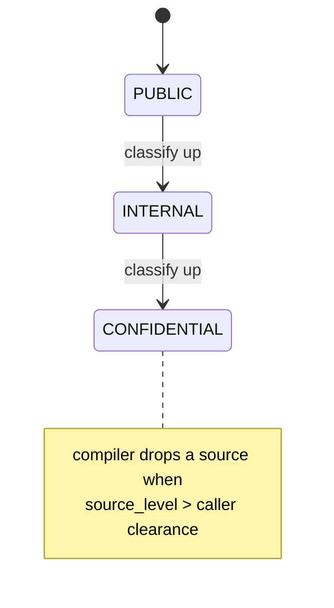

# SPEC-11 — Context Security Classification & Tool Risk Scoring

> Status: Draft · Last-Reviewed: 2026-06-25 · Depends on: SPEC-00, SPEC-01a
> Owns: data-governance metadata on context provenance; clearance-gated compilation;
> the tool-risk scoring contract its primary consumer (`iccha_autonomy`) implements.

## 1. Context

CEMAF tracks *who/why* every context change happened (`ContextPatch` provenance) but not
*how sensitive* the changed data is. The `PriorityContextCompiler` therefore cannot keep a
CONFIDENTIAL datum out of a prompt assembled for a low-clearance call — confidential and
public data are ranked identically. Separately, agent tool calls run with no graduated
risk signal: a `git push --force` and a `cat` are dispatched the same way.

This spec adds (a) a `SecurityLevel` classification to `ContextPatch` and a clearance gate
in the compiler (CEMAF **core**, additive), and (b) the *contract* for a `RiskScoringInterceptor`
that scores each agent node's intended tool action and can block high-risk calls (implemented
in the **consumer**, `iccha_autonomy`, against the existing `PreInterceptor` protocol — no core
change for the scorer itself).

Ported insight: ECC's `ecc2/src/observability/mod.rs` scores every tool call as
`base + file_sensitivity + blast_radius + irreversibility` with an auditable `reasons[]`
list and an `Allow/Review/RequireConfirmation/Block` action.



## 2. Interface Contract (MDE)

### 2.1 Core — `cemaf.context.patch`

```python
class SecurityLevel(StrEnum):
    PUBLIC = "public"
    INTERNAL = "internal"        # default — preserves current behavior
    CONFIDENTIAL = "confidential"

    @property
    def rank(self) -> int: ...   # PUBLIC=0 < INTERNAL=1 < CONFIDENTIAL=2

# ContextPatch (frozen dataclass) gains ONE field, defaulted:
#   security_level: SecurityLevel = SecurityLevel.INTERNAL
# to_dict() adds   "security_level": self.security_level.value
# from_dict() reads SecurityLevel(data.get("security_level", "internal"))   # old records OK
```

All `ContextPatch` factory classmethods (`set/delete/merge/append/from_tool/from_agent`)
gain an optional `security_level: SecurityLevel = SecurityLevel.INTERNAL` keyword.

### 2.2 Core — `cemaf.context.compiler.PriorityContextCompiler.compile`

The compiler consumes `(key, content)` tuples, NOT patches — so clearance is threaded
explicitly (it cannot read `ContextPatch.security_level` off the wire):

```python
async def compile(
    self,
    artifacts: tuple[tuple[str, str], ...],
    memories: tuple[tuple[str, str], ...],
    budget: TokenBudget,
    priorities: dict[str, int] | None = None,
    *,
    source_levels: dict[str, SecurityLevel] | None = None,  # key -> level; absent ⇒ INTERNAL
    clearance: SecurityLevel | None = None,                 # None ⇒ no gating (current behavior)
) -> CompiledContext: ...
```

Gate rule: when `clearance` is set, a source whose level `.rank > clearance.rank` is excluded
*before* the priority sort in `PriorityContextCompiler.compile`. Excluded keys are recorded in
`CompiledContext.metadata["security_excluded"]` (provenance, not silent drop).

### 2.3 Consumer — `RiskScoringInterceptor` (PreInterceptor, in iccha_autonomy)

```python
class RiskAction(StrEnum): ALLOW; REVIEW; REQUIRE_CONFIRMATION; BLOCK

@dataclass(frozen=True, slots=True)
class RiskAssessment:
    score: float                 # clamped [0,1]
    action: RiskAction
    reasons: tuple[str, ...]     # auditable; why this score

# score = clamp(base_tool_risk + file_sensitivity + blast_radius + irreversibility, 0, 1)
# action by configurable thresholds; BLOCK ⇒ PreflightDecision(REJECT, reason=...)
# every assessment emitted on the EventBus for audit.
```

## 3. Invariants (DbC)

1. `WHEN a ContextPatch is created WITHOUT security_level, THE System SHALL default it to INTERNAL.`
2. `WHEN from_dict reads a record lacking "security_level", THE System SHALL default to INTERNAL` (back-compat with all existing checkpoints).
3. `WHEN clearance is None, THE compiler SHALL behave identically to the pre-SPEC-11 compiler` (zero excluded by classification).
4. `IF a source level rank exceeds the caller clearance rank, THEN THE compiler SHALL exclude that source AND record its key under metadata["security_excluded"].`
5. `THE risk score SHALL always be in [0,1]` (clamped).
6. `WHEN RiskAction is BLOCK, THE interceptor SHALL return a REJECT PreflightDecision with a non-empty reason.`
7. `security_level SHALL NOT alter content_hash determinism` — same content ⇒ same hash regardless of classification.

Budget: 7 invariants.

## 4. Acceptance Criteria (BDD)

```gherkin
Feature: Context security classification

  Scenario: Default classification is INTERNAL
    Given a ContextPatch created without an explicit security_level
    Then its security_level is INTERNAL

  Scenario: Legacy checkpoint round-trips
    Given a serialized patch dict with no "security_level" key
    When it is loaded via from_dict and re-serialized
    Then security_level is INTERNAL and no error is raised

  Scenario: Confidential source excluded under low clearance
    Given an artifact "secrets" classified CONFIDENTIAL and "notes" classified PUBLIC
    When compile runs with clearance=INTERNAL
    Then "notes" is included and "secrets" is in metadata["security_excluded"]

  Scenario: No clearance means no gating
    Given a CONFIDENTIAL artifact
    When compile runs with clearance=None
    Then the artifact is eligible for selection exactly as before

Feature: Tool risk scoring

  Scenario: Destructive command is blocked
    Given an agent node whose intended action is "git push --force origin main"
    When the RiskScoringInterceptor runs PRE
    Then the assessment action is BLOCK and the node is REJECTed with reasons

  Scenario: Benign command is allowed
    Given an agent node whose intended action is a read-only "cat file"
    When the RiskScoringInterceptor runs PRE
    Then the assessment action is ALLOW and the node proceeds
```

Budget: 6 scenarios.

## 5. Out of Scope

- DataSource-level classification (SPEC-02 territory).
- Encryption / at-rest protection — this is routing metadata, not a crypto boundary.
- Per-field redaction within a source (whole-source gate only).
- Auto-classification of content (levels are set by the producer; inference is future work).

## 6. Dependencies

- SPEC-00 (ContextPatch provenance model), SPEC-01a (PreInterceptor spine — consumer uses it).
- No new third-party dependencies.

## 7. Correctness Properties

### Property 1: Backward compatibility
*For any* persisted patch produced before SPEC-11, loading and re-saving yields an INTERNAL
classification and never raises. **Validates: §3 Inv 2, §4 "Legacy checkpoint round-trips".**

### Property 2: Gate soundness
*For any* source set and clearance C, every source in the compiled output has level rank ≤ C.rank,
and every excluded-by-classification key appears in `security_excluded`.
**Validates: §3 Inv 4, §4 "Confidential source excluded under low clearance".**

### Property 3: Non-interference when ungated
*For any* inputs, `compile(..., clearance=None)` selects the identical source set as the
pre-SPEC-11 compiler. **Validates: §3 Inv 3, §4 "No clearance means no gating".**

Budget: 3 properties.

## 8. Eval Criteria

| Evaluator | Node | Mode | Threshold | Method |
|---|---|---|---|---|
| RiskScoreCalibration | agent node (PRE) | OBSERVE | block-rate on known-destructive set ≥ 0.95 | deterministic (pattern set) |

(Risk scoring is deterministic pattern-matching, not LLM judgment — OBSERVE only; promotion to
GATE is a consumer policy decision.)

## 9. Observability Contract

- **Log events** (core compiler): `context.security_excluded` with `{key, source_level, clearance}`.
- **Event** (consumer): `TOOL_RISK_ASSESSED` on the EventBus carrying `{score, action, reasons, node_id}`.
- **Attributes**: `brightagent.context.security_level`, `brightagent.tool.risk_score`,
  `brightagent.tool.risk_action`.
- **Metrics**: none (counts derivable from events).

## 10. Test Coverage Update

### a. In-repo layered (cemaf `tests/`)
- **L0 (surface)**: `ContextPatch` round-trip with/without `security_level`; `to_dict/from_dict`
  field presence (§2.1). Compiler `compile` signature accepts new kwargs (§2.2).
- **L2 (behavior)**: gate excludes CONFIDENTIAL under INTERNAL clearance & records key (Inv 4);
  `clearance=None` identical-selection property test (Inv 3); content_hash unchanged by level (Inv 7).

### b. Consumer (iccha_autonomy `tests/`)
- **Behavior**: `RiskScoringInterceptor` BLOCK→REJECT on destructive matrix; ALLOW on benign;
  `TOOL_RISK_ASSESSED` event emitted (§9). Built from a *real* captured agent-node action shape,
  not an invented dict (per testable-code "Fixtures Mirror Reality").

### Self-verification
`cd cemaf && uv run pytest && uv run mypy src && uv run ruff check`; then the consumer suite.
Confirm each §2/§3/§4 entry has a new test case before opening the PR.
