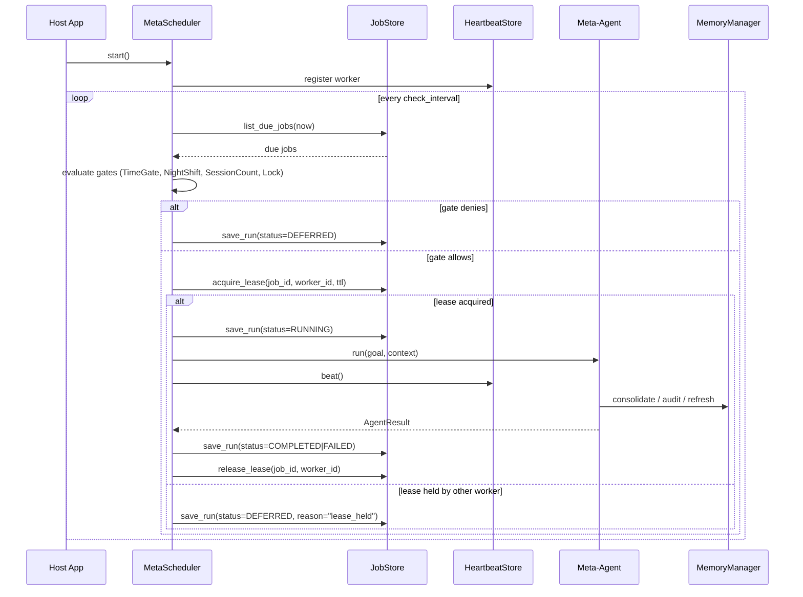

# SPEC-11: Dog-Fooded Meta-Scheduler

> CEMAF is a self-hosting framework. Its `meta/` layer carries meta-agents
> (`MetaAuditor`, `MetaSynthesizer`, `MetaArchitect`, `MetaKnowledgeGraph`,
> `DreamAgent`) that are intended to run AGAINST CEMAF itself —
> consolidating memory, analyzing traces, refreshing the knowledge graph,
> synthesizing new agents — but today no scheduling layer drives them.
> They exist as agents you have to call by hand.
>
> This spec defines the **dog-fooded meta-scheduler**: the durable,
> heartbeat-aware, quiet-hours-gated background runner that turns
> meta-agents into autonomous citizens. It is not generic infrastructure.
> It exists to make CEMAF run CEMAF on itself.

## 1. Context

### Why this exists

The `meta/` subsystem (`docs/architecture/spec-module-map.md`, CLAUDE.md §
Self-Hosting Engine) is built around four meta-agents and three pre-built
DAGs (`self_audit`, `feature_synthesis`, `knowledge_refresh`). These are
self-recursive: CEMAF using its own agents, tools, and DAGs to audit /
synthesize / consolidate itself. `DreamAgent` (memory consolidation) is a
fifth, the dreaming-mode workhorse from PR #164.

What's missing today: the **execution loop** that calls these on a
schedule, respects quiet hours, avoids double-running when work is already
in flight, and survives process restart with a record of what ran.

Without it, the meta layer is a library of methods nobody calls.

### The dog-fooding promise

> A CEMAF deployment, running for 24 hours unattended, must have
> consolidated its own memory, audited its own trace quality, and
> refreshed its own knowledge graph — using only CEMAF primitives, with no
> external scheduler (no cron, no k8s CronJob, no Celery).

That's the dog-fooding bar. The spec exists to satisfy it.

### What was deleted and why we're (selectively) restoring it

PR #193 deleted `ManagedScheduler`, `JobStore` / `InMemoryJobStore`,
`JobLease`, `JobRunRecord`, `JobRunStatus`, and the entire `heartbeats.py`
module (`HeartbeatStore`, `HeartbeatMonitor`, `WorkerHeartbeat`) — ~750
lines — on the grounds that no caller used them outside their own tests.

The audit was wrong about intent. The caller list was empty because the
wiring hadn't happened yet, not because no one wanted it. The dog-fooding
promise above is exactly what those modules existed to deliver.

This spec restores them on its own terms — not as a wholesale revert, but
as the minimum surface that satisfies the dog-fooding promise.

### Flow



## 2. Interface Contract (MDE)

```python
from collections.abc import Awaitable, Callable
from datetime import datetime, timedelta
from enum import StrEnum
from typing import Any, Protocol, runtime_checkable

from cemaf.core.types import JSON
from cemaf.scheduler.primitives import JobDefinition, JobKind
from cemaf.scheduler.protocols import JobResult


class JobRunStatus(StrEnum):
    DEFERRED = "deferred"      # gate denied or lease unavailable
    RUNNING = "running"
    COMPLETED = "completed"
    FAILED = "failed"
    TIMEOUT = "timeout"
    CANCELLED = "cancelled"


class WorkerHeartbeatStatus(StrEnum):
    ACTIVE = "active"
    STALE = "stale"
    MISSING = "missing"


@dataclass(frozen=True)
class JobLease:
    job_id: str
    worker_id: str
    acquired_at: datetime
    expires_at: datetime


@dataclass(frozen=True)
class JobRunRecord:
    run_id: str
    job_id: str
    worker_id: str
    status: JobRunStatus
    started_at: datetime
    completed_at: datetime | None
    result: JSON | None
    error: str | None
    metadata: JSON


@dataclass(frozen=True)
class WorkerHeartbeat:
    worker_id: str
    beat_at: datetime
    expires_at: datetime
    in_flight_jobs: tuple[str, ...]
    metadata: JSON


@runtime_checkable
class JobStore(Protocol):
    async def save_job(self, definition: JobDefinition) -> None: ...
    async def get_job(self, job_id: str) -> JobDefinition | None: ...
    async def list_jobs(self) -> tuple[JobDefinition, ...]: ...
    async def delete_job(self, job_id: str) -> bool: ...
    async def acquire_lease(self, job_id: str, worker_id: str, ttl_seconds: float) -> bool: ...
    async def release_lease(self, job_id: str, worker_id: str) -> bool: ...
    async def get_lease(self, job_id: str) -> JobLease | None: ...
    async def save_run(self, record: JobRunRecord) -> None: ...
    async def get_run(self, run_id: str) -> JobRunRecord | None: ...
    async def list_runs(
        self, *, job_id: str | None = None, limit: int = 100,
    ) -> tuple[JobRunRecord, ...]: ...


@runtime_checkable
class HeartbeatStore(Protocol):
    async def save(self, heartbeat: WorkerHeartbeat) -> None: ...
    async def get(self, worker_id: str) -> WorkerHeartbeat | None: ...
    async def list_active(self, *, now: datetime | None = None) -> tuple[WorkerHeartbeat, ...]: ...
    async def list_stale(self, *, now: datetime | None = None) -> tuple[WorkerHeartbeat, ...]: ...
    async def delete(self, worker_id: str) -> bool: ...


class MetaScheduler(Protocol):
    """Durable, heartbeat-aware scheduler — built for meta-agent execution."""
    worker_id: str

    async def register_job(
        self,
        *,
        definition: JobDefinition,
        handler: Callable[[], Awaitable[Any]],
    ) -> None: ...

    async def unregister_job(self, job_id: str) -> bool: ...
    async def list_jobs(self) -> tuple[JobDefinition, ...]: ...
    async def list_runs(self, *, job_id: str | None = None, limit: int = 100) -> tuple[JobRunRecord, ...]: ...

    async def start(self) -> None: ...
    async def stop(self, *, delete_heartbeat: bool = False) -> None: ...

    async def run_now(self, job_id: str) -> JobResult: ...
    async def worker_status(self) -> WorkerHeartbeatStatus: ...
    async def list_stale_workers(self) -> tuple[WorkerHeartbeat, ...]: ...
```

**Factory contract:**

```python
def create_meta_scheduler(
    *,
    worker_id: str | None = None,
    job_store: JobStore | None = None,         # default InMemoryJobStore
    heartbeat_store: HeartbeatStore | None = None,  # default InMemoryHeartbeatStore
    max_concurrent_jobs: int = 10,
    check_interval_seconds: float = 1.0,
    heartbeat_interval_seconds: float = 10.0,
    heartbeat_ttl_seconds: float = 30.0,
    metrics: MetricsCollector | None = None,
) -> MetaScheduler: ...
```

**Meta-agent registration helpers** (one entry per pre-built meta DAG):

```python
def register_self_audit_job(
    scheduler: MetaScheduler, *,
    interval: timedelta = timedelta(hours=6),
    nightshift: NightShiftWindow | None = NightShiftWindow.default_utc(),
) -> JobDefinition: ...

def register_knowledge_refresh_job(
    scheduler: MetaScheduler, *,
    interval: timedelta = timedelta(hours=12),
    nightshift: NightShiftWindow | None = NightShiftWindow.default_utc(),
) -> JobDefinition: ...

def register_dreaming_job(
    scheduler: MetaScheduler, *,
    memory_manager: MemoryManager,
    interval: timedelta = timedelta(hours=4),
    min_sessions: int | None = 3,
    nightshift: NightShiftWindow | None = NightShiftWindow.default_utc(),
) -> JobDefinition: ...
```

## 3. Invariants (DbC)

1. **Singleton enforcement.** WHEN a job has `singleton=True`, THE System SHALL allow only one in-flight run across all workers — enforced via lease acquisition before handler dispatch.
2. **Lease TTL bounds.** A lease MUST expire after `lease_ttl_seconds`; expired leases SHALL be reclaimable by any worker.
3. **Run record completeness.** Every dispatched handler invocation SHALL produce a `JobRunRecord` with `started_at` set; on completion `completed_at` and final `status ∈ {COMPLETED, FAILED, TIMEOUT, CANCELLED, DEFERRED}` SHALL be set.
4. **Heartbeat freshness.** WHILE a scheduler is running, THE System SHALL emit a heartbeat at least every `heartbeat_interval_seconds` to its `HeartbeatStore`; the heartbeat `expires_at` SHALL be `beat_at + heartbeat_ttl_seconds`.
5. **Gate veto is observable.** IF an `ExecutionGate` denies execution, THE System SHALL record a `JobRunRecord` with `status=DEFERRED` and a `metadata.reason` field naming which gate vetoed and why.
6. **No silent skip.** WHEN a job's trigger fires but execution is denied (gate, lease, disabled), THE System SHALL emit either a deferred run record or a structured log event — never both nothing.
7. **Stop is bounded.** `stop()` SHALL complete within `max(timeout_seconds for in-flight jobs) + 5s`; pending runs SHALL be marked `CANCELLED` if not finished by then.
8. **JobKind tagging.** Every `JobDefinition` registered via the meta-agent helpers SHALL carry `kind ∈ {DREAM, SYSTEM}` — never `STANDARD`; this is what makes the operator-facing classification useful.

## 4. Acceptance Criteria (BDD)

```gherkin
Feature: Dog-fooded meta-scheduler

  Scenario: Self-audit runs on its declared interval
    Given a MetaScheduler with register_self_audit_job(interval=6h)
    And the host app has been running for 6h 5m
    When list_runs(job_id="self_audit") is called
    Then exactly one COMPLETED run record exists
    And the run's payload contains the audit report shape declared by SPEC-04

  Scenario: Dreaming defers outside nightshift window
    Given a MetaScheduler with register_dreaming_job(nightshift=01:00-05:00 UTC)
    And the current time is 14:00 UTC
    When the dreaming job's trigger fires
    Then a JobRunRecord is saved with status=DEFERRED, metadata.reason="nightshift_closed"
    And the DreamAgent handler is not invoked

  Scenario: Singleton enforcement across two workers
    Given two MetaScheduler instances sharing a JobStore, both registered for "knowledge_refresh"
    When both workers' triggers fire within 1 second of each other
    Then exactly one worker acquires the lease and runs the job
    And the other worker saves a DEFERRED record with metadata.reason="lease_held"

  Scenario: Worker dies mid-run, lease eventually frees
    Given a MetaScheduler running a singleton job with lease_ttl_seconds=10
    And the worker process is killed after the handler starts but before completion
    When 11 seconds elapse and another worker's trigger fires
    Then the second worker acquires the lease and runs the job
    And the abandoned RUNNING record remains visible in list_runs (operator-debuggable)

  Scenario: Stop is bounded and records cancellation
    Given a MetaScheduler with an in-flight job that sleeps 60s
    When stop() is called and 5s elapses past the handler's declared timeout
    Then the handler is cancelled
    And its JobRunRecord status is CANCELLED with metadata.reason="scheduler_stop"

  Scenario: Heartbeat goes stale, status reports correctly
    Given a MetaScheduler with heartbeat_ttl_seconds=30 that stopped beating 45s ago
    When list_stale_workers() is called from another worker
    Then the dead worker appears with status STALE
    And after 2*ttl it transitions to MISSING

  Scenario: Bootstrap wires the three default jobs
    Given a host app calls bootstrap_meta_dogfood(memory_manager=..., scheduler=...)
    When list_jobs() is called
    Then it returns exactly: ["self_audit", "knowledge_refresh", "dreaming_mode"]
    And each has JobKind.SYSTEM (audit, knowledge) or JobKind.DREAM (dreaming)
```

## 5. Out of Scope

- **Distributed coordination at scale.** No Raft, no Zookeeper, no etcd. The lease/heartbeat model is good enough for single-digit workers sharing a store. If you need 100-worker fleets, use a real distributed scheduler.
- **Cross-host messaging.** Workers coordinate only via the shared `JobStore`/`HeartbeatStore` — no direct worker-to-worker calls.
- **Generic background-job platform.** This is not Celery / Sidekiq / RQ. It is the runner for *CEMAF's own meta-agents*. The `JobKind` tag intentionally lists `DREAM` and `SYSTEM`; if you find yourself adding `EMAIL_DELIVERY`, you're in the wrong tool.
- **Persistent store implementations beyond in-memory.** A SQLite-backed `JobStore` is a follow-up (clearly desirable for dog-fooding survivability across restarts, but not on the critical path for v1 of this spec).
- **Web UI / Admin dashboard.** Operator visibility is via `list_jobs`, `list_runs`, `list_stale_workers` + structured logs.

## 6. Dependencies

- **SPEC-00** — overall self-hosting architecture
- `cemaf.scheduler.executor.AsyncJobExecutor` — the underlying job runner (unchanged)
- `cemaf.scheduler.primitives.JobDefinition`, `JobKind` — kept from #193, used as-is
- `cemaf.scheduler.nightshift.NightShiftWindow`, `NightShiftGate`, `NightShiftTrigger` — kept, used as-is
- `cemaf.scheduler.gates` (`ExecutionGate`, `LockGate`, `SessionCountGate`, `TimeGate`) — kept, used as-is
- `cemaf.meta.agents.{MetaAuditor, MetaSynthesizer, DreamAgent, ...}` — the agents being scheduled (no changes)
- `cemaf.meta.dags.{self_audit, feature_synthesis, knowledge_refresh}` — the DAGs the jobs invoke (no changes)
- `cemaf.memory.manager.MemoryManager` — DreamAgent's consolidation target

## 7. Correctness Properties

### Property 1: Singleton invariant

*For any* singleton `JobDefinition` and any number of `MetaScheduler` instances sharing a `JobStore`, at most one handler invocation is active for that job at any wall-clock instant.

**Validates: §3 Invariant 1, §4 Scenario "Singleton enforcement across two workers"**

### Property 2: No silent skip

*For any* trigger firing, the resulting effect is observable: either a `JobRunRecord` is persisted, or a structured log event names the cause of skip. The empty case (trigger fires, nothing observable happens) is impossible.

**Validates: §3 Invariant 6, §4 Scenario "Dreaming defers outside nightshift window"**

### Property 3: Lease liveness

*For any* dead worker holding a lease with `ttl_seconds=T`, a competing worker's `acquire_lease` call succeeds within `T + check_interval_seconds`.

**Validates: §3 Invariant 2, §4 Scenario "Worker dies mid-run, lease eventually frees"**

## 8. Eval Criteria

Not applicable — this spec produces deterministic infrastructure, not LLM output. Quality is enforced via §3 invariants and §4 scenarios.

## 9. Observability Contract

- **Spans**:
  - `cemaf.scheduler.meta.run` with attributes `job.id`, `job.kind`, `worker.id`, `run.id`, `run.status`
  - `cemaf.scheduler.meta.gate` with `gate.name`, `gate.decision`, `gate.reason`
  - `cemaf.scheduler.meta.heartbeat` with `worker.id`, `worker.status`, `in_flight.count`
- **Log events** (structured): `meta_scheduler.run.started`, `meta_scheduler.run.completed`, `meta_scheduler.run.deferred`, `meta_scheduler.run.cancelled`, `meta_scheduler.worker.heartbeat`, `meta_scheduler.worker.stale_detected`
- **Metrics**:
  - `cemaf.scheduler.meta.jobs.registered` (counter, tags: `kind`, `worker_id`)
  - `cemaf.scheduler.meta.jobs.completed` (counter, tags: `job_id`, `status`, `worker_id`)
  - `cemaf.scheduler.meta.runs.deferred` (counter, tags: `job_id`, `reason`)
  - `cemaf.scheduler.meta.lease.contention` (counter, tags: `job_id`)
  - `cemaf.scheduler.meta.workers.stale` (gauge, tags: `worker_id`)

## 10. Test Coverage Update

### a. In-repo layered evals

**L0 (surface)** — per §2 entry, in `tests/unit/scheduler/`:
- `test_meta_scheduler_protocols.py` — every method on `MetaScheduler`, `JobStore`, `HeartbeatStore` has a contract test asserting signature + return shape
- `test_job_run_record.py` — `JobRunRecord` field validity (no completed_at while status=RUNNING, etc.)

**L1 (orchestration)** — in `tests/unit/scheduler/test_meta_scheduler_dispatch.py`:
- Trigger fires → gate evaluation → handler dispatched (one case per gate type)
- Trigger fires → singleton lease check → handler skipped if held
- `register_self_audit_job` / `register_knowledge_refresh_job` / `register_dreaming_job` → correct `JobDefinition` + handler shape

**L2 (behavior)** — in `tests/unit/scheduler/test_meta_scheduler_behavior.py`:
- One case per §3 invariant (1-8)
- Failure paths: handler raises → status=FAILED, error captured
- Timeout: handler exceeds `timeout_seconds` → status=TIMEOUT

### b. End-to-end / cross-repo

In `tests/integration/`:
- `test_meta_dogfood_self_audit.py` — real `MetaScheduler` + real `AsyncJobExecutor` + real `MetaAuditor` agent over a seeded EventBus; assert audit report appears in `list_runs` after the interval
- `test_meta_dogfood_dreaming.py` — real `MemoryManager` (sqlite) + `DreamAgent` + `MetaScheduler`; seed sessions; advance trigger; assert `consolidated_count >= 1` in the run record
- `test_meta_dogfood_lease.py` — two `MetaScheduler` instances sharing a `JobStore`; race their triggers; assert exactly one run + one deferred-with-reason
- `test_meta_dogfood_24h_simulation.py` — fast-forward clock, run 24h of triggers; assert all three default jobs ran at least once each, no silent skips

### Self-verification

- All existing scheduler / meta tests remain green
- `make check` passes
- `docs/architecture/build_graph_data.py` regenerated and committed
