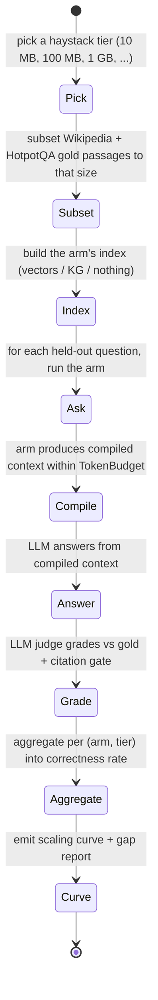

# SPEC-11: Needle-in-Haystack Benchmark — Multi-Hop QA at Scale

> "Find the needle in a petabyte haystack" is CEMAF's pitch. This spec turns that pitch
> into a measurement: end-to-end answer correctness on real-corpus multi-hop questions,
> across haystack sizes that grow by orders of magnitude. The result is a curve, not a
> point — with the petabyte claim explicitly framed as a projection band, not a
> demonstrated capability.

## Contents

- [Glossary](#glossary)
- [1. Context](#1-context)
- [2. Interface Contract (MDE)](#2-interface-contract-mde)
- [3. Invariants (DbC)](#3-invariants-dbc)
- [4. Acceptance Criteria (BDD)](#4-acceptance-criteria-bdd)
- [5. Out of Scope](#5-out-of-scope)
- [6. Dependencies](#6-dependencies)
- [7. Correctness Properties](#7-correctness-properties)
- [8. Eval Criteria](#8-eval-criteria)
- [9. Observability Contract](#9-observability-contract)
- [10. Gap Report](#10-gap-report)

## Glossary

| Term | Meaning |
|---|---|
| **Haystack** | The full text corpus a question is asked against. Sized in MB/GB; grows across runs. |
| **Needle** | The set of supporting passages that *must* be combined to answer a question correctly. Comes labeled with the dataset, not planted. |
| **Multi-hop question** | A question whose answer requires combining facts from ≥ 2 distinct documents (HotpotQA's defining shape). |
| **Distributed needle** | A multi-hop question whose supporting passages are spread across documents that share no surface-level keywords — the case naive vector RAG misses. |
| **Arm** | One assembly of CEMAF capabilities under test. SPEC-11 fixes three: full stack, KG-ablated, naive dump. |
| **Compiled context** | The bytes the LLM actually sees for a question, after retrieval + ranking + compaction under a `TokenBudget`. |
| **Citation gate** | A post-eval check that rejects answers not grounded in the compiled context (defends against memorized-answer false positives). |
| **Scaling curve** | End-to-end correctness rate plotted against haystack size on log axes, fit + extrapolated with a stated projection band. |
| **Gap report** | A named-and-counted list of capabilities the petabyte claim implies but the measured scaling curve has not demonstrated (§10). |

## 1. Context

CEMAF's umbrella claim (SPEC-00 *Enterprise Context Brain*) is that a CEMAF DAG can resolve
the knowledge a question needs by *pulling* from large enterprise sources on demand, instead
of pre-stuffing a single LLM window. The marketing form of that claim is "find the needle in
a petabyte haystack." Today there is no measurement of where CEMAF actually sits on that axis —
the existing `benchmarks/run_benchmarks.py` measures framework micro-ops (DAG dispatch,
EventBus latency), not retrieval quality on a real corpus.

This spec defines a **multi-hop, real-corpus, scaling-curve** benchmark. We use **HotpotQA**
(113k questions over Wikipedia, with labeled supporting paragraphs per question) because it
is the field-standard multi-hop QA dataset — real text, real questions, third-party answer
keys, no synthetic data. We measure **end-to-end answer correctness** (LLM-graded against the
gold answer, with a citation gate to defend against memorized-answer false positives). We
sweep haystack size across orders of magnitude (10 MB → 100 MB → 1 GB → as large as the
hardware allows) and compare three arms:

1. **CEMAF full stack** — `HybridRetriever` + `MemoryBackedKnowledgeGraph` + `Compactor` +
   `PriorityContextCompiler` under a `TokenBudget`. The system under test.
2. **CEMAF without KG (ablation)** — same stack, KG hop-traversal disabled; isolates how much
   of any win is due to multi-hop graph traversal versus vector retrieval alone.
3. **Naive full-context dump** — concatenate retrieved-or-truncated text into the model
   window with no priority compilation. The honest baseline that breaks first as the haystack
   grows; the inflection point where CEMAF starts winning is the headline.

The **petabyte claim is not directly demonstrated** — that is unrunnable on a laptop. Instead
we report (a) the measured curve up to the largest tier the hardware supports and (b) a
named gap report (§10) of what would have to be true at PB scale that has not been shown.
This shape — measure across orders, fit, project with named caveats — is how scaling claims
in this field are defensibly made.



## 2. Interface Contract (MDE)

### 2.1 New package `benchmarks/niah/`

Lives outside `src/cemaf/` so CEMAF stays library-only. Strict types, frozen dataclasses,
factories that take a real `RuntimeServices`-style bag — no module-level singletons.

```python
# benchmarks/niah/schema.py — typed results model

class Arm(Enum):
    CEMAF_FULL = "cemaf_full"          # vector + KG + compactor + priority compiler
    CEMAF_NO_KG = "cemaf_no_kg"        # ablation: vector + compactor + priority, KG OFF
    NAIVE_DUMP = "naive_dump"          # baseline: top-k concat to window, truncate beyond

@dataclass(frozen=True)
class HaystackTier:
    label: str           # "10MB", "100MB", "1GB", ...
    size_bytes: int
    doc_count: int

@dataclass(frozen=True)
class QuestionRun:
    question_id: str
    arm: Arm
    tier: HaystackTier
    rep: int                    # repetition index for variance
    compiled_tokens: int        # bytes the LLM actually saw
    compile_ms: int             # retrieval+compaction wall time
    answer_ms: int              # LLM call wall time
    cost_usd: float
    answer_text: str
    judged_correct: bool
    citation_grounded: bool     # answer's claims trace to compiled context
    error: str | None = None

@dataclass(frozen=True)
class ArmAggregate:
    arm: Arm
    tier: HaystackTier
    n: int
    correctness_rate: float        # mean(judged_correct AND citation_grounded)
    correctness_stderr: float
    p50_compile_ms: int
    p50_answer_ms: int
    mean_cost_usd: float

@dataclass(frozen=True)
class ScalingCurve:
    arm: Arm
    points: tuple[ArmAggregate, ...]   # one per tier, ordered by size_bytes
```

### 2.2 Runner contracts

```python
# Pure functions; arms are built from a config, not patched in.
def build_arm(*, arm: Arm, tier: HaystackTier, services: NiahServices) -> ArmRunner: ...

class ArmRunner(Protocol):
    async def answer(self, *, question: HotpotQuestion) -> QuestionRun: ...
```

`NiahServices` is a frozen container (LLMClient, EmbeddingProvider, VectorStore factory, KG
factory, judge LLM) — same DI shape CEMAF already uses, no globals.

### 2.3 Datasets module

```python
# benchmarks/niah/datasets.py
def load_hotpotqa(*, split: str, n: int, seed: int) -> tuple[HotpotQuestion, ...]: ...
def build_haystack(*, tier: HaystackTier, gold_passages: tuple[str, ...]) -> tuple[Document, ...]: ...
```

`build_haystack` ALWAYS includes the gold supporting paragraphs (the answer must be physically
recoverable from the corpus) plus filler from a pinned Wikipedia dump until `tier.size_bytes`
is reached. The seed is logged.

## 3. Invariants (DbC)

1. **Honest haystack.** For every question, the gold supporting passages are present in the
   haystack at every tier. A failure to retrieve them is a *retrieval* failure, never an
   *availability* failure.
   - `WHEN build_haystack returns, THE System SHALL include every gold passage for every question.`
2. **Same model across arms.** All three arms call the same answering model with the same
   `LLMConfig` for a given run. Only the **compiled context** differs by arm.
3. **Same judge across arms.** Answer grading uses one judge model + one prompt across all
   arms; each (question, gold, predicted) triple is graded once.
4. **Citation gate is structural.** An answer that is judged correct but whose claims do not
   trace to the compiled context counts as `judged_correct=True, citation_grounded=False`,
   and the **headline metric uses both fields ANDed** — defends against memorized-answer
   inflation.
5. **No leakage between arms.** Each `(arm, tier, rep)` run uses a fresh index, fresh
   retriever, fresh KG; the naive arm has *no* reference to a `KnowledgeGraph` or
   `PriorityContextCompiler`.
6. **Real failure surfaces.** If an arm errors on a question (timeout, OOM, retrieval miss),
   it is recorded as `judged_correct=False` with `error` populated — never silently dropped.
7. **Gap report is non-empty.** §10 lists every capability the petabyte claim implies but
   this benchmark does not exercise. Shipping with §10 empty is a spec violation.

Budget: 7 invariants (≤15).

## 4. Acceptance Criteria (BDD)

```gherkin
Feature: Multi-hop QA at scale on CEMAF

  Scenario: Headline metric is correctness AND citation-grounded
    Given an answer judged correct by the judge
    When its claims do not trace to the compiled context
    Then the headline metric counts it as a failure (defends vs memorization)

  Scenario: Naive arm degrades as the haystack grows
    Given the naive_dump arm
    When the haystack grows from 10 MB to 1 GB
    Then truncation kicks in and correctness rate falls (the inflection)

  Scenario: CEMAF full stack holds correctness as the haystack grows
    Given the cemaf_full arm
    When the haystack grows from 10 MB to 1 GB
    Then correctness does NOT fall by more than the projection band's stated tolerance

  Scenario: KG ablation isolates the multi-hop value
    Given a multi-hop question whose supporting passages share no keywords
    When cemaf_no_kg and cemaf_full run on the same tier
    Then cemaf_full's correctness exceeds cemaf_no_kg's on the multi-hop subset

  Scenario: Same model, same judge across arms
    Given a single benchmark run
    When any arm calls the answering or judge LLM
    Then the model id, prompt, and decoding params are identical across arms

  Scenario: Gold passages are present at every tier
    Given any haystack tier
    When build_haystack returns
    Then for every question in the run, every gold passage is in the corpus

  Scenario: Reported result includes a gap report
    Given a finished benchmark run
    When the report is rendered
    Then §10 names every capability the petabyte claim implies but this run does not exercise
```

Budget: 7 scenarios (≤20).

## 5. Out of Scope

- **Direct petabyte demonstration.** Hardware-bound; covered by the projection band + §10
  gap report instead.
- **Synthetic haystacks.** Explicitly excluded — the framework must perform on real,
  uncurated text or the claim is moot.
- **End-user latency targets.** This is a correctness benchmark; latency is recorded as a
  diagnostic, not a gate.
- **Optimizing CEMAF for HotpotQA.** Tuning to the dataset is forbidden; if a result is bad,
  fix the framework or the spec, not the benchmark.
- **Customer-corpus benchmark.** Phase 2 — sourcing/anonymizing is weeks of work.
- **Index-build cost amortization.** Reported, not optimized; the win must be visible
  end-to-end including index build.

## 6. Dependencies

- `cemaf.retrieval` — `HybridRetriever`, `VectorStore`, `EmbeddingProvider`.
- `cemaf.memory` — `Compactor`, `MemoryManager` (semantic store backing the KG).
- `cemaf.knowledge` — `MemoryBackedKnowledgeGraph`, `HubKnowledgeGraph` (SPEC-07).
- `cemaf.context` — `PriorityContextCompiler`, `TokenBudget`.
- `cemaf.llm` — `LLMClient` adapter for the answering model + the judge model.
- HotpotQA distractor split (Apache-2.0 license; pinned commit/tag).
- A pinned Wikipedia dump slice for filler (CC-BY-SA; size-bounded by tier).
- Hardware floor: developer laptop (16+ GB RAM); GB tier may require disk-backed pgvector.

## 7. Correctness Properties

### Property 1: Citation gate disarms memorization
*For any* question whose gold answer the answering model could plausibly memorize, the
**headline metric** uses `judged_correct AND citation_grounded` — so a correct memory without
support in the compiled context does not inflate any arm.
**Validates: §3 Invariant 4, §4 Scenario "Headline metric is correctness AND citation-grounded".**

### Property 2: Arm comparison is causally clean
*For any* `(question, tier, rep)`, the only difference between arms is the compiled context;
the answering model id, prompt template, and decoding params are byte-identical.
**Validates: §3 Invariant 2, §3 Invariant 5.**

### Property 3: The answer is physically reachable
*For any* question at any tier, every gold supporting passage is present in the haystack;
arms can fail to *find* them but cannot fail because they are *missing*.
**Validates: §3 Invariant 1.**

### Property 4: The petabyte claim is bounded by the projection band
*For any* extrapolation beyond the largest measured tier, the report states (a) the curve
fit, (b) the projection band, and (c) the §10 gaps that would have to be closed for the band
to hold at PB scale. No bare "scales to PB" claim is made.
**Validates: §3 Invariant 7.**

Budget: 4 properties (≤15).

## 8. Eval Criteria

| Evaluator | What it judges | Mode | Threshold | Method |
|---|---|---|---|---|
| HotpotJudge | answer matches gold (semantic equivalence, not string) | OBSERVE | per-arm correctness rate | LLM judge (one model, one prompt) |
| CitationGate | answer's claims trace to the compiled context the arm produced | GATE | ≥ 95% of `judged_correct=True` answers must also be `citation_grounded=True` | deterministic substring + LLM tie-breaker |
| ScalingCurve | shape of correctness vs haystack size, per arm | OBSERVE | log-log fit + 95% band | fit reported, not gated |

The **headline metric** the report leads with is `mean(judged_correct AND citation_grounded)`
per (arm, tier). Auxiliary diagnostics (compile_ms, answer_ms, cost_usd, retrieval recall on
gold passages) are reported alongside, never substituted for the headline.

## 9. Observability Contract

- **Span**: every LLM call (answering and judge) emits a CEMAF eval span via the existing
  `InstrumentedLLMClient` → `RunLogger` path; tokens + cost + latency are read from
  `RunRecord`, never recomputed.
- **Log events**: per-question — `niah.run.started`, `niah.compile.completed`,
  `niah.answer.completed`, `niah.judged`, `niah.cite_failed`. Per-tier rollup —
  `niah.tier.completed` with the `ArmAggregate` payload.
- **Metrics**: `niah_correctness_rate{arm,tier}`, `niah_cost_usd{arm,tier}`,
  `niah_compile_ms{arm,tier}`. Promoted to Prometheus where configured.
- **Artifacts**: dated markdown report + log-axis chart + a JSONL of every `QuestionRun`,
  written to `benchmarks/results/YYYY-MM-DD-niah-<model>.md` and `.jsonl`.

## 10. Gap Report

What this benchmark *does not* exercise that the petabyte claim implies. Shipping with this
section empty is a spec violation (§3 Invariant 7).

| Gap | Why it matters at scale | Status today | Closes when |
|---|---|---|---|
| Distributed vector store sharding | At PB, vectors do not fit on one node | Not exercised; runs against single-node pgvector | A multi-shard arm runs at the largest tier |
| Distributed KG sharding | At PB, the KG does not fit on one node | Not exercised; `MemoryBackedKnowledgeGraph` is single-process | A sharded KG arm runs at the largest tier |
| Cross-corpus dedup | Real customer data has duplicates that inflate retrieval costs | `Deduplicator` exists but is not wired into the benchmark indexer | Indexer wires `Deduplicator` and reports dedup ratio |
| Streaming/incremental ingestion | At PB, full reindex is impossible | Not exercised; benchmark builds a static index per tier | An incremental-ingest arm replays the corpus in chunks |
| Authorization-aware retrieval | Real enterprise corpora have row-level ACLs; ungoverned retrieval is a leak | Not exercised | A scoped-retrieval arm respects per-question ACL filters |
| Customer-corpus realism | HotpotQA is encyclopedic; enterprise text is heterogeneous (PDFs, tickets, chats) | Phase 2 | A customer-corpus arm runs on representative anonymized data |
| Cold-cache / first-question latency | Promised live, this benchmark warms the index per tier | Not exercised | A cold-cache pass measures TTFB on a fresh index |
| KG hop-depth beyond 2 | HotpotQA is mostly 2-hop; SPEC-07 motivates deeper traversals | Not exercised | A MuSiQue or 3-hop subset arm runs alongside |

The headline result is bounded by these gaps. They are the road from "measured to GB" to
"defensibly projected to PB."
