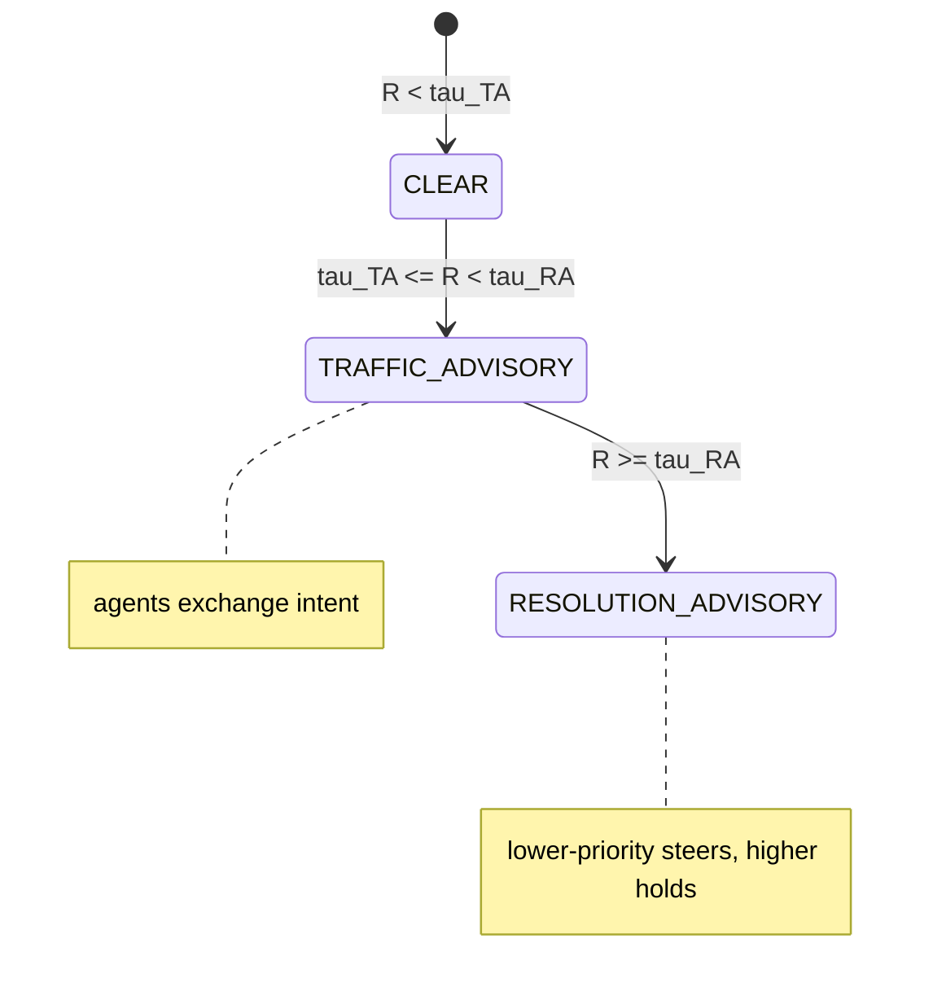

# SPEC-12 — Agent Collision Avoidance (TCAS over ContextPatch paths)

> Status: Draft · Last-Reviewed: 2026-06-25 · Depends on: SPEC-00, SPEC-01a
> Owns: deterministic coordination of concurrent agents that intend to write
> overlapping context paths — detect, advise, and steer before a write conflict.

## 1. Context

CEMAF runs agent nodes concurrently (`node_handlers.run_parallel_nodes` → `asyncio.gather`
over isolated context deep-copies). Concurrent agents that write the **same or nested
`ContextPatch` paths** only reconcile *after the fact* via a merge strategy — last-write-wins
by async scheduling order, which is non-deterministic and corrupts the audit trail.

This spec ports ECC's TCAS-style ("Traffic Collision Avoidance System") metric to context
space: treat two agents like aircraft sharing airspace, compute a continuous **collision risk**
from how much their intended write-sets overlap, and resolve *coordinatedly* — the
lower-priority agent steers away (defers its write) while the higher-priority one holds course.
Resolution is deterministic so two agents never pick the same maneuver.

The unit of "position" is the dot-notation **write path** (`node.output_key` → `draft.body`),
not a file. Three independent collision channels combine via noisy-OR:



## 2. Interface Contract (MDE)

### 2.1 `cemaf.collision.risk` — pure math, no I/O

```python
WriteItem      = (path: str, weight: float)        # weight ∈ (0,1], recency
AgentWriteSet  = (agent_id: str, items: tuple[WriteItem, ...], started_at: float = 0.0)

def path_segments(path: str) -> tuple[str, ...]: ...          # "a.b" -> ("a","b")
def tree_distance(a: str, b: str) -> float: ...               # [0,1]; 0 = identical path
def overlap_coefficient(a_paths, b_paths) -> float: ...        # Szymkiewicz–Simpson over prefix-sets

@dataclass(frozen=True, slots=True)
class CollisionChannels: overlap: float; dependency: float; tree: float

@dataclass(frozen=True, slots=True)
class CollisionResult: risk: float; distance: float; channels: CollisionChannels

def collision_risk(
    a: AgentWriteSet, b: AgentWriteSet, *,
    dep_distance: Callable[[str, str], float] | None = None,  # graph hops, or None
    weights: ChannelWeights = DEFAULT_WEIGHTS,                # overlap=1.0, dep=0.9, tree=0.25
    gamma: float = 0.5,                                       # dependency decay γ
) -> CollisionResult: ...   # R = 1 − ∏(1 − ωᵢ·rᵢ)
```

### 2.2 `cemaf.collision.protocols`

```python
class AdvisoryLevel(StrEnum): CLEAR; TRAFFIC_ADVISORY; RESOLUTION_ADVISORY

@dataclass(frozen=True, slots=True)
class Advisory:
    level: AdvisoryLevel
    risk: float
    channels: CollisionChannels
    transmit: bool                 # True at TA+ — agents exchange intent
    steer: str | None              # agent_id told to defer (RA only)
    hold: str | None               # agent_id with right-of-way (RA only)

@runtime_checkable
class CollisionPolicy(Protocol):
    def advise(self, a: AgentWriteSet, b: AgentWriteSet) -> Advisory: ...
```

### 2.3 `cemaf.collision.coordinator`

```python
class CollisionCoordinator:                  # implements CollisionPolicy via a TCAS policy
    def __init__(self, *, policy: CollisionPolicy | None = None,
                 cohort_size: int | None = None) -> None: ...
    async def register(self, write_set: AgentWriteSet) -> None: ...   # run-scoped, lock-guarded
    async def advise_against_cohort(self, agent_id: str) -> Advisory: ...
        # blocks until `cohort_size` agents have registered (or barrier disabled), then
        # returns the WORST advisory between this agent and every other registered peer.
```

Priority (deterministic tiebreak, highest wins right-of-way):
1. greater committed progress (Σ item weights), then
2. earlier `started_at`, then
3. lexicographically smaller `agent_id`.

## 3. Invariants (DbC)

1. `THE risk R SHALL be in [0,1]` and `distance == 1 − risk`.
2. `WHEN two write-sets share no path and no dependency edge, THE overlap and dependency channels SHALL be 0` (tree may be > 0).
3. `WHEN either agent writes an identical or ancestor path of the other, THE overlap channel SHALL be > 0`.
4. `advise SHALL be symmetric in outcome`: `advise(a,b)` and `advise(b,a)` yield the same level, the same `{steer, hold}` set, and the same hold/steer assignment.
5. `WHEN risk < tau_TA, THE Advisory level SHALL be CLEAR with steer=hold=None and transmit=False.`
6. `WHEN risk >= tau_RA, THE lower-priority agent SHALL be `steer` and the higher-priority agent SHALL be `hold`` — never equal, never both.
7. `THE priority tiebreak SHALL be total` (progress, then started_at, then agent_id) so `hold`/`steer` are deterministic for any input.
8. `advise_against_cohort SHALL NOT return before `cohort_size` agents have registered` when a cohort size is set (no false-CLEAR from advising before peers register).

Budget: 8 invariants.

## 4. Acceptance Criteria (BDD)

```gherkin
Feature: Agent collision risk

  Scenario: Disjoint write-sets are clear
    Given agent A writes "research.findings" and agent B writes "draft.outline"
    When collision risk is computed
    Then the overlap channel is 0 and the advisory is CLEAR

  Scenario: Identical write path triggers resolution
    Given agent A and agent B both intend to write "draft.body"
    When advise runs
    Then the level is RESOLUTION_ADVISORY and exactly one agent is told to steer

  Scenario: Nested path overlaps
    Given agent A writes "draft" and agent B writes "draft.body.intro"
    When collision risk is computed
    Then the overlap channel is greater than 0

  Scenario: Higher-progress agent holds right-of-way
    Given agent A has committed more write weight than agent B on a shared path
    When advise runs at resolution level
    Then A is the hold agent and B is the steer agent

  Scenario: Symmetric advice
    Given any two write-sets a and b
    When advise(a,b) and advise(b,a) are compared
    Then both produce the same level and the same hold/steer assignment

  Scenario: Cohort barrier prevents false clear
    Given a coordinator with cohort_size 2 and only agent A registered
    When agent A asks for an advisory against the cohort
    Then it does not return until agent B registers
```

Budget: 6 scenarios.

## 5. Out of Scope

- File/line-range collision (ECC's original domain) — CEMAF coordinates *context paths*, not source files. Execution/command security is explicitly **not** CEMAF's concern.
- Mutating the merge strategy — this spec *prevents* conflicting writes; post-hoc merge stays as-is.
- The consumer-side interceptor that wires the coordinator into a live run (separate, consumer-owned; this spec ships the reusable primitives + a built-in interceptor adapter).
- 3D embedding / visualization (future, monitoring concern).

## 6. Dependencies

- SPEC-00 (ContextPatch path model), SPEC-01a (PreInterceptor spine — the built-in adapter uses it).
- Optional: a `KnowledgeGraph` for the dependency channel (injected `dep_distance`); absent ⇒ channel is 0.
- No new third-party dependencies. No `Date.now`/randomness in core (priority uses caller-supplied `started_at`).

## 7. Correctness Properties

### Property 1: Bounded, dual risk
*For any* pair of write-sets, `0 ≤ R ≤ 1` and `distance == 1 − R`.
**Validates: §3 Inv 1, §4 "Disjoint write-sets are clear".**

### Property 2: Deterministic coordinated resolution
*For any* pair at resolution level, the `{hold, steer}` assignment is a total function of
`(progress, started_at, agent_id)` and is identical under argument swap.
**Validates: §3 Inv 4/6/7, §4 "Symmetric advice", "Higher-progress agent holds".**

### Property 3: Overlap soundness
*For any* two write-sets where one path equals or is an ancestor of the other, the overlap
channel is strictly positive; *for any* fully disjoint sets it is exactly 0.
**Validates: §3 Inv 2/3, §4 "Nested path overlaps".**

Budget: 3 properties.

## 8. Eval Criteria

Not applicable — collision risk is deterministic math, no LLM behavior. §3 invariants + §7
properties are the enforcement.

## 9. Observability Contract

- **Log events**: `collision.advisory` with `{level, risk, steer, hold, agent_a, agent_b}`.
- **Attributes**: `brightagent.collision.risk`, `brightagent.collision.level`.
- **Event** (when wired to a run via the built-in adapter): `CONTEXT_CONFLICT` on the EventBus
  carrying the Advisory at TRAFFIC_ADVISORY and above.
- **Metrics**: none (derivable from events).

## 10. Test Coverage Update

### a. In-repo layered (cemaf `tests/`)
- **L0 (surface)**: `collision_risk` returns `CollisionResult` with bounded fields; `advise`
  returns an `Advisory`; `CollisionCoordinator` satisfies `CollisionPolicy` (`isinstance`,
  runtime_checkable). One case per §2 type.
- **L2 (behavior)**: every §3 invariant — bounded risk (Inv 1), disjoint→0 (Inv 2), nested→>0
  (Inv 3), symmetry (Inv 4), CLEAR shape (Inv 5), RA hold/steer exclusivity (Inv 6), total
  tiebreak determinism (Inv 7), cohort barrier (Inv 8). Property-style: randomized-but-seeded
  path sets asserting bounds + symmetry.
- **Integration** (`tests/integration/`): `CollisionCoordinator` driving two registered
  write-sets through `advise_against_cohort` end-to-end, asserting deterministic steer/hold and
  a `CONTEXT_CONFLICT` event when wired to a real `InMemoryEventBus`.

### Self-verification
`cd cemaf && uv run pytest tests/unit tests/integration -q && uv run mypy src/cemaf/collision && uv run ruff check`. Confirm each §2/§3/§4 entry has a new test before opening the PR.
