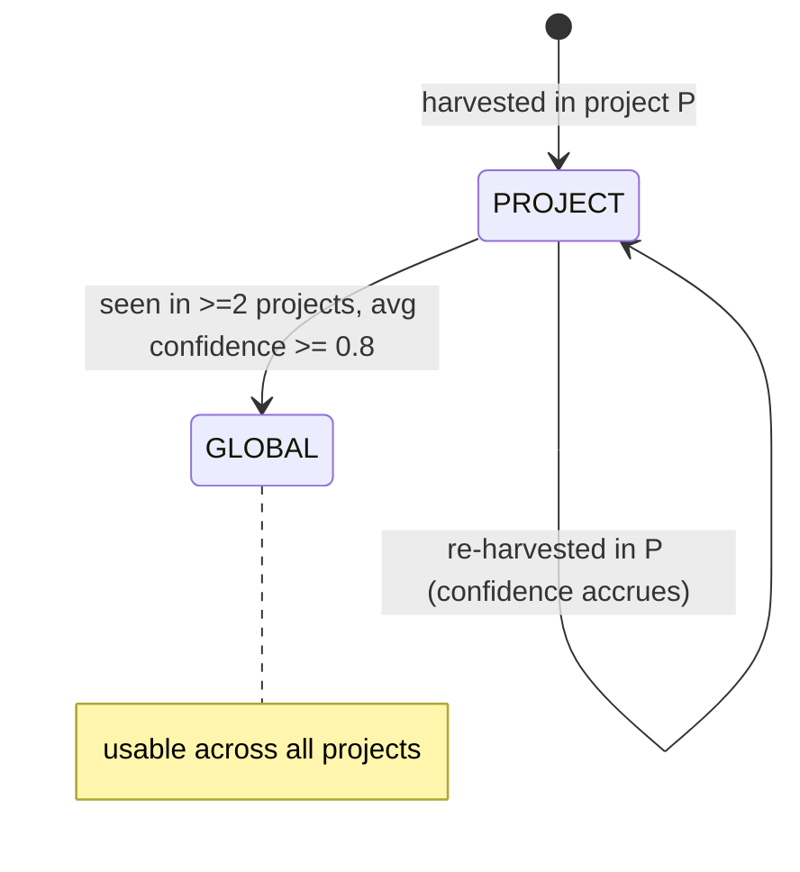

# SPEC-13 — Scoped Blueprint Harvest

> Status: Draft · Last-Reviewed: 2026-06-25 · Depends on: SPEC-00, SPEC-03 (Blueprint)
> Owns: project-scoping + confidence accretion on harvested blueprints; the
> PROJECT→GLOBAL promotion policy. Prevents cross-project blueprint contamination.

## 1. Context

CEMAF's blueprint harvester learns reusable blueprints from high-scoring runs
(`BlueprintHarvesterEngine` + `RecipeBlueprintDistiller`). Today the distilled entry id is
content-addressed **on goal text alone** — `harvest/{sha256(goal_text)[:12]}` — and the engine
registers with `overwrite=True`. So the *same goal text harvested in two different projects
collapses to one entry*: project B's run clobbers project A's blueprint. A React-domain
blueprint can overwrite a Django-domain one whenever their goal strings collide. There is also
no notion of *confidence* — every harvested blueprint is equally trusted on first sight.

Ported from ECC's continuous-learning v2: scope learned artifacts by **project** (a hash of the
git remote / workspace), accrue **confidence** on repeat observation, and only **promote** an
artifact to global (cross-project) scope once it has proven itself in **≥2 distinct projects
with average confidence ≥0.8**. This keeps domain knowledge from leaking across projects until
it's earned its generality.



## 2. Interface Contract (MDE)

### 2.1 `cemaf.blueprint.core` — additive fields on `Blueprint` (frozen Pydantic)

```python
class BlueprintScope(StrEnum):
    PROJECT = "project"   # default — scoped to its originating project
    GLOBAL = "global"     # promoted; usable everywhere

# Blueprint gains (all defaulted ⇒ backward compatible):
#   project_id: str = ""                       # "" ⇒ unscoped / legacy
#   confidence: float = 0.5                    # [0,1]; accrues on repeat harvest
#   scope: BlueprintScope = BlueprintScope.PROJECT
```

### 2.2 `cemaf.blueprint.library` — same three fields on `BlueprintEntry` (frozen dataclass)

```python
# BlueprintEntry gains, defaulted:
#   project_id: str = ""
#   confidence: float = 0.5
#   scope: BlueprintScope = BlueprintScope.PROJECT
# Carried through snapshot_entry / factory_entry / recipe_entry.
```

### 2.3 `cemaf.blueprint.harvest_defaults` — scoped distiller + promotion policy

```python
class ProjectScopedRecipeDistiller(RecipeBlueprintDistiller):
    """Distiller whose entry id is namespaced by project_id, so the same goal in two
    projects yields two distinct entries (no cross-project clobber)."""
    def __init__(self, *, project_id: str, **kw) -> None: ...
    # entry_id = f"harvest/{project_id}/{sha256(goal_text)[:12]}"  ("" project ⇒ legacy "harvest/{digest}")
    # sets entry.project_id, entry.scope=PROJECT, entry.confidence (from payload score or default)

@dataclass(frozen=True, slots=True)
class PromotionDecision:
    blueprint_key: str          # logical key (goal digest), project-independent
    project_ids: tuple[str, ...]
    mean_confidence: float
    promote: bool

PROMOTE_MIN_PROJECTS: Final[int] = 2
PROMOTE_MIN_CONFIDENCE: Final[float] = 0.8

def evaluate_promotion(
    entries: tuple[BlueprintEntry, ...], *,
    min_projects: int = PROMOTE_MIN_PROJECTS,
    min_confidence: float = PROMOTE_MIN_CONFIDENCE,
) -> tuple[PromotionDecision, ...]:
    """Group PROJECT-scoped entries by their goal digest; for each group seen in
    >= min_projects DISTINCT project_ids with mean confidence >= min_confidence,
    emit a PromotionDecision(promote=True)."""
```

Promotion **decides**; it does not mutate the store in place — the caller (or a thin helper)
re-registers a GLOBAL-scoped copy. Distinct-project counting reads from the durable
`BlueprintSource`/library, never the in-memory TTL correlator (which evicts).

## 3. Invariants (DbC)

1. `WHEN a Blueprint/BlueprintEntry is created without scope fields, THE System SHALL default project_id="", confidence=0.5, scope=PROJECT` (backward compatible).
2. `confidence SHALL be in [0,1].`
3. `WHEN two harvests share goal text but differ in project_id, THE distiller SHALL produce distinct entry ids` (no clobber).
4. `WHEN project_id is "" (legacy/unscoped), THE distiller id SHALL equal the pre-SPEC-13 form` `harvest/{digest}` (back-compat).
5. `evaluate_promotion SHALL mark promote=True IFF a goal-digest group spans >= min_projects DISTINCT project_ids AND the per-project mean confidence >= min_confidence.` Confidence is reduced to one value per distinct project (its highest) BEFORE averaging, so a project's duplicate harvests cannot skew the mean.
6. `evaluate_promotion SHALL count DISTINCT project_ids` — three entries from one project never satisfy a 2-project threshold.
7. `WHEN a goal digest already has a GLOBAL entry, evaluate_promotion SHALL skip that digest entirely` — it is promoted, never re-promoted (no double-promotion), even if fresh PROJECT entries for the same digest exist.

Budget: 7 invariants.

## 4. Acceptance Criteria (BDD)

```gherkin
Feature: Scoped blueprint harvest

  Scenario: Default scope is PROJECT
    Given a Blueprint created without scope fields
    Then its scope is PROJECT, confidence is 0.5, project_id is ""

  Scenario: Same goal in two projects does not clobber
    Given a distiller for project "alpha" and a distiller for project "beta"
    When both harvest a run with identical goal text
    Then the two produced entry ids differ

  Scenario: Legacy unscoped id is preserved
    Given a distiller with empty project_id
    When it harvests a goal "write a haiku"
    Then the entry id equals the pre-SPEC-13 form harvest/{sha256 digest}

  Scenario: Promotion fires across two projects at high confidence
    Given the same goal harvested in projects "alpha" and "beta" each at confidence 0.85
    When promotion is evaluated
    Then that blueprint is marked for promotion to GLOBAL

  Scenario: One project never promotes
    Given the same goal harvested three times in project "alpha" at confidence 0.9
    When promotion is evaluated
    Then it is NOT marked for promotion (distinct projects < 2)

  Scenario: Low confidence blocks promotion
    Given the same goal harvested in "alpha" (0.9) and "beta" (0.6)
    When promotion is evaluated
    Then it is NOT marked for promotion (mean confidence < 0.8)
```

Budget: 6 scenarios.

## 5. Out of Scope

- Mutating the harvest *engine* (`BlueprintHarvesterEngine`) — promotion is a policy/distiller
  concern; the engine stays substrate-agnostic.
- Automatic project_id detection (git-remote hashing) — the *caller* supplies project_id;
  CEMAF does not shell out to git (that's a consumer concern).
- Confidence-decay-on-rejection — accrual on harvest is in scope; decay policy belongs outside
  this spec.
- Persisting promotion side-effects — `evaluate_promotion` is pure; the caller re-registers.

## 6. Dependencies

- SPEC-03 (Blueprint, BlueprintEntry, harvest engine + defaults).
- No new third-party dependencies.

## 7. Correctness Properties

### Property 1: Backward compatibility
*For any* Blueprint/BlueprintEntry constructed pre-SPEC-13 style, the scope fields default to
PROJECT / 0.5 / "" and serialization round-trips. **Validates: §3 Inv 1, §4 "Default scope".**

### Property 2: No cross-project clobber
*For any* two harvests with equal goal text and differing non-empty project_id, the distilled
entry ids differ; with empty project_id the id is the legacy form.
**Validates: §3 Inv 3/4, §4 "Same goal in two projects", "Legacy unscoped id".**

### Property 3: Promotion soundness
*For any* set of PROJECT entries, `evaluate_promotion` marks a group promote=True iff it spans
≥min_projects distinct project_ids with mean confidence ≥min_confidence.
**Validates: §3 Inv 5/6/7, §4 promotion scenarios.**

Budget: 3 properties.

## 8. Eval Criteria

Not applicable — scoping + promotion are deterministic. §3 invariants are the enforcement.

## 9. Observability Contract

- **Log events**: `blueprint.promotion.evaluated` with `{blueprint_key, project_count, mean_confidence, promote}`.
- **Attributes**: `brightagent.blueprint.scope`, `brightagent.blueprint.project_id`, `brightagent.blueprint.confidence`.
- **Metrics**: none.

## 10. Test Coverage Update

### a. In-repo layered (cemaf `tests/`)
- **L0 (surface)**: `Blueprint` and `BlueprintEntry` accept + default the three fields;
  `to_dict`/round-trip preserves them; legacy dict without fields loads with defaults.
  **Durable round-trip**: `SqliteBlueprintSource` persists + reloads `project_id`/`confidence`/
  `scope`, and a pre-SPEC-13 table (no scope columns) migrates with defaults — the scope must
  survive durable storage or promotion silently breaks.
- **L2 (behavior)**: distinct-project distiller ids differ (Inv 3); empty-project legacy id
  unchanged (Inv 4); `evaluate_promotion` truth table — 2-projects/≥0.8 promotes, 1-project
  never, low-mean-confidence never, already-GLOBAL ignored (Inv 5/6/7).
- **Integration** (`tests/integration/`): drive two `ProjectScopedRecipeDistiller`s (alpha/beta)
  through the **real `BlueprintHarvesterEngine` flywheel** (EventBus → policy → correlator →
  distiller → `register_async(overwrite=True)`) over a durable `SqliteBlueprintSource`; reload
  from a fresh handle and assert both entries coexist (no clobber), then `evaluate_promotion`
  over the durably-loaded set marks the shared goal. Plus: a sub-threshold run is not harvested.

### Self-verification
`cd cemaf && uv run pytest tests/unit/blueprint tests/integration -q && uv run mypy src/cemaf/blueprint && uv run ruff check`. Confirm each §2/§3/§4 entry has a new test before the PR.
