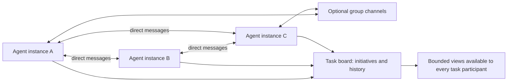

# SPEC-18: Peer Communication and Communal Task Board

Planning artifact. The APIs below are proposed, not implemented. This spec
defines both requested capabilities and their implementation sequence.

## 1. Context

Every participating agent must be individually addressable and able to talk
to another participating agent. A task must also expose a communal record of
competing initiatives, completed actions, current work, and future plans.
Neither capability requires a supervisor agent. Councils, overlapping groups,
courts of groups, and leaders with workers are optional coordination policies.

Each participant must also be able to use and share its own CEMAF `Context`
arbitrarily: all of it or selected paths, with chosen peers, groups, or the task
board. Sharing structured context is a core requirement of communication, not
an optional text attachment or a later enhancement.

### Existing substrate and missing contracts

| Existing owner | Evidence inspected | Reuse and missing behavior |
|---|---|---|
| `agents` | `AgentContext`, `AgentRegistry`, context factories | Registry IDs identify agent definitions; add separate UUID identity and lifecycle for each spawn. |
| `orchestration` | `ContextNodeExecutor`, `DeepAgentOrchestrator`, `CouncilResolver`, `RuntimeServices` | Wire participation into every execution path; retain DAG scheduling, recovery, cancellation, and budgets. |
| `council` | `AgentCouncil`, `CouncilMember`, `VoteAggregator` | Existing rounds broadcast prior opinions; add individual member contexts and optional peer conversations. |
| `tools` | `Tool`, `ToolSchema`, `ToolRegistry`; tool-using-agent example | Expose deterministic communication tools bound to the calling participant. |
| `events` | `EventBus`, `InMemoryEventBus` | Notify observers after accepted mutations; pub/sub alone has no mailbox, acknowledgement, or history contract. |
| `memory`, `persistence` | `MemoryStore`, persistence protocols | Reuse archival and adapter boundaries; ordinary get/set lacks atomic version checks and mailbox transactions. |
| `context`, `collision` | Context patches, compiler, collision spec | Compile bounded views with provenance; collision steering does not replace atomic board updates. |
| `replay`, `operator` | Replayer, checkpoint model, snapshot module | Extend existing records and projections with communication evidence. |

The missing capabilities are reusable framework protocols, not domain app code.
Keep them in existing packages; no new top-level package or orchestration loop.
Use `create_executor(..., services=RuntimeServices(...))` as the composition root.



## 2. Interface Contract (MDE)

All records are immutable, serializable values. All service protocols are
structural and `@runtime_checkable`. Proposed names are listed here so each
implementation PR has a concrete contract to satisfy.

### 2.1 Identity and participation

Preserve `Agent.id` and `AgentContext.agent_id` as registry identifiers.
Add `instance_id: UUID | None`, `parent_instance_id: UUID | None`, and an
optional bound collaboration session to `AgentContext`. Legacy manually
constructed contexts remain valid; collaboration tools require a session.

`AgentInstance` records:

- UUID `instance_id`, registry `agent_id`, display name and capabilities;
- tenant/project scope, `task_id`, `run_id`, node or council member slot;
- optional `parent_instance_id` for provenance;
- lifecycle state, creation time, terminal time, and current attempt ID.

Generate a full UUID at admission, before any user agent code runs. Repeated
spawns of the same definition receive distinct UUIDs. An execution retry or
council round retains the logical instance UUID and gets a new attempt ID.
A deliberate replacement spawn gets a new UUID and records `replaces_id`.
Durable resume restores recorded identities rather than regenerating them.

`AgentDirectory` provides `admit`, `get`, `list`, and `transition`. Listing is
paginated and filtered by authorized task, status, capabilities, and groups.
Admission is idempotent by runtime-issued spawn key. A directory entry must
distinguish queued, running, waiting, completed, failed, and cancelled states.
The parent relationship grants no routing privilege. Siblings and unrelated
participants in the same task can communicate equally.

Register eligible parallel peers before dispatch, so the first running peer can
discover queued participants. Sequential DAG nodes may also be pre-admitted,
but messages never bypass their dependency edges.

### 2.2 Peer messaging

`AgentMessenger` provides `send`, `receive`, `acknowledge`, and bounded
`wait_for_messages`. A bound session supplies sender identity and scope.

`AgentMessage` contains UUID message ID; task/run provenance; sender UUID;
exactly one target (instance UUID or group UUID); conversation ID; optional
reply-to ID; kind; bounded body or artifact references; creation time; expiry;
security classification; idempotency key; and acceptance sequence.
Message kinds include question, proposal, observation, reply, and handoff.
Kinds describe content; receiving a handoff does not transfer execution rights.

Contract:

- Send accepts into a recipient mailbox without invoking recipient code.
- A receipt distinguishes accepted, rejected, and already accepted. Accepted
  means stored by the configured backend, not read or acted upon.
- Receive is non-destructive, cursor-based, and bounded. Acknowledgement is
  explicit and idempotent; unacknowledged delivery may repeat.
- Same sender + idempotency key + same canonical payload returns the original
  receipt. Reusing a key with a different payload returns a conflict.
- Sequence numbers order accepted messages per mailbox; no global wall-clock
  ordering or exactly-once execution claim.
- Replies retain conversation ID and reference a message visible to the caller.
- Unknown, terminal, unauthorized, expired, and full-mailbox cases have typed
  failures. Pending mail at termination remains auditable as undelivered.
- A wait has a deadline and obeys run cancellation. Sending never waits for a
  reply. No mailbox lock is held while calling agents or event subscribers.

Agent-facing tools: `list_agents`, `send_message`, `read_messages`, and
`ack_messages`. The sender UUID, tenant, and run are injected, never accepted
as model-supplied authority. Tool wrappers return the existing `Result` type.
Tools are bound per invocation/session, not stored as mutable caller identity
on a registry singleton. The bound tool collection is available through the
session for BYO agent loops to expose through existing `ToolSchema` definitions.

### 2.3 Optional groups and courts

`AgentGroup` has a UUID, task scope, label, membership revision, and explicit
agent/group members. Groups can overlap and contain other groups; reject
membership cycles. Group expansion deduplicates leaf agents, is depth/fanout
bounded, and records the membership revision and recipient UUIDs at send time.
Later membership changes cannot silently change an already accepted message.
New members do not automatically receive historical private group messages.

Group operations use the bound session: `create_group`, `join_group`,
`leave_group`, and `list_groups`, with policy controlling membership changes.
Default task peers can create and join open task groups. Closed membership and
administration require an explicit application policy.

A court of groups is a group whose members are groups, plus an optional council
over explicitly chosen delegates or recorded group decisions. Ordinary group
messaging does not imply voting or double-count members as votes. Delegate
selection, quorum, and leadership remain explicit policy using `CouncilMember`
and `VoteAggregator`; install no default supervisor or mandatory leader.

### 2.4 Communal task board

`TaskBoard` provides `create_initiative`, `append_entry`, `update_initiative`,
`get_initiative`, `list_initiatives`, and `read_history`.

`Initiative` contains UUID; scoped task ID; title; proposed approach; creator;
participants; status; current step; next steps; blockers; evidence references;
related/alternative/superseded initiative IDs; and revision number.
Statuses: proposed, active, blocked, completed, abandoned, superseded.

`BoardEntry` is an immutable event containing UUID, initiative ID, author UUID,
kind (plan, action, finding, question, decision, blocker, status change), body,
references, timestamp, idempotency key, and monotonic board sequence.
Distinguish intended work from reported actions and verified outcomes. Recording
an action does not assert it occurred; link tool/run evidence when available.

All authorized participants in a task can read its initiatives and append
attributed contributions. The creator or explicit maintainers update the
initiative summary/status; other peers propose changes through entries. Changing
maintainers is revisioned and policy checked. Parallel alternatives are valid.
Abandoned and superseded approaches remain visible with their rationale.

Updates require `expected_revision`; a mismatch returns a conflict with the
current revision. Commit the new snapshot and its history entry atomically.
Append-only contributions do not overwrite each other. Read views return an
`as_of_sequence` and continuation cursor; retention gaps are explicit.

Tools: `create_initiative`, `post_update`, `update_initiative`, `read_board`,
and `read_initiative_history`. Listing defaults to a compact view of every
active initiative, owner, current work, blockers, and next steps, with pagination.
The board is task-wide. Private group chat stays in messages; restricted source
material is linked only where readers have permission, never copied into a
communal summary that would broaden access.

### 2.5 Each agent's Context is shareable

`AgentContext` currently exposes `global_memory` and `artifacts`; it does not
directly expose the executor's immutable `Context`. Add an explicit per-instance
working `Context` handle through the bound session. The runtime initializes it
from that participant's authorized input view. Agents can inspect it and apply
`ContextPatch` updates through a version-checked session operation. Each accepted
update yields a new immutable snapshot. Concurrent spawns never share a mutable
working-context handle, even when their agent implementation object is reused.

The owning agent controls what it shares and when. There is no supervisor approval
step, predeclared sharing graph, or fixed domain schema. Any serializable CEMAF
context value/path can be selected, subject to existing scope and classification
policies. Sharing the whole authorized context is an explicit supported operation.
Runtime services, credentials used by adapters, and live Python objects are not
part of the serializable Context payload.

Introduce `ContextExchange` in `context`, injected as optional `context_exchange`
in RuntimeServices. It provides `publish`, `inspect`, `read`, `import_share`, and
`revoke`. The shared-context store may implement the protocol independently of
messaging; delivery carries references through messages or board entries.

`ContextShare` contains:

- UUID share ID, owning instance, task/run/attempt, immutable source snapshot ID;
- selected paths (or explicit whole-context selection), schema version;
- detached payload or immutable artifact reference and content digest;
- provenance for the selected values and classifications;
- allowed recipient UUIDs or task-board audience, expiry, and creation time;
- optional prior share ID and base snapshot ID for a revision/delta.

Group shares freeze the expanded audience at publication, like group messages.
Task-board shares remain available to authorized future participants in that task.
Access checks apply to inspect/read/import, not only to discovering the reference.
A share reference is not authority by itself. Republishing received material may
not broaden the original audience unless the source policy allows delegation.

Agent tools: `share_context`, `inspect_shared_context`, `read_shared_context`,
`import_shared_context`, and `revoke_context_share`. `share_context` selects the
caller's current snapshot, accepts paths or whole-context mode, target/audience,
and an optional message or board initiative. A peer may request additional paths
by message; only the owner publishes them. Sending a context-only message is valid.

Recipients can query/read a share directly, compile it as `ContextSource`, import
chosen paths into their own Context, or derive a new share with preserved lineage.
Default import location is a namespaced source path; explicit path mappings allow
agents to incorporate content wherever their task needs it. Incoming values do
not automatically overwrite recipient state. Import records source share ID,
source instance, source paths/version and original provenance in new patches.
Deletion deltas are allowed only through explicit import policy.

Import requires the expected recipient context version and is atomic. Retry with
the same import key does not duplicate patches. Conflicting mapped values produce
a structured conflict unless a registered `MergeStrategy` was explicitly chosen.
Delta import verifies the base snapshot; unknown bases require fetching a full
snapshot. Reuse merge protocols, but materialize the accepted result as patches:
current `Context.merge()` and several branch strategies do not preserve complete
combined patch history by themselves.

Partial sharing must not leak unrelated values through patch history. Export
only authorized selected values and relevant filtered lineage; preserve references
to withheld ancestors without exposing their payloads. Snapshot payloads must be
deeply detached: a frozen Context model alone does not make nested dictionaries
immutable. Digest the actual exported payload independently of `state_hash()`.

Snapshot sharing is the initial default. Agents can publish follow-up revisions
and recipients can fetch deltas using explicit cursors. Optional subscriptions
notify of newer shares but never mutate recipient context silently. Each source
revision is separately authorized. Revocation prevents future retrieval/import;
it cannot erase a value already read or imported by another agent.

The working-context handle is authoritative for that participant during its
invocation. Reads after import see the new version immediately. Returning from
`Agent.run` contributes accepted patches through the existing node-result/context
merge path, with no duplication of patches already recorded. Parallel branch
conflicts still use CEMAF collision/merge policies. Checkpoint and replay must
capture the working snapshot, imports, share references, and import cursor; adding
only a tool-side dictionary would not satisfy this contract.

Byte/page bounds protect storage and tool responses; TokenBudget controls which
parts enter an LLM prompt. A whole-context share can therefore exceed a prompt
window using immutable references and paginated reads. It must not be silently
truncated into a summary. Revoked/expired/missing artifacts return explicit errors.

### 2.6 Services, execution, context, and storage

Add optional `agent_directory`, `agent_messenger`, `task_board`, and
`context_exchange` protocol
fields to `RuntimeServices`. A factory constructs a coherent bundle with shared
scope/policy configuration. Messaging and board may be enabled independently;
each needs the directory. Reject incomplete wiring at composition time.
Context exchange also requires the directory and the per-instance working-context
binding; it can be used through direct tools without enabling a board.

Suggested placement:

| Package | Proposed responsibility |
|---|---|
| `agents` | identity/group/message models, directory and messenger protocols, in-memory implementations, bound session, factories |
| `memory` | board models, protocol, in-memory implementation and factory |
| `context` | per-instance working-context contract, ContextShare, ContextExchange, snapshot/delta selection and provenance-preserving import |
| `tools` | session-bound communication and board tool wrappers |
| `orchestration` | lifecycle admission, scope/attempt binding, safe-point integration, checkpoint extensions |
| `events`, `observability`, `replay`, `operator` | event vocabulary, recording, reconstruction, read projections |
| `persistence` | optional durable adapters implementing atomic storage contracts |

Explicit task scope may span several runs when configured by the caller.
Default scope is one run, with no accidental cross-run discovery. Never infer
scope from an untrusted message argument.

Use existing DAG parallel/loop/conditional execution for conversations. Delivery
is cooperative: running agents read at tool/turn boundaries, council members at
deliberation boundaries, and subsequent DAG steps at their normal entry point.
A message cannot interrupt an LLM call, execute a completed agent, or create
an unlimited sequence of turns. BYO agents must opt into these reads; supplying
a service cannot force arbitrary `Agent.run` implementations to consume mail.

Test liveness with constrained concurrency: an agent waiting for a queued peer
must not hold the only execution slot indefinitely. The initial contract uses
nonblocking reads and bounded conversation rounds; waits time out if the peer
cannot run. Automatic durable wake-up/rescheduling belongs to SPEC-17's scheduler
and is a later adapter capability, not a second scheduler hidden in messaging.

At safe points, expose unread mail and board deltas as `ContextSource` values
compiled under existing `TokenBudget`, with message/entry IDs and board sequence
in provenance patches. Reading a tool result must use the same budgeting path;
never inject full transcripts directly into `global_memory`. Mark peer content
as external data for existing moderation, clearance, and validation policies.
Compiler exclusion does not acknowledge unseen mail. A board digest identifies
its source revision range and leaves originals available for retrieval.

The initial in-memory backends guarantee concurrency safety in one process only.
They must bound body size, mailbox depth, group fanout, page size, retained
history, and waiting duration. Exhaustion returns an explicit result; never
silently discard an accepted message or an initiative's historical actions.
Archive/retention policy is explicit at the factory boundary.

Durable adapters must atomically commit messages/delivery state or board
snapshot/history with idempotency records and an outbox. Events notify after
commit; subscriber failures must not undo accepted state or duplicate sends.
Do not represent MemoryStore get/set or EventBus publication as transactional
delivery. Reconcile this adapter with SPEC-17 authority/fencing rather than
creating another authoritative run database.

## 3. Invariants (DbC)

1. Every admitted spawn has a unique UUID; registry IDs remain backward compatible.
2. When a caller sends, the runtime supplies its identity and checks task scope.
3. When leadership changes, peer routing remains available under the same policy.
4. When a mutation retries with the same key, at most one logical mutation exists.
5. When initiative revisions conflict, no accepted history is overwritten.
6. When a run cancels, waits and active participation terminate without leaked tasks.
7. When context is compiled, communication content obeys budget and clearance.
8. When replay runs, recorded reads and accepted changes reproduce the observed
   state; no live messages, tool effects, or new LLM decisions are triggered.
9. When group membership changes, accepted recipient snapshots remain stable.
10. Absent services preserve existing execution and council behavior.
11. Each participant can share its full authorized Context or arbitrary selected
    paths without a supervisor; recipient imports never mutate the source.
12. A partial share exposes neither unselected values nor their historical payloads.
13. Every context import is revision-checked, idempotent, and provenance-preserving.

## 4. Acceptance Criteria (BDD)

```gherkin
Scenario: Two instances of one definition talk without a supervisor
  Given two parallel participants registered as Researcher in one task
  When A discovers B and sends a question to B's instance UUID
  And B reads it and replies
  Then their UUIDs differ and the exchange retains both sender identities
  And no parent agent handles the exchange

Scenario: Shared plans and competing approaches
  Given A and B pursue different initiatives for the same task
  When each publishes a plan, an action, and next steps
  Then C can read both initiatives and their attributed history
  And superseding one preserves its prior actions and rationale

Scenario: Arbitrary peer context sharing
  Given A has a working Context with findings, evidence, and a private scratch path
  When A shares findings and evidence with B through a context-only message
  Then B can inspect and import those values into its own Context
  And B can use the imported evidence on its next turn
  And neither the payload nor provenance reveals A's private scratch values
  And A's Context is unchanged by B's imports or subsequent edits
  When A publishes its full authorized Context to the task board
  Then C can retrieve the snapshot in bounded pages with its source provenance

Scenario: Context sharing conflicts and revisions
  Given B changed a target path after inspecting A's share
  When B imports against its previous working-context version
  Then the import reports a conflict without losing either value
  When A publishes a new revision
  Then B may explicitly import its delta against the matching base
  And replay restores the same imported values without fetching live context

Scenario: Simultaneous edits
  Given A and B may maintain an initiative at revision 4
  When both update with expected revision 4
  Then one update commits revision 5 and the other returns a conflict
  And independent append-only contributions from both remain visible

Scenario: Court of overlapping groups
  Given two groups share one member and belong to a court group
  When a participant sends to the court
  Then each authorized leaf recipient receives one logical message
  And group decisions can enter a council through explicit delegates
  And direct peer communication still works

Scenario: Retry, cancellation, and replay
  Given a send was accepted before an attempt failed
  When the attempt retries the same send key
  Then no duplicate logical message is created
  When the run cancels its waiting participants
  Then waits terminate and lifecycle state is recorded
  When the record is replayed
  Then the board and observed mail are reconstructed without live delivery
```

Additional required tests: unknown/terminal recipients; caller spoofing; cross-
tenant/task isolation; unauthorized board edits; invalid state transitions;
expiry; empty mailboxes; cursor pagination and retention gaps; stale attempts;
group cycles/fanout/changed membership; full queues; subscriber failure; duplicate
keys with differing content; concurrent runs sharing one service bundle; repeated
council member definitions; retry/resume identity; and waiting with concurrency 1.
Context tests additionally cover whole-context export larger than a prompt window,
deep-copy isolation, historical secret filtering, missing paths, stale import
versions, repeated import keys, mismatched delta bases, revoked/expired references,
unauthorized onward sharing, and downstream DAG visibility of imported patches.

## 5. Out of Scope

- Mandatory leadership, automatic leader election, or a universal social policy.
- A chat UI or externally hosted messaging integration.
- Automatic interruption of arbitrary agent code or guaranteed peer replies.
- An exactly-once claim for arbitrary effects taken after receiving a message.
- Shipping a new distributed broker/database within the initial feature.

These limits do not remove groups, courts, or peer-to-peer communication from
the requested deliverable. All three need executable examples before completion.

## 6. Dependencies

Compose the existing agent/tool registries, RuntimeServices, DAG execution,
councils, context compiler, moderation, budget controls, event bus, run logger,
and replay. SPEC-10 governs decisions; SPEC-11 governs visibility; SPEC-14
governs operator projections. SPEC-17 is a draft dependency for durable adapters,
not a prerequisite for the bounded in-process feature.

## 7. Correctness Properties

1. Identity isolation follows invariants 1–2 and the repeated-definition tests.
2. Topology independence follows invariant 3 and peer/group/court scenarios.
3. Concurrency correctness follows invariants 4–5 and conflict/retry tests.
4. Bounded execution follows invariants 6–7 and cancellation/budget/liveness tests.
5. Reconstructable evidence follows invariants 8–9 and replay/membership tests.
6. Compatibility follows invariant 10 and the existing integration suite.
7. Shareable context isolation and lineage follow invariants 11–13 and the context
   sharing/import scenarios, including partial-history and deep-copy tests.

## 8. Eval Criteria

Use deterministic scripted agents as the correctness gate. Test that a peer's
finding changes another agent's subsequent output and that a late participant
can reconstruct prior actions and future plans from the board. Assert exact
message/entry provenance and bounded turns, not just successful tool calls.

Optional LLM evals compare an isolated baseline with communication enabled on
the same tasks: useful information transfer, repeated work avoided, unsupported
claims, token/cost overhead, and task quality. No claim that more conversation
necessarily improves quality. Existing eval and budget services own these runs.

## 9. Observability Contract

Reuse `AGENT_SPAWNED` with instance identity and add lifecycle, message accepted,
read, acknowledged, rejected, group changed, and board changed events. Include
schema version, scope, run/node/attempt, instance/message/initiative IDs,
sequence/revision, and correlation/causation IDs. Default logs carry references
and sizes rather than unrestricted message content.

Extend RunLogger/replay records to retain the actual bounded read results and
referenced immutable payloads under the configured security/retention policy.
Events alone are insufficient to prove what an agent observed. Extend operator
snapshots additively with active participants, groups, unread counts, initiatives,
and blockers. Metrics include queue depth, message latency, timeouts, conflicts,
rejected sends, and communication tokens; avoid UUID metric labels.

## 10. Implementation Plan and Completion Gates

| Phase | Concrete change | Exit evidence |
|---|---|---|
| 1. Identity | Models, directory, context fields, factories; admission in ordinary/auction DAG paths, deep spawns, and council member slots; lifecycle cleanup | Same definition spawned twice is distinguishable; retries/rounds retain identity; cancellation and concurrent runs are isolated. |
| 2. Peer tools | Messenger, bounded in-memory mailboxes, bound sessions, discovery/send/read/ack tools, RuntimeServices wiring | Real DAG peers exchange and use a reply with no supervisor; duplicate, spoofing, scope, timeout, and backpressure cases pass. |
| 3a. Shareable Context | Per-instance working Context, ContextExchange, snapshot/delta tools, provenance-preserving imports and runtime patch propagation | A shares arbitrary paths or its whole Context; B imports and uses it; source isolation, conflict handling, filtered lineage, and downstream visibility pass. |
| 3b. Communal board | Initiative/history models, atomic in-memory revisions, tools, task-wide reads and context-share references | Three peers publish/read past actions and plans; alternatives and concurrent edits preserve history; a late participant can retrieve shared Context. |
| 4. Groups and councils | Group lifecycle, nested membership, recipient snapshots, member contexts, explicit delegate composition | Peer group and court-of-groups examples work; leader/worker example preserves worker-to-worker exchange. |
| 5. Runtime evidence | Budgeted safe-point reads, context provenance, events, RunLogger/replay and operator projection extensions | Replay reconstructs observed conversations/board without live sends; budget and moderation paths are exercised. |
| 6. Delivery | Public exports/factories, examples index, documentation and capability evidence | Offline examples in smoke suite; full verification passes. Both requested capabilities ship together after phases 1–6. |
| 7. Durable extension | BYO adapter contract and conformance suite aligned with SPEC-17 | Crash/restart, outbox retry, fencing, and multi-process races pass before claiming durable messaging. Separate follow-up. |

Phase 1 must inspect registry instance reuse: identity separation must not mutate
shared agent objects or imply state isolation where a BYO agent stores mutable
state on itself. Provide a factory-per-spawn path for stateful participants;
document explicit concurrency requirements for registered singleton agents.

Integration tests should exercise both structural BYO implementations and the
default backends through `create_executor`. Add regression coverage to existing
council/deep-agent tests rather than testing only standalone stores. New offline
examples must be guarded by `tests/integration/test_examples_smoke.py`.

For implementation run `make check`. For this spec and subsequent docs run:

```bash
uv run python docs/architecture/scripts/check_doc_links.py
python3 docs/architecture/scripts/check_doc_imports.py
uv run python docs/architecture/scripts/check_loop_ops.py
```
