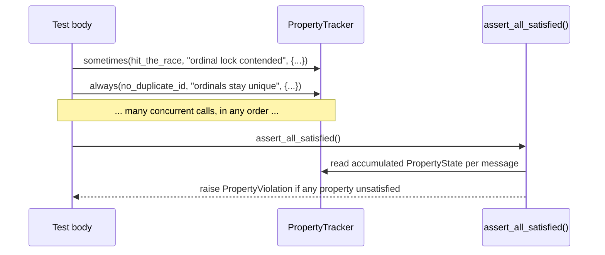

# SPEC-19: Property Assertions

> Sticky, message-keyed assertions (`always`, `sometimes`, `reachable`,
> `unreachable`) that accumulate across a run instead of failing on first
> call. Closes the "vacuous coverage" gap: a concurrency/holistic test can
> pass green while never actually exercising the race or branch it claims to
> test. Adapted from Antithesis's deterministic-simulation assertion model
> (`always`/`sometimes`/`reachable`/`unreachable`) to a plain, in-process
> primitive — no hypervisor, no fault-injection platform, just the
> accumulate-then-check mechanism.

## 1. Context

`test-behavior-real.md`'s forcing question — "if the underlying real client
behaved completely differently tomorrow, would any test fail?" — has no
code-level tool today; it's a manual code-review question. Holistic
concurrency tests (`tests/integration/test_agent_identity_substrate.py`,
`test_concurrent_runtime_services_load.py`, and similar) assert on final
state but cannot assert that the *interesting interleaving* — two `admit()`
calls actually racing the same lock, a RECOVER retry actually firing, a
council member actually timing out — was hit at all under `asyncio.gather`'s
nondeterministic scheduling. A test can go green for years without ever
exercising its own reason for existing, and no one would notice.

A plain `assert` fails on the first false condition and can't express "this
must be true at least once across many calls" (`sometimes`) or "this line
must run at least once" (`reachable`) without hand-rolled counters
scattered through test bodies. This spec gives CEMAF one small, reusable
primitive for both.



## 2. Interface Contract (MDE)

```python
from dataclasses import dataclass, field
from enum import StrEnum
from typing import Mapping

from cemaf.core.types import JSON


class PropertyKind(StrEnum):
    ALWAYS = "always"
    SOMETIMES = "sometimes"
    REACHABLE = "reachable"
    UNREACHABLE = "unreachable"


@dataclass(frozen=True, slots=True)
class PropertyState:
    """Accumulated state for one message-keyed property."""
    kind: PropertyKind
    message: str
    hit_count: int
    all_conditions_true: bool          # relevant to ALWAYS/ALWAYS_OR_UNREACHABLE
    any_condition_true: bool           # relevant to SOMETIMES
    last_details: JSON

    def satisfied(self) -> bool:
        """Whether this property's pass condition holds given what was observed."""
        ...  # see §3 Invariants 1-4 for the exact predicate per kind


class PropertyViolation(AssertionError):
    """Raised by assert_all_satisfied() naming every unsatisfied property."""
    def __init__(self, *, violations: tuple[PropertyState, ...]) -> None: ...


class PropertyTracker:
    """Accumulates property hits for one test/run; not a module-level singleton —
    constructed per test (directly, or via the `property_tracker` pytest fixture)."""

    def always(self, condition: bool, *, message: str, details: Mapping[str, object] = {}) -> None: ...
    def sometimes(self, condition: bool, *, message: str, details: Mapping[str, object] = {}) -> None: ...
    def reachable(self, *, message: str, details: Mapping[str, object] = {}) -> None: ...
    def unreachable(self, *, message: str, details: Mapping[str, object] = {}) -> None: ...

    def snapshot(self) -> tuple[PropertyState, ...]:
        """Every tracked property's current accumulated state, message-sorted."""
        ...

    def assert_all_satisfied(self) -> None:
        """Raise PropertyViolation naming every unsatisfied property; no-op if none."""
        ...
```

`unreachable(message=...)` is equivalent to `always(False, message=..., ...)`
called from a spot that should never execute — it exists as a distinct,
self-documenting name (matching Antithesis's own vocabulary) rather than
requiring the caller to spell out `always(False, ...)` at a dead branch.

## 3. Invariants (DbC)

1. `WHEN a PropertyTracker has never seen a call for a given (kind, message) key, THE tracker SHALL report that key absent from snapshot() — properties exist only once observed at least once, except per Invariant 3.`
2. `FOR an ALWAYS property, PropertyState.satisfied() SHALL be True IFF every recorded condition for that message was True (hit_count >= 1 AND all_conditions_true).` An ALWAYS property with zero hits is UNSATISFIED (never observed is not vacuously true) — this deliberately differs from Antithesis's own `always` (which treats zero-hits as a warning, not a failure) because CEMAF's use case is "prove this ran," not "monitor a long-lived service"; §5 documents this as an explicit, intentional deviation.
3. `FOR a SOMETIMES property, PropertyState.satisfied() SHALL be True IFF hit_count >= 1 AND any_condition_true is True.`
4. `FOR a REACHABLE property, PropertyState.satisfied() SHALL be True IFF hit_count >= 1.`
5. `FOR an UNREACHABLE property, PropertyState.satisfied() SHALL be True IFF hit_count == 0.`
6. `THE tracker SHALL key accumulation by (kind, message) — two calls with the same message and kind accumulate into one PropertyState; the same message under a different kind is a distinct, independently-tracked property.`
7. `assert_all_satisfied() SHALL raise PropertyViolation carrying every PropertyState where satisfied() is False, in the order first observed (or, for a zero-hit ALWAYS/REACHABLE, in the order first registered by the caller — see Invariant 8) — never raise on the first violation and silently skip the rest.`
8. `always()/sometimes()/reachable() calls with condition=False (or zero calls at all, for reachable) SHALL still register the (kind, message) key in the tracker with hit_count reflecting actual calls — a property that is NEVER called at all (e.g. dead test code) has no entry and assert_all_satisfied() cannot report it; this is a known, accepted limit (see §5 Out of Scope) distinct from a property that IS called with hit_count>0 but zero true conditions (which IS tracked and reported).`
9. `PropertyTracker.snapshot() SHALL be a point-in-time, immutable copy — later always()/sometimes()/... calls SHALL NOT mutate a previously returned snapshot tuple or its PropertyState entries (frozen dataclasses).`

## 4. Acceptance Criteria (BDD)

```gherkin
Feature: Sticky property assertions

  Scenario: ALWAYS property holds when every observed condition is true
    Given a tracker that calls always(True, message="m") three times
    When assert_all_satisfied runs
    Then no PropertyViolation is raised

  Scenario: ALWAYS property fails on any false condition among many true ones
    Given a tracker that calls always(True, message="m") twice and always(False, message="m") once
    When assert_all_satisfied runs
    Then PropertyViolation is raised naming "m"

  Scenario: ALWAYS property with zero calls is unsatisfied
    Given a tracker where always(..., message="m") is never called
    When assert_all_satisfied runs
    Then PropertyViolation is NOT raised for "m" (it has no entry — Inv 8)
    And snapshot() contains no entry keyed "m"

  Scenario: SOMETIMES property holds if at least one call was true
    Given a tracker that calls sometimes(False, message="m") twice and sometimes(True, message="m") once
    When assert_all_satisfied runs
    Then no PropertyViolation is raised

  Scenario: SOMETIMES property fails if called but never true
    Given a tracker that calls sometimes(False, message="m") three times
    When assert_all_satisfied runs
    Then PropertyViolation is raised naming "m"

  Scenario: SOMETIMES property fails if never called at all
    Given a tracker where sometimes(..., message="m") is registered via reachable-style pre-declaration but never actually called
    Then it has no entry in snapshot() and is not reported (Inv 8) — a caller who wants "must be called" uses reachable(), not sometimes()

  Scenario: REACHABLE property holds after one call
    Given a tracker that calls reachable(message="m") once
    When assert_all_satisfied runs
    Then no PropertyViolation is raised

  Scenario: UNREACHABLE property fails if ever called
    Given a tracker that calls unreachable(message="m") once
    When assert_all_satisfied runs
    Then PropertyViolation is raised naming "m"

  Scenario: Distinct kinds under the same message are tracked independently
    Given a tracker that calls always(True, message="m") and sometimes(False, message="m")
    When assert_all_satisfied runs
    Then PropertyViolation is raised naming only the sometimes "m" entry, not the always "m" entry

  Scenario: Violation report names every unsatisfied property, not just the first
    Given a tracker with two independently-failing properties "a" and "b"
    When assert_all_satisfied runs
    Then PropertyViolation.violations has length 2
    And both "a" and "b" appear
```

## 5. Out of Scope

- Cross-process / cross-run aggregation (Antithesis's platform-side "did this property ever pass across the whole fleet of simulated runs" — CEMAF's tracker is one-process, one-run/one-test scoped by design; a caller wanting multi-run aggregation composes its own store on top).
- Fault injection, deterministic hypervisor replay, guided scheduling exploration — genuinely out of reach without a dedicated platform; not attempted here.
- Auto-discovery of "dead" properties that are declared in source but never called in any code path (a property with truly zero calls has no tracker entry at all per Invariant 8 — catching that class of gap needs static analysis, not this runtime primitive).
- A pytest plugin that auto-instruments every test with a tracker; this spec ships the primitive plus one convenience fixture (§9), not automatic global wiring.

## 6. Dependencies

- `cemaf/core/types.py` (`JSON`)
- No other CEMAF module dependency — this is a leaf, dependency-free primitive by design (usable from `tests/` and, later, real `src/cemaf/` call sites without creating a cycle).

## 7. Correctness Properties

### Property 1: Accumulation is associative and order-independent
*For any* sequence of `always`/`sometimes`/`reachable`/`unreachable` calls
under one message, `PropertyState.satisfied()` depends only on the
multiset of conditions observed, not their call order — required for
correctness under `asyncio.gather`'s nondeterministic scheduling, which is
the exact use case motivating this spec.

**Validates: §3 Invariants 2-5 / §4 every scenario (each is order-insensitive by construction)**

### Property 2: No silent partial reporting
*For any* `PropertyTracker` with N unsatisfied properties, `assert_all_satisfied()`
raises exactly one `PropertyViolation` whose `violations` tuple has length N.

**Validates: §3 Invariant 7 / §4 "Violation report names every unsatisfied property"**

## 8. Eval Criteria

Not applicable — this spec has no LLM-invoking behavior. `PropertyState`/
`assert_all_satisfied()` are deterministic and exhaustively covered by §4's
Gherkin scenarios as unit tests.

## 9. Observability Contract

Not applicable in v1 — this is a synchronous, in-process, test-scoped
primitive with no spans/logs/metrics of its own. A future production use
(embedding `always`/`sometimes` calls in real `src/cemaf/` code, not just
tests) would need a `TelemetryPort`-backed sink instead of an in-memory
tracker; explicitly deferred (see §5).

## 10. Test Coverage Update

- **L0/unit** (`tests/unit/properties/test_tracker.py`): one test per §4
  Gherkin scenario, using real `PropertyTracker` instances — no mocks, this
  module has no external dependency to mock.
- **Real-behavior retrofit** (satisfies `test-behavior-real.md` and this
  project's "no unconsumed infra" precedent): extend
  `tests/integration/test_agent_identity_substrate.py` (SPEC-18 phase 1a's
  holistic concurrency proof) with real `sometimes()`/`always()` calls
  proving the exact interleavings that test's own docstring already claims
  to exercise ("admission idempotency survives concurrent duplicate
  registration" — assert via `sometimes()` that a duplicate admit actually
  hit the `receipt.created=False` replay path at least once; "ordinals stay
  gap-free ... even under lock contention" — assert via `always()` that
  every observed ordinal was unique). This is the direct evidence the new
  primitive earns its place: a genuine caller, on a genuine existing test,
  the same day it's introduced.

## Note on the source of this idea

Adapted from the Antithesis Python SDK's `antithesis.assertions` module
(`always`, `always_or_unreachable`, `sometimes`, `reachable`,
`unreachable` — https://github.com/antithesishq/antithesis-sdk-python).
CEMAF's version keeps the same four names and message-keyed accumulation
model but drops everything specific to Antithesis's hypervisor platform
(coverage instrumentation, fault injection, the `assert_raw` low-level
hook, the software-under-test sidecar protocol) — this is the assertion
*idea*, reimplemented standalone, not a port of their SDK.
